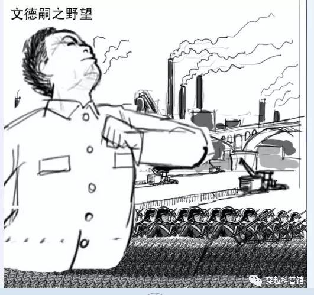

# 张岱临高见闻录（插图版）
网址：https://zhuanlan.zhihu.com/p/65825707

[TOC]

## **第一节 去临高**

客栈中，张岱端详着手里的一盒火柴，不禁回忆起自己第一次接触到“临高货”的情景。
那日，他正在书房中看书，他的书童迷烟笑嘻嘻进来道：“少爷，奴婢知道您喜好新鲜玩意，近日在街上无意中发现一稀奇玩意，特买来给爷您过目。”
却见书童递上一黄纸糊的小匣，上面是细细致致的一幅小画儿，画着火焰图案，反面横写着“临高火柴厂”五个字。

要待打开看时，却是没有盖子的，四面翻转看了一遍，原来是个套。把它推开一看，里面装着好些小枝儿，一头还有一京红红儿的东西。
张岱将小匣还了迷烟道：“这不过是小孩子玩的罢了。”
迷烟接过来，取出一根细细的，拿起来把那红点子对着边上的“黑纸”面去划，豁的一声便着火了，倒把张岱吓了一跳。张岱道：“别弄了！是个惹火的。”
迷烟那里肯听，便道：“这一点点的小头儿，燃着了那火就那么大。我们把他一根根的都取下来，凑在一处，拿到院子里，放个火球儿玩儿。”一面说，一面找了个钉儿，蹲在地下把那小枝都倒了出来，去刮那红点子。
张岱在旁边看见，说道：“快别弄，拿来我看！”
迷烟把小枝儿递上，张岱道：“匣子呢？”迷烟递了来。
张岱再看一遍，眼见这套匣边上，一面粗得狠，像是沙子做的，上面有几路划火柴留下的红印子。他把小枝儿有红点的一面往上轻轻的划，划了两下，没有动静，再划重时，火焰又出现了。张岱随后道：“快收起来罢，这是取火的东西，比着火镰包儿，灵便多了。有了这个，以后出门游玩时取火方便多了。”接着张岱又拾起一根着过的，仔细看了一看，只见那红京子烧成了炭，取起那套匣来，划了一下，便断了。后来，张岱又让书童又去街上买了好几盒火柴，部分给了厨房，部分自己收藏起来，作为自己出门旅行的必需品。

沉思间，跟随张岱来广东的书童迷烟带了客栈的小二进房来。

迷烟先回道：“回爷的话，他们说去临高，用不着专门雇船，可以搭乘澳洲人的轮船！”
张岱道：“不知这轮船有多大，坐多少人？”
客栈小二道：“我也说不出有多大，只知能坐两三百人。”
“两三百人？罢了，罢了，凭他多大的船，坐了两三百人，不要挤死了么？我们爷挤不惯。”书童赶紧说到。
小二道：“管家有所不知，要是坐统舱呢，那是说不定要挤的。坐房舱，就好得多了。倘是坐了头等舱，那就是坐了大菜间，吃的是澳洲大菜，一路上有细崽招呼。只怕在家里，也没有这等舒服呢。”
张岱暗想：早闻澳洲人有无帆无桨的自行船，且坐他一回，左右长长见识也好。想定了，便对小二道：“那么说，我们就坐轮船罢。”。
小二道：“不知客官您是要坐房舱，还是要坐大菜间？”
张岱道：“你说的什么大菜间最好。我们就坐那个。”
小二答应了，问几时走。张岱道：“那轮船可是天天有吗？”
小二说那里能够！不过，每隔三日总有船去临高就是了，明天便有船启航。
张岱道：“那么，就明天走罢。”
第二天一早，迷烟收拾过行李，吃过早饭，雇了一匹牲口。张岱骑了，迷烟跟着，又雇人挑着行李，一行人出城来至江边，在客运服务员指导下进入码头候船厅坐着等候。候船厅外，停着一艘大船，一缕浓烟突然从船上升起。张岱向那服务员问道：“我们就坐这个船么？”
服务员回道：“正是。”
“这船是着火了”
“不是，是船在备车？”
“什么是备车？”
“我也不懂，这词儿是以前一位首长告诉我的，反正冒烟后，这船就能动了”服务员对张岱的提问开始不耐烦起来。虽然对于蒸汽机这种“军国利器”是否应该用于民船有元老提出异议，但很快就有人提到临高生产的蒸汽机早就民用化了，不仅是临高的各类生产民用品的工厂，连杭州站的缫丝厂都早已用上了蒸汽动力。而在海岸警备队兼交通口航运部门供职的布特元老更是对蒸汽民用船的推广大肆鼓吹。
布特指出，工业化最恐怖的威力不在于技术的先进，而在于大规模、标准化，技术民用化是必须的，和平时期军购有限，如果只有军方一个客户那生产成本就太高了。历史上满清洋务派开始只想发展军事工业，但军用企业的庞大开支很快让清政府的财政日见窘迫，于是积极经营民用企业，期望开辟新的财源以补贴军备开支。用旧时空2000年左右的一篇分析工业化的文章来说，军事工业与民用工业是硬币的一体两面，德国能造奔驰，就能造豹二。
同时，临高推广蒸汽机轮船最大的阻力不在于蒸汽机的生产，而在于轮机员与机工的培养，就好像现代空军的扩充瓶颈不在于飞机的生产而在于飞行员的培养。现在那么多年下来，大型船舶轮机员与机工的数量临高已经积累了不少了。但由于企划院对大型蒸汽战舰建造的拨款有限，结果现在大型蒸汽战舰上的轮机员反而有了一些“过剩”。这些人如果全由军方养着，有些浪费，不如安排多余的备用轮机员与机工去大型蒸汽民船工作，战时安排他们去新造大型蒸汽的军舰，有利于迅速扩军。毕竟，一个现代国家海军的战时扩充速度实际上取决于商船的海员数量。
面对节约军费与生产盈利的诱惑，抠门的企划院很快批准了布特的计划。于是，有四艘H800被改造为蒸汽客运货运两用船，用于广州-香港-临高航线，以及广州-香港-高雄的航线。
一小时后，通向大船得铁门打开，候船厅里登时人声嘈杂起来。张岱让焙茗拿上行李，跟着人群挤上船，在船员指引下上了一层楼梯，进了大菜间。过了一会，又进来一个髡发髡服的人道：“敝姓包，名妥，是这间贵宾厅的服务员，请问客官您现在要点菜吗？”
张岱点头，包妥递上精美的菜单，菜单上不仅有一些中式套餐，还有核桃酥和一些名为“澳洲点心”的西点。由于张岱之前还没吃过“澳洲点心”，好奇之下便点了面包、核桃酥、曲奇等几样西点和一壶“澳式红茶”（实际上是旧时空的英式红茶），顺带点了早有耳闻却一直没机会品尝的张毓家核桃酥。张岱点完菜，服务员包妥便辞了去。一会儿，船开行了。
张岱走出舱面，要望江景，只见船上所有之物，都是生平未曾经见的。
张岱拉住一个经过身边的“髡人”船员，指着那不曾见过的东西去问他。如舢板、太平水桶、救命圈之类的，都一一都问了。又到机器舱的窗上望了半天。觉得乏了，便回房歇息。

过了一会儿，那个服务员包妥回来了，手上捧着一个方盘子，里面有张岱之前点的“澳洲点心”与红茶。张岱一边吃，一边跟包妥闲话聊天。包妥也将临高的繁华富丽，有的没的，说了一大套。慢慢的又说到风月场中去，说临高的姑娘，最有名气的是“四大金刚”。
张岱笑道：“不过几个粉头，怎么叫起他金刚呢？”
包妥道：“我也不懂，不过大家都是这么叫，我也这么叫罢了。这‘四大金刚’之中，头一个是林黛玉……”
张岱吃饱后，不免到外面去走动走动，包妥笑嘻嘻跟上来与张岱继续闲聊。
张岱道：“你们统舱里吃什么饭？”
包妥道：“不蒙你老人家说，我承这里账房几位先生照应，是在房吃的饭，还算好。在统舱里吃饭，实不象样呢。茶房们扛了一木桶饭来，众人便过来抢吃，也有拿脸盆盛饭的，也有拿筐子盛饭的，又没有菜，要吃菜时，要自家身带来。你老人家这顿吃得还满意吗？……”这包妥只管滔滔不断的信口开合，猛不提防，头上“呜呜”的一声怪响，倒把张岱吓一跳。
张岱问道：“这是什么东西在那里叫唤？”
包妥笑道：“这是放汽筒，招呼前面小船让路，以免碰撞之意。”

## **第二节 香港夜话**

船到香港时已经入黑，远望港内万家灯火。一会儿靠了岸，就听下面人声鼎沸起来。
张岱回头忽见自己住房亮了，说道：“没看见人进去，这个灯是谁点的？”
包妥笑道：“这是电灯，不用人点，自亮自灭的。澳洲人真是巧心思，这都是他们做出来的。”目前临高出品的灯泡由刘汤姆元老创建的701灯泡厂生产。701厂的最初目的是实现灯泡的再生，预期穿越时携带了1万只白炽灯泡，年损坏在2000-3000只，701厂的设计产能就是2000只，由于计算错误，穿越时携带了几百公斤的灯用钨丝，结果试生产时发现单位错了1000倍，即钨丝足够生产几百万只灯泡了，因此701厂逐渐提高到年产能5000只。没有701厂前，企划院只能控制灯泡的使用率在2000只左右，库存能满足5年，有了701厂后，灯泡的使用量可以提高到5000只，甚至再高一些到7000只也没问题，只要灯不彻底损坏可以一直再生下去。701厂建厂2年内实现绝大部分灯泡材料的生产，可以长期保持灯泡库存在9000只以上。由于现在供电的地区不多，也就临高、香港、广州等少数城市的元老院产业，结果灯泡的供应反而略有剩余。
于是布特找到企划院申请了40只灯泡安装到了4艘H800蒸汽客运船上，既能作为吸引高端客流的商业噱头，也能很好的宣传元老院“神迹”。不得不说，这种自亮自灭的电灯很是吸引了广州富人的好奇心，刚开始时大菜间的船票一度供不应求，被拍卖到了50两银子一张。等到张岱买票时，已经是这种船票推出大半年后了，由于买得起船票的富户已经普遍见识过了，因此买得人开始变少，张岱才得以用10两银子的“平价”订到船票。

张岱进房门端详了电灯好一会，忽然问道：“这玩意只有澳洲人会做？可有广里本地的匠户能仿制？”
由于中国的地缘政治因素，中国的农产品主要依靠自给，在古代没办法像近代的英法荷等西欧“小国”那样，依托分布在美洲、非洲、亚洲的广大农业殖民区以及中欧、东欧的农业国，通过国际间的“工农业剪刀差”建立一个以工商业作为国民经济主体的大型资本主义国家，但少部分地区通过国内的“工农业剪刀差”贸易与有限的东亚海上贸易，还是能建立起小规模的工商业文明区，这就是中国明清两代局部地区“资本主义萌芽”现象的经济基础。
张岱家乡早已出现资本主义萌芽，当地的浙东学派对工商业的态度也比绝大多数儒家学派要开明得多，主张“工商皆本”，反对“重农抑商”。
当然，在像西欧工商业强国那样通过“大航海时代”打开全球市场之前，中国“资本主义”也只能在长三角、珠三角等少部分地区慢慢“萌芽”，没办法自然成长为中国的压倒性经济、军事、政治力量。
因此，没有见识过全球广阔天地与现代农业技术的张岱在和刘三他们谈过后，觉得澳洲人通过“奇技淫巧的法子”虽然能造许多玩物赚取大把银子用于补贴民生，但“这法子用在一州一线固然使得，治下州县一多便会顾此失彼——何况他们再能赚钱，总不见得把天下黎庶的生计都包揽下来。”在他看来，澳洲人能创造的，最多也就是自己家乡的富裕加强版，让全天下亿万生灵都过上好日子，这想法未免太玄幻了吧？
不过，虽然对澳洲人的政治理论不感冒，但作为一个信奉“工商皆本”的“财迷”儒生，张岱对于通过澳洲技术让自己的宗族在经济方面更上一层楼是绝对有信心的。这也是为何当初他跟刘三说自己对澳宋的陶瓷工艺很感兴趣。在此之前，他亲手烧过陶瓷，可惜成品率很低，最终成了一场非常“败家”的“玩耍”。显然，无论是谁当家，都不可能长期在一个投资巨大却迟迟看不到收益的项目上继续投钱，于是张岱的陶瓷科研项目在家族的压力下下马了。一直到他看见了澳洲的“遍体施釉”和秘窑骨瓷，才重新燃起了对“制造业”的热心。而现在，一个比澳洲陶瓷工艺更加炫目、更有钱途的“奇技淫巧”出现在他面前，让他不由得心花怒放。
包妥答道：“不会，除了临高的澳洲匠户，没听说有其他匠户会做这个。
张岱摇头道：“澳洲人也不多两个眼睛，也不多两条膀子，有什么不会的，不学罢了。”
包妥道：“只怕心眼儿不及澳洲人。”
张岱道：“但凡是个人，心眼儿总是一样的。不过有一种人被一种嗜好迷住，不得开罢了。至圣先师曾云：‘人一能之，己百之；人十能之，己千之。’那里有学不会的学问呢？”
正说着时，只见迷烟笑嘻嘻的走过来，递一个小匣给张岱道：“少爷，这又是一个样儿的，咱们头回买的那种大些，当初我买的那种要两钱银子一匣，这个只要花五十文。我才在底下买的，给爷瞧。”
包妥一看，原来是一匣火柴。便笑对迷烟道：“这是澳洲火呀！你没见过么？”
迷烟道：“我头看见的匣子，比这个小，那小棍上，是黏着红点子的。”
张岱又问包妥道：“这东西是从临高进得货？”
包妥看了看牌子道：“不是，听说澳洲首长在香港设了工厂，这是澳洲人雇佣广里本地的匠户教他们做的。有人说，那工厂一个月内要造一万箱，每箱可赚十两银子呢。”
张岱拍手道：“是不是呢！我就说没有学不会的事情。这么个小巧东西也学会了，那电灯怎么做哪有学不会的？房里去坐罢！这会儿有点冷了。”
两个同到房里，又谈了一会儿，包妥别去，一宿无话。
次日清早起来，洗过脸，包妥来送早点。盘子里有一瓶红茶菌，两片松糕似的东西（面包片），并抹上鲜红色的果酱，两个白煮鸡蛋。张岱洗过手拿起来吃了，又喝了茶，又出来闲望一回。
此时，船又从香港启航，驶往临高。

## **第三节 粮食与数学**
随着香港渐行渐远，周边的景色也变成了“大海啊都是水”，眼看没啥景色可看了，张岱回到了房间内休息。

此时焙茗又像献宝一样的向张岱递上一张报纸，“少爷，这是小的在船上的铺子里买的澳洲人邸报，昨晚刚送上船的。”

澳宋的报纸，张岱在梁存厚家躲避的时候看过几份，因此并不陌生，算是了解澳洲人与澳宋情况的公开情报来源，当下便看了起来，结果马上被头版头条的新闻惊到了——《又一批运粮船运抵广州，广州粮库存粮已超过10万吨》
仔细看内容，大致是说自从广州光复以来，元老院高度重视广州的民生问题。为了确保广州市民不挨饿，弥补由于战争而导致的广西粮食进口渠道的中断，元老院从南洋大量购粮，加上海南的存粮，至今已向广州运输了超过20万吨（约等于200多万石）粮食，存粮超过10万吨。
张岱看后不禁有些咋舌，他记得每年经过运河运往北京的漕粮也不过400多万石，而髡贼进入广州才大半年就从海外运粮超过200万石粮食，那髡贼远距离调拨粮食的能力岂不是已经接近大明朝廷？如果这些粮食不运去广州卖，而是用来募兵，那这200多万石粮食能供养二十万大军约一年的粮饷。
提起明末的那些文人，很多人的印象是不识数，证据就是“一炮糜烂数十里”之类的记载。但实际上，类似人在现代一样有，从孙大炮的“十万英里铁路计划”、常凯申的“歼敌一亿转进台湾”到中国大陆学者的“饿死三千万”、“三亿五千万金卢布”等等，中国自古以来就不缺“不识数”的各种大人物。而且这种现象也不止国内有，国外一样有，从印度人的各种不靠谱嘴炮，到创造了“天价卫生纸”的美国国防部，各种奇葩的数字不时出现在新闻媒体上。
究其原因，一是很多人根本不是“不识数”，只不过是别有用心，出于各种政治经济或宣传目的有意夸大或缩小有关数据。跟满清内务府报价10—30两白银一个鸡蛋比，明末文臣“一炮糜烂数十里”的报告已经很有良心了。二是很多人由于教育和工作履历的原因确实不识数，这方面除了文化素质低下、见识少的普通人，现代记者、律师、人文科学的知识分子表现也很明显，“三亿五千万金卢布”笑话就是典型——如果只是别有用心而非“不识数”，某女研究生决不会采用这样一个明显有问题的数据。明初，朱元璋取消了科举考试中的数学科目，很多一门心思只想着考科举的书生也确实因此放弃了数学方面的学习。
不过，对张岱这样的豪门出生文人来说，学好数学是必须的——虽然明代的科举考试不考数学了，但日常的生产经营离不开数学，不管是收租、放高利贷还是经营其他产业，真的“不识数”的士绅很可能因为经营不善而败落。以浙江经济发达、教育发达的状况和中央朝廷对各省生员的录取限制，对张岱来说“才高八斗”却没被录取是很正常的，最有可能的就业出路就是继承家业，当一个地主兼资本家。同时，万一他家因为某些原因败落了，那另一条可行的出路就是像他的众多同乡那样当一个“绍兴师爷”。
因此，虽然张岱本人喜好贪玩，没啥事业心，但在父亲的严厉“教养”下，他本人的“实学”素质其实不算差，所以很快就推算出了这笔粮食的军事价值。同时，他也渐渐明白了为何髡贼攻入广州后敢不鸟士绅。
自古以来，攻城的目标除了打开进军的道路，最主要的目的就是为了城里储存的各类物资。客气一点，抢走官府储备的物资，再逼城里的富户“乐捐”一部分，再抢劫城里的中产小市民一部分；不客气一点，就会像满清那样直接屠城，然后拿走全城的“无主”物资，其中粮食是重点。如果是建立长期统治，则在征税方面需要士绅的配合。但不管是“乐捐”还是征税，最终的目的都是为了搞到能够供养大军和官吏的粮饷。现在髡贼自己的粮食多到能反过来供应全广州城，自然不需要士绅的“乐捐”和“包税”，也就没必要鸟那些士绅。
但同时，张岱也在暗中嘲笑髡贼“不智”——“看起来髡贼终究只是一群短视的海商，没啥大局观，居然为了广州城里的一点买粮钱就卖掉那么大笔存粮，如果这么多粮食不是运去广州卖给小民，而是直接募兵或收买明军，只怕这会儿已经集结起大军打到南京甚至北京了。
暗中笑了一会，张岱突然又疑惑起来。“髡贼真的向广州运了那么多粮食？不会是吹牛吧？如果不是吹牛，拿这么多粮食又是从哪里来的？琼州府能种多少粮食？南洋真有那么多存粮可供出售？”
长期以来，他受到的教育告诉他，大明是天朝上国，周边是“地瘠民贫”的藩国，海岛上打不了多少粮食。对于琼州府，梁存厚曾提到他当初是如何劝澳洲人别去琼州府开荒，说去那里开荒很可能会血本无归云云。
莫非澳洲人有啥种地秘法？能在贫瘠的琼州府大规模开荒成功？或者南洋的粮食出产不亚于湖广和江南？
还有，髡贼如果看中广州城里的那些买粮银子，直接抢就行了，进城之后他们也抄了一些士绅的家，不像是不敢抢的样子。想赚钱，最少也可乘机高价卖粮，但他在广州没听说有粮价大涨的消息，公开宣扬有这么多粮食可卖，也不像要炒粮的样子，卖粮真的只是为了“小利”，没有收买民心之意？
莫非他们真的是想把天下黎庶的生计都包揽下来，让全天下亿万生灵都过上好日子？
这一天，张岱想了很多，最终带着种种疑惑进入梦乡。
到了第三天早晨，包妥送早餐来时，告诉张岱，临高到了。

 文澜江入海口

## **第四节 到达临高**

开进临高博铺港，丰城轮与船上的大炮渐渐映入张岱的眼帘。
张岱问道：“这么大的兵船，怎么开动，怎么打仗呢？”

包妥道：“这船听说来了临高后就没见开动过，但船上的那种大炮听人说有放过，打好几十里呢。”
“真会吹牛，把大炮射程夸大了十倍有奇，澳洲报纸上说的广州运粮数恐怕也是吹牛，不过髡贼大量向广州运粮应该是真的，就是难猜髡贼此举意欲何为？”在听了包妥的话后，张岱根据自己的见识，对广州运粮的事和髡贼大炮的射程做出了自己的初步判断。虽然大炮的射程确实被包括包妥在内的归化民在口耳相传中无意中夸大了，但大炮的实际射程也远远超过了张岱自己的估算。当然，由于丰城轮上的火炮今天没有进行射击训练，所以张岱今天也无缘见识丰城轮大炮的实际射程与威力。
正当张岱东张西望时，只见一缕浓烟，远远向着码头移动靠近。包妥道：“那是火车，也是和这自走船一样是用水火之力驱动机关行驶的。”
张岱拍手笑道：“果然。我到了船上来，就想着水上有了这种船，陆上也该有这种车才对呢。”

谈谈说说，船已傍了码头，在包妥的协助下下船登岸。由于在广州城里已经见识过“大世界”的雄伟和澳洲式码头的运作，因此除了丰城轮，博铺港的一切并未引起张岱主仆的太多惊奇，二人闲逛了一会儿后，就排队坐上了之前从未体验过的火车。
在火车上，张岱首先想到的是，这火车运兵倒是挺方便，倘若博铺遇险，百仞老营的髡兵便可火速赶至救援（当年满清官员担心淞沪铁路会成为西方军队进攻上海的捷径，所以第一次建好的淞沪铁路被满清赎回后拆了）。随后又觉得不妥，这铁路耗费如此多的好铁打造，实在是太过劳民伤财，增加的那点调兵速度根本得不偿失，有这银子，不如多多蓄养骑兵。至于平常运人运货的那点收益，不管是用文澜河航运还是修条土路一样可以办到。
“这帮髡贼真是有钱没地方花！”张岱如此想到。

接着，张岱又吃惊的看到文澜河正在恶化的水质与河边工厂的大烟囱。“这临高的风水已经被髡贼糟蹋成这样了，看来他们在临高的作坊很大，蓄养匠户与市井之徒恐怕已有十数万之众。”
与很多现代人的意淫不同，中国古代不是所有的地方都“青山绿水”，也有环境污染，尤其是苏州、杭州等人口密集又拥有染布坊等大量“污染企业”的大城市，河水变绿发臭不算罕见。张岱家里经营多家作坊，多年来也游览过包括苏州、杭州在内的多座城市，因此很快明白临高目前恶劣的“风水”背后意味着什么。
当然，中国古代的人对生态环境的概念一般称呼“风水”，并为此研究出了大量或有用或错误的理论，不仅涉及一般的自然环境，还涉及到噪音污染。于是，在把已经死去的祖宗当活人伺候的心理下，就像现代小市民抵制铁路（地铁除外）经过自家住宅那样，他们非常抵制铁路经过自己家的祖坟，从慈禧太后到下面的某些官绅，为此都抵制过铁路的修建或要求铁路改道。
到达东门市后，主仆二人又游历了一番，有了在杭州参观完璧书坊、在广州参观大世界的经历，这里的街景也未引起两人的多少惊奇，最大的奇观就是街上不时走过穿着暴露的髡女。
张岱暗想，这些澳洲女人（张岱搞不清真髡假髡的区别）寡廉鲜耻，看来很好勾搭。正当他思索着是否应该找个髡女搭讪，以此为途径多多了解临高与澳洲人，顺便与之”深入浅出的交流一番”时，随即发现迷烟张着嘴，眼都看直了，一副猥琐相，很是丢人，立马拍了一下焙茗的头并训斥到：“行了，别看了，行李都快掉了，要是少了什么小心我家法伺候！”
迷烟也是一惊，马上磕头道：“少爷开恩，小的不看了”，随即闭上了眼睛。
张岱随即又温言道：“行了，我也知道少年人血气未定，易为声色所诱，不能自持，拿好行李，先随我找吃饭的地方。”
此时已近中午，张岱主仆也走得有些累了，于是就近走进一家异域风情的餐厅。
进到餐厅后，张岱主仆却发现这店主居然是高鼻深目的红毛人，而这红毛人的身后则挂着一副非常“淫荡”的油画。

此时，一位华人服务员上前问道，两位客官里面请，想吃点什么？
张岱道：“这店是洋夷开的？“
”是啊，这洋夷原在首长的酒楼里当小二，因为得的赏赐多了，就自立门户开了这家店。”
“那画里的洋婆子是怎么回事？怎么还长了翅膀？洋婆子到底有翅膀么？”
“哪里人会长出翅膀来呢，听店东说，那是他们的菩萨！”
正聊着，忽听得店内有人大骂：“忘八羔子！瞎了你娘的眼睛，洒了你爷一脚的开水。”
张岱听得这声口好熟，好像是个熟人，转过头一看，居然是替自己家里往南洋代销茶叶和采购澳洲货的白斯文。
此时白斯文正卷起袖子欲打服务员，服务员一边后退一边说：“这位爷，刚才对不住，但在这里打人是犯法的，你要是真动手了我可要上街喊警察了！”
一听到“警察”二字，白斯文又慢慢放下了自己的拳头，回到了座位上，转身时也看见了张岱，怔了一怔，道：“咦，宗子兄，你也跑临高来了？”
注：张岱，字宗子

## **第五节 他乡遇故知**
与封建社会自给自足的自然经济不同，资产阶级崛起的经济基础是流通广泛的商品经济，资源、技术、市场三者缺一不可。对于明代江南地区的地主兼手工作坊业主来说，他们生产的茶叶、丝绸、棉布、瓷器等工农业商品需要流通商帮他们销往全国甚至世界各地，张岱也因此在协助父亲管理家业的过程中结识了一批来自全国各地的商人及其子弟，包括负责北方与蒙古市场晋商、负责长江流域市场的徽商、负责日本市场的闽商以及负责南洋市场的粤商。
白斯文就是一个粤商二代，早年曾经跟随父亲来张岱家里谈生意，与张岱熟识。张岱又名维城，字宗子，又字宗子，因此白斯文称呼张岱“宗子兄”。
在张岱启程去广东前，白斯文父子还曾多次向张岱推销过澳洲货。因此张岱来广州后，也曾想过找白斯文父子当“带路党”，带他去临高见识见识。谁知找到白斯文家里后，却得知白斯文一家已经搬家去了临高，房子也卖了，买主也没白斯文一家的联系方式，于是才有了后来张岱去润世堂找“带路党”的行动。
当时张岱想着自己虽然与“润世堂主人”从未见过，但靠着赵引弓这层关系，对方可能会关照自己。
后来，他确实见到了“润世堂”的“澳洲东家”，对方也表示欢迎他去临高看看。但在“润世堂”的那番对话让他感觉澳洲人似乎有意招揽自己，就算对方不在意自己是否会投诚，似乎也有让自己当“蒋干”的倾向。为了避免自己被澳洲人“蒙蔽”，为了“眼见为实”，于是张岱决定不让澳洲人“好吃好喝一路伺候周到的让自己游览临高”，而是决定要去“微服私访”——古代皇帝“微服私访”的故事多数是虚构的，但官员、文人的“微服私访”确实有很多。
最终，他只带了书童就登上了去临高的客船。
此时，在临高，张岱见到白斯文，也算情理之中，毕竟他最后得知白斯文的消息就是他一家搬去了临高。
于是张岱道：“是啊，愚兄来临高看看这澳洲景，咱们也好久不见了，这顿饭我请，我们边吃边聊，还请斯文贤弟跟我多说说这临高的风土人情。”一边说，一边让服务员“好酒好菜都端上来”，并在白斯文对面坐下，迷烟站在一旁伺候。
而白斯文见到张岱，则是意料之外的感觉，不禁小声道：“宗子兄，这里的澳洲人很是不好相与，来之前你打听过这里是啥情况吗？”
张岱道：“你既然比我先来，这里的风土人情，想来也熟悉了，何妨告诉我呢。”
白斯文道：“这个叫我那里说起呢？”
张岱道：“你只拣要紧的，说点也好。”
白斯文道：“我说出来，你可别不信。”
张岱道：“问人不疑，疑人不问，既然我现在问你了，如何不信？”
白斯文又道：“我老实告诉你，这里与别处不同，这澳洲人礼义廉耻皆无，不念旧情，尤其得小心澳洲人的仙人跳。”越说，声音越低了下去，张岱对最后一句话差点没听清。
张岱惊道：“此话怎讲？”
白斯文道：“想当初，因为在广州买澳洲货时听很多人说临高市面繁华，生意好做，我和我爹被猪油蒙了心，居然听信了澳洲人说的‘投资移民’，就卖了广州的产业搬来了临高。谁知到了此地才知，这里不管是蓄奴还是购房置地都麻烦得很......”
白斯文将他在“移民入籍宣讲会”上的听到的事简略说了一遍，说话间服务员端上来两个盘子放在张岱和白斯文面前，又在两人面前各放下了一把小刀，一把铜叉。这铜叉的形象，也是说不出来的古怪。再看那盘里时，却是一块鱼浇上些似汤非汤、似汁非汁的东西，颜色倒是雪白。张岱心想，又没个筷儿，正不知如何吃法，难把这叉子叉着，往嘴里送么？却见对面白斯文已经拿起叉来，叉了一块吃了，于是依样画葫芦也一刀一叉的运用起来。
服务员又指着迷烟问道：“这位爷，不知这位管家用饭吗？”
张岱道：“迷烟，你先坐一边去”，随后对服务员说，“随便给他吃点什么，过会一起结账。”服务员听后离去，过会儿给邻桌的迷烟上了几片面包，一杯红茶。
此时，张岱对白斯文道：“说了那么多，你还没告诉我澳洲人怎么玩起仙人跳了？”
“既然购房置地都麻烦得很，我爹就想着这澳洲人最多在县城一带势大，在乡下未必能只手遮天，就让我去城南看看买地是否方便点。那日我到了南宝镇，见到一不知羞耻的澳洲女子衣衫不整，还对我含情脉脉，我就上前与之搭讪，谁知对方突然大喊非礼，还喊来了澳洲捕快将我捆了......”
在白斯文眼里，临高女学生的校服可谓“衣衫不整”，那女学生没有回避男人的眼光反而挺胸向他走来，就有了“含情脉脉”的感觉。当然，自己上前搭讪后对方如何回避他，自己又如何因为精虫上脑不顾女生的口头警告而带着三个恶仆追逐调戏她，就被他省略了，直接跳到了对方大喊非礼引来了警察的环节上去。

“本来我想，这帮澳洲捕快设下埋伏，以不正经的澳洲女子诱捕我，不过是为了求财，本想破财免灾，谁知对方钱收了，依然对我严刑拷打，还送我去山里干了一年的苦役，三个月前才刚放我回家，真是礼义廉耻皆无。”
在白斯文看来，这少女如此“淫荡”的做派摆明是有心勾引他，习惯了大明政权不下乡的白斯文也无法想象元老院会将几十个“捕快”派遣到南宝这种“偏僻小镇”，整件事根本是澳洲捕快以“不良少女”为诱饵设下的“仙人跳”。根据他在大明的生活经验，所谓的“罚款”也被他当成了给“捕快”的贿赂，可不知怎得对方收了钱却不放过他，依然给他这个斯文人上了“鞭刑”和“劳改”，这做法实在是太不仗义、太无耻了。
“出了这么大事，你家里就没想想办法？”张岱奇道。
“怎么没有？我爹先是去找跟他做生意澳洲人设法疏通，谁知人家根本不念昔日做买卖的情分，理都不理。我爹又去澳洲人的官府鸣冤告状，也被逐出，还回话说什么好在这次是未遂，又是初犯，对我已经从轻发落，否则就是什么三年起步最高死刑......”
张岱越听越是心惊，自己来临高后也曾见过一些“衣衫不整”的澳洲女子，也曾有过上前勾搭的念头，要是对方也玩仙人跳，也不知会吃多少苦头。
“你在这吃了那么多苦，为何还没离去？”张岱又问了个他感到奇怪的问题。
“我也想走，可我爹说这临高的生意实在好赚，广州也被澳洲人占了，回去一样要面对澳洲人，让我再忍辱负重几年，等钱赚够了再去其他繁华之地安居。”白斯文叹口气道。

## **第六节 东林党黑幕**
白斯文的这翻话如果被某个读书读傻了的穷酸秀才听见，多半会被对方痛斥“见利忘义”云云，但张岱却表现得心如止水。
作为一个被父亲寄予厚望、将会继承家业的真正儒家精英，张岱除了学习用于维护社会秩序、给社会下层人民洗脑的儒家典籍之外，还在父亲与世交长辈的言传身教之下学到了很多“不足为外人道”的厚黑权术。
例如对于辽东战局，他父亲与东林前辈在聚会饮宴时，他在酒桌上听到：“吾等一向认为当今圣上英明神武，迟早能荡平建州卫叛逆、光复辽东，但这打仗所需的粮饷，陛下自己的内帑和北地商绅们的报效怎么花都成，能不能别花国库的银子？再退一步说，就算把国库的银子都花光了，能不能别再加税？”按照这些前辈的说法，中国历史上北方蛮夷很少南下，就算偶尔打到南方，也多半站不住脚很快退回去，就算是当年的元军，也没怎么祸害南方（相对中国北方而言），建奴也好，流寇也好，祸害的都是北方人，与吾等南方人何干？我们何必白白出钱？能不能谁想打仗谁掏钱？
不仅是辽饷问题，还有科举与阉党的问题也让张岱的这些前辈们非常不满。明代江浙的税收占到全国税收的35%左右，对大明中央财政的税收贡献更是在2/3以上。但大明却并没有在科举录取等政治方面优待南直隶和浙江，反而限定了录取名额。按照张岱在酒桌上听来话说，我们南直隶人和浙江人给了朱家那么多孝敬，你不投桃报李就算了，即使限制了录取名额，江南文风鼎盛，我们考进朝廷做官的人依然占了半壁江山，最可气的是居然不重用我们这些德才兼备的君子，亲近没文化、没卵子的小人，以及那些拍阉人马屁的各省斯文败类，实在是是可忍孰不可忍。

“五人墓碑记”事件发生后，张岱和张溥私下小聚，喝醉了的张溥更是赤裸裸的告诉他，现在读过书明事理的人，大多数已经明哲保身了，所以要对抗阉党，就要用蠢一点的人。对于那些蠢人，就绝对不可以跟他们说真话，必须要用宗教形式来催眠他们，使他们觉得所做的事都是对的。
因此，社会经验丰富的张岱早已明白所谓的“君子”不过是满口仁义道德，一肚子利欲熏心。他本人也不鸟“存天理、灭人欲”的程朱理学，而是过着纵情声色、落拓不羁、淡泊名利的生活，对做官也不上心，因此现在也就不会苛责白斯文什么。
相反，从白斯文的话里，他又发现了点别的能触动他的信息，正要张口询问，却见白斯文站起身来向门口喊道“夸掌柜，这边！”随后又转身跟张岱说道，“宗子兄，失陪一下，我现在有笔生意要谈，谈完后让那个洋夷结账，这顿饭就不劳您破费了，就当是我请，给您来临高接风洗尘。”
此时，夸克穷也一脸微笑走向白斯文。原来，白斯文在这间西餐厅出现也不是单纯的吃喝玩乐，而是听他老爹的吩咐过来跟英国商人谈茶叶生意的。
一个多小时后，夸克穷结账走人，白斯文对一直在旁边冷眼旁观的张岱说道：“宗子兄，澳洲人虽然规矩严了点、怪了点，但小心行事，也无大碍。下午我带你逛逛临高，这里好玩的地方还是不少的，尤其是澳洲秘戏和紫明楼，晚上就住在我家，让我一尽地主之谊。”

## **第七节 水太凉**
“愚兄在广州之时，已经随梁家的管家去过紫明楼，也在紫明楼看过澳洲秘戏，这些就不牢文贤弟推介了。你还是多和我谈谈临高的日常生活。”张岱说道，随后又对服务员说道：“小二，上茶”。
“这里与别处消遣的不同，无非是看澳洲秘戏、逛窑子，还有就是大街上各种玻璃窗、玻璃灯特别多，不知宗子兄还想知道些啥？“白斯文走过来坐下说道。此时，服务员又给他们二人上了一壶红茶。
张岱笑道：“我问的是风土人情，你却说的是你自己的雅趣，你还是先跟我说说这里的生意如何好赚吧。”
白斯文说”临高的生意实在好赚”，触动了张岱，只是想进一步详细问时夸克穷来了，因此拖到现在才继续问白斯文。
“其实也没啥特别，不过是这里的澳洲货比广州更多更廉价，而来这里采买澳洲货和茶叶的洋夷也很多，大宗茶叶也比广州更好卖。按我爹的说法，他来临高后每月赚到的银子比在广州时多了两三倍。”白斯文回答道。
“此处粮价如何？”按照张岱的社会经验，赚得银子多未必代表生活好。根据他从晋商那得到的消息，边镇虽然银子多，但粮价也很高，很多底层军户居然吃不饱。
“略低于广州，宗子兄问这个做啥？莫非你们张家有意来此开粮栈？”白斯文疑惑道。
“非也，只是愚兄对此处的民生有点兴趣。对了，上次你说到被澳洲捕快‘仙人跳’，看来此处的胥吏很黑啊，令尊为在此立足恐怕花了不少银子上下打点。”张岱笑道。
然而白斯文却是一脸扭曲的表情，好半天，才说道：“其实，我现在也有些看不明白澳洲官府，不知是该说他们黑还是不黑。若说他们黑吧，但每次暗中给他们送上孝敬，总是严词拒绝；若是说他们不黑，他们公开索要的各类“税费”却比在大明多得多......”随后，白斯文向张岱简略说了一遍他所了解的临高税收政策。大意是这临高的各类税费可比大明官府的正税多得多，也不知其中有多少是这“大宋朝廷”的正税，有多少是灰色的“火耗”，又有多少是“澳洲胥吏”私下定的规矩，最奇葩的就是那”劫富“的累进税率。好在他们家在临高生意兴隆，总体而言还是比当初在广州做生意时赚得多。
但张岱却是听得一脸的淡定，他父亲曾告诉过他明太祖朱元璋开国时曾定下规矩，向江南征收重税，以至于当年曾经有不少士绅”无不怀念我大元“，好在江南本身富裕，即使交了重税他们的日子也过得不错，看起来这髡贼颇有明太祖“劫富”的风范。尤其是当张岱问清楚这些税费都是公开交，甚至还有纸面凭据后，心里对澳宋的评价开始慢慢向“正大光明”的方向靠拢。
“文贤弟，以你所言，我看这澳宋颇有新朝气象，当年我大明太祖也是如此光明磊落，公开征重税，严禁官吏私下收钱。你也说当初那罚款是你爹去澳洲人衙门公开交的，你那事未必是澳洲捕快玩仙人跳。可能是你不知何时得罪那澳洲女子，于是她寻机在几个澳洲捕快面前诬陷你，那些澳洲捕快不过是照章办事。有没有想过去澳洲衙门申冤翻案？”由于被东林党前辈们说一套做一套的伪君子行径恶心到了，落拓不羁的张岱现在反倒有些欣赏”澳宋官府“的“真小人”作风！
“傻子才去，宗子兄你真是以君子之心度小人之腹，那些髡贼真没你想得那么光明磊落。”随后，白斯文又向张岱说了不少他道听途说来得的临高黑暗秘闻。什么某澳洲大户以细作罪名公报私仇杀害情敌后埋尸内院，让夫人给老相好的埋尸之处浇水（从西餐厅老板那里听来的，那个老板曾经在南海农庄餐厅当侍应，旁听过万家兄弟的“闲话”）；什么某澳洲通房丫环因与人私通而被家主暗中推下高楼摔死，相好也被秘密逮捕后处死，还让另一个通房丫环顶罪（女仆杀人案张冠李戴、以讹传讹的黑暗版本）；什么某卢姓真髡为谋夺家产谋杀岳父与大舅子（白斯文在劳改期间从狱友那里听来的，那个倒霉鬼进劳改营的罪名是“污蔑元老”）......说这些的时候，白斯文唯恐自己“祸从口出”，说得特别轻声细语，一有服务员靠近就禁声，连邻桌的迷烟也有一些谈话没有听清。尤其在说到卢姓真髡谋夺岳父家产一事时，还是以“耳语”状态说的。
最后，白斯文又对张岱说道：“后来我听说，当日诬陷我的髡人少女似乎后来还做了真髡的通房丫环，我要是坚持翻案，天晓得此时是埋尸树下还是坠楼而亡，所以申冤的心思也淡了。”
而张岱听后，则继续淡定。这些秘闻固然有些黑，但士绅大户的深宅内院之中，这类恩怨情仇也不少，实在有些平常。对张岱来说，真正能让他感到震惊的经历是“水太凉”。
记得当年“七君子”事件后，他曾为此愤青了一把，向父亲提议派遣义士暗杀魏忠贤，而他父亲则淡淡的告诉他，已经与钱谦益等其他东林党的世叔世伯们初步定下了扳倒魏逆的计策，他这个小辈就别不自量力插手了。不久后，发生了两件让张岱感到后背发凉的事情。一是厂卫突然前往常熟抓捕钱谦益，似乎魏忠贤那边收到了什么风声，好在这次有惊无险，不止他家，连钱谦益都没啥事。二是在这件事后没几个月，天启皇帝在西苑游船时落水着凉，不久吃下“仙药”一命呜呼！虽然东林党大力宣传是魏忠贤“谋逆”，当时宫廷内都是魏忠贤的人，进献仙药的也是阉党霍维华，似乎魏忠贤最为可疑，但事后魏忠贤的倒台与霍维华的平步青云，让张岱深深怀疑这件事其实是东林党暗中勾结在阉党内的卧底或内奸干的。既然魏忠贤能在东林内部安插卧底或收买到内奸，导致钱谦益差点因为泄密而被打入天牢；那东林党在阉党内安插卧底或收买内奸也不是件奇怪的事。尤其是当他后来无意中得知仙药来自武当，负责送药进京的是跟东林党关系密切的武当大弟子卓一凡，更是坚信了这种判断。
几年前，父亲病危，临终前，张岱终于鼓起勇气问起当年的真相。他父亲说了句让他感到毛骨悚然的话：“你想太多了，宠信阉人与奸佞的昏君因为‘水太凉’而驾崩，这已经不是第一次了......”

## **第八节 奇技淫巧**

父亲的话，张岱刚听到时松了一口气，以为自己想太多阴谋论了，皇帝死于意外落水着凉已经不是第一次了，这很正常。但后来一想到“昏君”的词眼，张岱马上又解读出了另一层意思——你想太多忠君思想了（不要有心理负担），对于宠信阉人和“奸佞”的“昏君”，用制造“意外落水着凉”的方式弑君我们文官集团早就不是第一次干了。
此时，父亲已经咽气了，他再也没机会找父亲问个明白，也没胆量去找钱谦益等其他东林大佬询问这件事。
而他此后则继续过着花天酒地的日子，远离“功名利禄”——张岱这种远离政治的“逍遥派”生活态度，可以说一半是被东林大佬们的虚伪给恶心出来的，一半是被他们的心狠手辣与神通广大给吓出来的。
收起自己的黑色回忆，张岱与白斯文又聊了会儿，忽然间餐厅内响起了丁当丁当的声音，寻着钟声望去，却是餐厅内的自鸣钟的钟声。

19世纪自鸣钟的自动报时小鸟机构

白斯文道：“不知不觉到了澳洲时辰两点了。”
张岱问：“那是？”
白斯文道：“这是自鸣钟，每到一定时辰就会自行打鸣。”接着把自鸣钟的作用对张岱简略说了一下。
张岱听后笑道：“这是女人用的东西。”
白斯文道：“想来男子又是个俗物，不配用了。”
张岱道：“不是这么说，岂不闻‘作奇技淫巧，以悦妇人’（出自《尚书.泰誓下》）？可见得惟有妇人方悦奇技淫巧。这个自鸣钟，不是奇技淫巧么？所以说是女人用的。”
白斯文道：“那么说凡是巧的东西，都是女人用的了。”
张岱道：“这有个分别，巧而有用的，比方这钟本身，何尝不巧，然而钟摆在家里，一家都可以知道时候，这就是巧的有用了。至于这个自鸣的机关……偏不要知道时候，何必要打呢？若说听得远，只怕十丈以外，就听不见了。要知道时候呢，抬头一看，就知道了，何必要听。而且有听着数的工夫早也看完了，何况还有错数的时候呢。”
白斯文又道：“晚上没灯亮的时候听听，不是用处么？”
张岱道：“到了晚上，没有亮的时候，不是睡觉了么？还问时候做甚？”
白斯文呆了一呆，道：“宗子兄所言甚是，我原本也想去澳洲铺子买个自鸣钟，现在看来不必了。”
张岱道：“未必，若只是看时辰，这澳洲自走钟还颇有用处，贤弟不妨买一台放家里，但自鸣机关就有些画蛇添足了。说起这个，愚兄在澳洲船上，也见过类似的奇技淫巧之物。像我房内的电灯，将房间照得同白昼一般，那个做法岂不是极巧？然而又极有用，就不能算淫巧。但我在船头，却看见一个电灯，像一个筒儿似的，就放及灯笼的亮，灯前还置木板机关，让灯一闪一闪（张岱看不懂灯光信号与莫尔斯密码），这有甚用处呢？这就是奇技淫巧一类，不过哄着娘儿们玩罢了。”
白斯文站起来说道：“罢了，罢了，时间不早了，小弟还要回去向家父复命，宗子兄不妨跟我去府上做客，明儿我们继续聊！”
张岱也起身道，“那我就叨扰斯文贤弟了，但再去贵府之前，不知斯文贤弟可否带我去临高的书铺一游，临高书铺中可有本地的《缙绅录》卖？吾欲拜访本地贤达，以探查本地民情。”

缙绅录

张岱来临高的主要目的是看看澳洲人“吹嘘”的“人间天堂”、“千百年未有的治世”，一路走来他也确实见到了临高市面的繁华，但这一切并没有让张岱产生任何感到惊奇的地方。尤其是在见识过澳洲人如何在广州抓光乞丐和整顿市容之后，东门市的整洁、无乞丐也在他的意料之中。早在广州润世堂跟刘三谈话的时候，他就断定澳洲人会不惜金钱人力把临高装点一新用以粉饰太平——不外乎当年隋炀帝的故伎——出了临高可就未必如此了。因此，他将这次来临高的考察重点放在了临高以外的海南城乡地区。
而要在脱离澳洲人“关照”的情况下考察海南城乡，不管是找人带路、寻求相对体面的食宿还是确保人身安全，当地缙绅的支持与帮助都是必不可少的。同时，张岱也相信，跟“话不投机”的澳洲人相比，他跟本地的缙绅更容易有“共同语言”。最重要的是，万一澳洲人将来真的打到江南甚至夺取天下，在如何向澳洲人“投诚”的问题上，相信自己可以提前从海南当地的缙绅那得到答案。
白斯文想了想，道：“本地的《缙绅录》就不必去书店买了，我家就有。”
一小时后，张岱主仆跟随白斯文来到“白府”——“碧瑰园”住宅区内一座“澳洲式”的花园别墅，北面是一幢两层的“澳洲式”平房，南面的院子里是一片青草地，东西两面有花坛，种着些不知名的花朵、灌木。
进到房中，张岱与白斯文的父亲见面，互相客套了一番。
之后，白斯文带张岱进书房，从书架上抽出一本《琼州府政协委员名录》递给张岱。
“政协委员是澳洲人对缙绅的称呼？”张岱奇道。张岱离开广州时，元老院在广州只有工商联，尚未组织政协，黄秉坤在谈临高情况时，不好意思说家里人早就投髡了，因此也避谈“政协”，因此张岱此时是第一次见到“政协委员”的名称。
“应该是吧！自从我上次出了事，我爹四处托人搭救，虽未成功，却意外得到了这本书，听人说，书上的人都是能跟澳洲官府说上话的琼州府本地缙绅。”白斯文回答道。

##  **第九节 琼州府政协委员名录**
按照白斯文的说法，这本书是当初父亲花了100两银子从李孝朋那里买来的，据说是琼州府当地的几个士绅家族为了拓展人脉而模仿大明的《缙绅录》编撰的。
张岱翻开《琼州府政协委员名录》，细细阅读起来。很快发现这本书跟大明的《缙绅录》有极大的区别。大明的《缙绅录》记载的主要是官员的品级职衔、除授日期、科甲出身、核定养廉银数额等等，而这本《琼州府政协委员名录》的除了与《缙绅录》一样有姓名籍贯外，其他都没有，反而多了诸如“家庭成份”、“主要产业”、“年度纳税额”等等项目，感觉更像是衙门的《黄册》和《鱼鳞图册》。

黄册

鱼鳞图册

将白斯文的父亲请来询问才得知，这本书刚开始编写的时候，确实是把重点放在了“澳洲官员”方面，首先是他们能打听到的行政口、军事口的部分元老和高级归化民干部，其次是吴明晋、汤允文等“投髡留用”的“降官”。但很快编书的士绅就被“澳洲锦衣卫”请去“喝茶聊天”，不得不删去所有“髡发”人的资料（政保总局担心这本书会泄漏元老的信息，并方便土著对归化民干部的拉拢腐蚀）。既然“髡发”的人不准写，那他们就只能写那些跟“澳洲官员”走得近的土著豪强的资料，而这类人通常都有一个“政协委员”的头衔，于是这本书就定名为《琼州府政协委员名录》。
至于为啥这本书写得像征税的《黄册》和《鱼鳞图册》，白斯文父亲从李孝朋那里得到的消息是——只有多纳税、多多孝敬澳洲官府，澳洲人才会跟你“亲近”，并“赏赐”个政协委员的“虚衔”。虽然不能免税，但有了啥赚钱的门路如技术转让、澳洲货分销等等澳洲官府会首先知会他们。于是，财产与纳税额就取代了科举功名与品级职衔，成了“政协委员”的主要资料。像琼南那几个县之所以政协委员少，就是因为那里太穷、有钱人太少的缘故。
当然，白斯文父子等外来新移民不知道的是，某些人如刘大霖、海述祖虽然开始的时候不是很富裕、纳税有限，但由于在地方上很有民望，因此也被元老院拉进了政协。同时元老院对这些人在经济上大力扶持，希望将其培养为新兴资产阶级，成为元老院统治的社会基础，这些人的家族也因此迅速暴富，最终的结果就是政协几乎成了“富人俱乐部”。
此外，这本《琼州府政协委员名录》其实也有一些错漏的地方，虽然名义上收录整个琼州府的政协委员名单，但实际上称其为“琼北地区大部分政协委员名录”更合适——只有琼北几个州县的政协委员名单较为完整、详细，不仅每个县的政协委员数量较多，而且还记载了部分政协委员的家庭地址。琼南几个州县的政协委员数量就很少了，而且大多只有姓名籍贯，有的县干脆是一片空白，除了某些县确实太穷、人口太少没几个有钱人之外，另一个原因是琼北的士绅由于人脉关系打听不到琼南各州县政协的具体情况，甚至有极少数的琼北商绅由于低调、不常参加政协会议的原因也被漏掉了。而东南亚公司的几个土著股东虽然不是政协委员，但由于有钱、跟元老走得近，也被错当成政协委员记录上去。
“这似乎是澳洲人的捐官啊，那这些政协委员可有授实官的？”张岱问道。对于捐官，张岱并不陌生，江南很多商人都靠这个跻身官绅阶层以保障自身安全，但大明的捐官一般只授虚衔。
“没有，不过听说很多政协委员的子侄都被澳洲人强行带来临高入学读书，当年那些人还以为这是澳洲人要他们‘质子输诚’，但今年有几个学成后进了衙门当差，大宋又是官吏一体，将来平步青云甚至封侯拜相犹未可知。”白斯文的父亲笑吟吟的说道。
虽然他曾经安慰白斯文说等赚够钱后就离开临高，但随着对“大宋”的日益熟悉，慢慢起了别的心思，例如设法捐钱捞个“政协委员”当当，等到孙子到入学年龄后送进芳草地学习“考个功名”等等。尤其是去年临高开始公务员考试后，他更是暗恨白斯文不争气留下了案底，现在想考“大宋科举”都没机会了。但他不知道的是，那几个从芳草地毕业后进入政府任职的士绅子弟在思想上跟父辈越走越远，现在正为反对“封建包办婚姻”跟家里人冷战中，而那些士绅因为“家丑不可外扬”并没有告诉他这些事......
而张岱听后想到的却是，虽然澳洲人的作风似乎更符合江南士绅的胃口，但长久下去会不会是“要完”的节奏？一方面，在张岱看来，这种谁交税多就“亲近”谁的作风明显对江南士绅有利，自己父辈们的烦恼不正是给了大明朝廷那么多税收，而大明王朝却并没有回报相应的权力嘛？但另一方面，作为一个儒生，他还是有些儒家道德信仰的，相信“礼义廉耻，国之四维；四维不张，国乃灭亡”。因此他对父辈的虚伪、趋利内心颇为抵触，连带着也有点不看好“市侩”的澳洲人。

## **第十节 没人性的新一代**
正当张岱在想“唯利是图”的政治作风是否会导致“大宋要完”的时候，上百公里之外，海岸警备队的副总指挥官布特也在想着同样的事情——“芳草地怎么教出了这样一帮反人类的人渣？要是我们的学生与未来的政府高官大部分都是这副德行，这澳宋是要完啊。”
这一切起源于布特对海岸警备队白沙水寨海防所的一次视察。
此时是1636年，穿越集团已经来临高八年了，芳草地也已经建立了七年，因此已经有一批没能升上初中的芳草地小学生毕业后被安排进了各行各业工作，其中进政府机关当公务员的也不少。尤其是大陆攻略开展后，为了弥补干部数量的不足，更多年龄较大的高小学生被安排提前毕业，调入各机关充当行政实习生。再加上军事班、警政班、医务班、工业班等芳革地内“定向培养班”的毕业生，临高政权体系内“芳草系”的干部正在慢慢崛起。
投降元老院的原明军白沙水寨把总的儿子、在芳草地读了四年小学（进芳草地之前读过三年私塾，有文化基础，跳级读完小学课程）、一年军事班后毕业的左思艾也刚刚结束了为期一年的实习，正式升任琼山县白沙水寨海防所的所长。意气风发之下，他在海防所的食堂里宴请了他认识的并在琼山县工作的芳草地校友，于是一群刚刚毕业一年的职场菜鸟就在海防所的食堂里一边吃喝一边吹水聊天。
“哎，现在很多小老百姓真是不识抬举，首长想让他们的孩子免费读书，还可以在学校白吃白喝，他们居然不愿意把自家孩子送来，以至于至今还没完成首长交代的招生任务。”教育口的归化民干部许四海抱怨道。
随着元老院教育资源的增多，现在教育系统正试图在海南岛全面推广义务教育，将招生的范围由归化民子女、海南士绅子女、少量自愿送孩子进学校的普通土著子女，向所有的海南土著儿童推广，首先在临高、三亚和琼山县这几个经济较发达的行政区建立了芳草地的分校进行试点。
然而，很多琼山县的土著却纷纷表示交不起学费。元老院的义务教育原本只对孤儿与归化民子女在初小阶段免费，到了高小阶段只有孤儿与烈士遗属继续免费，一般归化民子女免学费不免杂费和伙食费，而土著子女不管是士绅家送来的黄平还是符不二这样的小户人家送来的符喜，都是要交费的，戴嫣的学费和杂费、生活费则是推荐她入学的元老代缴的。而且对很多穷人家来说，7岁以上的学龄儿童也是家里的半个劳动力，就算读书免费依然有经济损失。

为家里干农活的失学儿童

别说7岁，哪怕是还在穿开裆裤的三四岁幼儿，也有干活的

为了鼓励土著子女入学，教育口决定在初小阶段全面免费，不论是归化民家庭还是土著家庭，甚至提出免费吃午餐。然而很多现实而精明的土著平民这种“天下掉馅饼”的好事，反而疑神疑鬼起来。尤其是当他们听说“澳洲人的学校”不教四书五经，很多毕业的学生成了“匠户”、“军户”后，更是觉得就算真的免学费并提供午餐也没啥意思。要知道此时土著匠户收徒弟也是免学费并免费提供吃喝的，只是学成后要给师傅免费干几年活。因此除了一些家庭劳动力有剩余、有心让孩子学门技术当“匠户”的穷人家外，其他的土著依然不为所动。

中国传统的未成年学徒

再后来，有家长发现自己的孩子在学校每天都要“操练”（早操和体育课、军训），又听说有芳草地的毕业生“被派去大陆打仗了”，于是又有了谣言——“义务教育免费读书是假，招募军户和从军匠户是真，在学校呆上几年后会被送去大陆当炮灰”云云。于是，不仅送孩子来上学的土著越来越少，连已经入了学的土著孩子都有退学的。

土著的疑惑：这是“书院”还是兵营？

“依我之见，不如上书元老院，学习西洋奥斯曼国的血税制度，强制征收幼童入学。”进芳草地前上过私塾的左思艾在对比了芳草地军事班与旧式书院的区别后，觉得芳草地更像是“武学”，跟奥斯曼帝国的“新军”有异曲同工之妙，当下就提出了自己的想法。
“说得对，对那些刁民哪用那么多废话，首长也说了枪杆子里出政权，不听话就揍，打服为止。”一个电力口的归化民干部接口道。
“我觉得，可以直接做的狠一点，屠村，把小孩剩下带回去养。”德隆银行琼山支行的行长姜宁伸手梳理了一下被细细的汗珠粘在鬓角的秀发，而后继续说道：“首长们最喜欢孤儿了，屠村是有效获得大量孤儿的最好办法。”
“不不不……这样有损元老院和首长的名声！”一个十五六岁、脸上带着谜样红晕的可爱小姑娘一边挥着小手指一边说道，随后画风一转，冷着脸说到：“我们可以煽动其他人屠村，然后我们收人！”
她叫珑兰，是姜宁的闺蜜，文宣部和临高时报社、出版指导小组以及真理办公室驻琼山县办事处的办事员，之所以这么说是因为根本没有那么多的归化民来一一填补这些萝卜坑，于是几块牌子一个班子。同时兼职政保总局的密探，负责暗中搜查揭贴、禁书等“反动读物”并上报。
“我想到一个法子，让部队伪装成土匪山贼屠村。”另一个在国民军服役的年轻军官李荣德也附和道。
“最简单的，派人去村里纵火，然后我们冲进去救人，只救小孩。”姜宁越说越亢奋。

左思艾越听越是心惊，没想到这几位校友如此狠毒，连忙劝道：“别，屠村是没有必要的，我知道山里有些穷村子每年都有卖小孩的，其实买人就可以了，首长一定同意。”
“你把人父母杀了，这就是在孩子心理埋下一个种子。”
“问一句话，这里谁能对一个村子下杀手？”另外几个干部也纷纷劝阻。
“太过份了，你们还有没有人性？”布特走进来怒道。
就在这天，布特来到白沙水寨海防所视察。为了解实际情况，他事先没有跟下属机关打招呼，直接玩了把“突击检查”，在向门口的守卫出示证件后就带着身边的警卫直接闯了进去。
此时正是中午12点，大部分海警正在食堂就餐，布特也因此直接去了食堂，打算一边吃饭一边检查海警的伙食供应情况。在布特看来，武装力量战斗力来源的两大支柱一是后勤补给（含武器装备），二是思想信仰，而伙食则是后勤补给的重点之一，他可不希望因为某些干部的贪污腐败而在伙食方面亏待基层军警。
刚走到食堂门口，他就听见许四海的抱怨，于是停了下来，想顺便听听归化民干部私下会聊些什么，结果听到了这样一段让他感到震惊的对话。
此时，食堂里的众人看到的情景则是，一个三十多岁的黑瘦“中年人”（古代和近代，“中年”的定义是25—40岁，“青年”为14—25岁），身穿一件很旧的、有点皱巴巴的海警制服，满脸通红的在咆哮。其实布特刚穿越时还是个白胖眼镜男，但穿越后的日子其实却比他原先预计的还要辛苦，“艰苦奋斗”八年之后，外形变得又黑又瘦。同时布特对穿着也不讲究，结果两套海事制服一穿就是八年没换过。而布特现在有点“潦倒”的形象，则让食堂里的某些人产生了某种误会。
珑兰首先反应过来，反过来呛道：“大叔，我们说啥关你屁事，滚一边去！”
姜宁也误会布特是海防所里的“小把戏”，说道：“闭嘴，领导们谈话你这个做小的插什么嘴！”
“对不起，对不起，首长您消消气，我替同年们向您道歉。”左思艾一边说，一边挥手让赴宴的外单位归化民干部赶紧走人。别人不知道布特是谁，左思艾可是不敢忘了海岸警备队的首长们长啥样。也正是因为惊惧于首长突然“从天而降”，一下子懵了，脑子一片空白，左思艾的反应比珑兰和姜宁慢了一拍。眼见左思艾毕恭毕敬的态度，其他人也发觉情况不妙，外单位的归化民干部赶紧一溜烟陆续跑出门外。
随后，布特按照原计划检查海防所的工作。总的来说，左思艾的工作做得不错，食堂的伙食、船舶与武器的保养、海警的实操考核、海防所的卫生等等都大多达到了规章制度的要求。年青人还是蛮有朝气和干劲的，不像某些年龄较大的海防所长已经有了暮气，工作各种拖拉、敷衍，只有在收渔税、行政规费和罚款时特别积极。尤其是各类工作台账的填写之细致、规范，比起那些原先是文盲半文盲出身、“速成班”培训出来的海防所长，简直是天壤之别。布特终于见到了第一个不用自己从教写字开始培训的干部了，不愧是芳草地毕业的。

## **第十一节 厚黑的思维**
如果说穿越之后布特最大的感悟是什么，那就是领导不好当。曾经，布特以为当领导动动嘴就行了，但等到真的当上了领导，他才发现如果不想混日子得过且过，还想干出一番事业来，就不能当懒人。尤其是穿越到古代，幻想穿越者动动嘴，土著手下能不打折扣的完美执行，从攀科技书搞生产到执行各种行政命令、国法国策乃至改造社会，一切都能顺利搞定，是很傻很天真的想法。
在海岸警备队创立初期，面对一大幚稀奇古怪、字都不认识几个、缺乏理想与冲劲的部下，在缺乏合格干部的情况下，布特发觉如果想让自己下达的命令得到良好的贯彻，很多事都得像诸葛亮那样冒着累死的风险亲力亲为的去干。此外，还必须处理好单位内部各类复杂的人事关系与派系矛盾，例如伏波军海军出身的老兵与从投降明军、土著农民、北方流民中新招募的兵员之间的新老矛盾，北方人与海南土著之间的地域矛盾等等。
再加上为了经费、资源问题与企划院等其他部门、其他元老之间的工作矛盾，以至于布特感觉要想当好领导，首先要向女人学习：1、肚子里能容得下小人；2、能顶住来自上面的压力；3、能容忍有人在下面捅；4、能善用应付摩擦；5、能在摩擦中获得快感；6、每个月必须开例会。而布特的体重也在这种心力交瘁的工作中由穿越初期的约140斤重，下降到了120斤以下，反倒是达成了旧时空一直没能达成的减肥愿望。
现在，随着一批自己亲自培训的年轻干部日渐成熟能干，在加上一批有理想、有文化的芳草地毕业生的加入，海岸警备队总算是有了一批相对靠谱的干部，自己也不用像以前那么累了。
左思艾算是这批年轻干部中的佼佼者，在他身上布特看到了旧时空现代“知识青年”的一丝影子。唯一的缺陷是，他动用海防所的伙食经费请校友在海防所聚餐。不过考虑到事情不大，又是初犯，也就让左思艾自己拿钱出来把伙食费补上（算左思艾自己请客），再给了个警告处分了事。毕竟人无完人，因为一点小事就处罚太严重甚至开除，恐怕就找不到能干活的干部了，“水至清则无鱼”嘛！
不过事情并没有就此完结，一想到在食堂门口听到的对话，布特就感慨，怎么芳草地教出来的某些学生如此没有下限，为了完成招生任务，甚至仅仅为了搜集孤儿讨好元老院，连屠村的主意都想出来了？
一桌才八人，居然有3人在津津乐道的讨论屠村搜集孤儿这么反人类的话题，哪怕是历史上的蒙古人都没这么下限。虽然草原游牧民族常干杀光高于车轮的大人、收养低于车轮的小孩的事情，不过动机并非搜集孤儿，而是为了争夺生存资源或部落仇杀。跟同样原因杀得腥风血雨、连小孩一起杀的广东土客械斗比，杀大留小已经算相对仁慈了。历史上唯一能跟那几个芳草地毕业生的反人类言论相对应的案例，似乎也就只有在欧洲人人喊打的吉普赛人了——他们会仅仅为了找童养媳而杀害女孩的父母。
后来再一想，当时聚餐的归化民干部里反对屠村的人还是略占多数，看来芳草地的道德教育未必如自己想得那么糟糕，也许是那几个归化民干部的道德无下限是个人或家庭原因导致的而非芳草地的教育出了什么问题。就算芳草地真有啥责任，考虑到哪怕在旧时空，各种果粉、日杂脑残、熊孩子也不少，指责学校教育“重才缺德”的言论也比比就是，教育口也未必比旧时空的教育界差到哪里去。
此外，元老院正在尝试从经济基础到意识形态进行全面的改造，而这种社会形态剧烈变动的时期也往往是“礼乐崩坏”的社会阶段，出现一些卑鄙、无耻、下流、下贱等各方面无下限的人和事似乎也是难以避免的。
不过，无论如何，必须对那几个归化民干部必须进行批评教育，将这些“迷途的羔羊”“导入正途”。尤其是其中有两个女干部对自己的态度很不礼貌，有个女生还高高在上的摆起了“官老爷”架子玩起了“禁言”。虽然自己的穿得差了点可能被她们误会是“小把戏”，但这种没礼貌的傲慢做派实在不利于体制内归化民群体的团结，更不利于开展体制外的群众工作。以他们现在既中二、残忍又傲慢、没礼貌的思想状态，闯祸是迟早的事，轻则破坏内部团结，重则影响元老院统治的稳定。
元老院那么辛苦的自己培养干部，不就是担心旧官吏靠不住破坏元老院的统治嘛，要是元老院自己培养出来的干部也像旧官吏那样残暴、傲慢、脱离群众，那真是太讽刺了。
于是，布特马上联系高晓松，告诉他自己的食堂门口的见闻，建议他立即联系那几个干部所在部门的有关元老，对这几个干部进行调查和适当的教育引导。而同样身为人父的高晓松听后勃然大怒，表示要亲手砍了这几个“人渣”。看着高晓松举起指挥刀气势汹汹的要“跨部门执法”，布特也有点被吓到了。毕竟那几个人只是私下说了些不良言论，并未实际行动，最多再加上傲慢无礼、人际交往有问题，就这样直接砍了似乎过了。
最终，高晓松还是被有关部门的元老劝住了，但对这几个归化民干部的调查与思想教育工作也得以开展。
经过约谈，布特发觉，那几个归化民干部有那样的恐怖思想，既有家庭的原因，也有元老教育方面的原因。
首先是家庭方面，姜宁出身海南士绅家庭，当初元老院要求士绅子弟强制入学芳草地时，因为她的弟弟还未到入学年龄而她到了，因此在元老院“男女均可”的要求下成了少数入学芳草地的士绅女儿之一。封建大家庭内部是非多，因此她很早就耳濡目染的不少“宅斗”常识，而她这次提出屠村言论，说到底其实是把“宅斗”经验用在了政治上——“亲妈不死，继母如何上位？”历史上，由于“母凭子贵”，为了争夺家产继承人的抚养权，妻妾互杀真不算新鲜。不过，无论在何时，这种“杀母夺子”的把戏都是非常不道德的，儒家思想家也很早意识到这类行为的害处，为了“家庭和睦”，后来就有了庶出子女统一认正妻为“母亲”、庶出子女的亲生母亲只能叫“姨娘”的规矩。
然后就是芳草地方面的原因了，一方面芳草地的教育积极鼓励士绅子女反对“封建压迫”，于是“认正妻为母亲、亲妈只能叫阿姨”的封建糟粕被姜宁抛弃和敌视。另一方面，个别女元老却拿旧时空的《金枝欲孽》等宫斗、宅斗故事为案例，告诉姜宁如何做一个“女强人”，于是在旧时空现代宅斗故事熏陶下的姜宁就把“宅斗”当成了工作指南与人际关系指南。最要命的是，姜宁对宅斗中的各种龌龊手段不以为耻、反以为荣。如果说，封建大家庭的妻妾受到儒家“封建旧道德”的影响，在干“杀母夺子”的把戏时还有一丝愧疚与无奈，彻底抛开旧道德却未树立新道德的姜宁则是把这种“脏活”当成了理所当然的事。最终的结果就是她在校友聚会上发表了提出了那条耸人听闻的提议。
在搞清了姜宁的反人类言论背后的心路历程后，布特双手捂脸陷入了沉思，他想起了旧时空另一位用“宫斗”经验玩政治的著名女性——慈禧太后。因为与光绪皇帝的宫斗，她最终走上了利用义和团、“向列国宣战”的道路。最后当她得知洋大人没打算逼她退位后，感到赢了“宫斗”的她又喜极而泣，高呼要“量中华之物力，结与国之欢心”。难怪一直到旧时空的现代，女性从政尤其是出任一把手的比例依然大大低于男性，女人里面像武则天那样理性大于感性、懂政治、顾大局的女汉子比较少，更多的是心态类似慈禧太后的所谓“宫斗高手”。
珑兰的情况与姜宁类似，但也有一些不同。她的父亲是投降元老院的海南岛明军军官，祖上是大明“抚黎”时从云南调过来的“客军”。不管是在云南弹压少数民族，还是在海南“抚黎”，这个军人世家都积累、总结了一套“借刀杀人”、“趁乱牟利”的政治智慧，并世代相传，最终有幸在元老院光辉下掺和政治的珑兰在酒桌上拿出了这套智慧。而元老院在登州的所作所为，也让她感觉这么做是对的——虽然她不知道特侦队逼反孔有德、山东站试图延长战争的黑材料，但纵观有关登州事件的公开材料，她依然看出了“借刀杀人”、“趁乱牟利”味道，并且打算青出于蓝。而在国民军服役的见习军官李荣德，也是海南军户出身，从小听父亲说了不少明军伪装成土匪抢劫杀人和杀良冒功的事……
这件事的最终处理结果是，这三个干部在布特那里听了一天的“思想教育”后送回了原单位继续工作。当然，出了这么一档子事，有关元老也发觉这几个归化民干部的三观与人品很有问题，暂时不敢继续重用他们几个，并叫其他归化民干部多多关注这几个人，防止他们“乱来”，实际上把他们削权了。
而这几个归化民干部也为自己失去元老的信任而感到不安，一方面多次向元老表忠心，另一方面决定要尽快“立大功”，用实际行动设法赢回“首长的信任”。
然而谁都没想到，不久之后，他们的一次试图“将功补过”的莽撞行动，加上张岱在临高考察时临时起意的一次“包间密谈”，居然会逼反一位伏波军的高级军官，给元老院的大陆攻略带来了一点不大不小的麻烦……

## **第十二节 关于“澳宋新道德”的提案**
当布特结束了对那三个归化民干部的思想教育工作返回海警总部的办公室之后，他马上开始起草关于“澳宋新道德”的提案。

这次归化民干部思想问题的风波让布特认识到，澳宋的“精神文明建设”该提上日程了，必须在芳草地与各单位内加强道德教育方面的投入，以防再出现这类“想歪了”的干部，否则会危害生产秩序、社会秩序进而影响元老院统治的稳定。
这并非危言耸听，从渔猎采集的原始社会跨入到相对自给自足、号称有“三百六十行”的农业社会，再到拥有成千上万种职业的工业社会，人类的聚居规模越来越大，社会分工越来越细，交流协作与商品交换也越来越频繁。由于利益诉求的不同，人与人之间的矛盾也越来越多。于是为了确保生产力的发展与生产关系的稳固，以及经济上占统治地位的群体（统治阶级）的利益，人类有了“文明”——法律、道德、宗教、文化等等意识形态。
例如，一神教之所以讲究“契约精神”，原因是发明一神教的犹太人是靠商业谋生的，而阪依一神教的欧洲人、中东人农业生产长期落后也需要依靠工商业贴补收入。南亚次大陆是被称为“人种博物馆”的多种族环境，各种族的生产力差距极大，于是根据各种族、各民族、各家族的种族天赋、家学渊源发展出了以种族、民族、家族为区分的世袭分工制度，也就是印度教的“种姓制度”。同时为了安抚、麻醉被压迫的落后种族、民族，又发明了“前世因、后世果”、“轮回转世”的说法。而东亚儒家文化，也是根植于古代东亚地区的生产力发展基础与人际交往特色，发展出了三纲五常、四维八德、五伦、十义等伦理概念以及相关的法律与道德。
即使是动武，也会在这些意识形态的框架下进行，这方面以暴力作为后盾的法律就是典型。尤其是涉及到不同群体、集团之间的战争，更是需要靠意识形态来凝聚人心、鼓舞士气、区分敌我。例如在领土争夺方面，讲究祖先崇拜的东亚儒家文化圈用“自古以来”作为鼓舞士气的工具，根据血缘、地域区分敌我；不讲究入乡随俗、到哪都不把自己当“外人”一神教用“应允之地”为自己到处侵略、反客为主的行径进行自我辩护，以确保自己不会因为“心虚”而影响战斗力，根据信仰区分敌我。
但并非所有的矛盾都必须用或者能用武力解决，尤其是生产单位内部成员之间的矛盾，拥有长期合作关系的生产单位之间的矛盾，一旦打起来，或者打过头，生产力与生产关系会被严重破坏。例如每一个见识过现代工业社会的元老都是宝贵的，500元老之间的矛盾就不适合互相使用武力压服对方，否则元老院发展工业化的目标就难以达成；500元老对几万伏波军的控制也不能指望几百杆现代枪械，万一打起来天晓得谁收拾谁；元老院对归顺自己的归化民及土著，也不能啥事都用枪杆说话，对方就算打不赢难道还不会逃跑？即使是法律，由于需要暴力机关的维护，使用成本太高，打击面也不能太大。
于是，为了维护一个生产单位内部关系的和谐有序，各生产单位之间关系的长期和谐有序，使用广泛性、低成本的和平手段调解矛盾就变得非常有必要了。因此能够被社会成员广泛遵守的、非强制性的道德文化就成了日常生活中最常用的生产秩序维护工具与阶级统治工具。
简而言之，物质决定意识，经济基础决定上层建筑，一切道德与社会文化，并没有高低之分，采用哪类意识形态取决于这类思想与文化是否适应生产力的发展与相关的社会需求。
例如，同样是为了争夺生存资源或仇杀，杀光男丁、收养低于车轮男童的草原游牧民族落战争之所以比“满门抄斩”的广东土客械斗相对“仁慈”，并非游牧民族的道德观高于广东人，而是草原地区地广人稀，长期处于缺人和封闭状态、流行族内婚的游牧部落需要外族人口补充劳动力与婚配对象（防止近亲婚配）。而广东汉族则没有这类需求，加上儒家信仰里有“报杀父之仇”的传统，导致得胜的一方不敢收留战败一方的男童。
目前，元老院已经在政治思想教育、法律法规等方面有了不少建树，但在道德方面似乎还是空白。
实际上也不是一片空白，来自大明的成年归化民依旧在根据自己从小到大的生活中被潜移默化培养出来的儒家信仰看待自己与元老的关系——恩主与家奴的关系，根据儒家关于“恩义”、“仁义”之类的旧道德观效忠元老与元老院。蒋锁当初之所以没有暗杀元老，就是儒家关于“义”的道德信仰起了作用。此外，拔刀队的日本武士则是根据“武士道”精神效忠元老院。
而芳草地的一部分毕业生，一方面在元老教师的教育下抛弃了旧道德，另一方面却并没有建立起与新社会相适应的新道德，因此显得特别的急功近利、嚣张跋扈、没有礼貌。如果在工作中继续这样为人处世的态度，“刁民”、“智障”、“滚”之类的粗口不断，习惯性挥动屠刀解决问题，很容易得罪同僚与广大群众，从而影响澳宋体制的内部团结与元老院统治的稳定。
当然，元老院要建设的是新的工业社会，包括儒家文化与“武士道”在内的旧道德是不能照搬的。因此，布特在研究元老院版本的新道德时，也将根据工业社会的经济基础与社会特点进行规划和设计。
正当布特正在为研究、设计“大宋新道德”而苦思冥想的时候，张岱正在刘大霖的府上跟几个临高的政协委员谈笑风生，用他们自己的人生观、价值观、道德观对“大宋”与元老院的政治、经济、军事、文化、社会风俗等各方面的情况评头论足。
张岱在白斯文父亲的引荐下，来到临高县政协主席刘大霖的府上做客。刘大霖听说有“江南名士”来访，也是激动不已，在听到张岱说想多找几位临高的“政协委员”了解“大宋的新朝气象”后，刘大霖马上找仆人发请柬请来了几位住在临高县并且有空闲的政协委员来他家“饮宴”。
于是包括刘友仁、黄守统、李孝朋在内的六位临高政协委员来到刘大霖府上，跟刘大霖与张岱一起吃饭。
等到酒过三巡，大家打算开始聊澳洲人时，刘大霖吩咐大多数仆役出房回避并关紧房门，还叮嘱站在身边伺候的两个书童不要将今天他们这些政协委员聊天的内容传出去。
当初《大宋琼州府缙绅录》（后删去“髡人”的资料改为《政协委员名录》）的编写虽然不是什么机密，他们事先也没有到处张扬，原本只有少部分政协委员和他们的“家里人”知道，结果却有“大宋锦衣卫”找上门请他们去“喝茶”。这些人因此发觉澳洲人似乎在自己身边布了眼线，或者找家里的仆役打听过他们的日常言行。而且他们在编《大宋琼州府缙绅录》时，也曾经派仆人设法接近澳洲人的“家奴”、“家丁”打听过澳洲人的情况，推此及彼，很容易想到自己身边的仆役也可能因为“大嘴巴”或者被收买而向澳洲人透露他们的隐私。
虽然他们目前没有“反宋”的想法，但谁能确定此次跟来自“篡明”的江南名士聊天时，不会说什么让澳洲人犯忌讳的话从而惹来麻烦，因此干脆“密谈”。
张岱客套一番后，首先问的是“政协委员”的职能，是否只是‘虚衔’，除了“发财”机会的优先权，是否还有其他特权。毕竟白斯文的父亲不是政协委员，对政协委员究竟是做什么的肯定不如在座的几位政协委员清楚。
几位政协委员互相看了看对方的眼神沉默片刻后，刘大霖首先开口：“我觉得，大宋的政协委员，似乎是‘言官’！”在原本的历史上，刘大霖已经在1635年去世了，但靠着“澳洲神医”，他现在不仅延长了寿命，精神也尚可。

##  **第十三节 政协委员的提案**

“一、在本会会议上有表决权、选举权和被选举权；……这是何意？”张岱一边看着刘大霖给自己的《政协委员章程》，一边不时抬头询问在座的政协委员。
“澳洲人说，县里的政协委员可共同推举两位大家信得过的委员去省里开会，当省政协委员；老夫得蒙县里诸位同僚抬举，和刘老爷（刘友仁）多次参加省政协会议。”刘大霖回答道。
张岱道：“二、密切联系群众，了解和反映群众的愿望和要求；这‘了解和反映群众的愿望和要求’似乎和大明乡绅的差事差不多啊？”
黄守统道：“是啊，我们这些政协委员大多原本是前明的乡绅。”
张岱道：“三、通过本会会议和组织充分发表各种意见、参加讨论国家大政方针和该地方重大事务；四、对国家机关工作人员的工作提出建议和批评；五、对违纪违法行为检举揭发；……这还真有点像大明的言官啊，尔等这些向这髡……哦，是大宋朝廷上过哪些折子？”
“我向首长们检举过几个书吏贪赃枉法，大宋朝廷二话不说就把那几个书吏下狱。”刘友仁笑着说道。秋赋事件后，刘友仁逐渐发觉澳宋很注重“廉政”，在反腐方面多提议没啥政治风险，因此把一些自己听到的腐败风声利用政协会议向元老反应。至于其中有多少是刘友仁首先揭发的，有哪些是十人团告密后又从刘友仁这里得到旁证，刘友仁就不知道了，他真以为这些全部是自己检举的功劳。
“老朽去年向大宋朝廷上书开科举以收天下士人之心！”刘大霖也面带得色的说道。由于珠三角反击战后伏波军又退了回来，不仅成功麻痹了北京朝廷，也让刘大霖等一些海南士绅对澳宋的前途产生过疑虑，搞不明白是伏波军兵力太少打不下广东还是“首长们”缺乏夺取天下的野望。刘大霖因此长期对澳宋政权持观望态度，在政协会议上沉默寡言，只是拍手称好。一直到去年，伏波军打下了广州，刘大霖才对“效忠大宋”积极起来，提了不少自以为是的“金玉良言”，其中第一条就是开科举。不久之后澳宋有了第一次面向全社会的公务员考试，刘大霖误以为这是自己提案的功劳。
“老夫向大宋朝廷上书多多蓄养马匹，多多打造铠甲，配以澳洲火铳，建铁甲骑射大军，早日夺取天下。”黄守统也提到了自己所提的“良策”，但由于伏波军一直没有出现“铁甲骑兵”，他说这事的时候面带忧郁。
“不才也曾上书大宋朝廷”，眼看着讨论气氛热烈起来，李孝朋也吞吞吐吐说起了自己的提案，“只要双方合意，……嗯……，利息不论高低皆为合理，朝廷不该干预……”
“李掌柜，这种混账折子你也好意思说，哪怕在前明，你那‘利上起利’也是要治罪的。”刘大霖马上呵斥李孝朋。
“刘老爷，首长也说过‘市场选择’，只要双方合意，我的房子卖多少价钱都是合理的，放贷也应如此，我不过是响应首长的号召而已。”李孝朋反驳道。
“那澳洲人的元老院更改了律法吗？”刘大霖冷笑道。
“这……我想首长们慢慢会想明白的，当初澳洲人也曾多年不开科举，如今不是开了吗？”李孝朋红着脸说道。
虽然古代高利贷很黑，但封建王朝为了统治的稳定也大多立法禁止高利贷，明律规定：“凡私放钱债及典当财物每月取利并不得过三分，年月虽多，不过一本一利；违者笞四十，以余利计赃，重者坐赃论罪，止杖一百”。也就是规定不管时间长短，利息总量上限是本钱的100%，违反的人要抽鞭子、打板子。在饥荒时节，地方官府甚至要求一些积谷较多的大户减息向自家佃户或其他缺食人户放贷。当然，随着明代官府对社会控制力的不断衰退，以上政策早就名存实亡了。
而元老院在利率方面倒是没有规定利息不得超过本金，但要求年利率不得超过20%，而且严格执法，当初琼山县地主为了抓逃亡佃户“还债”而“被首长打板子”的事情可是让不少海南地主噤若寒蝉。为此李孝朋想了不少办法规避法律，例如在借条上多写借款数量等等，但始终有风险。因此当他发觉元老院并不反对他高价卖房后，由他那在那芳草地上学的弟弟代笔替他写了一份充满现代词汇的提案，高呼“金融创新”和“利率市场化”的口号，试图将自己的高利贷生意合法化，可惜至今没有任何回音。

剩下的几个政协委员也纷纷提到自己对“大宋朝廷”上的“奏折”，有提议澳洲人留发髻、穿“汉服”以示“华夏正统”的；有提议废除简体字改用繁体字的；有说“髡女”穿着暴露、有伤风化的；还有要求废除“累进税率制”以鼓励“勤俭持家”的……当然，其中绝大多数提案都没回音，甚至还有政协委员暗中被首长“召见”，要他以后“少发这种无聊提案”，但并不妨碍他们在“江南名士”张岱目前装逼，显得自己“很受大宋朝廷的器重”。
当然，张岱也不是傻瓜，根据他在广州和临高的见闻，很快发觉除了刘大霖、刘友仁等少数人的少数提案，其他的提案似乎不见澳洲人“纳谏”。最诡异的是，这些人总是说“首长”云云，“元老院”云云，就是不见他们提“大宋皇上”，这味道有些不对啊！
“诸位，请静静，”张岱挥手示意，“你们说的‘首长’在大宋官居几品？这‘元老院’可是大宋的‘内阁’之意？请问当今大宋的‘皇上’的年号是……”说到这张岱还稍微停顿了一下向南举手抱拳行了一礼，倒不是他此时真的心向大宋了，而是长期的儒家礼教使他不敢在一群“大宋言官”面前“无礼”，“诸位之中，谁可曾有幸面见大宋圣上？诸位的奏折应当是呈送给大宋皇上的吧？”
顿时，原本有些喧闹的谈话戛然而止，众政协委员面面相觑，突然发觉自己长期以来似乎遗忘一件很重要的事。

## **第十四节 澳宋的政体**

这些政协委员们所遗漏的重要事情就是，现在的“大宋皇帝”是谁？
其实也难怪他们会忘了“大宋皇帝”，这些临高的士绅是看着穿越集团如何逐渐从几百人的规模逐渐发展壮大的，对穿越集团的底细知道的比较清楚，知道临高这里真正做主的是执委会和元老院。因此，他们不会像儋州典史殷承世、佛山锦衣卫试百户林铭等对“澳宋”不熟的新投靠者那样，一开口就高呼“大宋皇上万万岁”，在长达八年的交往中也早就习惯了只知有“执委会”、“元老院”而不知有“大宋皇上”的政治状态。最关键的是，他们很长一段时间都没想到“髡贼”真的能“坐龙庭”，只是把澳洲人当成“草头王”。
最早见到“澳洲人”的时候，他们只当是一股中等规模的奇怪海贼跑来抢劫。之后他们发现“髡贼”不抢不滥杀，还积极剿匪、发展经济、救济灾民，给临高各路官绅带来很多好处，于是将“澳洲人”当成类似苟家庄这种有“海贼”背景的土豪暴发户，不仅以“百仞村”的名义给予一定的合法地位，在税收方面也给予缙绅阶层才有的优待（按照500亩土地与50人口的规模报税），还跟澳洲人积极商讨“上书内附”等“招安”事宜（穿越众内部争论后决定拒绝）。
再之后的澄迈大战，“澳洲人”取得让他们目瞪口呆的胜利，但他们也只是把澳洲人当成“琼州王”，还是没想过“澳洲人”能“夺取天下”。当年珠三角反击战时进攻广州又“退兵”的事，也让“髡贼”在澄迈大战时树立的“威望”消散了不少。在很多海南官绅看来，这件事要么是伏波军人数太少打不下广州，要么是“髡贼”们“胸无大志”没想过“逐鹿中原”，未来的出路多半是像郑芝龙那样“杀人放火受招安”。澄迈大战后一部分海南官绅对“大宋”的“求官热”，也随着珠三角反击战的落幕与元老院对他们的冷面孔而迅速冷却下来。
一直到伏波军打下广州，再加上有一部分士绅子女从芳草地毕业“进了大宋官府当差”，他们对“大宋”的政治热情才真正高涨起来。在他们看来，能拿下广州就有希望拿下整个两广，将来即使不能“问鼎中原”，也能长期割据两广维持一个“小朝廷”。而他们的儿女已经做了澳洲人的官吏，真的有希望成为“从龙之臣”。因此在占领广州后，政协委员们兴起了一股“提案”的热潮。
然而正当“大宋”在迅速“开疆拓土”，越来越像一个“朝廷”而不是一群海贼自封的“草头王”之际，张岱的一系列提问使在座的政协委员们恍然，自己对澳宋其实还有很多不了解的地方，不仅从未细究“首长”、“元老院”等称呼的概念，还将一个“朝廷”最重要的“国主”问题都忽略了。
在现代中国，“国民”的概念早就普及，“皇帝”、“国王”等君主不是一个国家的政治必需品。但在古代“家天下”的政治环境下，“国姓”是必不可少的。西方是在法国大革命时才开始有“民族国家”的概念，革命初期路易十六夫妇也在干着“宁与友邦、不与家奴”的勾当。而中国一直到20世纪初，“这大清的天下是我们大家的”依然被大多数中国人认为不是“人话”。

然而这临高政权的“国姓”是什么的问题让在座的几位政协委员犯了难。虽然他们知道临高这里没有“皇上”，一切由元老院做主，元老院又以元老院主席为首，但元老院主席到底算不算“大宋皇帝”他们吃不准。从“文主席”和平让位于“王主席”一事来看，感觉元老院主席更像是“首辅”的角色。至于传说中远在海外、虚无缥缈的“大宋皇帝”，也不知是否真的存在。而且当初很多临高士绅都曾怀疑这批所谓的“澳洲人”是“流亡者”，大约不是党争败阵，就是宫闱里的斗争失利，迫不得已驾着铁船逃命来到大明，最后在堪称穷山僻壤的临高县落脚，所以即使真的存在传说中远在澳洲的“大宋皇帝”，元老院未必会让他们认传说中的“大宋皇帝”为主。
正当众委员们互相大眼瞪小眼哑口无言之时，张岱再次开口提问道：“怎么啦？诸位为何不语，我是否问了不该问的？”
刘大霖叹了口气，首先打破沉默，缓缓说道：“以我等所见，这澳洲人不论各县正堂，各部将领，各号掌柜，还是匠户、乐户的头目，皆称首长，应当是……澳洲人对‘头领’的俗称，并无具体品级。至于元老院？古时称呼老臣为元老，应当是……大明那边的‘阁老’之意，元老院应该确实是……大宋的‘内阁’。”
“至于这大宋的皇上，似乎还远在海外……”刘友仁想了半天，决定根据元老院官方的说法谈澳宋的“国主”问题，接着向张岱简要述说了真理办公室所编撰的“大宋澳洲行在”的历史。由于有一部分士绅子女在去年参加了在临高进行的公务员培训，因此培训课程中关于“元老院历史”的资料也让政协委员们知道了一些。
张岱听后惊道：“这算遥尊？既然大宋皇上远在澳洲，那临高所发之律法、政令岂不是矫诏？澳洲海路遥远，与无君何异？”
“即时大宋皇上身在临高，恐怕也无法下诏了……”刘友仁继续向张岱普及“元老院历史”资料中关于“大宋皇帝彻底虚君化”的内容。
“这不是……这不是……垂拱而治嘛”张岱原本想说“这不是汉献帝嘛”，但很快发觉此话不妥，立马改口。
“垂拱而治，此乃古风，即使是大明那边，昔日万历天子也曾长久不理朝政，由张相等多位阁老代天子牧民……”刘大霖马上举例为澳宋辩护。
“张先生可曾听闻昔日万历天子曾册封丰臣秀吉为倭王？其实丰臣秀吉并非东瀛国主，听闻真正的东瀛国主也是垂拱而治，已经数百年不问世事，由丰臣秀吉等权臣摄政……”黄守统也开口为元老院执政的合法性辩护，至于他为何知道日本那边的国情，那是他跟某个去日本做贸易的元老闲聊时无意中知道的。
“元老院没有让大宋皇上退位让贤，可见诸位元老是要当诸葛武侯，这是天下少有的忠贤啊！”
“要我说，大宋皇上早该效仿尧舜，禅位于元老院之中的有德君子。”
其他几个政协委员也纷纷附和，这些人都是靠元老院发财的，开始慢慢把扶持自己的元老当成“恩主”，因此纷纷开始为元老院歌功颂德起来，对远在万里之外的“大宋皇帝”完全不感冒。有的委员甚至想过给元老院主席送《劝进表》或黄袍，但此前“元老院主席”突然由“姓文”变成了“姓王”，使得他们有点搞不清元老院里的“大当家”究竟是谁，或者是否存在长久的“大当家”，只得继续观望下去。
听到这些话，张岱笑而不语，想起了黄宗羲在一次聚会上的惊人之语——“君主专制乃天下之大害”！跟多位东林党人的“酒桌谈话”与父亲临终遗言，大大削弱了张岱的“忠君思想”，使得他并不对“君权旁落”感到反感。他之前的惊叹，并非惊叹元老院“挟天子以令诸侯”，而是感觉元老院直接颁发法律与政令可能“程序不合法”，明代中后期文官集团的势力虽然强大到有“君主立宪”的倾向，但在程序上还是需要皇帝签字、盖章，而澳洲人这里居然更进一步，除了尊号和祭祀权，其他都被元老院夺走了。
“看起来，天子垂拱而天下治，这可能才是澳洲人富国强兵的真正奥妙。要是大明天子英明，早日将朝政彻底托付给东林君子代管，兴许我大明早就中兴了，不仅能扫除髡贼、建奴、流寇在内的各路乱党，还能让全天下的百姓早日过上好日子。”张岱心中不禁如此遐想。
跟中国历史上某些幻想“民主万能”的知识分子一样，张岱也开始幻想“制度万能论”，幻想单纯靠改革政治体制来实现强国富民。虽然他很讨厌某些东林党人的虚伪嗜利，但对东林党治理好国家还是蛮有信心的，毕竟作为东林党人根据地的江浙地区是大明最富裕、最太平的地方，而很多地方政府的实际管理者是“绍兴师爷”。张岱因此很有些优越感，觉得其他地方的大明百姓没能像江浙百姓那样过上好日子一定是那里的读书人不如东林党聪明能干，很多地方官府大量雇佣“绍兴师爷”代理政务一定是他们不如自己的同乡聪明能干……

## **第十五节 澳宋的强大实力**

张岱微笑着幻想了一会儿，突然想起几个关键词：“倭国、虚君、善商贾、船坚炮利、海上霸主、髡发……这些事怎么那么耳熟？”
想了一会儿，他向诸位政协委员问道：“诸位，尔等有没有想过，这所谓的‘澳洲’，……其实就是……倭国之代称？”张岱看着诸位政协委员的脸色，斟酌着字句，慢慢说道：“这些所谓的‘澳洲人’，……其实就是……，当年五峰船主的余党？”眼见那些政协委员们没有发怒，张岱慢慢终于鼓起勇气说出了自己的疑问。
此言一出，众委员再度面面相觑，刘大霖问道：“张先生何出此言？”
“依诸位所言，这大宋皇上的处境与东瀛倭王颇为相似，都是垂拱而治。而在数十年前，五峰船主汪直（应为王直，明史误写为汪直）和现在的澳洲人一样是善商贾、船坚炮利、纵横四海，我还曾听家父提过，当年汪直还曾据倭国萨摩洲之松津浦，僭号曰宋，部署官署，咸有名号……”张岱开始一条条分析“髡贼”和王直海盗集团的共同点，别说用“宋”的旗号建国、设立官僚机构、筑城练兵，就连在岛屿上建设根据地与自由港、发展海上贸易、霸占海上航线收取保护费、进攻沿海城市收取“赎城费”等等很多元老院干过的事，都是当年以王直为首的“倭寇”（明代中期的中国海商兼海盗集团）玩剩下的，尤其提到“倭寇”也是“髡发”。最后，张岱总结道：“诸位难道不觉得这些澳洲人在琼州府的所作所为跟当年的五峰船主颇为相似吗？”

明代大海盗王直

“髡发”的“倭寇”

“张先生言之有理，然澳洲人大败数万官军，攻占广州，在广东各地开府建衙，兵威远在汪直之上……”刘大霖回答道。
“当年五峰船主也曾拥兵二十万，多次大败大明官军，浙、闽、粤等沿海七省无一不受倭患袭扰，倭国三十六岛之夷皆其指使……但最终……最终还是……还是败给了戚家军。万一大明过几年又出了新的戚少保，这大宋……这大宋新朝又该如何应对？诸位……诸位又该如何是好？”张岱继续一边察言观色，一边慢吞吞的向诸位政协委员分析这澳宋政权的前景。
虽然穿越者自我感觉良好的当自己是近代“洋大人”的翻版，但在张岱这种不知道中国近代史却了解“倭寇”的人眼里，“髡贼”似乎是“倭寇”的翻版，还是实力与威胁性小于“倭寇”的“弱化版”。嘉靖时代的“倭寇”不仅打遍中国沿海，一度兵临南京，还一度把日本西南部变成了王直集团的“半殖民地”。跟“倭寇”当年的“霸业”相比，至今拥兵不过三万，仅仅“袭扰”过广东、福建两省的“髡贼”真的有些不够看。“倭寇”当年在戚家军的打击下和大明朝“招安”的分化瓦解政策下逐渐没落了，后来虽然崛起了以“十八芝”为代表的新海盗集团，但最后依然是被消灭或招安的下场。因此张岱觉得将来髡贼的下场未必好于王直和郑芝龙。

嘉靖朝“倭寇”（中国海商集团）的势力范围

“张先生所虑之事，吾等早就想过，但澳洲人的大宋跟汪直的伪宋不同，澳洲人粮饷之多远在汪直之上，澳洲人火器之犀利也绝非倭寇所能匹敌？”黄守统微笑着说道。
“昔日五峰船主也曾富甲天下、手握上万火铳雄兵……”张岱接口道。
黄守统道：“然而汪直可没有能养活数十万人的粮饷，也没有日产十多万斤铁的大铁厂，就算是昔日嘉靖天子在位之时，大明的户部、工部每年所能提供的军粮与铁器都未必多过澳洲人现在的产出。”对于《临高时报》上刊登的粮食与钢铁的产量意味着什么，别的士绅也许只是感叹澳洲人真会搞生产，但黄守统这个以“剿匪”起家的儒家军事精英却很明白这背后的军事动员潜力。同时黄守统也感觉，澳洲人似乎还是过于“爱好和平”，既未利用手上的粮食扩军几十万，也未将大多数的钢铁产出用于军事，编练出一支在黄守统看来最适合这个时代“铁甲火铳骑兵”。
“澳洲人手上居然有这么多粮饷、这些多铁料？这粮食是琼州府本地所产还是自南洋购入？”张岱奇道。如果说对于粮食因为先前在船上的读报经历而有点心理准备的话，澳洲人手上的钢铁产量之多也很让张岱震惊，同时也很想了解清楚报纸上所提到的广州商品粮来源。
“既有琼州府本地所产的，也有自南洋购入的。澳洲人不仅善商贾，也善耕种，很多薄田经过他们的天地会指导耕作之后，产量大增……”在农业方面跟穿越集团有过密切合作的刘友仁开始谈起天地会在农业领域的技术奇迹，最后提到澳洲人现在琼州府的产业已经养活了多达二三十万的“奴仆”、“长工”与“佃户”，听得张岱暗中感慨：“看起来澳洲人真有种田秘法，南洋也有大量粮食可买，难怪澳洲人能够向广州运那么多粮食售卖。”
其实张岱能想到的，那些临高士绅也早就想到了。临高士绅里很早就曾有人怀疑过所谓的“崖山之后”是冒称，因为历史上打“大宋”旗号的势力确实很多，不止是王直，元末农民起义军也曾打过“大宋”的旗号，甚至连元顺帝妥欢帖木儿在野史里都被说成是宋恭帝之子。就算这伙澳洲人真是“崖山之后”，在那些临高士绅眼里也没啥高大上的——宋代由于政治斗争而爆出来的各种或真或假的黑材料，经过元明两代的艺术加工，到了明末黑宋代君臣的段子和话本早就满天飞了，事实上其中相当大比例的“黑宋”作品成熟于明朝（是不是故意的就不清楚了）。
提起宋太宗，明代底层百姓和大部分士绅首先想到的是“烛光斧影”；

提起宋真宗，明代百姓想到的是沉迷修仙与狸猫换太子；

提起宋徽宗，明代百姓想到的是那个和李师师鬼混、喜欢太湖石的败家皇帝（来自《水浒》）；

甚至连传说中的宋恭帝之子妥欢帖木儿，明朝都有人写诗讽刺——“至今儿孙主沙漠，吁嗟赵氏何其雄”。

宋恭帝与元顺帝是亲生父子？？？

皇帝都这副德行，大臣就更别提了，连被现代中国人评价较高的王安石，在明代百姓眼里都是奸臣的形象，话本《拗相公》就讲述了王安石辞官回乡，一路上发现农妇以猪为拗相公，还有夜间其子自地狱回来求王安石放弃变法的桥段。宋神宗也因此成了亲信“奸臣”王安石的“昏君”。这样一个充满黑历史的朝代，在明朝人的眼里真没啥神圣性。
而且穿越集团刚登陆的时候，势力弱小只有数百人，粗鄙无文，其中还有不少人在干着匠户、乐户的勾当，在临高士绅眼里实在“高级”不起来。因此很长一段时间以来临高士绅只是把所谓的“澳洲人”当成是一股有钱、能打的“洋夷”或海贼。对他们来说，对方的“大宋”身份是真是假并不重要，关键是对方是否能给他们带来实实在在的利益，以及“澳宋”这颗“大树”是否坚挺、能长期让他们“乘凉”。在这方面，海南士绅对澳洲人经历了一番从敌视、鄙视到友好、重视、崇拜的心路历程。
按照张岱、刘大霖、黄守统等儒家精英的政治观，或者说是中国传统农业社会的陆权思维。如果想要“坐龙庭”，最少需要三个基本条件，一是自身拥有足够多的粮食与兵源，二是人数在几万以上的精兵与优秀的军事将领，三是“开科举以收天下士人之心”，而这三个条件很长一段时间内“髡贼”都不具备。
以中国古代的经济基础，第一个条件意味着需要足够多的肥沃耕地，或者足够大的、适宜耕种的平原地盘。有了这种地盘，就能养活足够多的人口，就有了足够统一全国的军粮与兵源。在中国历史上这样的地盘陆续由关中平原（汉唐时代）、华北平原（五代、北宋）和长江中下游平原（元明清时代）充当，这些地盘中的某个交通枢纽（长安、洛阳、开封、杭州、北京、南京）就成了当时中国的首都。
当然，一个中国古代王朝起家的地盘如果不是关中平原、华北平原、长江中下游平原也没关系，只要地盘的耕地与人口能够供养几万以上的脱产精兵，军事将领能征善战，就能打下华北平原、长江中下游平原等东亚最主要的几块农耕区，然后就有了一统天下的物资基础与人口基础。例如辽东有开发时间超过3000年的大片耕地，有历史长达上千年的铁器制造业，从那里诞生了辽、金、满清等少数民族王朝。
但偏偏在明代，中国沿海岛屿不具备这样的条件。人口最多海南岛也只有几十万人口，而且粮食不能自给，台湾更是疟疾横行，郑芝龙等海主白送耕牛、种子、农具也没能招揽多少饥民去台湾开荒。实际上以王直、郑芝龙为代表的明代中国海商势力之所以没能成功参与中国大陆的政治博弈，主要原因就是缺粮——他们所能控制的沿海岛屿粮食产量不足，又没办法从日本和东南亚买到足够的商品粮，无法养活大量的脱产军队。郑成功更是“端着银碗没饭吃”——一方面他手里的银子多到没地方花，另一方面他连十几万军队都喂不饱。而大陆上随便哪个省的耕地与人口都能秒杀明代中国沿海岛屿上的耕地总和与人口总和。于是珠三角反击战后，伏波军“退守琼州府”的行为，让海南士绅对澳宋军事实力的可持续扩张产生了疑问。
而且即使某个军事集团打下关中平原、华北平原、长江中下游平原等大规模产粮区，如果不能让统治阶级的子弟进入国家政权，或者说是不能成功拉拢世家大族等地方实力派，大一统的封建皇朝依然无法维持。这就需要一种能让统治阶级合法上位管理国家政权的政治体制，这种政治体制在汉代叫“举廉孝”或“察举制”，在曹魏至隋初叫“九品中正制”，在隋朝之后叫“科举制”。但偏偏很长一段时间内“髡贼”都没“开科举”，使得海南士绅们感觉“澳宋”不像一个“朝廷”而像一个“草头王”。
由于以上原因，即使是澄迈大战之后，依然有很多海南士绅对“澳宋”的政治前途信心不足。他们也曾认为如果大明那边出现了新版“戚少保”，或者“髡贼”内部出现类似当年“倭寇”那样的内讧，琼州府还是有可能重归大明的，当然髡贼也有可能像郑芝龙那样被“招安”。如果运气足够好，大明看不上琼州府鸡肋般的赋税，又不愿或者出不起军费，像放弃“交趾布政司”那样放弃琼州府，那“澳宋”的最好前途就是割据琼州府，变成大明的“藩属”。
由于以上的想法，大部分士绅曾经长期对穿越集团持观望态度，一方面愉快的和“髡贼”做着生意，另一方面并不积极掺和“大宋朝政”。即使是那些跟澳洲人走得最近、经济获益最多的政协委员们，虽然由于在经济方面的利益很希望“大宋”能“千秋万代”，但也对“大宋”能否“一统天下”信心不足，政协会议也一度开成了“拍手会”。同时，穿越集团也不想给自己统治区内的士绅们什么实权，于是双方非常默契的长时间维持了“政冷经热”。
不过随着海南士绅、尤其是政协委员们对澳宋了解的日益增多，看着“澳洲人”的铁厂能日产十多万斤钢铁、在济州岛拥有数万马匹、船队转运着的上百万石的粮食，他们对关于“澳宋”政治前途的信心又逐步增强了。占领广州之事也证明，澳洲人并非“胸无大志”之辈，也并非没有“攻克坚城”的能力，广东的几百万人口与大量耕地也在一定程度上确保了伏波军兵源与军粮的可靠供应。最后随着“大宋开科举”（公务员考试）和部分士绅子女进入澳宋政权，他们对澳宋政治前途的最后一丝忧郁也彻底烟消云散。
因此，这一轮由张岱发起的关于澳宋政治前途的讨论，很快演变成了政协委员们对澳宋经济、军事实力的讨论。刘大霖、刘友仁向张岱大量提及从《临高时报》上看到的各种政治、经济、军事信息，黄守统、李孝鹏等有子弟在芳草地读书的委员们则大谈“内部揭秘”，大家都加上自己的分析见解，当了一回澳宋版“键盘政治局”。当然，其中不乏他们对澳宋的“忠言逆耳”——什么元老院出兵太草率了，居然只派万余精锐就出兵攻明了，浪费了“短毛村”（标准村）里的十几万壮丁；什么首长们太短视了，居然把大量粮食送至广州贩卖获利而没有用来招兵买马；还有人讨论为何“髡兵”没有大规模装备铠甲……

## **第十六节 澳宋“大户”**

随着谈话的深入，张岱得知了不少关于澳宋军事、经济方面的信息。
根据这些信息，张岱发觉澳宋能动员的粮食虽然未必多于大明户部的漕粮，但多于大明现在所能掌握的军粮是没问题的，铁器的产量更是骇人，难怪可以奢侈到铺设铁路。丁口方面，那些有民兵武装、偶尔操练的“短毛村”（标准村）似乎是大宋的卫所军屯，这些短毛“军户”和那些元老院所属短毛“匠户”、短毛“商户”及其它短毛“奴仆”中少说也可凑出二十万壮丁，再加上广东土著人口，在粮饷有保障的情况下确实可以拉出“数十万大军”。
论天时，此时大明正处于风雨飘摇之中，应该没机会像围剿“倭寇”、杨应龙、奢崇明、安邦彦那样动员大量兵马来围剿髡贼；论地利，广东陆路地形较为封闭，海路方面髡贼又船坚炮利非大明水师短期可以匹敌，可谓易守难攻；论人和，髡贼在广东经营多年，信誉卓著，已经积累起了不少人脉，又厚待部属，髡兵铳炮犀利、国毅敢战，确实是明军的劲敌。
因此张岱觉得，以澳洲人目前的实力，即使不能“问鼎中原”，但像“建奴”那样割据一方应该问题不大，确实是一个值得考虑的政治投机……错了，是政治投资对象。当然，澳洲人是不是真的有那么多粮饷、铁器、壮丁可用，还得亲眼观察一下澳洲人的产业才可下定论。
此外，张岱又觉得这些澳洲人似乎缺乏“大局”观，像商贾多于像一方诸侯。例如在出征前没有“扫地为兵”，打到广东后也是扩军“缓慢”，至今总兵力不过数万；还将大量宝贵的粮食用于贩卖而不是招兵买马，也不知是嗜利短视还是“把天下黎庶的生计都包揽下来”的圣母心发作，前者意味着髡贼没有政治前途，后者意味着髡贼很傻很天真。因此髡贼头目的政治素质如何张岱也打算好好试探一下，如果真的“望之不似人君”，即使现在实力再强大将来也有可能会败亡，自己决不能陷进去。要知道东林君子们虽然也很嗜利，却不短视，在贪腐方面的吃相远远好于阉党，主要靠让朝廷减税和让下层“投献”来提高自家的经济收益，这些年来可谓名利双收。
当下，张岱向诸位政协委员们问起澳宋“豪门大户”与“达官贵人”的情况，表示自己有意拜访，想跟澳宋“大户”的“当家”或“大宋名士”探讨一下“修身齐家治国平天下之道”，并参观一下大宋首长们的田庄和作坊，希望政协委员们帮他引荐。
此时，这些人当年在编撰《大宋缙绅录》（因政保干涉而流产）时打听到的消息在这次讨论中开始发挥作用，一些关于元老的或真或假的信息开始被张岱得知，并让他进一步了解了很多关于澳宋的“政治内幕”。
“要说起这大宋新朝的显贵，我觉得非文相、王相莫属，但现在文相远在广州，王相日理万机，怕是不容易见啊，不如我找熊首长问问是否有空，他好歹是临高县令……”
“你有多久没见熊首长了？不知道他早就调走了吗？现在临高县的县令姓钱。”
“我觉得钱首长更佳，钱家在大宋也算是大户人家，钱公讳水廷，不仅是新任的临高县令，还是新任的琼州知府，他还有个兄弟是大宋禁军教头，听说钱家的两位夫人也是女官。”
“你说的钱家兄弟是说浅水协吗？我怎么听说他是大宋锦衣卫的教头？”
“说起大宋锦衣卫，似乎大宋官府管这叫‘政治保卫局’，听说局长姓赵，说不定是大宋宗室，也是个值得拜访的对象，可惜他为人深藏不漏，比文相、王相更难见到。”
“不对啊，我怎么记得大宋‘政治保卫局’的当家人是马督公。”
“督公？这是大宋内相吧？应该是大宋东厂的提督，大宋锦衣卫的缇帅绝对是姓赵，上次‘政治保卫局’请我……请我去喝茶时，我亲耳听到办案的总爷提过‘赵局长’什么的。……”
“马督公是内相？这绝不可能，他老人家可是有家室的，听说常召我们开会的唐夫人是他的妾室，正室姓杜……”
“好了，别越扯越远，说起这澳洲人的大户，我觉得明家比钱家更为显赫，明老爷是水师提督，明公子更是官拜吏部侍郎，明少奶奶也是大宋六扇门的女将。”
“要我说，这大宋第一大户非吴农相莫属。其他首长虽有官职，却不见有啥产业，论家大业大能与广置田宅的吴农相比吗？而且吴农相佳名厚德、不贪不嗔，听说连很多真澳洲人都在他手下混饭吃，在众多真澳洲人的拥戴下，说不定下一任元老院的主席会姓吴。”
“吴农相现在是如日中天，但好像至今未有子嗣，也不知他那偌大的家业将来会不会便宜外姓人。听说独孤首长现在有了好几个儿子，将来成为大宋第一大户犹未可知。”
“你们又越扯越远了，张公子是想找首长探讨修身齐家治国平天下之道，我觉得这事该去拜访芳草地里教书的先生，尤其是大宋的学政，关心民众教育，听说正在争取村村有塾。”
“张先生不是说过还要参观首长们的田庄和作坊嘛，吴首长那里也该去”
……
仔细听过委员们的讨论后，张岱请求政协委员们先帮他引荐吴农相，他想先看看大宋是如何种田的。几天后，刘大霖告诉他，吴首长没空见他，但欢迎他去南海农庄参观考察。

澳宋“大户”吴南海

## **第十七节 参观南海农庄**

次日黎明，张岱醒了，叫起迷烟，到炉子上去烧了壶热水，胡乱洗过脸。刚吃过早饭，白家仆役进门告诉张岱，吴农相派来接他去南海农庄的管事到了。于是张岱主仆别过白斯文父子，跟一个身穿四个口袋干部服的短毛青年坐上马车，来到了南海农庄。然后张岱主仆从马车上下来，就在那个短毛青年的带领下在农庄内信步闲逛，见到了农庄内一片片的桑林、茶林、稻田、麦田……

那个短毛青年向张岱自我介绍是天地会的农技员，名叫刘学笙，别字茂明，原是琼山县一个地主的庶子，去年刚从芳草地毕业，现在南海农庄实习，这次由他负责带张岱参观南海农庄参观考察，并向张岱介绍澳宋的农学。
对于张岱的到来，临高的元老们都是知道的，并就如何对待张岱展开过的讨论。有想跟张岱坐而论道的，但更多的元老感觉跟张岱的认识差异太大，不知道和他有什么好谈的。最后海南大区区长兼临高特别市市长钱水廷的一番讲话得到了大部分元老们的认同：“张岱是敌占区来的旧文人，没有认识到时代已经变了，现阶段既不是统战对象，也不是改造对象，我和他直白的说，‘天就要变了，你们是注定要被时代淘汰的’，也没什么意思，还是不见了吧。如果他待得时间长了，看出澳宋取代大明是大势所趋，倒不妨和他讨论一下如何让旧文人融入新社会。”
于是元老们的普遍态度是不急着接触张岱，先让他在临高慢慢参观体会，过段时间如果他有“投髡”的倾向再接见他。对于张岱的求见，吴南海的态度是把他当成天地会的潜在客户，先派遣农技员向他推介澳宋的农业高科技。如果张岱因此对澳宋心悦诚服，希望学习、引进相关的农业技术，再跟他谈谈将来的经济合作。于是，就有了这次刘学笙带张岱参观南海农庄的事情。
刘学笙一边陪着张岱主仆闲逛，一边提起南海农庄各种产物的亩产量，并提到丰收的秘诀——蓄水池与蒸汽抽水机调节着美台洋的旱涝，临高自产的各类简易氮肥、简易钾肥、简易磷肥和氨水如何增肥，以及波尔多液、桐尿香等农药。张岱虽然一路认真聆听，却也并未如何惊讶，毕竟来之前已经见过不少“澳宋精巧器物”，从临高士绅那里知道了“澳洲种田秘法”对亩产量的提升，早已经有了相关的心理准备。
根据临高士绅告诉他的信息，在张岱看来，不管是神奇的蒸汽提水机，还是各类化肥、农药，都需要花大价钱从澳洲人那里购买，导致种田成本大大增高，最后增加的那点产量恐怕大部分还是以服务费的模式便宜了天地会，最后变成了澳宋“军粮”的一部分。对土著“粮户”来说，实际增加的收入有限，可谓是“天地会吃肉、粮户喝汤”。
“以‘澳宋种田法’增产为诱，使琼州府的粮户将田里的泰半收成给了澳洲人，实在是高，难怪澳洲人能有那么多粮饷可供调动！”张岱最后如此想到。
不得不说，张岱的这翻推测部分“真相”了。在21世纪，虽然发达国家的农业生产效率空前高效，但大部分钱却被提供良种、化肥、农药、农业机械的农业公司及其背后的工商业资本赚去了，一线农民的实际收入水平并未因此大幅提高，甚至由于农产品价格的相对低廉而时常亏本。为了维持农业生产，很多国家不得不将从工商业那里收到的税以“农业补贴”的模式返还一部分给农民。
不过，在南海农庄里也不是没有让张岱感到喜出望外的情景。当“熊猫色”的荷兰乳牛出现在张岱眼前，看着母牛肚子上丰满的“肉包”，雪白的乳汁在挤奶少女芊芊小手的蹂躏下不断流入大木桶里慢慢注满，张岱终于疯狂了。他大声对刘学笙说到：“这黑白花色的澳洲牛多少钱银子？某要买一头。”

很多现代人不知道，中国人很早就已经开始喝牛奶和食用乳制品了，对于奶油也一直不陌生。对于如何利用牛奶制作美味，中国传统生活自有一套独特经验。张岱本人就是这方面的达人，他所写的《陶庵梦忆》里有一篇《乳酪》，介绍自己享受牛奶制品的心得体会。
据《乳酪》所言，张岱府上养有一头奶牛，每天晚上挤奶，然后把新鲜牛奶盛放在盆内，静置一夜。第二天早上，“乳花簇起尺许”，盆内牛奶的表面上会出现厚厚一层“乳花”，张岱的习惯是将这一层精华捞出，加工成各种可口奶食。其实，这种所谓“乳花”并不神秘，就是原生态的“奶油”，亦即英文中所说的“cream”。
生牛奶静置一段时间之后，密度较低的脂肪便会浮升到牛奶的表层，这就是最初步的奶油，更具体的说是稀奶油，专业一点的叫法则为“乳脂肪”。只不过如此提取奶油的方式效率太低，所以长期以来人们发明了各种更为快速高效的方法，如现代工业是利用离心机来分离奶油与脱脂奶。张岱府上养牛只为供给他和他的家人，自然不在乎效率，因此只采用了最简单的分离乳脂肪的方式，通过静放来获得浮到牛奶表层的稀奶油--乳花。乳花漂起之后，下层的奶液即为脱脂奶，不过张岱似乎对脱脂奶没兴趣，他的欣赏都投注在稀奶油上。所以，张岱笔下的“牛乳酪”，既非液态的牛奶，也不是我们今天熟悉的西式奶酪，而是固态的稀奶油。
要说张岱也算口味壮，他最喜欢的是直接喝煮熟的奶油!其具体方法是将刚捞得的新鲜奶油放在铜锅中，并且按一斤奶油配四杯茶水的比例，兑入带有茉莉花香的绿茶汁，加热到沸腾之后再耐心熬煮一阵，据说出锅后“玉液珠胶，雪腴霜腻，吹气胜兰，沁入肺腑，自是天供”。在《蟹会》一文中，他还提到，当招待友人一起吃蟹的时候，会用肥腊鸭以及这种沁着茶香的煮奶油来佐味。
听起来同样很美妙、很诱惑的是，张岱也喜欢把一种“鹤觞花露”兑入稀奶油，然后入锅蒸熟，趁热享受。此外还会在稀奶油内加入豆粉，制成奶油豆腐，据其体验，是冷吃最佳。实际上，张岱所知道的加工奶油的方法很多，包括煎炼酥油(黄油)，揭取奶皮，用酒凝成奶油“酪”，以及利用醋制成乳饼，加盐制成咸味奶油。通常，人们都是利用牛奶制作上述种种奶制品，但张岱却改用奶油，仅此细节就可看出他的生活品质远远高于一般标准。
非常重要的是，《乳酪》还提到，当时苏州最富盛名的乳制甜点名店“过小拙”也是以奶油制作其经典美味“带骨鲍螺”，这就隐约显示出传统生活对于奶油有相当普遍的使用。在此还涉及《红楼梦》中的一个细节，元春曾经从宫中赐出“糖蒸酥酪”，这“酥酪”是盛在“盖碗”里，用小勺舀着吃。北京传统小吃有“奶酪”一味，乃是以糯米酒兑入牛奶，用炭火烤或者入笼屉蒸，形成半凝固状态的成品，据此，现代读者一般都以为“糖蒸酥酪”就是北京传统奶酪。
然而，元妃所赐的宫中美点名为“酥酪”，显示其并非普通牛奶制品。在传统上，“酥”是奶皮的提炼物，也就是黄油。如果直接以黄油蒸制软点，未免过于肥腻重口，似乎不太可能。但是，张岱享用奶制品的方法之一乃是以新奶油加花露之后入屉蒸熟。由此看来，《红楼梦》中的“糖蒸酥酪”很可能采用与张岱一样的方法，是以奶油做成，要比民间常见的蒸奶酪更为精致。

## **第十八节 为何不买地？**

对于张岱的买牛要求，刘学笙表示自己需要上报吴首长才能定夺，此事也不必急于一时，不现在先去农庄茶社（南海咖啡馆）歇息一会儿，品尝一下“澳洲茶点”。
此时他们已经在南海农庄里走过了四五里路，都有些累了，加上张岱自认是“茶淫”，精于鉴茶辨水，深谙茶道，听后马上来了兴趣，于是就跟着刘学笙走向农庄茶社。
进入农庄茶社后，张岱马上就被里面清纯的女服务员与充满制服诱惑的女仆装吸引住了，心下疑惑：“这到底是澳洲的茶馆还是青楼？”不禁多打量了几眼那些“澳洲丫环”，琢磨着离开临高前是否买几套女仆装回去给家里的侍寝丫环穿上，增加点闺房乐趣。
“张公子，喜欢喝点啥，这里的一般只招待首长和农庄里的自己人，外面的人很少有机会来这里吃喝，卖得茶点是外面看不大到的上等货色。”刘学笙的话打断了张岱的意淫，于是张岱坐下来看起了刘学笙递过来的点茶单，迷烟站在张岱身后伺候，眼光却不时瞄向咖啡馆里的女服务员。
看着点茶单，张岱发觉大部分茶饮品种在杭州时已经去赵引弓那里喝过了。这样高度雷同的茶室装修、茶具样式与茶饮品种，在刘大霖的家里是不存在的，看起来凤凰山庄里的赵秀才跟澳洲人的关系不一般哪，可能是真澳洲人。不过此时不是想这些事的时候，还是先看看这里有啥自己没品尝过的好东西吧。
随后，张岱先是点了一杯“澳洲奶茶”。喝过几口之后，张带的想法是，这奶似乎放久了，气味已失，茶叶也非上等，这杯“奶茶”远不如自己发明的“兰雪奶茶”好喝，看起来这澳洲人也不像那些临时士绅们所吹嘘的那样无所不能。于是，张岱随手将喝剩下的大半杯奶茶赏给了身后的迷烟。
“兰雪茶”是张岱个人研发的茶，《陶庵梦忆》上对制法有记载，但不甚明确，今已失传。兰雪茶对当时的茶叶领域产生了不小的影响，不到四五年就占领了市场，风靡一时。张岱将刚捞得的新鲜奶油与兰雪茶放在铜壶中煮，这样制作出来的“高级奶茶”，据他自己说，味道很好。因此，张岱有可能是中国有史记载的第一个喝奶茶的家伙。

在对“澳洲奶茶”大失所望后，张岱又点了一杯之前没喝过的“咖啡”。随着穿越集团的到来，咖啡的饮用和种植也提前200多年出现在了中国，由于产量稀少，至今只有南海咖啡馆等极少数地方有供应，因此之前张岱对“咖啡”闻所未闻。
女服务员送上一杯“黑茶”，却用一个小瓷盘托着，瓷盘里还有一把茶匙和两块雪白东西，方方儿的，比骰子大好些，看了也不懂。张岱拿起“黑茶”来呷了一口，皱眉道：“太酽了，涩了。”
女服务员问道：“要糖么？”张岱点点头。女服务员又递过一个小瓷瓶儿，又问道：“吃牛奶么？”张岱也点点头。只见那女服务员把那两块白方的东西丢在茶里，拿茶匙调了几下，便都化了，张岱才知道那个是糖。女服务员调罢了，又搀上牛奶。张岱再呷一口，便觉不涩了，慢慢的呷完。在喝咖啡的同时，张岱也开始跟坐在对面刘学笙有一搭没一搭的聊了起来。
“吴首长这庄子有多大？”
“大约五六千亩吧，听庄里的王叔说，这里以前大多是荒地，首长们来之前只有一些福佬在这里开过荒，但因为收成太差总是种了一两年就抛弃土地走了。首长本事大啊，来这里第一年光种红薯就一亩收了8000多斤。”
“你说的王叔是？”
“是这庄子里的大管家，听说他是最早跟了首长的本地土著之一。”
“吴首长就这一个庄子？”
“不是，这只是吴首长在这里的开荒的第一块地，后来通过开荒和买地又增加了几个庄子，现在琼州府挂‘南海农庄’牌匾的庄子全加起来良田在两万亩之上。”（实际上这些土地是农委会的直属实验农场）
“吴首长的田地还真是多，他是澳洲首富吧？澳洲人这里有比他更富的吗？”
“吴首长是不是澳洲人里的首富我不清楚，田地应该是吴首长最多。说来也怪，除了吴首长，其他首长似乎都不喜欢买地。这庄里还住着好几十个首长，平时我也见过他们出手阔绰、一郑千金，但就是没听说除了吴首长之外还有哪位首长买过地。”
“还有这种事？所有的澳洲人除了吴首长都没田地在手？”
“啊，对了，听说刘家小姐嫁给勋首长时，陪嫁了几百亩田地，卢首长也有个张家庄，但住在临高的其他首长还有谁有地我就不清楚了。”
“这澳洲人真对买地没兴趣？”
“之前大宋朝廷要搞累进税率，我家也曾试图走门路希望首长们能高抬贵手，并表示愿意投献一部分良田给玉成其事的首长，都被首长们推了，首长们似乎真不喜欢买地收租。”
“那庄里庄外的澳洲人都靠啥营生？庄里的澳洲人跟吴首长是啥关系？”
“很多澳洲人都在大宋朝廷为官，大宋朝廷的俸禄很高，听过真澳洲人的俸禄更高；还有些澳洲人有作坊和商号。至于庄里的澳洲人，听说他们和吴首长都在‘农委会’为官，算是吴首长的属下。”
“你说的‘农委会’就是大宋以前的‘司农寺少卿’吧？”
“应该是这样，农委会的主要职责就是‘劝农’，现在全琼州府的农机、良种、化肥、农药的出租与售卖都是农委会下属的天地会包办的。对了，吴首长要我代他老人家问张公子，有没有兴趣购买天地会的服务？”
最后一句话，张岱根本没听见，他此时已经陷入了对澳洲人理解不能的迷茫状态。虽然江浙两省的士绅大多兼营工商业，但一直没放弃对土地的迷恋，将很多从工商业那里赚到的钱用于购买、土地。对他们来说，工商业虽然利润高但风险也很大，钱来得快去得也快，衡量一个家族财富的主要标准不是有多少工商业和流动资金，而是拥有多少土地，就好像现代某些中国人以拥有多少房产作为家庭财富的衡量指标。
同时，也只有在拥有大量土地的情况下，才能拥有稳定的巨额财富收入，从而稳定持久的供养“家丁”和乡勇掌握稳定的暴力机器，稳定持久的资助自己儿子或宗族子弟、亲戚同乡读书、考科举成为一批官员和后备官员的“家长”和“恩主”，稳定持久的资助慈善救济与社会文化活动获得名望和一部分底层百姓的好感，最终取得持久稳定的政治权势、保障家族的长久富贵。这就是中国封建社会“经济基础决定上层建筑”的运作模式。
毕竟当官的合法收入太少、还有被开除的可能，科举功名也不能世袭，唯有私有土地和私有财产是世袭的，就算家里暂时没有人当官和拥有科举功名，只要没被朝廷“抄家”，依靠稳定而巨额的合法经济收入，依然可以用这笔稳定的收入长久的供养打手、死士，长久的收买、控制读书人和官员，编织一张庞大而复杂政治关系网，用以保障家族的安全与世代富贵。
反过来说，也只有真正有权有势的家族，才能抵御土地兼并过程中的各种风险，从而不断扩张家族所有的土地面积。毕竟不管是放高利贷还是收租、收地，都是需要权势保障的，需要有家丁、打手对付抗租或拒绝交地的“刁民”，需要官府和读书人为其经济压榨与欺男霸女的行径站台背书。
因此，在中国古代和近代，拥有土地面积的多寡，不仅是衡量一个家族财富的主要指标，也是衡量一个家族政治权势的重要参考指标。
现代某些升斗小民幻想自己祖宗仅仅靠勤劳和节俭成为地主的想法，其实只是不切实际的意淫。某些现代人因为被人欠钱不还而同情“黄世仁”，屁股其实坐歪了。谁当“黄世仁”、谁当“杨白劳”，关键不在谁欠谁的钱，而在于谁更有权势。“黄世仁”既可以通过放高利贷使“杨白劳”破产、卖女儿、上吊，也可以通过向“杨白劳”借钱不还骗光杨白劳的积蓄。反过来，“杨白劳”欠“黄世仁”的钱固然是死路一条，借钱给“黄世仁”也是肉包子打狗有去无回，始终是被压榨的命。
古代真正的豪强地主，和现在的房地产开放商一样，需要手眼通天、黑白两道通吃。即使是现在广东地区权势滔天的临高穿越集团，如果不是在刚穿越时在广州抱上了高举和杨公公这棵大树，又用几百杆现代枪械摆平了以刘大霖、黄守统、苟家庄为代表的临高土豪，以及跑来临高黑吃黑的各路海盗，也难以赢得穿越初期宝贵的和平发展时间。
原本张岱想通过打听澳洲人里有哪些人拥有大量土地，来估算澳洲人里有哪些家族是能长久富贵下去的“世家大户”，以及这些“澳洲大户”跟他家乡的江南“大户”的差距如何，从而定下自己下一步“结交”的目标。但澳洲人除了那个身为“大司农”的吴首长，偏偏其他人视土地为粪土，现在有些不知该怎么衡量了。不过连土地最多的吴首长也不过有两万多亩高产良田，看来这“澳洲大户”的财富比起江南“大户”来还是差点，江南那边的顶级“大户”拥有良田二十万亩左右。虽然澳洲人种田的亩产高，但也没有到比江南良田的亩产高十倍的地步。
其实不止是张岱和中国古人把土地作为衡量“大户”的主要指标，历史上第一个资本主义国家英国在很长一段时间内也把拥有私人土地的面积与地租收入的多少作为衡量社会地位高低的指标。世界名著《傲慢与偏见》里就非常形象的展现了当时英国乡村“淑女”对“金龟婿”的定义——每年能收到多少多少英镑的地租，至于住在城里、没有土地只有小钱钱的资产阶级暴发户亲戚，女主和她的家人反而不怎么感冒。而这时候已经是19世纪初，英国的第一次工业革命已经进入最后阶段，再过一两代人西方就要因为经济危机而出版《共产党宣言》、爆发无产阶级革命了……

## **第十九节 我外孙将来是要做皇帝的**

“张公子，想啥呢？我刚才说的你考虑得怎么样了？”刘学笙的话打断了张岱的沉思，回过神来的张岱连忙拱手致歉道：“哦，在下刚才一时走神，不知刘兄弟刚才说了啥？”
“我是问，张公子有没有兴趣购买天地会的服务？”接着刘学笙将天地会的“全包”、“半包”等技术服务简略介绍了一遍，并且表示由于绍兴目前还在伪明统治下，因此天地会的农技员需要“等大宋天兵解放绍兴后”才能去他家上门工作。但张岱可以先购买天地会的良种、化肥、农药等农资，并且进入天地会的农业技术培训班学习相关的使用方法。
“哦，这个呀，在下还是很有兴趣的，我先预定两头黑白花色的奶牛，其他待我回家乡后跟族里的宗亲长老商量后再派人来临高详谈。对了，我在外面听闻吴庄主家里人丁单薄,可有此事？”张岱此时打算换个方向套话，以考察哪个“澳洲大户”的家里人口多。一来在中国古代除了田地，家族人口的数量是另一条重要的“大户”势力参考标准，人口越多的家族往往势力越大，实际上直到现代中国农村依然有“三个儿子抵得上一个派出所所长”的民谚；二来从这次求见吴南海不成的情况看，“大宋朝廷”里的高官未必有时间见他，或者未必愿意跟他交往，但对于没有“官位”的家属张岱应该有希望跟对方交上“朋友”。张岱认为哪家“澳洲大户”家里的人口越多，自己结交上的希望就越大，不仅可以通过这些人打听“大宋高官”的情况，套取更多自己所需的情报，还可以通过这些人影响“大宋朝政”。
“确实如此，吴首长已成亲六年，婚后三年多吴夫人才诞下一女，今年初好不容易又怀上了，可惜上个月滑了胎，也不知何时才能有子嗣为吴首长后继香灯。”刘学笙感叹道。
“吴首长只有一位夫人吗？为何不多纳小妾以早生贵子？莫非是吴夫人那边……？”
“不是，听说是因为吴首长信了十字教，这十字教的教规不让纳妾。”
“有这事？某在老家也认识几位信十字教的，没听说十字教不让纳妾啊？倒是听人说，有些信十字教的洋夷不把妾侍接回家里给名份，只是养在外室，也不认庶子，实在是不慈。”
“这个？我没入过十字教，教规如何我实在不清楚了，只是听王叔说，庄上已经有不少人向吴首长推荐自己的女儿、侄女为妾，连吴夫人也多次提过纳妾的事，但都被吴首长推了。阿，对了……”说道这里，刘学笙停嘴犹豫了一下，随即又觉得这则八卦连在这里饮茶的诸多首长都经常嚷嚷，说出来应该不打紧，就又说了下去：“我也曾听其他首长说过，吴首长已经暗中纳了两个小妾，原本我是不信的，若真是小妾，哪有抛头露面出去做事的，但听张公子提到信十字教的洋夷不给妾侍名份，那她们母女没名没分住在庄里也就不奇怪了。”

南海农庄之幸福的母女

“吴庄主的妾侍也是生的女儿啊！”张岱一声叹息，感觉这吴庄主的万贯家财将来恐怕真有可能像某个临高士绅说的那样会“便宜外姓人”。而刘学笙心里则在想，要不要告诉张岱，那两个“妾侍”原本就是一对母女，不是“生的女儿”，毕竟按照他从自己父亲那里学到的儒家伦理，“母女双收”算“乱伦”，也不是啥光彩的事，尽管中国古代的皇室、贵族、大人物里不乏这么干的“禽兽”，连朱熹都有“爬灰”的传闻。就在犹豫之间，张岱已经开始打听其他首长的子嗣问题了：“澳洲首长们不会都像吴首长家这么人丁单薄吧？”
“当然不是，别的首长我不清楚，庄里住着的首长一大半都有儿子了，为此元老院都在庄里开设了‘幼儿园’，给少首长们开蒙。”
“听人说，独孤首长现在有了好几个儿子，现在是他家男丁最多吗？”
“好像是，就在今年他的第四个儿子出生了，两个月前就在这里摆的满月酒。”
“那你可知独孤首长在哪里高就？”
“他就在吴首长手下做事，就住在庄里。”
“恕在下冒昧，不知刘兄弟可否替我引荐独孤首长？”张岱突然站起来拱手行礼道。
“张公子你太多礼了，此事容我回头问问独孤首长，不过我跟独孤首长也不太熟，独孤首长脾气又差，也不知此事是否能成。”刘学笙也连忙站起来回礼。
就在此时，忽听得呱呱呱一片小儿哭声。两人不觉纳罕，向门口望去，却见一个高个少妇抱着一个婴儿走进茶室，在她前面是一对身穿绫罗绸缎的老年夫妇，身后则跟着一大群身穿各色“华服”的男女老少。
见他们进来，一个女服务员迎上去道：“高大娘，你们来早了，午餐时间还未到。”
那走在前面的老年妇人清了清喉咙，朗声道：“以后要叫我高老夫人，我家请的客人来得差不多了，家里小坐不下，就提前来这里，你先给他们每人上一杯好茶，一会儿满月酒准时开席。”
那女服务员回到：“那好，高大娘那你们先坐，想喝什么茶。”接着递上一张茶单。
那“高大娘”面孔一板，不悦道：“你跟你说过了，以后要叫我高老夫人，别看我外孙现在是个小不点，将来是要做皇帝的。”
茶社里的女服务员们和张岱主仆、刘学笙都被吓了一跳，张岱不禁小声询问刘学笙，那家人是什么来头。刘学笙表示自己也不清楚，以前只知道那家人的女儿好像是某位首长的生活秘书，也就是澳洲人的“通房大丫环”。
“娘，你胡说什么呀，双儿，你先下去给每个客人准备一杯海南乌龙茶。”高个少妇温柔悦耳的声音打破了茶社里的诡异气氛，那个叫“双儿”的女服务员赶紧跑向厨房。
“我没胡说，张先生他们都说了，大宋皇上不久之后会把皇位让给元老院主席。这孩子的父亲就是元老院主席，将来孩子他爹做了皇帝，这孩子就是太子，迟早也会当皇帝。”那老年妇人继续说道。
“先别说这些了，大家先坐，过会儿吃澳洲大餐庆祝我外孙满月。”她们身边的老年男人赶紧出来转移话题，招呼身后的客人。张岱主仆则跟着刘学笙走进茶社的厨房，找双儿了解那家人。
其实这家人正是文德嗣、王洛宾、萧子山穿越初期，由高举送给他们的奴仆高青一家。走在前面的老年夫妇是高青、高纤，抱着婴儿的高个少妇就是当时年仅十四岁的高露洁，此时已经二十三岁了。

这些年来，王洛宾也先后纳了三个女仆，除了高露洁，还有两个分别取名为王珊、王静。王洛宾跟她们先后生了四女一子，前面四个都是女儿，分别取名为王思梅、王思兰、王思竹、王思菊，直到上个月才由高露洁生下王洛宾的长子王泗骢。高青、高纤夫妇俩刚来临高时是安置到了百仞公社里干活，但到了高露洁怀第一个孩子时，王洛宾就将他的便宜“岳父母”转到了居住条件更好、保安措施严密的南海农庄干些轻松的活。等到高露洁生下儿子后，他们夫妇向吴南海申请“退休”，此后就住在农庄里颐养天年。在跟同样住在农庄里的张兴教等归化民干部及其他女仆的闲聊中，高纤夫妇终于发觉自己的便宜“女婿”不仅在“大宋朝廷”里身居高位，将来还有可能当皇帝，到时候自己的外孙就是“太子”。
然后在一些归化民干部的奉承中，高纤“抖”了起来，现在日常的举手投足之中越来越有“贵气”，连带着看农庄里那些下田指导工作的“泥腿子”首长的眼神都有点不屑。她原本在江西一户士绅家里当通房丫鬟，在给老爷生下高露洁后升级当了“姨娘”，知道该怎么摆“主子”的谱。谁知高露洁还未满周岁时生父就死了，高纤和女儿也被大妇逐出家门。后来高纤就带着拖油瓶高露洁嫁给了高青，再后来跟着高青进了高举家为奴，最后又被高举送给了“澳洲海商”……
相比之下，对元老院的内部情况更为熟悉的高露洁则比较淡定。她从王洛宾那里知道元老院的主席是元老们轮流做的，由其他元老选出，且不说自己至今还只是“通房丫环”，就算真的当了正妻也不会一直是“第一夫人”，因此为人比较低调，任何一个“首长”都不敢轻易得罪。
而木讷、老实、几乎吃了一辈子苦的高青则患得患失，即为自己一家的“飞黄腾达”而惊喜，又觉得此事太过玄幻，担心是黄粱一梦。万一首长们“造反”失败，或者传说中的“大宋皇帝”重新掌权，那自己一家恐怕就得跟着便宜女婿“满门抄斩”了。

## **第二十节 龙种？**

南海咖啡馆（农庄茶社）里，四十多位男女老少陆续坐下，足足坐了十多张四人餐桌。
王泗骢进咖啡馆后依然哭个不停，高露洁说要给孩子喂奶，就躲开众人找了间包间进去，关门解开上衣哺乳。
此时在房门外，几个女人走上前围住高纤七嘴八舌，说道自己或自己女儿或自家儿媳妇正在哺乳期，如果高老夫人不嫌弃，愿意给这孩子当奶妈。
另有几个男人则走到高青面前恭维：“高老太爷，你真是好福气啊，不声不响的居然当了‘国丈’！”
“哪里哪里，王主席这还没登基当皇上呢，我哪会是国丈。”胆小谨慎的高青连忙摆手说道。
“嗨——，迟早的事。我儿子告诉我，现在大宋的赵皇上早就不管事了，迟早让位于元老院主席，大明的朱皇上又不是大宋天兵的对手，这北京的金銮殿迟早姓王，到时您老就是国丈了？”
“瞧您说的，我女儿不过是王主席的通房丫环，我哪里敢自居国丈，直到去年我都不知道我女儿伺候的的首长居然是大宋的首辅。”
“你外孙是‘太子’总不会是假的了吧？以后我们这些人还得多仰仗您外孙呢。”
……
几分钟后，高露洁走出包间，众人纷纷围上来，都说王泗骢相貌一表非凡，果然龙种。
接着又有人说龙种没一个不是天上降下的星宿，既来这里，总要求他保佑一方太平。此刻眼见福星在此，不可怠慢，总要行个礼数。于是众人让高露洁抱着孩子站在正中，闹哄哄的抬过来一张四人桌设副香案、点了香烛。眼看一群人闹哄哄的又要行个三跪九叩礼，高露洁慌了，高喊一句“首长不让行跪礼”，就赶紧抱着孩子躲进了包房，不再理睬众人。
众人眼见高露洁抱着王泗骢躲进包房不声不响，气氛顿时有些尴尬。此时双儿跑出来对众人说，茶泡好了，大家还是先坐下来喝茶休息一下。接着几个女服务员推着小车在每张四人桌上摆上四杯乌龙茶，众人就渐渐散开坐回座位上，喝茶闲聊，一时人多口杂。
此时又有人问起高青、高纤两口子：“王主席今天来不来这里？”
高青、高纤回答说：“王主席日理万机，今天恐怕是赶不上满月酒了。”这个回答让几个归化民颇为失望。
等到不再有归化民缠着高青两口子时，高纤悄悄走到包间门前，让高露洁开门放她进去一起照顾孩子。进门后，高纤小声问道：“他真的不来了？”
“娘，我在家里都说过了，王主席去昌化出差了，听取当地首长关于在石碌开铁矿的方案，今天是绝对赶不回来了。”高露洁小声回答道。
“他怎么能这么狠心哪？有啥事比他长子的满月酒还重要？你老实告诉我，你是不是失宠了？他是不是只想着‘静静’（王静）那只狐狸精不想理你了？”
“娘，你说到哪去了。王主席已经说了，石碌铁矿对元老院很重要，必须马上跑一趟。孩子的满月酒可以再过一个月办‘双满月’。”
“都快是做皇上的人了，怎么能成天往外跑呢？他干嘛不派属下去？说到底，我看是你不再讨他欢心了，你自己反省一下，想想怎么固宠吧！”
“我看是你之前跟他提的要求让他感到不高兴了，否则怎么会现在连百刃城都不让你进！”
“你这不孝女，怎么说话的？我提的那些可都是为了他的体面，他怎么可能不识好歹？我看是你太晚生儿子才惹恼了他！哎——”高纤一边唉声叹气，一边往外走。
又过了一小时，南海咖啡馆的自助餐兼王若宾儿子王泗骢的满月酒开席了，众人胡吃海塞起来，咖啡馆里充满了欢乐的气氛。
在旧时空，没有中国人想到在充斥着四人座的咖啡馆或茶馆里办满月酒。一来很多咖啡馆和茶馆不卖酒，都没酒喝，这还算“满月酒”吗？二来中国传统的交际性、礼节性酒桌文化倾向于十人左右围成一张大圆桌，同坐一桌的客人越多越好，不仅方便谈话聊天，也可让主人家少跑几桌轻松点，还能多摆些餐盘。三来喜欢去咖啡馆、茶馆吃饭的现代大城市小资并不热衷于兴师动众大办满月酒，更倾向于在家中请少数亲戚、熟人小聚一翻，甚至有人不打算办满月酒了。
但在穿越者引领时尚的新时空，尤其是在穿越者影响力很大的临高，却很意外的出现了归化民去咖啡馆、茶馆办满月酒的神奇画面。
一来南海咖啡馆并非是“正统”的咖啡馆或茶馆，而是更接近西餐厅的模式，咖啡馆里也卖酒和各类现代餐饮，客人不用担心没有“满月酒”喝。二来旧式中国人非常好面子，酒桌大固然好，但酒桌数量太少也不好看。由于高露洁一家此次请到的客人只有四十多人，真的坐十人大圆桌就只有不到五桌客人，场面实在不够看，但如果去南海咖啡馆坐四人桌，那就能摆出十桌以上的“大场面”。而且这次满月酒吃得是自助餐，餐桌小的缺点并不妨碍就餐。三来，这是“澳洲老爷”带来的“时尚”啊！
事情还得从独孤求婚为子女摆“满月酒”说起。独孤求婚自从因为在“女仆革命”中出篓子而“仕途无望”之后，就把很大的精力用在了“三妻四妾”的享受上了，至今已经搞了四个女仆，生出了四男三女。孩子出生了，按照中国传统要办满月酒。对于最早出生的三个孩子，独孤求婚还大操大办了一翻，请了农业口的元老和归化民干部去酒楼吃流水席。后来眼见孩子越生越多，办满月酒的需求越来越频繁，不仅浪费钱，精力上也有点搭不上了，也就不再大操大办。不仅客人越请越少，请客模式也改成了去南海咖啡馆吃自助餐。

虽然独孤求婚对办“满月酒”越来越敷衍了事，要不是家里女仆的“哀求”，他甚至不想办“满月酒”了。但在很多归化民眼里，只要不是太离谱，例如寒酸到像韩国人那样吃不起肉、像某些香港人那样住房小到像笼子一样，“澳洲老爷”不管做啥都透着一股“高贵”范。既然“澳洲老爷”连办“新年国宴”都是吃自助餐，那坐在小桌子上吃自助餐就是一件“很有面子”的事。
就好像肯德基、麦当劳、星巴克等非常普通的、大众化的西式餐饮曾经被中国人当成高档餐饮，马苏里拉芝士、佛卡恰、卡普奇诺、玛奇朵、拿铁等等平淡无奇的意大利平民词汇让现代中国小资的大脑里充满了浪漫的遐想。但实际上，马苏里拉芝士的意大利语本意是“小扯蛋”，是指能扯出长长白丝的不规则球状奶酪；佛卡恰本意是“压缩”，是指“浓咖啡”；卡普奇诺的本意是“小帽子”，其实就是“帽子咖啡”；玛奇朵的本意是“被污点”，也就是“污点咖啡”；拿铁的本意是“奶”，即“咖啡奶”或牛奶咖啡。

## **第二十一节 相国老爷，您不能这样不讲体面啊**

“满月酒”宴会上，高纤一边笑纳着赴宴归化民的恭维，一边回想着最近一年多来的烦心事。
原本她和高青两耳不闻庄外事，一心在南海农庄安心当着“豪奴”。但有一天，南海农庄里的人突然开始热烈讨论起这样一个话题——“澳洲首长”已经打下广州，兴许用不了几年就能上京城里开新朝了，主席说不定就是新皇上……
跟临高士绅一样，大部分归化民对元老院的“从龙”热情也是伏波军打下广州后才普遍高涨的。在打下广州之前，广大归化民之所以愿意跟随元老院对抗“大明天兵”，主要动机并非是他们看出元老院能改朝换代，自己能跟着元老院能当“从龙之臣”，而是为了“报恩”、“求一条活路”以及“官逼民反”的愤恨。
一来是“澳洲老爷”将他们从饥荒、战乱的死亡线上拉回来并安排就业，并且“澳洲老爷”给他们的可是类似赖家兄弟的“豪奴”待遇与明军将领的“家丁”待遇，按照中国传统的儒家信仰，这种“恩情”必须“舍命报答”。
相比之下，一神教徒就没这觉悟，所以从17世纪的“五月花号”清教徒到21世纪的绿绿难民，在屠杀和伤害异教“恩人”方面毫无心理负担。而西方影视剧里也不时出现主角杀掉“救命恩人”的桥段，虽然大多有“救命恩人”有点“神经质”的理由，问题是在那些人眼里“异教徒”普遍“精神不正常”，最少也是“迷途的羔羊”，就好像很多中国人看“有经人”也感觉有点“神经兮兮”的。因为“神经质”或“异教徒”的原因谋杀“恩人”，这种事受到儒家文化影响的中国人可绝对干不出来。要让中国人杀恩人，除非这个恩人同时也是对他伤害很大的仇人，“仇恨值”大大高于“恩惠”，以至于“恩断义绝”……
二来即使不考虑报答的“恩情”，大多数归化民离开了穿越集团也很难找到第二条生活待遇这么好的“活路”。虽然澄迈大战前很多归化民并没有打败明军的必胜信心，但既然明军要来毁灭他们好不容易得到的“安生日子”，为了保卫自己来之不易的“幸福生活”，很多人在“拼死杀出一条活路”的悲愤心理下依然走上了战场。
三来在魏爱文及文化宣传口的长期政治教育下，归化民普遍积累了大量“官逼民反”、“替天行道”的造反情绪。
至于“改朝换代”的野望，其实之前大部分归化民都没想过。在来自广东福建等省的归化民眼里，临高政权不过是类似“十八芝”的“海主”，最多也就是类似安南、暹罗、渤泥、大小佛郎机（在一鸦之前大部分中国人误以为占据东南亚部分地区的西班牙、葡萄牙是东南亚国家）的“藩国”，只不过这个“藩国”是澄迈大战后新独立的，再上一次这么干的地方是“交趾布政司”。而不少来自山东的归化民则干脆把临高政权当成了南方海岛版的“水泊梁山”，最多也就是南方版的“朝鲜”。
当然，有“改朝换代”野望的归化民也有一些。比如从诸彩老那里投奔过来、看过穿越集团宣传片的施奈德等海盗头目，还有亲自参加过澄迈大战的马袅盐场村村民，不过这些人是相对少数，1630年出了伏波军撤离广州的事情后，其中又有一些人动摇了。
总而言之，占领广州前很多归化民的想法是，仅仅凭借小小琼州的“一府之地、数万兵马”，自保就不容易了，“杀上北京，夺了鸟位，在那里快活”，似乎是“奢望”，因为首长们“连广州城都没打下来”。大家还是想办法守住临高“小天堂”，过“安生日子”。运气好，将来也许会等来大明的“招安”的圣旨，或者是“册封”的诏书。万一运气不好守不住琼州府，大家就跟着首长们“转进”到其他地方，或者返回“澳洲故土”。
不过在伏波军迅速打下广州后，绝大多数归化民终于有了澳洲人说不定会入主中原，取朱皇帝代之的想法，燃起了“从龙”的野望。虽然他们的见识不如临高士绅与张岱，不懂啥天时地利人和，不懂得夺取天下需要怎样规模的经济资源与人力资源，但打下广州的政治意义他们还是有些感觉的——既然能打下省城广州并守住，那广东全省大明官军就都不是“大宋天兵”的对手了，其他省份的官军也未必是对手，这样一个省接着一个省的打下去，北京紫禁城里的“龙椅”，也许、可能、应该……离首长们不远啦！
实际上，中国历史上很多农民起义军都是在打下一个省城或重要的大城市后，才有了广泛而坚挺的政治信心——有了自己参与了“开创新朝”的感觉，不再把自己当成被逼无奈不得不“杀官造反”的苦命人；有了自己的“头领”是“天命所归”的感觉，不再是非法自封的“草头王”；有了各级管理机构是“官府”的感觉，不再是“头领”私设的“非法机构”。例如李自成在西安后建立“大顺”，张献忠在成都建立“大西”。
以占领广州为转折点，很多归化民的“政治热情”高涨，开始有了“统治阶级的觉悟”——这种“觉悟”的不是指“为国为民”，而是“封妻荫子”、“一人得道鸡犬升天”。不仅有部分归化民干部这样想，上至部分元老的女仆，下至跟元老或归化民干部关系密切的普通归化民甚至土著群众，也都这样想。

于是，很多人纷纷开始讨论跟自己沾亲带故的首长或归化民干部“是几品的官啊”？甲、乙、丙等文凭与芳草地小学文凭相当于大明的什么“功名”？然后，他们又开始算计自己应该如何向跟自己熟悉的首长或归化民干部攀亲戚、谈恩情、拍马屁，怎么从中索要好处。
在这样的气氛下，高青、高纤夫妇也乘着高露洁来南海农庄看望他们的机会，询问她跟的那个王首长“在大宋官居几品”？……
当发觉自家攀上了“大宋首辅”，甚至有希望成为“皇亲国戚”后，高纤就让高露洁“吹吹枕边风”，要求“王首辅”帮他们“脱籍赎身”，还有就是替他们“置办一处田宅”。
高露洁告诉父母，早在好几年前，元老院就把他们俩的卖身契烧了，他们早就是“良民”了，现在是南海农庄的“长工”身份。至于“置办田宅”的事？王主席自己都没田地，也不方便给她们买地，他们喜欢种地就在南海农庄里跟吴首长申请一块地自己种，不收他们租子。嫌住房小的话可以帮他们在南海农庄里安排一套大点的公寓免费住。
高纤当时以为是高露洁没给王洛宾生下儿子，不够得宠，所以王洛宾对他们的关照才如此“小气”，也就不敢多要求什么，只是住进了吴南海给他们安排的公寓居住。
后来高露洁生了儿子，加上一些得知相关消息的归化民的奉承，高纤终于有勇气“抖”了。她首先要高露洁转告王洛宾：“打虎还是亲兄弟，上阵莫过父子兵呀！这江山，我们得替你看着点！”——要求给高青父子“封官”。
王洛宾让高露洁转告高纤，“高弟早就是大宋的国家干部了，而且还是在大宋的‘锦衣卫’里当官。至于高青，年纪大了，还是在南海农庄里颐养天年吧。”
于是高青夫妇就先向吴南海申请“退休”，然后就又要高露洁转告王洛宾：“想搬到‘王丞相’府上跟女儿团聚，帮忙照顾外孙。”当时高纤打的如意算盘是先想办法混进“相府”，然后设法“转正”为相府的奴仆，能当上“相府”的管家最好，就算是当一般奴仆也不算差，毕竟“宰相看门人，大过七品官”嘛！当时王洛宾不疑有他，加上自己在百仞城里的公寓正好有空房，就答应了高纤“跟女儿团聚”的要求。
进入百仞城那天，高青、高纤面对“大宋首辅”，突然忘了元老院长期以来“不准行跪礼”的教育，掸掸衣服、迈出方步，就准备下跪，王洛宾赶忙上去扶住他们：“别！别！这可不行，大家快屋里坐……”劝了多次，两人你看我、我看你，才迟迟疑疑地跟着王洛宾进了屋。
然后在屋里，高青、高纤两人跟王洛宾进行了一翻三观尽毁的交流，高青胆小怕事不敢多说什么，曾经当过姨太太的高纤则忍不住“哀嚎”起来！
“什么？这围墙里的大宅院不全是您老的相府？您自个的宅子只有这栋楼里的两层（复式公寓）？合计只有两间正房、五间厢房（五室两厅）？相国老爷啊，您不能这样不讲体面啊，不说几进几出的大宅院，独门独户的宅子总该有啊，怎么能和其他首长共住一处大杂院呢？”
“大宅院会有的，明年元老院就会迁到广州，到时我会搬进独栋别墅。……”王洛宾一边解释一边不禁在心里吐槽，这便宜丈母娘好像有点不好伺候，元老院的房子是根据家庭人口分配的，我这房子已经是百仞城里最大的了，除了住在南海农庄的独孤求婚，元老中就没有比自己住房更大的了。
“什么？您老府上的奴仆连我女儿在内只有三个通房丫环？相国老爷啊，您不能这样不讲体面啊，别的仆役不说，护卫、长随、轿夫、车夫这些总该有吧？要不然连出门都不方便……”
“你说的这些我都有，元老院办公厅给我安排了……”
“什么？您老真的没田地？不仅没想过买地，连那些粮户的‘投献’都推了？不仅没田地，名下连一间铺子都没有？您老真的是没任何产业需要我们老俩口帮你打理？相国老爷啊，您不能这样啊，就算您想做海青天，也不能像海青天那样饿死自个骨肉啊！……”
别看普通老百姓好像都期望着当官的个个是拒绝“徇私枉法”的“青天大老爷”，等到自己的亲戚熟人中有了做了官，很多人马上又是另外一种态度。说到后来，高纤居然还提到了吴南海：“相国老爷啊，您不能这样整天只想着为国为民啊，也得为自个家里多想想啊，您手下的吴农相可比您体面多了，家里田宅无数、仆役成群……”
王洛宾不知该如何向高纤解释股份制、法人代表、经理人等元老院产业的产权性质与经营模式，最后只好用手捂住双眼，叹口气说道：“别说了，我想静静……”
“首长，你叫我？”一直躲在自己房间里静观其变的女仆王静蹦了出来……

## **第二十二节 抛媚眼给瞎子看**

王静蹦蹦跳跳的跑出来让大家都愣住了，几双眼睛同时看向王静那因为时机不对而显得欠揍的笑脸，然后就不言语了。时间，仿佛静止了！最后还是王洛宾先反应过来，说道：“没叫你，回屋里照顾孩子去。”
虽然以高青夫妇的地位与三观，对于王洛宾有其他女人不会说什么，但王洛宾却是现代人，自己反而不太好意思开口向便宜“岳父母”坦然介绍自己的“小三”、“小四”。因此当高青夫妇刚进门时，王洛宾叫另外两个女仆先待在里屋照顾孩子，打算等聊得气氛融洽些再顺带开口向高青夫妇介绍王珊、王静，暂时先由高露洁负责招待二老。但现在，王洛宾这种遮遮掩掩的态度却反而让高青产生了某种误会。
却见高纤收起看向王静的复杂眼光，突然从座位上“滑下来”跪倒在地，跟着砰砰磕了三个响头，哭着说道：“相国老爷啊，都是我教女无方，小女若有啥伺候不周的地方，请您老多多包涵。看在她好歹为你老诞下麟子的份上，可千万不能赶走她啊？……”
高纤原本就想不通，王洛宾贵为“首辅”，怎么会啥“家业”都没有，“家仆”也很少（元老院办公厅安排给王洛宾的随从在她看来算“官差”，是“靠不住”的“外人”，不算“家仆”）。就算是大明最清廉的海瑞，听说也是有田、有房、有妾、有奴仆（根据记载，海瑞在老家有40亩左右的田产，曾经花120两白银买房，一生至少有三妻三妾，死时身边还有“二媵四仆”，他的“清贫”是相对于其他大明官员，比真正的泥腿子日子过得好是没问题的）。现在看到青春年少、一脸笑容的王静，高纤算是“想明白了”——“相国老爷”有了“新宠”，自己的女儿“失宠”了。“相国老爷”未必没有大笔“家产”，只不过不想交给他们老俩口打理，难怪他会推辞他们夫妇上门“干点杂差”的请求。搞不好，之前答应他们“跟女儿团聚”的话本意不是接他们夫妇进“相府”，而是想将高露洁“赶回娘家跟父母团聚”的意思。虽然古代大户人家多数不会赶走生了儿子的姬妾，但由于种种原因这样的事也不是没发生过，高露洁的生父家里就发生过“留子不留母”的事情，这让见识过这类事的高纤非常恐惧。
“哎，你这又想到哪里去了，我怎么会赶走露洁呢？……”看着哭哭啼啼的高纤，王洛宾只得耐着性子继续跟高纤解释，同时奇怪高纤怎么突然有这种不可思议的想法。
好说歹说了不知多久，高纤终于相信王洛宾对高露洁“念旧情”、不会“终乱终弃”，破涕为笑。而王洛宾也终于发觉高纤两人想住进百仞城的动机不单纯，为避免以后的麻烦，就劝高纤两人还是回南海农庄“颐养天年”，想看女儿的话他会让高露洁“常回去看看”。谁知，高纤又突然“哀嚎”起来：“相国老爷，您这是为难老身啊，我们老两口已经向吴农相申请退休了，他怎么可能让我们再回南海农庄去……”
又经过了一番鸡同鸭讲的沟通，王洛宾才搞明白高纤的顾虑——高纤认为他们夫妇俩既然已经跟吴南海“脱离主仆关系”了，就没理由继续“赖在”南海农庄，更担心吴南海拒绝收留他们夫妇。
当初王洛宾把高纤夫妇送进南海农庄后，他们根据以往在大明的“家天下”经验，误会了“南海农庄”是吴南海的“家产”，自己被文、王、萧等几个“澳洲海商”送给或卖给了“吴家”，因此长期以来以来把吴南海当成了自己的“家主”效忠。虽然时间久了，在看到很多比高纤夫妇后进“吴家”的归化民都成了“管事”，而他们夫妇依然“原地踏步”（高纤长期在南海咖啡馆当“厨娘”，高青长期在南海咖啡馆当“跑堂”），高纤有点心理不平衡，但因为在南海农庄的生活待遇不错，依然没有二心。直到他们得知自家女儿伺候的王洛宾成了“大宋首辅”兼“未来皇上”后，高纤才起了“跳槽”的心思。
高纤从来就不是一个“从一而终”的人，实际上就算她想“从一而终”，作为被买卖的奴婢也没办法自主决定命运。当初她之所以坚决站在“澳洲老爷”一边不理高举，是因为她觉得澳洲老爷比高老爷待她好，而高举当时却没有重用他们一家。现在既然吴南海也没有“重用”他们夫妇（高纤不觉得自己长期待在南海咖啡馆当厨娘是被“重用”），又有了比吴南海更好、更有前途的投靠对象，自然想另攀高枝。但高纤心里的传统封建道德又不允许她“背主”（这也是当初她不愿搭理高举的另一个原因），因此在解除和吴南海的“主仆关系”之前，她也不敢贸然“投奔相府”。这才有了当初高纤又是要求王洛宾帮她们夫妇“赎身”，又是向吴南海申请“退休”的举动。
就好像搞台独、港独的人并非真心想“独立”，只是为了给自己带着中国领土投靠外国势力的卖国行径寻找合法性一样，高纤之前又是要求“赎身”又是“申请退休”的举动也并非真心向往“自由”和想“颐养天年”，只不过是为了给自己离开南海农庄“投奔相府”的行为找合法性和“心安理得”。
虽然早在1634年，由于元老院内部关于“蒸汽版大清”的讨论，穿越集团开始了废奴运动。吴南海在当时也让初晴公告包括高纤夫妇在内的所有南海农庄奴仆，他们“自由”了，但随之出现的并非是被“解放”的欢呼，而是一片“哀嚎”——所有的“奴仆”纷纷要求“吴庄主”不要“赶走他们”。像这样“欲做奴隶而不可得”的“哀嚎”，当时遍布整个穿越集团控制区（甚至后来占领广州时，广州站的“奴仆”对“废奴”也是“哀嚎”一片）。各个领域元老不得不费了不少口水,告诉那些归化民，就算是当“长工”，他们以往的生活待遇依然不变，才把这场风波平息下去。不过包括高纤在内的很多人，只当是元老们收回了“废奴”的成命，并没有把“当长工”的解释放在心上，因此直到后来很多人像高纤夫妇那样有了别的“前途”自己提出想“赎身”，才发觉原来当初元老们关于“废奴”的话是真的。然后他们只能感慨，澳洲老爷真是仁厚，即使当“长工”也能有“豪奴”的待遇。
虽然高纤后来真的相信自己是“长工”了，但出于对东家“感恩”的旧式封建道德，高纤依然不好意思直接向吴南海“辞工”，因此找了个“告老还乡”的借口，在高露洁的指点下向吴南海“申请退休”。当然，根据他们在大明的经验，如果当时吴南海说“不许走”，高纤夫妇还是不敢离开南海农庄。但让他们喜出望外的是，初晴告诉他们吴南海批准了。
当然，不管是穿越集团的“废奴”，还是高纤自以为是的“赎身”、“告老还乡”，双方都是“抛媚眼给瞎子看”，彼此都没感受到对方言行的真正涵义。高纤习惯了当“豪奴”，感受不到穿越者在革除封建依附关系方面的努力；穿越者习惯了以对待现代自由工人的态度对待这些名义上是他们奴仆的归化民，对高纤等人的“效忠”与“背叛”也毫无察觉。就好像旧时空某些岛民总是感受不到“祖国大陆”给他们的“关怀”，反而不停抱怨对方为何不肯“释放善意”、不肯“理解他们”。
在初步搞清楚高纤的想法后，王洛宾只得安慰高纤，“吴庄主”绝对欢迎他们夫妇在南海农庄的旧居里长住，而且以后每个月还有“退休金”发放，确保他们安度晚年。如果实在不高兴继续住南海农庄了，可以去广州和高弟一起住——在琼山县干了多年情报工作之后，随着广东攻略的开展，高弟也调去广州了，目前以“粮行管事”的公开身份负责对外情报局在珠三角的情报网。
虽然高纤从高露洁那里知道高弟目前在广州当“锦衣卫”，也能成为他们夫妇的靠山，但跟“王首辅”的地位相比就差远了。高纤深信，不管是他们夫妇能继续住在南海农庄“领月钱”，还是高弟当上“锦衣卫”，都是“托了王首辅的福”。自己就算不能住进“相府”，也绝不能住得离王首辅远了，今后还得想办法多提点提点女儿想办法固宠，如此才能确保他们夫妇和高弟的“荣华富贵”。因此，高纤向王洛宾表示，他们夫妇还是回南海农庄颐养天年算了。
最终，拿着王洛宾写给吴南海的信件，高纤、高青又回到了南海农庄。在回家的路上，高纤又把高青臭骂了一顿：“我跟了你这个窝囊废算是倒了八辈子的霉了，你还有点男人的担待没有？我在相国老爷府上费尽口舌求情，你坐在一旁屁都不放一个。……”
高青则窝窝囊囊的不吭气，加快脚步往前走……

## **第二十三节 张岱送礼**

虽然后来决定回到了南海农庄先住着“颐养天年”，但高纤的烦恼并未结束。
自从他们的女儿生下“太子”的消息传出去后，每天上门送礼的归化民络绎不绝，几乎踏破了门槛。收了那么多的“人情”，高纤也不好意思不给那些上门奉承的归化民们一点甜头。实际上她那么急着“投奔相府”，也不乏“还人情”的因素在内。她在王洛宾面前提到的广置田地、兴建豪宅、大量蓄奴的建议，固然是封建官绅甚至是这个时代新兴工商业富人扩张政治经济势力的“体面”之举（实际上这些事穿越集团都做过了，只不过不是以元老个人身份做的，而是以元老院的集体身份搞的“团购”），也是很多底层平民“攀高枝”的捷径（实际上归化民们早就“攀上高枝”了，只不过他们眼中的“高枝”是以强势家族为单位，而不是以元老院集体为单位）。此时正不知有多少底层归化民与底层土著平民（通过归化民向住在农庄里的高青夫妇送礼）希望通过协助土地买卖、营建豪宅、上门为仆的方式跟“王首辅”搭上线呢！只是现在这种情况，这“人情”该怎么还呢？
正没奈何之时，关于给王泗骢办满月酒的事让高纤看到了机会……
原本按照高纤的想法，这次“太子”的“满月酒”就该去东门市里最好的酒楼“大宴群臣”，自己家也该乘此机会跟“大宋群臣”熟络一下。但高露洁告诉母亲，“王主席”不打算破费大办，只想请一些跟他一起工作的首长及家属“在百刃城里的食堂小聚一下”。为了安抚母亲，高露洁还在张兴教指导下说了一翻“新朝简朴气象”的道理。
王洛宾一而再、再而三不讲“体面”，着实让高纤有些看不懂。要知道这类宴席，吃喝本身并不重要，相关的交际活动才是关键。上级对下级的笼络，利益集团的内部交易与联盟关系巩固，下级对上级的巴结，都会在这类宴席上完成，怎么能马虎呢？（实际上元老之间也常常通过吃饭拉关系、谈利益交换，但因为元老的财产不是“家产”制，而是私人所有制+股份公司制，所以从未想过带上家属一起搞）尤其这次还涉及到“太子”兼“王家未来家主”与“大宋群臣”兼“大宋大户家主们”之间的首次正式见面。
有那么一刻，高纤甚至有了跟孙尚香同样的想法——“王主席”是“下等人出身，不懂富贵人家的礼仪享用”。记得听女儿说过，“王首长”似乎是“匠户”出身，当“主席”之前做过很久的“匠官”。这样的话，之前很多不可思议的事就很好理解了。例如连一栋府邸也不起，和其他首长一起住在鸟笼一样的“大杂院”里，家里仆役极少，多半是以前当“下等人”时过惯了这样的日子，现在改不过来了。
但随即，高纤又马上想到，既然王主席这么不讲“体面”，应该也不介意宴请“下人”，可以用“给孩子在南海咖啡馆办满月酒”为借口，把王洛宾请到南海农庄里来。这样就能制造机会给那些奉承她的人见到王洛宾了，到时候让那些人自己去向王洛宾提要求。至于他们的愿望成与不成，就看他们的造化了，自己也算尽了力，此后应该不会有人说自己“绝情”、“蒙蔽上听”了。
于是高纤就试探着让高露洁询问王洛宾，能否在南海咖啡馆给孩子办“满月酒”，并宴请一些她在南海农庄的“熟人”赴宴，得到了肯定的答复，这让高纤欣喜不已。于是她马上通知奉承她最多的十几家归化民来喝她外孙的“满月酒”，并表示这是一次难得的“面圣”机会。
然而出乎高纤意料的是，在“满月酒”的前一天，高露洁却跑来说王洛宾去了昌化县视察，可能来不及赶回来了，建议改在下个月办“双满月”……
改期？这谈何容易！且不说订金都付了，也未必来得及通知那十几家宾客，贸然“改期”也会让那些宾客对王主席跟他们家的“关系”产生疑问，于是高纤只得一边让高露洁想办法劝王洛宾别去昌化，一边跟上门的归化民解释：“王主席日理万机，今天可能赶不上满月酒了。”
最终，王洛宾还是没有来南海农庄，这不仅让高纤很失望，也让众多赴宴的归化民很失望。
收起那些不愉快的回忆，高纤继续强颜欢笑，招待那些宾客。就在此时，张岱来到高青夫妇面前递上拜贴，朗声说道：“不才张岱，机缘巧合至此，敬悉大宋王主席弄璋之喜。想天上石麟，他日定属栋梁之器。兹奉上长命富贵锁一件，伏维笑纳，肃贺麟喜。”接着递上一个礼盒。

在厨房间从双儿那里初步打听到高家底细之后，张岱发觉这是一个结交“澳洲大户”的绝好机会。于是他向刘学笙问清楚东门市金店的位置后，马上命迷烟去买长命富贵锁作为贺礼。于是在经过一个多小时的狂奔后，迷烟终于赶在自助餐开席不久之后赶回了南海农庄。在南海咖啡馆门口，张岱小声痛骂一句“怎么这么晚才送到”之后，就丢下一身大汗、上气不接下气、连话都说不出来的迷烟，拿着礼物走向高青夫妇……
对于张岱的贺礼，高纤可谓喜出望外。自从女儿生了“太子”的消息传出去后，送礼恭贺的人虽多，然而“上等人”却一个都没有。别说那些“首长”没一个恭维她的，连那些“当官”的归化民干部都没几个拍她马屁（县处级以上的高级归化民干部有机会直接见到王洛宾或其他“大首长”，没必要巴结高纤，低级归化民干部高纤看不上眼）。
此时，终于有一个穿着不凡、风度翩翩的“贵公子”来给她送礼，高纤的虚荣心顿时得到了极大满足，马上招呼张岱赴宴就坐，并和张岱闲话家常。
随后，其他“有眼力”的归化民也纷纷围过来跟张岱攀谈，一时间张岱身边也是人多口杂。
在这个过程中，张岱又从包括高露洁在内的众多归化民那里旁敲侧击打探到了不少关于王洛宾的情况。例如，王洛宾虽是“匠户出身”，却是一个能识文断字、天文地理无所不知的“儒匠”（部分归化民的脑补，中国传统文化体系是“三教九流”，即儒、释、道，僧人、道士以外的世俗知识分子被统称为“儒”，连明末来华的欧洲传教士利玛窦也自称“儒者”。类似的情况是“阿凡提”的维语本意是“先生”，阿富汗语中“毛拉”的本意是“老师”）；在大宋长期当“匠官”，两年前被众多首长“推举”为“主席”，取代“文相”成为“元老院第一人”。当然，关于王洛宾拒绝广置田地、广蓄奴仆，至今住在鸟笼一样的“大杂院”里等等“不体面”的事，高家一句也没提。
“看起来这大宋是‘匠而优则仕’阿！不知这王洛宾的技艺高超到了何等地步，以至于能身居高位？又是对匠户滥恩，又是大力推崇什么‘新道教’，这大宋朝政倒是颇有嘉靖天子的作风。莫非现今大宋赵官家不理朝政，其缘由跟嘉靖天子一样是专注于‘修道成仙’，而并非仅仅是延续前宋的故态？（南宋由于皇室人丁单薄，政治上多次出现相权强势、君权旁落的情况）话说回来，前宋本就笃信道教（两宋是中国道教的高度繁荣时期，历代皇帝大力支持道教发展），跟嘉靖朝相像也不奇怪。但奇怪的是，在赵官家式微的情况下，为何满朝文武甘愿推举一个匠官为主？是这王首辅在有其他过人之处，还是因为朝中其他大佬相持不下，因此找个了没啥威胁的匠官居中协调？”张岱一边跟那些归化民东拉西扯的套话，一边不断对澳宋的政治情况进行各种推测。

## **第二十四节 匠官**

与很多现代人想象得不同，中国古代封建王朝也会大力吸收技术人才。中国古代的“文官”，本意不是“文科”官员，而是指有知识、学问的官员，明代以前的科举考试中还有数学，明初被朱元璋废除。明清科举考试的第三场“策问”，涉及兵、农、刑、礼、吏治、河防、工赈，要准确回答策问中的内容，确实需要广博的知识储备和人生阅历，不是光凭死记硬背的笨功夫就能搞定。至于如何获取应对策问所需的知识，从当事人的经历看，一条途径是在少儿的启蒙家教中有意进行灌输。1888年江南乡试举人第一名(俗称解元)姚永概，他的父亲就强调须于农田水利上讲究一番，给他开具的阅读书目中分地理（天文附）、兵盐、漕河、水利、农田、度支、礼乐、洋务数门，督促逐一细究。
当然，从以上的考试内容与教育内容不难看出，相关的自然科学技术科目是侧重于农业的，没有工业方面的内容。
作为以农业为经济基础的古代政权，农业对国家和社会至关重要，耕读传家是美谈，关心农业会受到道德上的尊崇。因此，中国古代的知识分子如果要发展技术，大多侧重于农业的相关科目，连明末著名科学家徐光启都把自己的主要精力放在了天文学、水利学、农学等农业相关领域，编写《农政全书》《崇祯历书》（农历）《几何原本》（最早的几何学是古埃及人为了划分农田发展起来的）等农业相关的科学著作。很少有知识分子去注意跟工业、制造业相关的科目，只有沈括的《梦溪笔谈》、宋应星的《天工开物》等少数书籍跟工业制造相关。

《农政全书》

《几何原本》

而从事制造业的工匠则是兼具力工和匠人角色的手艺人，大多是文盲，别说写书总结和传播自己的技术经验，就算得到了《梦溪笔谈》《天工开物》等技术书籍也看不懂。
很显然，这种模式的“科技树”虽然使中国的传统农业技术长期领先世界，使中国长期成为全球最富裕、最强大的国家之一，却无法带领中国进入工业化，也无法适应工业社会，最终被历史淘汰。于是在19世纪，中国本土生产的手工业品，无论是枪炮火器还是民用商品，都被西方的工业化武器与工业化民用商品吊打。到了20世纪，连长期领先世界的农业也被西方的工业化农产品吊打。在工业化的交通物流面前，江浙等省份甚至发生了种鸦片都会亏本的奇葩现象。
除科举入仕外，对于某些特殊的技术人才中国古代封建王朝也会免试录取，也就是技术入仕。例如天文历法、火器制造、医学、宫殿园林营造等方面的人才，进入钦天监、太医院、工部等部门任职，汤若望、南怀仁等西方传教士就是这样进入明清朝廷做官的。当然，跟农业、政治密切相关的天文历法人才，跟权贵的性命攸关的医学人才，政治待遇较高，会有正式的编制与品级；而跟制造业相关的技术人才与工匠政治待遇较低，大多是“临时工”的待遇。

耶稣会传教士：我们不考科举照样在中国当官，既当科学家又当神棍！

但就在明朝，有一批靠技术逆袭的底层工匠进入了官僚阶层，他们的经历到今天都是个传奇。例如工匠吴敏德官至都御史；无锡石匠陆祥官至工部左侍郎；蒯祥、蒯义、蒯刚、蔡信、郭文英等人以木匠身份而官至工部侍郎。其中天安门城楼的设计者蒯祥不仅出任工部侍郎，还留下一个北京老地名蒯侍郎胡同和一个江南最大的建筑工匠群体香山帮（香山是蒯祥的故乡，在今苏州）。香山帮鼻祖蒯祥家族有5人先后入仕，香山帮匠人有9人入仕。

蒯祥：是谁说中国古代工匠不能当官的？

这批“工匠”官僚中，政治地位最高的是徐杲，以工匠身份而被拔摧为工部尚书，但最倒霉的也是他。嘉靖帝刚驾崩，徐杲就被人弹劾革职。徐杲被罢职后，这些人还不肯罢手，又捏造罪名，极力构陷。最终，徐杲被流放戍边。可叹功名富贵，终成泡影。
《明史•宦官李芳传》中记载：“世宗时，匠役徐杲以营造躐官工部尚书，修芦沟桥，所侵盗万计……芳劾之。时杲已削官，乃下狱遣戍。”正史中居然称之为匠役徐杲，躐官是指越级升任。从修撰者的文字把戏中，不难看出这些人对工匠入仕的态度。
嘉靖皇帝刚登基，正准备以营造工程竣工事由赏赐工匠，工部给事中王缜不乐意了，带了一伙官员就来进言：“陛下初登大宝，工匠末技，已有以微劳进者，诚不可示后世。宜散遣先朝诸画士，革工匠所授官。”嘉靖帝想赐徐杲太子太保，以阁臣除阶为首的大臣们都力阻不可，认为工匠成此工作，即其职分，哪能有如此高规格的晋秩赏赐，嘉靖帝只好作罢。徐杲罢职遣戍事件后，工匠授官受到正统士大夫愈加严厉的攻击，很难得授官职了。自此后，匠是匠，官是官。大道朝天，各走一边。
事实上，是工匠们升官动了以科举出身的士大夫的奶酪，所以引得他们群起反击。“匠役杂班”与公卿为伍的现象，让科举出身的士大夫越来越难以接受。认为这是皇帝滥恩，简直就是与唐中宗的斜封墨敕一样。滥恩是什么？就是恩情泛滥，胡瞎给人，是不符合规定的赏赐。斜封墨敕是什么？就是皇帝权宠用事，任命官吏不遵制度，不经外廷盖印而直接下达的命令。这评价有点大胆过分了。
因为这段历史，张岱现在很难不把澳宋的政治现状和大明嘉靖朝发生的事联系在一起。他不奇怪“匠户”王洛宾能当高官，因为大明也发生过多次“匠户”做高官的历史；他也不奇怪一个“匠户”能达到“首辅”和“未来皇帝”的高度，大明开国皇帝朱元璋也是出身“淮右布衣”；他奇怪的是，王洛宾的“首辅”之位居然来自“满朝文武”的“推举”，并且是以“匠官”的身份上位……
虽然历史上满朝文武“推举”丞相接受前朝“禅让”当皇帝不稀奇，但这类人在当“丞相”之前都是手握重兵的军头。按照张岱的推测，目前还处于军事扩张阶段的澳宋，应该是“兵马强壮者为之”，由一个掌握重兵、实力最强的军头出任首领。而这次不管张岱怎么跟高露洁一家套话，都找不到王洛宾曾经“手握重兵”的只言片语。按照高露洁的说法，在当“首辅”之前，王洛宾长期跟“匠役”们厮混在一起，不要说行军打仗，连跟“将军”们谈“军国大事”的时候都不多。从澄迈大战到攻打郑芝龙，王洛宾都置身事外，带着她在三亚“打理铁矿”和“治理地方”。看样子，起码在当“首辅”的前几年内，王洛宾真的只是一个“匠官”，最多是曾经有过治理“民政”的经历。这样一个毫无军功甚至跟军方关系有些疏远的“匠官”，是如何“得到满朝文武拥戴”的？那些手握重兵的军头都能忍？
这样的情况，可以有两种解释。一是王洛宾还有一重高露洁一家都不知道的身份，例如赵官家的私生子，或者是大宋第一大户的家主，满朝文武之中有很多家族的“门生故吏”。但这个可能性不高，因为不管是皇室私生子还是大户家主，都没必要蓄意隐瞒，要是大家都知道了王洛宾的另一重尊贵身份，他的“匠官”身份就会被忽略。就好像天启天子虽然“不理朝政”、只顾着做木匠活，但大家只会想到他是皇上，而不是一个木匠。二是这个王洛宾并非实权人物，只是一个傀儡或协调人。因为是“匠官”，所以“没啥威胁”（当年蒋经国就是误会李登辉是“没有威胁的技术官僚”才提拔的），在朝中其他大佬或军头们相持不下的情况下被推了上去“暂代首领”？……
关于王洛宾的政治状态，张岱一时难以下定论，便不再想。随后开口询问“王首辅”有哪些“精湛技艺”？亲手做过哪些“澳洲宝贝”？参与过哪些工程？
其实张岱本身也是个技术迷，在《陶庵梦忆》中真诚地赞美了苏州几个艺匠：“吴中绝技：陆子冈之治玉，鲍天成之治犀，周柱之治嵌镶，赵良璧之治梳，朱碧山之治金银，马勋、荷叶李之治扇，张寄修之治琴，范昆白之治三弦子，俱可上下百年保无敌手。但其良工苦心，亦技艺之能事。其厚薄深浅，浓淡疏密，适与后世赏鉴家之心力、目力针芥相投，是岂工匠之所能办乎？盖技也而进乎道矣。”

《陶奄梦忆》：“吴中绝技， 陆子冈治玉之第一”

既然王洛宾能当“匠官”，想必在“技艺”方面有过人之处，这不禁引发了张岱的“鉴赏”兴趣，想打听一下王洛宾的“工匠”成就。但这些问题不管是高青夫妇还是其他归化民都一无所知，唯一见过的高露洁则表示虽然跟过王洛宾进过工厂，但完全看不明白，加上她嫌“作坊”里“响声太大”，后来向王洛宾求情之后就不再跟着进工厂了。说到后来，高露洁嫌张岱问太多有些烦，就找借口躲开张岱不再说了。
张岱也开始醒悟自己跟一个“妇道人家”聊了这么久有些“失礼”，也不追问，当下又去找刘学笙商谈参观工厂的事，尤其是传说中“日产十多万斤铁的大铁厂”。
不知不觉间，宴会散席了，很多归化民带着没有见到王主席的遗憾逐渐散去。张岱也跟刘学笙边走边聊，商谈着求见独孤首长和参观工厂的细节安排，身后跟着因为汗液蒸发、没吃午饭而又冷又饿的迷烟……
高青一家在送走所有客人并结账后也准备离开，此时双儿突然拦住高纤道：“高大……”眼见高纤的面孔又开始绷紧，双儿赶紧改口道：“哦，高老夫人，昨天吴首长嘱咐我，让我代他问您，愿意继续在这烧菜吗？之前的退休金继续发放，还会多发您老一份工资。首长说这叫‘退休返聘’，他还说很多首长喜欢您老做的菜，您就这样退休不干太可惜了，希望继续发挥余热。”
“这……”高纤一时弄不明白吴南海这是葫芦里卖得什么药，是找借口多给她一份“月钱”讨好她，还是有其他企图，支支吾吾的道：“王主席未必喜欢我继续做这……”
“吴首长昨天已经跟王主席通过电话了，王主席已经同意你继续在这工作，现在就等您老同意了。”双儿回答道。
高纤不知道电话是什么，但“王主席已经同意”这句话的意思是懂得，马上回答道：“这个，若这真是王主席的意思，老身自当从命，不过这事最好等王主席回来后再说。”
谈话就此结束，高纤一家就此离开南海咖啡馆。临走前，高纤不禁向双儿投去“孺子可教”的眼光。
当农庄里的很多人包括一部分农庄“管事”纷纷改口叫她“高老夫人”之时，双儿等少数“不长眼的下人”却还像以前那样叫她“高大娘”，让高纤十分不爽——什么意思？还当我跟你一样在当“下人”？就好像阿Q特别喜欢在王胡、小D面前耍威风一样，这几天高纤对那些“不长眼的下人”也是黑着脸，多次强调自己外孙的“太子”身份——因为女儿可能“失宠”的事，高纤不敢说别的，只敢强调自己外孙的“太子”身份。
在实际利益所得有限的情况下，高纤现在也只能通过一些称呼方面的虚荣来弥补自己对“荣华富贵”的渴望。
快走到家时，高纤突然一拍脑袋道：“糟了，我不该让他们叫我高老夫人，我们家的本姓是刘，我应该让他们叫我刘老夫人。”然后对高青又哭又闹起来了：“我跟了你这个窝囊废算是倒了八辈子的霉了，你还有点脑子没有？我们早就跟高家脱离关系了，怎么能继续姓高那么久呢？我们早就该改回本姓，或者改姓王……”。

注：高青本姓刘，到了高举家之后从了主姓，夫妻双双改姓高。

## **第二十五节 参观钢铁厂**

对于南海农庄里的闹剧，有些得知此事的元老感到非常不爽，纷纷跑去政保局要求赵曼熊把高纤送去符有地那里报到，或者直接找到王洛宾要求他管好高纤。
政保局办公室里，第一个元老上门时，赵曼熊漫不经心的丢给该元老一个信封，“你来的正好，我这里有一封关于你的举报信，说你和其他几个元老图谋不轨、意图谋反，我当然相信你不是这种人，不过有些归化民显然无法理解元老院的政治体制，也‘忠诚’过度了。建议你回去好好教育部下，不要再写这种关于‘首长谋反’的荒唐举报信了……”。
原来，农业口的一群元老在南海咖啡馆聚会时，讨论过下次元老院主席的选举大家一起投票选吴南海，还说过什么“农业口要上位”、“酱油元老要出头”、“皇帝轮流做”等等只言片语。这些谈话不知被哪个归化民听去了，又传了出去，以讹传讹之后，就有了这封关于“首长谋反”的举报信。
那位元老铁青着脸离开办公室时，赵曼熊提醒他，这多半是来海南不到两年的新归化民写的，在经历了“文主席”变“王主席”的事后，老归化民对元老院主席的更迭应该比较淡定，建议你首先加强对新归化民的教育云云。
第二个元老上门时，赵曼熊又丢出一封举报信，“你来的正好，最近有人举报你要暗杀马督工，我当然相信你不是这种人，不过有些归化民显然把你的气话当真了。有些话呢，元老之间私聊时发发牢骚无所谓，有归化民在场时说这些就不太好了……”。

原来，有元老在外面聚餐时，喝醉了酒，大骂“马逆千嘱将来迟早是坐‘三叉戟’飞艇不得好死的下场”。这句话不知被哪个归化民或土著听去了，以讹传讹之后，就有人写信举报说“某某首长意图投射三叉戟短矛行刺马督工……”。
第三个元老上门时，赵曼熊又丢出一封举报信，“你来的正好，最近有人举报你‘大逆不道’、有‘不臣之心’……”
“……这位首长对大宋大大的不忠，竟然说赵官家的天下是我们大家的。你想:这是人话么?……”浏览举报信的内容时，那位元老的脸色也越来越难看，临走时说道：“有些人怎么就这么愚昧呢？政治教育怎么就这么难呢？”
第四个元老上门，这次没有举报信被甩出来，该元老要求赵曼熊追究高纤“造谣罪”，赵曼熊缓缓说道，“这个，根据我这里的情报档案，王主席要当皇帝的、王主席的儿子是太子之类的话，不是高纤编造出来的。高纤甚至不是传播这个谣言最多的人，她也是跟着外面的传言人云亦云，要追究也轮不到她吧？其实很久之前就有过文主席要当皇帝的谣言了，后来这个谣言的主角才换成了王主席。最重要的是，造谣之类的事要定罪，必须有受害者，或者对国家政权和社会的稳定有明显危害，现在文主席、王主席要当皇帝之类的谣言有啥实际危害吗？说起这个，很久之前吴南海倒是跑来问过我，有没有办法阻止‘母女哀嚎’的谣言……”
……
王洛宾的办公室里，第一个元老上门谈这事时，王洛宾说到：“我早就在家里教育过她了，不过老人家思想僵化，对很多事真的理解不能，反正现在也没闹出啥乱子，就随她去吧……”
“还说没闹出啥乱子，她都在四处宣扬你要当皇帝了，说你儿子是太子。”
“说起这个，好像你的生活秘书也在外面到处宣扬你是啥将军，迟早是‘天下兵马大元帅’，还说你儿子是将门虎子，将来必成大器什么的……”
第二个元老上门谈这事时，王洛宾说到：“教育的事我已经尽力，我也没那么多时间教育高纤，要不你现在去南海农庄找高纤谈谈。”
“废那么多话干嘛，还是直接打板子家法伺候。”
“打板子？家法伺候？你这作风怎么那么像封建大老爷呢？说起这个，上次是谁因为‘虐待’生活秘书被其他元老围着骂？……”
第三个元老上门谈这事时，王洛宾说道：“废话就不多说了，她现在到底触犯了元老院的哪条法律？是诬陷罪还是泄密罪？这事你还是直接去找政保或警察部门的元老商量吧，如果高纤真的违法了，我绝不会徇私，也绝不会像某些元老那样为她求情。”
第四个元老上门谈这事时，王洛宾说道：“最近我反思了一下，我们在旧时空似乎也没比高纤好到哪去，当年我们在北朝，也常常说用太上、今上、太子之类的名称称呼国家领导人，用皇考、太子、公主称呼过领导人家属，你说我们当年说这些算不算造谣、传谣？……”
……
由于高纤并未实际做出危害元老院的行为，她的“嘴炮”也不涉及泄密、诬陷之类的性质，而且类似的“嘴炮”很多元老家属甚至元老本人都有说过，这件事最终不了了之。
正当赵曼熊和王洛宾在办公室里就高纤的问题与其他元老开“茶话会”之际，元老院的钢铁厂也迎来了张岱主仆。作为理工宅，钢铁厂的负责元老也不知该如何和张岱打交道，就找了一个叫冯伯惠的归化民干部陪同张岱参观，参观流程与接待标准参考之前来参观的政协委员和元老院的商业伙伴。
他们首先来到的是矿石粉碎车间，靠门口有一个大锤，不用人力，自己能提上去打下来，打得火星四射。轰隆隆的巨响使得张岱的头皮直发麻。在这里，张岱根本没办法跟陪同的归化民干部交流，即使面对面大吼大叫，对面的人也一样什么都听不到。在这种环境下，张岱他们也没办法呆太久，匆匆打了个转就离开了。走出了好远，大家才勉强恢复了说话的能力。
“那大铁锤怕是有好几千斤吧？如此沉重的铁锤，为何能自行上下？”张岱大声问道。
“这是汽锤，首长以水火之力驱动机关，可自行上下。”冯伯惠也大声回答道
“那声响真是惊天地泣鬼神，那些匠户整天在此劳作，如何承受得了？”张岱不禁感叹。
“大部分在这里工作的工人，听力都很糟糕。我们已经采用了一些措施来保护工人的听力了，比如缩短劳动时间，以及为工人提供耳塞。不过技术限制下，效果其实很有限。”冯伯惠回答道。

接着他们又参观了高炉，看着铁水如溪流般流淌出来，注入一个个长条形的模具池。里面做工的人，都是蓬首垢面的，脸上满是汗珠。张岱猛想起初遇迷烟时的模样，不觉又怔了。
迷烟发觉张岱盯着自己看，不禁问道：“少爷，您有何吩咐？”
“哦，没啥，想起了你刚来我府上时的模样。”张岱回答道。
迷烟道：“少爷您是怕赃的，怎么见了这些赃劲儿，倒看出神了？”
张岱道：“看怎么赃法，这个是不得已之赃。他们为了做活，闹成这样儿，他们又肯这个样儿去自食其力。我见了他们，既觉得可怜，又觉得可敬呢！”一边说着，一边走出炎热的高炉车间。
远处传来隆隆之声，张岱循声走过去一望，只用两人推着装满铁锭的小铁车，在铁轨上经过。看着一车车的铁锭不断被运走，张岱道：“这倒省了许多人力，但这铁路造价不菲，若是厂里出铁不多，也筑起铁路，未免大材小用了。……”趁此机会，张岱从冯伯惠那里套出了钢铁厂的大致产量，比之前临高政协委员所说的还多，“日产约二十万斤铁”，而且生产“从不停绝”。冯伯惠还告诉张岱：“首长说了，将来在广东南海县还将建更大的铁厂，产量会是临高钢铁厂的好几倍。”
这让张岱大吃一惊，当年他曾看过家里私藏的《大明会典》，里面记载明初各省钢铁征收配额总计约为1847万多斤。当初临高政协委员告诉他临高有“日产十多万斤铁的大铁厂”时，他还以为政协委员们对产量有所夸张。现在看着仓库里堆积如山的铁锭、铁板、铁条，还有远处不断流淌的、如溪流般的铁水，临高钢铁厂的产量应该比政协委员们说得还多。如果冯伯惠所言非虚，这里三个月的铁产量就和明初大明官府掌握的铁产量差不多了，等到将来广州南海县的钢铁厂再投产……这帮澳洲人生产那么多铁干嘛？

## **第二十六节 钢铁的用途**

“产那么多铁，干什么用？”对于这个问题，冯伯惠是这样告诉张岱的：“张公子你问的这个问题，小人很久之前也曾问过首长，当时首长跟我说，‘干什么？干挺大明啊’，我想首长的意思是这些铁是供应军需的，用于推翻‘篡明’，光复大宋。”
“这么多铁，远超军需了吧？而且有这么多铁，也不见大宋天兵配备铠甲，这又是为何？”
“铠甲？小人记得有其他铁厂打造过，为何没有配备大宋天兵小的就不清楚了。除了军需，这些铁还有很多其他用处，例如打造大铁船、大铁牛（蒸汽拖拉机）、铁路、铁桥、铁房子、铁城墙（注1）……”冯伯惠开始一项项细数自己在临高见过的“大铁器”。
“大铁船不是军中所用的吗？”张岱奇道。
“这个？小的以前问过首长，出产这么多铁，可是为了多打造几艘大铁船？首长告诉我说打造铁船还不急，对付郑逆和‘篡明’的水师还用不着铁船。况且现在铁产量也不够，等到铁产量够了，别说大宋水师的船，就算是大宋的商船也会用铁打造。”
“日产二十多万斤铁大宋的首长们还说不够用？既然现在不造铁船，那那么多铁都用到哪去了？铁桥、铁房子、铁城墙又是咋回事？我好像没在临高见着这些奇景。”
“别的铁厂小的不清楚，只知道这个铁厂现在产得最多的铁器是铁轨，首长说是铺铁路用的，建成后可日行千里，还说这铁厂现在的日出铁量还不够铺一里铁路的，也不知猴年马月才能实现十万里铁路的盛况。还有一些小人也看不明白的大铁件，首长说是造铁桥用的，看画册，那铁桥的样子还蛮怪的，回头小的给你找出画册让张公子您开开眼。至于铁房子、铁城墙，都在东门市以西的百仞城那里，首长们也大多住在那里。”
听到这里，张岱算是明白了几分。铁路的耗铁量之大张岱是见过的，当时就觉得这铁路造的太过劳民伤财，简直堪比西晋朝的石崇斗富。就算这澳洲人产铁多，又是为运兵、运粮而用，也太过奢侈浪费了。以中国之贸迁驿传，哪里需要这样奢侈的铁路啊，把官道、运河修修好也够用了。而且居然还想着要建“十万里铁路”，这简直比修万里长城的秦始皇和开凿五千余里大运河（注2）的隋炀帝还要丧心病狂。长此以往，小民必然困苦无告，迫于倒悬。这澳宋就算真的暂时夺取了天下，怕是也要像秦、隋一样二世而亡啊。如果自己见到澳宋的朝中大佬，自己必须为天下黎民百姓的福祉劝上一劝，切不可如此滥用民力。
张岱现在对铁路的观感，实际上就是旧时空19世纪60年代中期洋务派对铁路和电报的态度。例如，晚清军事家、政治家、湘军宿将、后期洋务运动的主导者、时任江西巡抚的刘坤一认为“以中国之贸迁驿传，根本不需要铁路和电线”。曾国藩此时认为架电线、修铁路都将使“小民困苦无告，迫于倒悬”，结果都是“以豪强而夺贫民之利”。当时洋务派里只有李鸿章一人很早就认识到铁路和电报的巨大前景，积极推动电报和铁路的建设，却饱受各方的攻击。
简而言之，他们认为以当时中国的交通、物流、通讯等方面的需求，不需要铁路和电报，以当时中国的经济基础和社会基础，建设铁路和电报对平民不利，对维护社会秩序的安定不利。实事求是的说，以中国传统农业社会的缓慢生活节奏与落后生产力，参考后来西方列强在中国铁路建设过程中对平民的伤害，以及四川保路运动的黑幕，这种想法并非完全没道理。
问题是如果当时的中国不愿意下狠心吃一时的苦搞工业化，将会在更久的时间内吃更多的苦。这里可以套用《1855美国大亨》里作者借主人公的口所作的论述：“因为粮食短缺，你们最多一次性的饿死几百万人。但是如果不能尽快建立起工业，你们要面对的就是灭亡，至于俄国，也就要重新回到每年可持续的饿死数十万人的老路上去。谁家的工业化都是要死人的……”
19世纪70年代起，发生了俄国侵略新疆、日本侵略台湾等一系列“边疆危机”。在险恶的现实面前，洋务派改变了对铁路和电报的态度，转而积极推动中国铁路和电报的建设，并且在政治方面逐渐压倒了依然坚持抵制的顽固派。
不可否认，当年儒家士大夫的科技眼光有很多局限性，但真正眼光远大的人又有多少？不知有多少现代人需要的技术与产品早年曾经被认为“没有前途”。一直到今天，类似清末儒家“奇技淫巧”的逻辑，依然在中国大为流行。从公路应该修多宽，到高铁该不该建，再到中国宇航事业的发展，我们都能从反对派的声音里找出类似“奇技淫巧”的逻辑。例如公路修太宽是“劳民伤财”，高铁是“运椅子专列”，神州号是个“大炮仗”。结果就是，原先因为担心“劳民伤财”而没有修太宽的公路发生了大堵车，高铁一票难求，而中国宇航事业的发展也带动了一系列的产业升级。
“中国，请停下你飞奔的脚步，等一等你的人民，等一等你的灵魂，等一等你的道德，等一等你的良知！不要让列车脱轨，不要让桥梁坍塌，不要让道路成为陷阱，不要让房屋成为废墟。慢点走，让每一个生命都享有自由和尊严，每一个人都不会被时代遗忘。”这段话实际上就是现代版“奇技淫巧”的逻辑，而且结合了号称“清流”的“顽固派”和见识有限的早期“洋务派”两方面的逻辑思维。
正当张岱陷入沉思之际，冯伯惠的问候打断了张岱的思绪：“张公子，想啥呢？走了这么久，您老也该有点累了，不如随我去办公室小歇一下。”
“哦”张岱随口答应，跟着冯伯惠走了几分钟，步入一间办公室。
张岱坐下后，办公室女文员按照冯伯惠的吩咐给张岱倒了一杯盐汽水。张岱看着里面不断冒起的气泡，疑惑着喝了一口后，感到说不出的舒畅，正想问冯伯惠这种“甜水”叫什么时，却见冯伯惠递上一本画册。张岱翻开一看，画册上是各种钢铁建筑的效果图。这其实是钢铁厂的“政治教材”兼“广告宣传册”，目的一是向钢铁工人灌输“自豪感”，让他们了解自己正在从事何等伟大的事业；二是告诉元老院的各种商业伙伴，元老院的经济实力与科技实力有多强大；三是如果有土豪看中了某项建筑设计，向元老院的铁厂下订单，那是再好也没有了。所以，冯伯惠见张岱对铁桥、铁房子、铁城墙之类的有兴趣，就兴冲冲拿了一本给张岱看，随即按照当初培训时教的向张岱滔滔不绝的介绍起这类建筑。
张岱顿时也是大感兴趣，这澳洲人真是把铁器玩出花来了。原本他以为，所谓的“铁桥”，应该是用铁桩代替木桩或石块，造出桥墩；用铁板代替木板、石板，铺设桥面，或者是类似云贵川等省的铁索桥（注3）。结果理应用最“牢靠”材料的桥墩和桥面是用“人造石”（水泥）所制，而可有可无的桥栏却用上了铁杆。最怪的是，在桥的上方还用粗大的铁条围成廊桥状，却又不能遮风挡雨，这造型太“奇技淫巧”了吧？（注4）
用那么多好铁搞个不能遮风挡雨的廊桥状铁框架，有啥用？”对于张岱提的这个问题，冯伯惠一时语塞，只得说自己也不太清楚，回头他会请教首长，再给张公子一个答复。
随后的“铁房子”介绍，张岱就容易理解多了，不就是用铁桩、铁板代替木桩、木板做房子嘛。虽然用铁做房子太过“骄奢淫逸”，但好歹比那“铁廊桥”实用多了。

关于“铁城墙”，这本画册里就没有了，冯伯惠说张岱得自己去百仞城那边看。其实这就是当年穿越者刚登陆时用现代集装箱临时搭建的军事工事，在现代根本算不上“建筑”,编这本画册的穿越者也就没想到将其编入画册，却不知在土著眼里这是临高最震撼人心的“奇景”之一。
然没有“铁城墙”，但类似用途的铁门、“铁围栏”画册里倒是有很多，此外还有“铁窗”，这些也是目前这家铁厂能够卖得出去的主要“民用商品”。实际上，当初编画册的三个目的，只有第三个目标实现了一部分。
政治教材”的目标基本失效，不管是钢铁厂的归化民职工还是来钢铁厂参观的政协委员与各路商业伙伴，都没觉得各种奇奇怪怪的钢铁建筑物有何“伟大”之处，跟他们又有什么关系，完全是当“西洋镜”看。就好像古代天启皇帝的木工手艺，无人喝彩，大家只觉得这个皇帝“贪玩、不理朝政”；现代很多人则更加倾心于“自由、民主、人权”的“伟大”与“田园牧歌”的小清新，诅咒着各种工业污染与城市化建设。
相对而言，穿越者不想继续住下去的金属板房以及铁制的门窗、围栏，倒是在他们的理解之内。前者成了澳宋元老“家财万贯”或“骄奢淫逸”的体现，他们觉得“铁房子”虽然很“气派”，但很不实用，用铁做房子完全没必要。后者在他们眼里则成了性价比很高的商品，铁门、铁窗、铁围栏绝对比木门、木窗、土墙的防盗能力强得多，价钱适中买得起，值得买点回去装点门面，既气派又实用。

本画册中的铁门，张岱去白斯文家时就见识过并摸过了。开始的时候张岱还以为白斯文家的黑色大门是木制的，听到开门时的金属声，再抚摸一番后才恍然这是铁门。当时他还感慨临高的生意果然好赚，白斯文家居然都用上铁门了。现在看过画册上的介绍，张岱才发觉这铁门的售价居然比自己原本预测的便宜多了，就也起了订购的念头，就是这铁门的运输似乎很麻烦。
“如果余买了这铁门，你们能负责送货吗？”张岱试探着问道。
“没问题，临高县境内免费送货上门。”冯伯惠眼见又能做成一笔生意了，顿时高兴得有些合不拢嘴，自己这下又有好几个银元的提成进账了。
“能送到浙江山阴县我府上吗？”张岱又问。
“这……，张公子你府上可够远的，这我得请示下首长，可能得收点运费。”冯伯惠为难得回答道。

注1：关于铁城墙，详见《临高启明》实体书版，就是由现代集装箱拼成的百仞城围墙。

注2：隋代大运河总长度2700多公里，合5400多里。

注3：东汉时中国已有铁索桥，明清是中国古代铁索桥建造的鼎盛时期

注4：钢铁廊桥的具体形象，请大家参阅外白渡桥

## **第二十七节 澳洲人连火铳都卖？**

对于张岱的送货要求，冯伯惠说自己得找首长请示，张岱对此表示理解。之前他在南海农庄要求买奶牛时，刘学笙也是如此回复他的。他自己也知道临高距离家乡绍兴有好几千里的路途，就算是走海路恐怕也得费时一个月以上，这送货恐怕真不容易。要不是这临高的奶牛实在是好，铁门的性价比实在太高，他也不想买这些运输不便的稀罕货，弄不好运费得比货物本身贵上好多倍。接着，张岱主仆又在冯伯惠的带领下去参观临近的机械厂。
到了机械厂里，冯伯惠一一指点：“这里是人工做的，那里是用机器的。……”
到了切割车间，冯伯惠道：“这地方是切铁的。”又叫一个小工，拿了一块一寸来厚的碎铁放到刀口上去切一遍给张岱看。
张岱弯下腰，低下头去看着切了，立起来笑道：“我当是飞快的刀，原来是没有刀刃儿的，有一寸来厚的刀口。也不是切，是硬敲断的，然而那个劲儿也可以了。”
“那是当然，有了首长们做的这‘自动切刀’，我们这里的铁匠可省了不少事，首长可真是能人啊。”冯伯惠笑道。
冯伯惠又带着张岱到拉丝车间去看，这里的机器都是细巧的，与那边又自不同。看着那细巧的金属丝不断从流水线上生产出来，张岱不觉暗暗称奇。仔细看了好一会，才跟着冯伯惠走出车间。
下一个车间是生产“铁管”的，车间里堆满了大小粗细不一的铁管，不停有小车进出拉走一部分铁管。张岱拿起一枝细铁管，放在眼边，望亮处一照，觉得这铁管里外都极为光滑，也毫无自己以前见过的大明熟铁管的接合缝。张岱不禁感叹道：“这些无缝铁管是用于大宋军中火铳的吧？制作如此精良，难怪大宋天兵的火器如此犀利。”
“不是，这些是输水用的。”冯伯惠道：“这是用于远距离输水的大水管，还可用于排水，这是安装在屋里的小水管，张公子有兴趣的话，也可以买点回去安装在府上……”冯伯惠将这些粗细型号各不相同的水管向张岱一一介绍了用途。水管之类的大明也有，输水管大多是用竹管，排水管多数是用陶管，因此张岱很快听明白了冯伯惠的介绍。
“这么好的铁管仅仅用于输水？大宋的百姓买得起吗？”张岱不禁问道。
“大部分不是卖给大宋百姓的，按照首长的交代，这些铁管将会送去自来水公司，用于铺设自来水网。大宋百姓买的是自来水，用买水钱补贴铺管的花费。……”随后冯伯惠又带张岱到车间外的宣传栏前，向张岱介绍目前临高正在建设中的自来水网。
根据目前临高群众的市场消费能力与元老院的产能，除了百刃城，大部分城市家庭还无法做到每家每户都安装自来水，所以在城市内像现代便利店一样广泛布置公用水龙头，向城市居民论桶卖水。卖水的代理商通常由宾馆、饭店、澡堂、商店等安装了自来水设施的商业机构兼职。此外，一些比较有钱的士绅大户或商人家庭也会申请自来水入户，一大家子合用一两个水龙头。即使如此，目前临高县城与东门市的自来水网依然需要用掉好几万米的水管。当然，根据长远的规划，自来水入户是迟早的事，将来还会扩展到农村。
听完介绍，张岱不禁再次加深了澳洲人“奢侈浪费”的印象。澳洲人不但用铁做水管，而且在一座小城中铺设几万丈之长的铁质水管。在城里卖“自来水”倒罢了，反正这临高城里的富户多，向那些泥腿子卖水又是啥意思？那些习惯了用井水的泥腿子会舍得花钱买水？澳洲人也不怕亏了老本，白白糟蹋了这么多的精致铁管。就好像后世很多人质疑高铁的市场前景，此时张岱也对“自来水”的市场前景充满了疑虑，并且暗暗下了“奇技淫巧”的评价。
原本张岱以为，自己已经够“败家”了，但跟澳洲人一比真不算啥。从粮食到各种铁器，那么多重要的战略物资居然都不是供应军中，而是出售或用于各种他想不到的生活用途上，就算澳宋有再多的粮食、铁器，怕也是政治前途堪忧啊。
“这么多铁管用于输水，那大宋天兵的火铳还供应得上吗？”张岱又问道。
“这个？……应该供应得上，我听在枪炮厂当差的同乡说，那里每日也有大量火铳出产，数量多到还卖了不少给南洋的番鬼佬。”冯伯惠答道。
“澳洲人连火铳都卖？”张岱吓了一跳，身在江南的他，并不知道早就有元老向北方明军和东南亚的西方殖民势力推销南洋式火枪与左轮手枪的事。在他看来，澳洲人争夺天下的优势之一就是火铳。连这种“军国利器”都卖，也不怕买主反过来用这些火器打他们，真是没有远见。感觉这帮澳洲人更像是见利忘义的商人，不像争夺天下的“雄主”。
但随即，张岱又对买火枪产生了兴趣：“既然澳洲人卖火枪，那我能买几支吗？”
“这个？你还是去枪炮厂那边问吧。”冯伯惠答道。
这一天的参观就此结束，张岱匆匆回到白斯文家，并且问白斯文可曾买过澳洲人的火铳。白斯文也对此表示惊奇，说他在临高这么久了，也没听说过澳洲人对外卖过枪，同时表示如果能买到枪，他也想买几支玩玩。
又过了一天，有一个自称“航运公司刘总办”的归化民干部上门找张岱传话：“张公子，您最近提的那些采购要求，首长们经过讨论后基本都答应了。奶牛可以卖给你，铁门也可以帮您送货。但奶牛和铁门都只能送到杭州城外，然后您老人家得派人去杭州城外提货。”
“你们说的杭州城外，其实是指凤凰山庄那里吧？”张岱盯着“刘总办”的眼睛，意味深长的问道。
“是啊，凤凰山庄的赵庄主是我们的熟客了，每月我们总要发一两条船的货送过去，您老要的的货可以跟着一起送去。首长们还让我转告你，让您老多买点澳洲货，买的越多，平摊下来的运费越便宜。”
“能多卖给我一些澳洲火铳吗？”张岱问道。
“说起这个，我也正要替首长给您老传话，枪可以买，但不能多买，最多只能卖给您三支火枪。还有就是，在大宋境内持枪需要有许可证。张公子您没有许可证，这枪不能直接给你，只能送去杭州，张公子您老再去凤凰山庄提货带回老家用。下次再来临高，也不能带着枪来，否则会被没收，说不定还会下狱问罪。”
张岱最近提出的一系列采购要求，确实有些出乎接待的归化民的意料之外。以往他们接待的客户，要么像白斯文父子那样已经在临高常住了，要么像夸克穷那样自带商船运货。要求帮忙远距离运货的顾客，张岱还是头一个。归化民将这些事上报元老后，相关部门的元老还为此开了个小会，讨论的结果是，反正张岱的家乡离杭州站不远，干脆送到杭州站让张岱自己提货。
至于张岱提出的买枪要求，要是发生在广东攻略之前，倒是没啥大问题，反正元老院向大明出售火器早就不是第一次干了。但当梧州战役的细节传回临高后，很多元老都对继续向外卖军火的事提出了质疑。于是不仅山东站的军火买卖被紧急叫停，对东南亚的军火出口也一度暂停了一段时间。随着讨论的深入，这事在撕逼过程中还扯到了“闹临高”案件。
于是为了元老的安全着想，临高警察部门开始执行有限禁枪制度。其核心精神如下：一是推行持枪许可证制度，一般只有元老、受到元老信任的一部分归化民及少数土著能取得持枪许可证，例如归化民军警、政协委员，没有许可证的人不得在临高境内持有枪支；二是没有许可证的外来土著商人，例如夸克穷等人，随身带来的枪支不得带下船，或者带下船后必须主动上报海关，交由警察部门暂时保管，离境时再交还。
对于张岱的买枪要求，考虑到元老院的即将展开的江南攻略，大规模卖枪是肯定不行的。但同时有不少元老希望拉拢张岱，作为拉拢的诚意，有元老提议不妨卖几支候版火枪给张岱玩玩。反正就算我们不卖，张岱也可以从北方明军那里搞到手，几支猴版火枪对军事大局也不会有啥影响。
于是对张岱的答复就此定下来，最后决定派大波航运公司的总务办公室主任刘海洋（“刘总办”）给张岱带去了答复。
“真有澳洲火铳可买啊，我能买几支吗？”旁听了张岱和刘海洋的对话，白斯文插嘴问道。
刘海洋看了一眼白斯文后说道：“按照元老院的律法，发持枪许可证的条件之一是必须身家清白无案底，白公子我记得您好像是吃过官司的吧？这事您老还是别想了。”