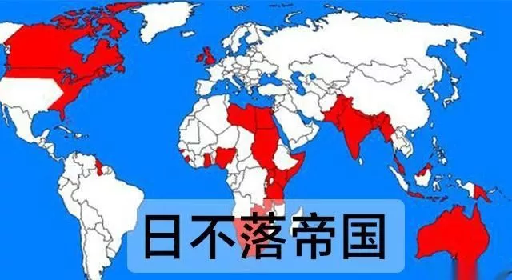
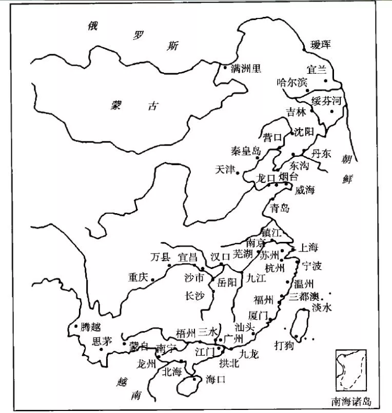

# 第四十一节 鸡同鸭讲

文化馆餐厅中，众人正坐着吃“开封菜”。盛天仕、布特、张岱坐一桌，盛天仕与布特的两个警卫员、李永薰、左亚美、迷烟坐另一桌。

当薯条送上餐桌后，盛天仕教张岱沾上番茄酱后吃。正当张岱津津有味的品尝着薯条之时，盛天仕说道：“张先生，这种薯条是把土豆切条后放入油中煎炸而成，你可知这做薯条的土豆来自何处？”

张岱回道：“愿闻其详。”

盛天仕道：“济州岛！”

“哦！”张岱听后淡淡的回应。

盛天仕继续说道：“这济州岛可是远在千里之外，位于朝鲜国与倭国之间的大海上。”

“哦！”张岱继续淡定回应，脸色如常。

盛天仕对张岱循循善诱道：“澳宋的势力分布极广，不仅在千里之外的济州岛有农场，更远的地方，北至辽东、东至倭国、南至南洋、西至天竺，都有我们的商站。辽东的鞑子为我们采集人参、鹿茸，倭人为我们开采金银，朝鲜人为我们牧马，南洋是我们的谷仓，天竺人卖给我们硝石和棉布。从倭国、朝鲜一直到南洋各国的海面，都有我大宋的商船在自由的航行。”

张岱放下手中的薯条问道：“不知盛首长想说什么？能否明示？”在张岱看来，做生意行商本来就该走遍天下，四处开分铺、买卖物资，在辽东、日本、南洋、天竺各国有商铺、有商船航行有啥奇怪的？莫非，这盛首长想邀自己一起做海贸生意？”

眼见张岱一幅榆木脑袋不开窍的样子，盛天仕决定再说得再直白点：“大宋的商船能在海上自由的航行，是因为我们大宋有一支强大的海军。同时，我们也能以船坚炮利完全隔断了大明的海外贸易。”

张岱一时搞不明白盛天仕想说啥，在他的眼里，所谓的“隔断贸易”比较接近大明的“海禁”，但“海禁”从来就没能真正把海贸禁掉，只是便宜了某些有特权、有门路的地方士绅与海上走私犯。而且澳洲人从海上来，应该非常热衷于反对“海禁”才对。

一想到海上势力，张岱马上又想起了“卖旗”的郑芝龙，于是恍然大悟道：“哦，在下明白了，大宋水师已荡平郑家，今后海上的买路钱是孝敬给大宋水师的。不过在下家中现今不做海贸，盛首长提这个，莫非……？”说到这里，张岱突然看向旁边坐着的“水师副将”布特，心想：“莫非盛首长现在是替布将军当说客？他们想招募我进水师当师爷管理钱粮？”

布特在旁边算是听明白了，盛天仕这是在通过“国际贸易”和“制海权”的角度向张岱宣传澳宋的强大，但张岱显然对“国际贸易”和“制海权”意味着什么毫无概念，更想不到盛天仕此时是在“示威”。

这也不奇怪，对农耕民族来说，海洋不过是“咸水荒漠”，岛屿是“咸水荒漠”里的“绿洲”；沙漠则是沙子的“海洋”，绿洲是“沙海”里的“岛屿”。两者并无大的区别，都是“打不了多少粮食”的“贫瘠之地”。对中国这种传统陆权国家来说，针对沙漠民族、草原游牧民族的“塞防”远比针对海上势力的“海防”重要得多。因为历史上从草原、沙漠那边跑过来“打谷草”的游牧部落远远多于海上的“骚扰”。在明代之前，从西晋时期的“五胡”到五代时期的沙陀族，再到宋代的辽、金、元，已经有太多的北方“鞑子”曾经“入主中原”。而对于来自海上的“岛夷”，在旧时空一鸦之前的中国人眼里，那点军事威慑真的不够看。别说游击队性质的“倭寇”，哪怕是丰臣秀吉统帅的日本正规军，在大明眼里也不如杨应龙这个四川土财主的苗族民兵威胁大。旧时空的历史上直至19世纪70年代，满清依然选择支持左宗棠的“塞防”而不是李鸿章的“海防”。

而且明代中国人评价海上势力强弱的标准也从来就不是在海外有多少地盘、多少商站、多少贸易额，能不能封锁海岸线，而是可以聚集起多少兵力，在中国大陆打下过多少城池，打垮过多少野战军团，其实就是陆权的那套标准。例如明代文人对“倭患”的记载，五十三个倭寇一路砍杀打到南京城下被大书特书，描写王直、徐海等“倭寇”集团的强大时，重点写他们有多少万兵力、劫掠过多少沿海地区，而“倭寇”集团在海外有多少贸易据点、哪些贸易路线、多少贸易额，根本没几个文人关心过。

因此，盛天仕想通过宣扬“国际贸易”和“制海权”来宣扬“澳宋强大”的宣传策略失败了。

这件事也让布特明白了一个道理——不要幻想土著越无知自己就越容易摆显。就好像很久之前某个讽刺中国人的段子：一个外星人出现在面前，普通中国人的反应很有可能是——把这只“大青蛙”剥皮后炖汤……

眼见张岱看向自己，布特思索一番后对张岱说道：“盛首长想要说的是，我大宋通过海贸，聚集起了数不清的钱粮可用于发军饷，拥有大量马匹可用于组建庞大的铁骑，大量的硝石可用于制造火药以供军用，可谓兵强马壮，绝对能问鼎中原、横扫天下。不知张先生可曾记得嘉靖年间五十三个倭寇横行江南八十余日、攻掠州县二十余处、杀死杀伤四五千官兵、打到南京城下之事？现今我大宋的王师不下数万之众，每个将士的战力皆在那些倭寇之上，都是以一敌百的精兵。”

眼见张岱的脸色开始变得凝重，布特又说道：“当然，我大宋王师军纪严明，上岸之后决不会似昔日倭寇般烧杀劫掠。去年大宋王师攻占广州，仁义之师形象相信张先生应该见过了。”

张岱连忙挤出笑脸抱拳致敬：“布将军所言甚是，大宋王师的仁义，去岁余在广州已经见识过了。”

其实刚才张岱之所以脸色凝重，并非摄于伏波军的强大，也不是担心伏波军会烧杀劫掠，而是惊讶于布特这个“海外来客”居然知道大明嘉靖年间的轶事。按照张岱原来的想法，这帮来自海外的澳洲人应该对崇祯朝之前的大明历史不太清楚才对，结果不仅知道嘉靖朝的“倭寇”，而且还知道很多连大明普通百姓都不太清楚的历史细节。虽然江南百姓中也有一些“当年几十个倭寇跑来杀人放火、打跑大股官军”的民间传说，但布特居然精确的知道倭寇的具体数量、横行的时间、攻掠的州县数量和被杀官兵的大致数量。按照张岱的猜想，这恐怕得跟熟悉嘉靖朝史料的大明官员、士人有过深入接触，或者看过《筹海图编》之类记载这件事的冷门书籍才能知道得这么清楚。张岱哪里想得到，旧时空由于互联网等现代传媒的功劳，这件史料对大部分元老来说不过是“常识”。

张岱不禁又想起当初在广州梁家阅读髡贼文章时无意中看见跟自己写的手稿有大段一模一样内容时的惊骇，当时他能想到的只有“心有灵犀”和“梁家只怕早就被髡贼渗透得像筛子似的”两种解释。现在看来，江南一带的官场、士林恐怕也早就被髡贼渗透了，也不知赵引弓这个“髡贼细作”暗中已经跟多少江南的官员、士人暗通曲款了，以至于眼前这个髡贼的“水师副将”居然知道只有一部分江南官员、士人才知道的历史资料。

此时，盛天仕也终于发觉自己以旧时空关于大英帝国的历史名言（注1）为蓝本，从“国际贸易”和“制海权”的角度向张岱宣扬澳宋的强大是鸡同鸭讲。于是他马上改口跟张岱说，澄迈大战时，数千伏波军是如何迅速打垮“五万明军”的；珠三角反击战时，一千多伏波军是如何横扫广东的；广东攻略时，一般只需100多国民军就能拿下一个县城等等。最后盛天仕告诉张岱，伏波军将在八年内打下南北两京。

张岱也频频点头称是，同时内心想：“这两位首长又是宣扬大宋王师兵强马壮，又是宣扬大宋的‘仁义’，看起来是想要余投靠他们了。”

吃吃谈谈中，下午的“达人秀”快开始了，于是众人又回到了包间看表演。

如果说上午的“达人秀”表演者都是归化民，那下午的“达人秀”表演者都是土著。

第一个由土著表演的节目是杂耍，上台的是一对身高相差极大的杂耍组合，高的那个人是个高八尺的“巨人”，矮的那个人则是个身矮二尺的“侏儒”。他们化装成“巨灵神”和“土行孙”，表演了耍石锁、舞锤、舞流星、走索、踏滚木、吞刀、吐火、跃圈、筋斗等杂技。

之后又有土著艺人陆续上台表演地方戏剧、唱小曲、拉二胡、鼓瑟、吹笛、吹箫……

注1：19世纪中叶，英国经济学家史丹菜·杰温斯对当时的大英帝国是这样描述的：实质上，世界的五分之一是我们的自愿进贡者：北美和俄罗斯大平原是我们的谷物种植园；芝加哥和敖德萨是我们的粮仓；加拿大和波罗的海沿岸是我们的森林；在澳大利亚和新西兰放牧着我们的羊群；在阿根廷和北美的西部大草原则逐牧着我们的牛群；秘鲁运给我们白银；黄金则从南美和澳大利亚流到伦敦；中国人为我们种植茶叶，而印度则把咖啡、茶叶和香料运到我们的海岸；西班牙和法国是我们的葡萄园；地中海沿岸各国是我们的果园；我们的棉田，长期以来都是分布在美国南方，而现在差不多扩展到地球上各个热带地区去了。

旧中国海关分布图

大英帝国通过控制主要分布在中国沿海、沿江地区的海关，从中国掠夺了比《辛丑条约》赔款多N倍的财富，并成功打压了中国的民族工业，详情参阅马督工所写的《洋关故事》系列。

日本人眼里的东亚地图

