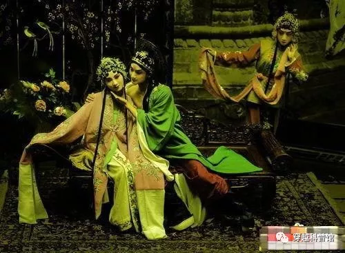
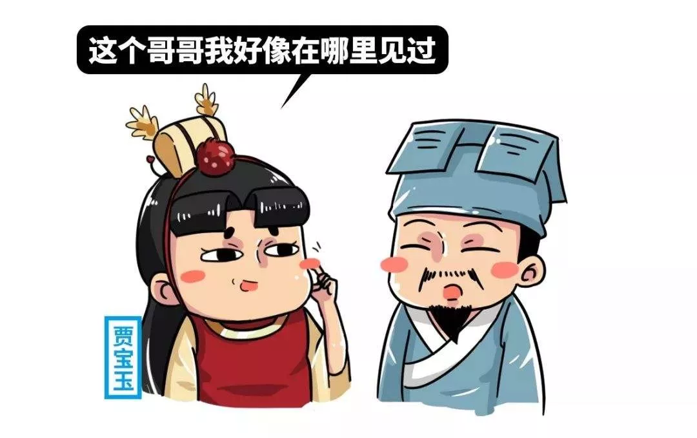
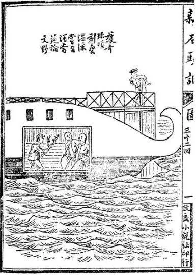

# 第四十二节  “基情”的碰撞

当一对琴箫合奏的土著男女表演结束后，盛天仕突然笑着对张岱说道：“听闻张先生弹得一手好琴，不知能不能过会儿上台弹奏一曲《广陵散》？”

张岱一惊，不是来看表演的吗？怎么这里还有让看客上台表演的道理？

其实盛天仕请张岱上台表演，虽然是突然冒出来即兴想法，也不是毫无把握。这一切，得从“达人秀”组织报名活动时遇到的“惊喜”说起。

“达人秀”的目的一是宣传澳洲新文化，二是为元老院发掘土著“音乐人才”，三是检验这些年来元老院移风易俗的成果。如果有大量的土著、归化民来报名参加表演，那就意味着元老院这些年来移风易俗的努力有了一定的收获，澳宋统治区内的群众已经抛弃了对演艺工作者的歧视。可惜元老们期望的“报名热潮”并未出现，除了用行政命令派来表演的芳草地学生、军警以及体制内的专业演艺人员，其他体制内的归化民报名者寥寥。体制外的土著报名者还不到一百人，而且以来到临高的流浪戏班居多，非专业的体制外土著表演者一个都没有。

不过在登记、了解土著戏班的过程中，元老们也不是没有遇到“惊喜”。

一是意外发现在明末男女同台演出比较平常。

负责这次活动的几个元老受旧时空清末民国历史的影响，原以为这个年代的土著会对“男女同台表演”很忌讳，结果来报名的戏班中有好几组涉及男女同台演出。

实际上，元代以前的民间戏班通常是家庭性质，常有男女同台演出的。明初虽然有过对女演员和男女同台演出的打压，但在明代嘉靖朝之后已经名存实亡了，明末的戏班也是有男女同台演戏的。旧时空直至清康熙年间，才被统治者以“有伤风化”为由禁止女演员登台。此后戏曲舞台上的女角逐渐由男艺人充任，直到清末女演员才重新登台演出，然后关于“男女同台演出”的禁忌也慢慢瓦解了。

在发现明末社会对“女演员”与“男女同台演出”的宽容后，主持文化工作的几个元老心中不禁暗骂满清的“倒退”与“反动”。

二是意外发现明末江南官绅中有不少人从事戏剧创作。

这一发现的起点是报名的土著戏班中有一位班主兼编剧是进士出身的原大明徐闻县典史。此人名叫汤清远，出生于一个书香世家，能通天文地理、医药卜筮诸书。14岁当了秀才，21岁中了举人，34岁中了进士，后来官拜南京礼部祠祭司主事。后因上书弹劾上官贪赃枉法、刻掠饥民的罪行，被流放到雷州徐闻县为典史。广东攻略后，因为人正直、群众口碑好，被留用。雷州府主任萧占风还发现这个人“离经叛道”，思想言行跟澳洲首长们有几分相似，于是推荐他去临高上“学习班”，打算提拔他当徐闻县主任，结果他却递了辞呈，也不等批准就扬长而去。后来就办起了戏班，自任班主兼编剧。（注1）得知临高办“达人秀”后，他就带着戏班来到临高参加演出。几个元老跟他交谈后得知，他在南京当官时认识了很多戏曲名家，这些戏曲的作者大部分都是举人、进士，有些还是高级官员。（注2）

这让元老们大跌眼镜，没想到这个年代居然有很多官绅投身“演艺圈”。再后来，熟悉明史的元老就向对此感到惊讶的元老们科普阮大铖、张岱等明末著名戏曲作家，其中关于张岱的描述还有“会演戏”、“自己登台献艺”的说法（注3）。

因此，盛天仕认为，张岱应该是愿意“登台演出”的。

然后，张岱很快就对盛天仕的邀请表示了拒绝：“盛首长对在下过誉了，在下就不献丑了。”

盛天仕以己度人，心想：“这个张岱还挺谦虚和害羞的，看来得给点诱饵才能让张岱鼓起勇气上台。”

回想了一下自己当年在大学里弹吉他泡妞的经历，盛天仕又说道：“张先生就不要再谦虚了，若论这古琴，在临高恐怕无人能与张先生比肩，先生难道就没有博红颜一笑的念头？”

随后盛天仕又将脸转向李永薰和左亚美，说道：“两位美女，你们很想听张先生弹琴是不是？”

此时，李永薰面色尴尬，一言不发。左亚美则随口附和道：“是，是……请张先生弹奏一曲。”

然而张岱显然没有“博红颜一笑”的觉悟，反而怒气冲冲的说道：“盛首长这是什么意思？在下并非乐户，不习惯上台抛头露面！”

听到“乐户”、“抛头露面”等词汇，盛天仕才恍然张岱不是谦虚和害羞，而是跟本时空的某些土著一样鄙视“演艺圈”。但问题是根据自己之前从布特元老那里得知的信息，张岱也是明末“演艺圈”里的一员，和阮大铖一样热衷于戏剧创作，好像还有上台表演的经历，怎么也表现得如此“封建”？

正当盛天仕疑惑之时，张岱又想起盛天仕提到的《广陵散》、“博红颜一笑”等字眼，顿时感觉屁股发凉，马上铁青着脸掏出昨天盛天仕送给他的琴谱举手一掷投入了盛天仕怀中，说道：“在下并非梨园的相公，阁下若是要寻求断袖之欢，找错人了！这本琴谱阁下也送错人了，原物奉还！”说完这句话，张岱就起身离开，迷烟也跟着走了。

对张岱来说，通过音乐交流“博红颜一笑”的事他其实是做过的，但当时是他给看中的名妓赠送诗词歌赋，再由名妓传唱。实际上，这也是中国古代文人与青楼妓女在文化传播方面的主要合作模式了。文人的诗词歌赋由名妓传唱，就像今日的小说被著名导演搬上银幕一样，能够变得家喻户晓、香名远扬。反过来，著名士人的作品又可以使妓女身价倍增、一夜走红。开句不过分的玩笑，可以说他们之间形成了一种“长期共存、互相欣赏、荣辱与共、肝胆相照”的关系。（注4）

在张岱看来，盛天仕昨天刚赠送给他琴谱，今天就让他上台弹奏琴谱里的《广陵散》，感觉是把他当“名妓”对待了。但张岱可从没想过当“名妓”或梨园的“相公”，他虽然好“娈童”，却绝不想当别人的“娈童”。

虽然盛天仕一时没想明白为何张岱说“琴谱送错人了”，但“梨园的相公”、“断袖”之类的字眼他是懂的，顿时感到非常尴尬。与此同时，坐在另一桌的李永薰和左亚美也是心思各异。

李永薰出生南京锦衣卫家庭，听家里人提过秦淮河边“才子佳人”的“风流韵事”，所以当初她可以很从容的扮成妓女打劫客人赚路费。当她听到盛天仕要求张岱“抛头露面”弹琴并且提到“博红颜一笑”时，她就已经误会了盛天仕的用心，心想这位首长还真是重口味，虽然这位张先生长得还算眉清目秀，但已经年近四十了，当“娈童”也太“超龄”了吧？因此当盛天仕让她和左亚美鼓动张岱上台时，她面色尴尬、一言不发。此时，她小声的问盛天仕道：“首长，你不觉得张先生年纪太大了吗？”

左亚美出生农民家庭，家里人带着她逃荒之前她从未离家超过10里，逃荒到广州后也很快被穿越者买下带到临高进行“封闭式培养”，反倒是不清楚大明的青楼文化。因此当盛天仕要她鼓动张岱上台时，她还随口附和了一句，后来也没听懂张岱和李永薰的话，于是问道：“首长，张先生怎么走了？他刚才说的梨园相公、断袖之欢是什么意思？小李为何说张先生年纪太大？”

看着李永薰、左亚美的奇怪眼神，盛天仕开始语无伦次起来：“我不是，我没有，别瞎说啊……”

沉默一分钟后，盛天仕又对李永薰、左亚美说道：“拿上饮料和零食，先去下面找座位看表演，我跟布首长有些话要谈。”

李永薰、左亚美出门后，盛天仕又示意两个警卫员也出去，守住门口暂时别进来。

等到雅间里只剩下盛天仕、布特两个人后，盛天仕带着一丝怒意说道：“说说吧，到底是怎么回事？你提供给我的资料里不是说张岱兴致来了会自己登台献艺吗？”

布特沉思了一会儿后，说道：“我想，这可能跟‘演艺圈’内部的‘鄙视链’有关。简单地说，由于经济基础和社会风气的原因，这个年代身处幕后的老板兼编剧看不起在前台‘抛头露面’的演员。不知你有没有看过《霸王别姬》，同样是圈内人，身为老板的‘戏霸袁四爷’跟卖屁股的程蝶衣明显不是一个层次的，如果你让袁四爷干程蝶衣的工作，人家也会生气。在21世纪，老板兴致来了跑龙套也许很常见；但在17世纪，人家也许会觉得这是侮辱。”

听了布特的初步解释，盛天仕依然感到不太明白，说道：“我现在也没要张岱上台扮女人，只不过是要他上台弹琴而已，他干嘛发火？而且你给我看的资料里，不是说张岱会登台表演吗？”

“你说的资料是指《张岱：告诉你什么才叫有品的纨绔子弟》那篇文章吧？那不是我写的，是我从大图书馆的电子资料库里翻出来的，你说要找点关于张岱的资料，我就下载后打印给你了。那篇文章我也看过，但除了这篇文章，我并没有找到其他资料佐证张岱会登台表演的事，不确定张岱会不会上台表演。这样吧，我去找汤清远问问，他这种人应该跟张岱有点‘共同语言’，兴许能搞明白张岱是怎么想的。”

注1：这个土著人物的历史原型为汤显祖。明代中期，随着资本主义萌芽的出现，出现了何心隐、罗汝芳、李贽等离经叛道的思想家。他们痛斥口谈道德而心存富贵的伪君子，以“非圣无法”自命，在思想文化上造成了很大的影响。汤显祖读“非圣之书”，在当时的历史条件下接受了资本主义萌芽时期反理学、反传统、反专制的思想影响，尤其敬仰激进的思想家李贽。因此他在政治上、文学上具有反抗性和斗争性，被现代人评价为“进步的思想家”，“思想的进步性主要表现在人民性和反封建性上”。

可惜汤显祖的生卒年代早了点，跟元老院的登陆时间对不上，所以不能写这个人是汤显祖，只能以汤显祖为原型虚构这样一个土著人物，就当是汤显祖的精神传人好了。

不过类似汤显祖这样的土著，虽然在三观方面跟现代人“有几分相似”（能够被现代“革命文化”高度赞颂的古人，或多或少都有些现代性思维，或者说是有点“穿越者”的气质），但在深入了解穿越集团之前，很可能把“大宋”当成第二个“大明”。他们既然能对大明做出“递了辞呈，也不等批准就扬长而去”的事，对澳宋也可能这么做。

注2：《吴晗：明朝资本主义萌芽问题》一文中写道：……很多作过大官的人写剧本，像《牡丹亭》的作者汤显祖就是一个官。元曲的作者没有一个是高级官员，都是一些下层社会的人，有的在衙门里当一个小办事员，有的做医生；可是明朝戏曲的作者，大部分都是举人、进士，有些还是高级官员。……

注3：详情参阅网文《张岱：告诉你什么才叫有品的纨绔子弟！》。关于张岱“演戏”的说法靠不靠谱，我会在后文进行分析。

注4：详情参阅《古代文人与青楼文化》

中国古代的戏剧真的有不少“有伤风化”的色情表演，但因此禁止女演员登台可谓禁错了方向。毕竟两个男演员（其中一人男扮女装）表演“活春宫”，有“搞基”的嫌疑，更加“有伤风化”。

**第四十三节  演艺圈鄙视链背后的阶级歧视**

布特带着门口的警卫员去后台找汤清远，见到汤清远时，布特还未开口，汤清远就先开口说道：“布将军，我上次说过了，剃发投宋一事恕难从命，在下只想过点闲云野鹤的日子……”

“汤先生你误会了，现在找你是因为有些事想请教你，希望汤先生能传道授业解惑。”

听到澳洲人是来“请教”自己的，汤清远顿时有了点优越感，于是跟着布特一起去了包间。

在包间里，三人互相客套一翻后，布特首先问汤清远，是否曾登台唱戏，有没有听说过哪位江南士绅亲自登台演戏？

汤清远说，他只会在以下两种情况下唱戏，一是教班里的小生、花旦演戏之时，二是跟友人小聚谈戏之时，不过公开登台表演是万万不能的，他也没听说过哪位江南士绅会登台表演。

布特又问汤清远，江南文人何时会有雅兴表演弹琴。

这个问题算是引发了汤清远的痒处，顿时滔滔不绝的讲起了自己参加浙江白鹿诗社音乐会的经历。根据汤清远的所说，明代文人的音乐活动类型，分为一人独处、三五小聚、众人宴集三种情况。一人独处时弹琴是为了自娱自乐，或者抒发对亲友的思念、对知音难觅的感慨、对景物的抒怀。三五小聚是指两三个人一起的音乐活动，往往产生于送别、来访、出游、赏花这几种情形当中。众人宴集是指人数众多的宴会，大致可分为一般性的诗文酒会、寿宴、节庆宴会、赏花宴会等四种情况。（注1）

……

跟汤清远交流了一翻明代“演艺圈”的内幕后，布特心中慢慢有了一翻推测。

送走汤清远后，布特对盛天仕说道：“我想我搞明白了，这年头文人如果要唱戏，最多也就是在内部小圈子里表演示范一下，对普罗大众公开登台表演他们是万万不肯的。所以这年头的士绅参与公开演出，都是做出资人、编剧之类的幕后工作，没有人当演员。音乐表演也是一样，明代文人的那些音乐活动，实际上是士绅阶层内部的技术交流与社交礼仪，不涉及公开表演。我觉得让张岱在私密庄园里私下弹琴给你听还行，请他为台上表演的弹琴者作词谱曲也可以，但要他公开上台表演，他应该是不肯的。”

盛天仕问道：“这些人是怎么想的？有才艺干嘛藏着掖着？公开展示出来成为明星不好吗？”

布特说道：“我觉得对张岱来说，该不该上台表演弹琴是次要的，表演平台是什么样的、观众是谁才是最重要的。根据汤清远的描述，这年头士绅如果要表演弹琴，不管是参与竞技的表演对手还是观众，一般都是非富即贵的文人雅士或好友。”

布特指了指下面表演台上的土著艺人和大厅里的上千观众，继续说道：“让张岱跟表演‘胸口碎大石’的街头杂耍艺人同台表演，对着近千名不懂乐律的平头小老百姓表演弹琴，人家恐怕还真会觉得是侮辱。别说张岱了，就算是身为现代人的章子怡穿越过来，你请她去下面弹琴，人家多半也会觉得你在侮辱她。我记得章子怡当年可谓是心高气傲、鼻孔朝天，认为演电影才有面子，说电视剧‘不是东西’，拒演电视剧。”

盛天仕感叹道：“靠，老板鄙视打工的演员倒也罢了，同样是拿片酬演戏，居然也有鄙视链。”

布特说道：“这有啥奇怪的，21世纪小白领鄙视农民工都是常有的事，尽管前者的收入未必高于后者，更何况名气、收入、内部地位相差极大的演艺圈了，而且这种鄙视链还会随着时代的发展而变化。记得在20世纪初，当时西方的一流演员认为演高雅的舞台剧才是自己的追求，拒演低俗的电影。后来电影变成高大上的‘第七艺术’，又轮到章子怡等人鄙视电视剧演员了。”

盛天仕说道：“还真是失策，当初我们怎么就没想到表演活动的逼格问题。”

布特说道：“这回土著报名人数有限，我们有得选吗？而且刻意将表演者划分为三六九等，也有违元老院人人平等的原则。我算是看透了，其实所谓的‘高雅’，本质上是面向富贵消费者的高收费文化。所谓的‘低俗’，本质上是面向底层消费者的文化。20世纪初的社会舆论说电影‘低俗’，除了没有剧本、缺乏特效之类的技术原因，最主要还在于当时的电影太‘廉价’——制作成本低，票价低、主要观众群是比较贫穷的底层群众。后来随着电影向高投入、高技术、高收入的方向发展，主力观众群变成有一定收入、地位的所谓中产阶级，电影也就变得‘高大上’起来。说到底，所谓的高雅，本质上是中上层的品味；所谓的低俗，其实是底层的品味。”

盛天仕恍然大悟道：“明白了，所谓的逼格，其实是阶级歧视的问题。这年头戏曲界的编剧是姓赵的，演员是贱民，所以姓赵的歧视贱民，不愿意干贱民的工作。”

布特则说道：“别说在十七世纪，就算是二十世纪七八十年代的香港，当演员也不是啥有面子的事。当时的香港依然是半殖民地半封建特色，演员歌手赚钱再多，在旁人眼里，还是下九流的戏子歌伎，难登大雅之堂。因此进入演艺圈的，以底层人群为主，他们没有文凭，也没有背景，演艺圈已经是少有的他们能够实现财富积累和阶级飞跃的通道。例如四大天王在出道之前，周润发是酒店服务生、刘德华是发廊洗发的、郭富城是冷气工人、梁朝伟是电器商店的售货员。香港娱乐圈的黄金年代，其实是由一群灰小子和灰姑娘创造出来的。（注2）哪像后来，大量的富二代、星二代甚至官二代带着资源加入娱乐圈。”

盛天仕问道：“那些人怎么又突然对演电影感兴趣了？”

布特回答道：“原因有很多，演电影可以赚大钱，更可以洗钱，例如通过片酬将见不得光的黑钱转到自己的妻子、儿女、情妇的名下。（注3）不过最关键的是，电影逐渐发展为政治洗脑的利器。当赵老爷们发现当电影明星可以取得类似宗教大法师的社会影响力后，怎么可能再歧视电影演员？让自己的子女当电影明星还来不及，就好像在古代欧洲，贵族家庭热衷于送自己的子女进入教会当神职人员。”

盛天仕昂然说道：“既然我们穿越到了这里，现在就得改变人民群众对演员的歧视。”

布特说道：“这是当然，我们举办达人秀，目的之一不正是为了给有才艺的归化民一条上升通道嘛！不过我觉得刚才张岱发火，恐怕不仅仅是因为你叫他上台弹琴吧？”

布特突然走过来拿起桌子上的《吴景略古琴谱集》，意味深长的对盛天仕说道：“这琴谱是你送给他的？”

盛天仕将昨晚跟张岱进行技术交流的事大致说了一下，并且问道：“我也知道这年头的乐户很多都是女的兼职卖身，男的兼职拉皮条或卖屁股，但这跟琴谱有啥关系？张岱为何说琴谱送错人了？”

布特将古代文人和妓女之间“长期共存、互相欣赏、荣辱与共、肝胆相照”的关系大致解释了一遍，最后说道：“你前一天晚上刚送了一本琴谱给张岱，今天就要他上台表演，真的是跟这个时代文人捧妓女的套路高度吻合，也难怪张岱会误会你想打他菊花的主意”

盛天仕喊冤道：“我真没那么想啊。”

布特说道：“这件事可以说是巧合，如果有机会再见到张岱，我替你跟他解释吧。说起来，卖身也可以说是这年头演员的社会地位低下的原因之一了。像芭蕾舞起源于欧洲宫廷，在欧洲是贵族的专利，但就算是在非常崇洋媚外的民国，也依然被张爱玲写文章大大鄙视了一翻。因为芭蕾舞刚传入中国时，其中一个主要的渠道是俄国十月革命后逃亡的没落贵族，当时不少教芭蕾舞的白俄贵族女子为了生计兼职当舞小姐。舞女的性质自不必说，对于张爱玲这样同样封建没落家族出身的小姐来说，舞女显得廉价。”

沉默了一会儿，布特继续说道：“不过送诗词歌赋和琴谱的套路毕竟是文人捧妓女用的，张岱能把思路歪到‘断袖之欢’上，也可能有以己度人的因素。”

盛天仕惊到：“你是说，张岱曾经用这套搞过……”说到这里，盛天仕突然感到一阵恶寒，顿时说不下去了。

布特说道：“张岱对娈童的爱好，可是他自己写在墓志铭上的。他还写过一篇《祭义伶文》，我原本一直以为他对夏汝开的深情记述，一是欣赏对方文艺水平和为人，二是因为两人的交情，现在想来，这里面恐怕还有些不纯洁的内情，难道《红楼梦》里蒋玉涵的原型就是夏汝开？”

盛天仕奇道：“怎么又扯到《红楼梦》？”

布特回答道：“这个啊，因为《红楼梦》里贾宝玉的人物形象跟张岱实在太像了（注4），所以红学界有过一个推测，那就是《红楼梦》的真正作者是张岱。或者说，《红楼梦》最早的作者是张岱，他写了《石头记》，但没流传开。后来手稿辗转传到曹雪芹手里后，被曹雪芹删改成了《红楼梦》。《红楼梦》八十回之后的内容之所以不见了，原因之一是后面的内容涉及满清入关，所以被曹雪芹或其他拿到原始手稿的人毁掉了。如果这种推测是真的，那贾宝玉和蒋玉涵的原型很可能就是张岱和夏汝开……”

话聊到这个时候，下午的达人秀表演活动也结束了。盛天仕、布特去下面的观众大厅叫上李永薰、左亚美，一起去逛文澜文化公园内道路旁的美食街。

有人说《红楼梦》中贾宝玉最像的人就是张岱

注1：详情参阅《明代永嘉文人音乐史料考析——“白鹿诗社现象”的发现、考证与探究》，上海音乐学院硕士学位论文。永嘉是浙江温州古郡名，宋代时“永嘉学派”崛起，是“浙东学派”的主要派系之一，主张减轻捐税、买卖自由、尊重富人、发展商业，是中国资本主义版儒家文化的鼻祖之一。据考证，宋元明清四朝永嘉文人里擅长弹琴的音乐家有171人，尤其明代懂琴的音乐家最多，有64人。这是目前我能查到的、生活状态与三观最接近张岱的古代音乐家群体了。

注2：详情参阅《蓝洁瑛与邝美云：香港都市传说的一体两面》

注3：其实在古代，古董字画等艺术品市场也在充当类似的作用。其中比较赤裸裸的一种“交保护费”模式是，商人“重金购买”当权者的书法题字作为安全营业的“保护伞”。

注4：因为这个原因，《张岱临高见闻录》的少部分内容改编自《红楼梦》的清末续篇《新石头记》，尤其是第一、第二节，很多归化民龙套也是来自那本书。

《新石头记》插图

