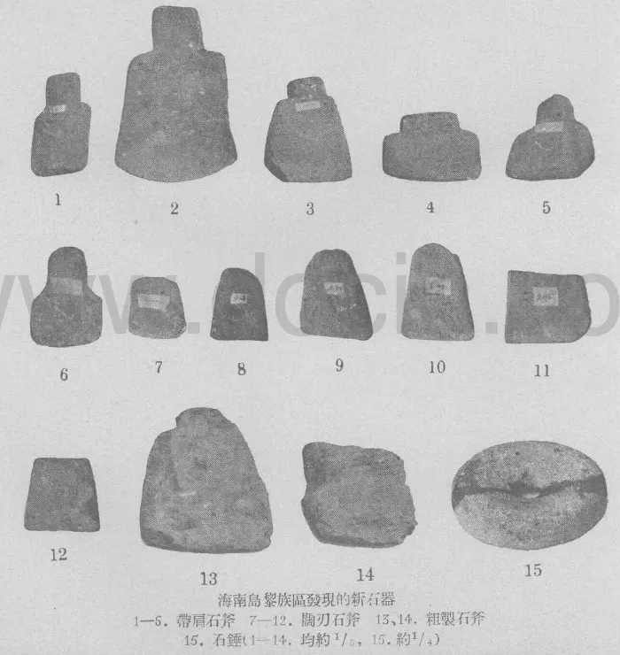
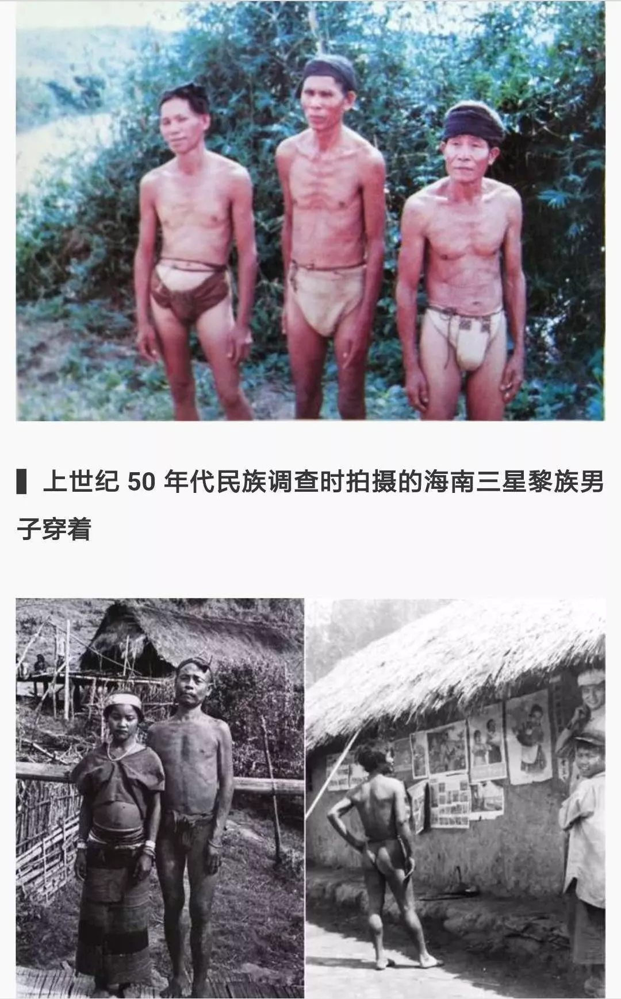
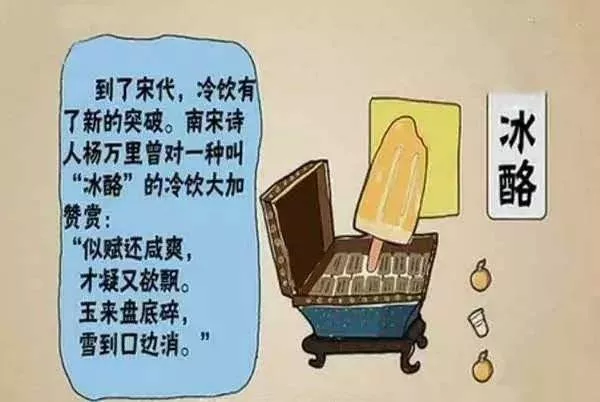
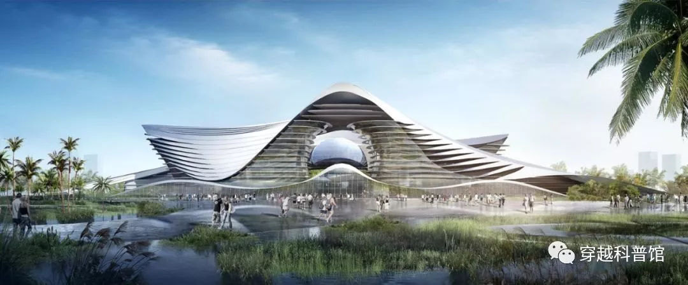

# 第四十六节  工具冶金史馆

博览会开幕的第二天，张岱主仆来到科技馆门口，在盛天仕、布特的带领下走进科技馆参观。

当初钟利时博士所写的《科技馆展览计划大纲》，涉及工具冶金史馆、能源动力史馆、机械工业馆、纺织工业馆、交通工业馆、铁路工业馆、钟表工业馆、木材工业馆、工业理念馆、环保科普馆，共计十大展览主题。（注1）《提纲》公布后，马上震惊了众元老。

有的元老说：“这也太赞了吧，现代也没几个科技馆有这个配置啊……”

也有的元老说：“这是首都工业科技馆的配置吧？”

总体而言，钟利时写的企划实在太过豪华，不仅远远超过了目前元老院的建设能力，有些展览内容如“环保科普”也有点超前。根据目前元老院实际掌握的资源，经过删改后缩减为工具冶金史馆、能源机械史馆、交通工业馆、钟表工业馆、木材工业馆五大展览主题。

工具冶金史馆的展览内容分为石器时代、青铜时代、铁器时代、现代钢铁四个部分。

“石器时代”的展览品主要来源于海南生黎村落，除了展览石器（注2），还展览骨制工具（注3）。当黎苗事务办公室主任慕敏向科技馆捐献通过贸易得来的石器、骨器之时，众元老不禁感慨，生黎村落可真是石器时代原始部落的活化石，看来当初“抚黎”的明军很有“穿越者”的感觉。

光屁股拿石斧打仗？这样能打赢明军才怪。哪怕是最落后的非洲黑蜀黍部落也不过如此。最不可思议的是，海南部分黎族居然将这样的生活延续到了新中国建立之后。

青铜器一部分来源于当初对士绅进行抄家时意外缴获的古董，一部分从大陆古玩市场购得。

传统铁器则来源于海南汉族村落，这是最容易获得的展览品。

最后就是由元老院钢铁厂生产的现代钢铁器具。

出于“教育土著”的目的，展览的现代钢铁器具大部分都能在石器时代、青铜器时代、铁器时代找到对应的同类产品，大部分现代钢铁展品跟十七世纪中国人的日常生产生活有着非常密切的关系，例如各种钢制的农具、工具、炊具、兵器等等。从而确保土著参观者可以马上看明白现代钢铁展品的用途，以及“对比明显”的展览效果。

“……张先生，请看这种澳宋生产的滑轮式钢弩，准确射程可达二百多步，篡明那边的木弩、竹弩却只有五十步射程，火铳射程也不过六七十步。就算澳宋没有犀利的火铳，光比拼弓弩，篡明兵卒依然不是澳宋王师的对手。就算不打仗而用于打猎，也能打到更多的猎物，获得更多的肉食和皮毛。这就是先进生产力带来的差距，不仅有益强军，也有益于民生……”

盛天仕滔滔不绝的跟张岱提到各个时代器具的材料差异、性能差异，强调因为这些差异导致的生产力与战斗力方面的差距。张岱也不时点头称是，心中不禁想起了当初跟刘三在广州的谈话。当初在广州，刘三也曾大谈“先进生产力”，告诉他：“技术本身的原理，更是有军国民生诸多大用啊”，其论调跟盛天仕很相似。

在张岱看来，所谓的“与民生有益”，最低限度要让人吃饱穿暖，农业与纺织业的发展就成了关键，也就是所谓的“男耕女织”。对于“军国大事”，起决定性作用的除了“国朝富强、民生宽裕”，还有就是“众正盈朝”。一旦朝政昏暗、奸孽当道、武备废弛，就算有再多的钢铁、粮食也不足为凭。想当年大明给予辽东明军的军饷、粮食、铁器不知比建奴多几倍，结果却是屡战屡败，包括铁器、火器在内的大量军资因此白白送给了建奴。

然而当时在民生方面，刘三向张岱举的例子却不是澳宋在农业、纺织业方面的“先进生产力”，而是大谈“半大小子卖冰棍”；在军国大事方面，刘三的提议却是向蒙古人卖只能日用的马口铁换取牛羊马等大畜。

这让张岱感到十分可笑。要不是广东气候炎热、广州城里有钱人多这些“天时地利”条件的配合，“半大小子卖冰棍”这个产业怎么可能发展得起来？

被刘三重点吹嘘的“搪瓷大缸”则可以被装着棉被的小木箱取代，还不如谈谈制冰技术。不过张岱对穿越者的制冰技术也不怎么稀罕，因为大明也有同类技术，使用硝石制冰，张岱作为一个吃货也吃过类似现代冰淇淋的“冰食”（注4）。由于对穿越集团的工业化制冰技术没有概念，在张岱看来澳洲人应该也是用硝石制冰。

虽然心中鄙夷，但刘三的“卖冰棍”点子确实能在广州城里解决一部分少年的就业问题，受儒家浙东学派“工商皆本”理论的影响，张岱也不歧视商业，所以当时张岱通过有条件的承认“技巧之力”对“民生”的好处，给刘三留了点面子。

军国大事方面，张岱认为刘三的“铁器论”根本是“见小忘大”、“本末倒置”。只要像王振这种向蒙古人私卖军器的阉竖继续把持朝政，像晋商这种走私违禁品的奸商继续存在，卖点马口铁又有何用？至于通过贸易换来牛羊马等大畜，这个还用你提点？大明很早就借鉴唐宋旧法，“用茶易马，固番人心，且以强中国”（注5），完全不用卖任何铁器就能换来马匹等大牲畜。与其琢磨怎么私底下在铁器上动手脚，不如多想想如何多多提拔像“岳飞”那样的忠臣良将，防止像“秦桧”那样的奸臣把持朝政。辽、金、蒙元军备齐整，也没能妨碍到杨家将、岳家军、大明王师屡败胡虏。

与刘三相比，盛天仕带张岱参观并解释各个时代的器具差异更具有说服力。尤其是钢弩，即可通过打猎有限解决吃饭穿衣的温饱问题，也可用于打仗。因此张岱很快就感觉到了生产工具、兵器的改进对生产力、生活水平、战斗力的改善作用。不过，张岱并没有因此彻底认同盛天仕的观点。

民生方面，张岱始终觉得，光靠改进生产工具并不能彻底解决民生问题。“工具”再好，如果不能和“天时、地利、人和”三方面的情况相配合，未必能发挥作用。例如澳洲人生产的钢铁农具固然比传统农具好用，但对于农业亩产起到决定性作用的还是气候的“风调雨顺”和耕地的肥瘦，例如靠河的水浇地和山上的旱田亩产区别很大。就算是从事从工商业，依然受制于“天时地利人和”。天时方面，既有海难漂没之类的天灾，也有季节性的市场供需问题；地利方面，既有地形交通的问题，也有地方市场特色的问题；人和方面，除了生产技术、管理水平、人力资源等要素，还涉及政治方面的人脉与治安方面的成本。

在张岱看来，工商业的利润大小主要取决于市场的需求、价格以及在运输、治安、政治等方面的成本与风险。就算做出再好的产品，如果卖不出去或售价太低，运不到销售市场或运费太高，被黑白两道“雁过拔毛”甚至全部“吞没”，最后还不是一场空，反而还折损了本钱。

由于历史的局限性，已经习惯了太平日子和通过科举功名、官位、人脉打通“商路”的张岱已经忘了，这个世界有很多人其实是“仗剑行商”。当然，这怪不得张岱，因为就算是中国在这个年代最应该“仗剑行商”的镖局，也是信奉“多交朋友”而不是“打遍天下”，而“交朋友”这种事跟刀快不快的关系不大。甚至直到旧时空的21是世纪，商业活动中依然不乏“关系是第一生产力”的现象。张岱更没想到，有人会用大炮“开拓市场”。因为在中国历史上，有本事用大炮让黑白两道甚至皇帝屈服的人，大多数会改行当官甚至当皇帝，而不是继续以经商作为主业。因此在旧时空的1860年，当洋人打进北京后没有当皇帝，而是仅仅签了一个协议、要了一点赔款、增开了几个通商口岸，就退了出去，让大清国的人对洋人大脑的工作方式实在是百思不得其解，感觉是遇到神经病了。

军事方面，张岱觉得澳洲人的武器固然非常精良，但要是碰上吃里扒外、唯利是图的的“奸臣”、“奸商”，还是会悲剧。而且从朝廷的角度考虑，臣民掌握的武器太精良也不是啥好事。

“所谓‘飞鸟尽、良弓藏’，弓弩再好，也得有猎物可打、有用武之地才行。（注6）刘大夫是这样，这位盛大人也是这样，难道见执于微末之事是澳洲人的嗜好？”想到这里，张岱嘴角露出一丝和煦的微笑。

盛天仕见张岱笑了，一时不知张岱是何心态，开口问道：“不知张先生是否从中感悟到我澳宋的工具史观与先进生产力？”

张岱想了想后说道：“不知盛首长能否谈谈澳宋在机关术（农业机械）、驱虫药（农药）和肥田粉（化肥）方面的先进生产力？此乃变更风水的奇术啊！”

盛天仕不知张岱内心所想，听到张岱说出“先进生产力”一词，顿时感到很得意，心想：“刘三没能让张岱领会的‘先进生产力’概念，自己居然办到了。”

于是盛天仕高兴的说道：“带张先生领略我澳宋的机关术，本来就是这次参观的主要目的之一，请张先生随我等参观机械工业馆。”

实际上张岱领会到“先进生产力”概念，并非是此时盛天仕说了什么，而是之前跟刘学笙参观南海农庄时自己感悟出来的。与“工具史观”相比，张岱对“改换风水”的“机关术”、“驱虫药”、“肥田粉”更加感兴趣。

但张岱却并不知道，他眼里能“改换风水”的“机关术”、“驱虫药”、“肥田粉”，在现代人眼里也是“工具史观”的一部分，而且是“工具史”的高级阶段。但这类“工具”的普及使用，需要以大规模开发煤炭、石油等化石能源为前提。一旦化石能源的供应出现问题，又没能找到靠谱的新能源取代，生产力与社会发展马上会发生严重的倒退。例如旧时空20世纪的石油危机就让很多工业国的经济发生了严重衰退。

当然，大规模使用化石能源的工业社会，超越了张岱的见识，因此张岱并未能想到“机关术”、“驱虫药”、“肥田粉”也是“工具”。说到底，张岱眼里的“工具”，跟穿越者眼里的“工具”不是一回事。

注1：详情参阅《番外5：钟利时博士所写的科技馆展览计划大纲》

注2：1950年代初，中国考古工作者在海南黎族村落发现了黎族收藏的石器，详情参阅《海南岛黎族区发现的新石器》

注3：详情参阅《黎族骨器》，白沙黎族自治县至今保留着骨雕技艺。

注4：唐朝末期，人们在生产火药时开采出硝石，既而发现硝石溶于水会吸收大量的热，使水降温到结冰。自此便有夏天制冰之法，当时长安街头已有出售冰制冷饮和冷食的商贩，买卖人逐渐把糖加到冰里吸引顾客。到了宋代，市场上冷食的花样日益繁多，商家还在里面加上水果或果汁，后来还在冰里加果浆和牛奶，很像现在的冰淇淋，当时称为“冰酪”。十三世纪，马可•波罗把这种冰淇淋的制造方法带回了意大利，后又传至法国。卡特琳皇后的一位私人厨师，在此基础上研制出掺入奶油、牛奶、香料的半固体冰淇淋并刻上花纹，这种甜品大受贵族阶层欢迎并迅速流传开来。

注5：《明史．食货志》对明初陕甘茶马互市的记载。

注6：“飞鸟尽、良弓藏……”这段话是一语双关。从民生角度来说，没有鸟，弓弩再好也解决不了吃饭问题。从“军国大事”的角度来说，没有强大的外敌，军方容易遭人忌恨，而且是几乎所有阶层的忌恨。君主担心军方会造反取代他，贵族担心军方不顾他们的脸面和利益搞“独裁”，平民担心军方会欺压他们。就算是临高五百废，也经常乱扣“独走”之类的帽子。

**番外5：****钟利时博士所写的科技馆展览计划大纲**

现实生活中的海南科技馆设计效果图

一、工具冶金史陈列

旧石器时代：打制石器；狩猎与战争

新石器时代：磨制石器；骨制工具；弓弩

青铜时代：青铜冶炼史；青铜礼器；青铜兵器；青铜弩机；铜钱

铁器时代：冶铁的历史；铁制工具；铁制兵器；锻造与制钢；铁的战略意义

现代钢铁：现代冶炼技术；型材与轧钢；现代锻造；现代热处理；

结束语：钢铁与国力

团体活动：打制石器；

二、能源动力史陈列

能源简史：先民用火的历史；先民对煤炭的使用；取火工具；

畜力机械：传统畜力机械（畜力碾盘、畜力磨坊）；

风力机械：传统风力机械（风力磨坊、风力提水）；

水力机械：传统水力机械（水车灌溉、水力磨坊）；现代水轮机；

现代热机：蒸汽机；蒸汽机与工业革命；斯特林发动机；汽轮机概述；

电力科普：电的基本概念；电热效应；电磁效应与发电机；电化学效应与电池

太阳能：太阳能简介；太阳能热水器；

结束语：能源与未来

互动体验：太阳能热水器体验；蒸汽机模型演示；斯特林发动机模型演示；手摇发电机体验

团体活动：花样取火比赛(钻木取火、透镜取火)；

三、机械工业陈列

力学科普：理论力学；结构力学；材料力学；

结构制造：铸造；锻造；钣金；锻压；

结构连接：紧固；铆接；焊接；钎焊；

机械原理：常见机构；齿轮传动；皮带传动；连杆与钢丝传动；离合器；变速机构

机械加工：车床；铣床；刨床；钻孔机械；磨削机械；

机械设计：绘图仪器；机械制图与晒图；公差配合与样品；表面光洁度与样品；

机械教育：机械工程师与技术工人对社会的价值；机械工程师与技术工人职称级别与福利待遇；如何成为机械工程师；如何成为机械技术工人；澳宋优秀工程师与技术工人介绍

互动体验：多种机械机构活动模型操作体验；

团体活动：机械制图；配钥匙比赛

四、纺织工业陈列

纺织机械：古代纺织机械；当代纺织机械；提花机

缝纫机械：古代缝纫工具；缝纫机；

服装制造：服装的演变；当代服装款式；

皮革制造：皮革的历史；皮革的生产过程；皮具的生产；

互动体验：纺织机模型纺织体验；

团体活动：用缝纫机制作小口袋；

五、交通工业陈列

车辆制造：车辆的历史；车辆的结构；当代车辆；

道路设施：公路的构造；交通规则与信号；交通安全；服务场所（驿站与大车店）

船舶制造：船舶的历史；帆船的结构；轮船的结构；船舶的制造；当代船舶

航海技术：导航与定位；海员的职能；帆船航行；轮船航行；海上救生；

港口设施：港口设施；港口机械；海关知识；检疫检验

结束语：海洋的战略意义；

团体活动：六分仪定位比赛；航海钟定位比赛；交通警察角色扮演

六、铁路工业陈列

机车制造：蒸汽机车；货运车辆；客运车辆；特种车辆；列车编组；

铁路器材：铁轨及配件；枕木；道岔；信号灯；轨距；铁道的结构；

铁路设施：铁路的建造；铁路桥梁；铁路隧道；站台设施；扳道房；铁路道口

铁路运行：单线与复线；铁路通讯；铁路调度；铁路网示意图；客运时刻表

铁路知识：乘车常识；安全常识；铁路法规

结束语：铁路的经济与战略价值

互动体验：铁路火车模型演示；

七、钟表工业陈列

时间知识：天文与历法；经度与纬度；天文仪器的历史；计时器的历史；时间测定与时区；

现代钟表：钟表原理；钟摆演示模型；摆钟工作演示；临高的钟表产品；钟表对航海的意义；

互动体验：重力式擒纵器演示；大型音乐咕咕钟定时表演

八、木材工业陈列

木材历史：先民利用木材的历史；传统木结构建筑；传统家具

木材采伐：森林与环境；原生林、次生林与人工林；科学采伐与可持续发展；木排运输；

木材加工：规格材加工；规格材分等；规格材干燥；使用规格材的好处；木材的品种和特点

木结构建筑：现代木结构建筑；防火、防虫与防腐；

木制家具：现代家具；标准化生产与订制；门窗的结构与生产

木工机械：传统木工工具；现代木工工具；木工机床；

互动体验：拼装斗拱

团体活动：木工DIY

九、工业理念陈列

工业理念：传统手工业与现代工业的区别；大量生产与流水线；标准化；质量过程控制；社会分工与产业链

实例展示：食品工业与快餐业；32mm系统家具及配件；标准件；标准包装箱与托盘；基于规格材的木结构建筑设计；服装与鞋子的尺码；农产品的分级、分等

互动体验：测量自己的身高、三围、脚码选择适合自己的服装、鞋子尺码。

十、环保科普陈列

环保概述：人类与环境的关系；工业与环境污染；污染治理的代价及效益；环保的务实与极端主义；以人为本的环保理念

劳动保护：烟气；重金属；高温；粉尘与矽肺；劳动防护现状（劳保装备与措施；定期身体检查；高危职业调岗制度）；劳动防护的未来（粉尘治理）

污水处理：污水治理技术的现状（污水集中排放、上下游规划）；污水治理技术的未来（污水处理厂及未来污水处理技术简介）

废气处理：废气治理技术的现状（依风向规划工业区、避开人口集中地区、选址的学问）；废气治理技术的未来（除尘技术；脱硫、脱硝技术；清洁能源）

固废处理：固体废物治理技术的现状（合理规划填埋场、利用废弃矿井、填海造地）；固体废物治理技术的未来（固体废物利用）

垃圾处理：垃圾处理治理技术的现状（垃圾填埋场与城镇发展、垃圾回收）；垃圾处理治理技术的未来（垃圾焚烧及垃圾发电；垃圾分类）

其他污染：声污染概述；光污染概述；

农村环保：秸秆燃烧与大气污染；沼气与堆肥；

湿地保护：湿地的环境价值；红树林的环境价值；水体自净与生物降解；水体富营养化；

生物保护：生物多样性对人类的价值；人类活动对动植物种群的影响；入侵物种的影响；森林与动植物种群；动植物种群状况评估；动植物保护与栖息地民生的关系；

渔业保护：保护渔业资源；过度捕捞的危害；休渔期与网具限令；

森林保护：保护原生林；科学采伐；摒弃刀耕火种的落后生产方式；不使用生长缓慢的木材；森林与水土流失；

结语：以人为本是环保的核心；

互动体验：垃圾分类演示；蚯蚓厨余垃圾箱

