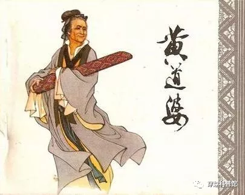
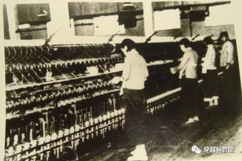

# 第四十八节  纺织业的先进生产力

对于纺织业的先进生产力，盛天仕的讲解先从黄道婆开始。在带张岱参观临高土著的手工纺织机的时候，盛天仕告诉张岱，松江府之所以能成就“衣被天下”的美名，实现“苏松税赋半天下”的财政收入，重要原因之一是在宋末元初有一个叫黄道婆的松江府织女曾来琼州府学习当地的纺织技术，并将其带回江南进行推广。黄道婆所推广的纺织技术，可以说是宋末元初的“先进生产力”。没有黄道婆的贡献，就没有松江府的“衣被天下”，松江府更没办法向朝廷上缴“重赋”……

盛天仕的“群众史观”让张岱一时大脑当机，从小到大，他所受的历史教育都是以“帝王将相”作为主角的“英雄史观”，从未想过一个小小的“织女”居然也能对朝廷征收赋税的数量有这么大的影响力。虽然他以前非常佩服一些工匠的技艺，认为“盖技也而近乎道亦”，但从未想过匠人的技艺居然能影响到“民富国强”。虽然他现在非常钦佩澳洲人的“机关术”、“肥田粉”、“驱虫药”等技术，但一直觉得发明这些技术的人应该算“圣贤”而非“工匠”。例如春秋战国时期的著名木匠鲁班在当时被尊称为“公输子”，是“诸子百家”之一。

随即张岱又想起，盛天仕口中的那位“了不起的劳动人民”、“伟大的匠人”、“优秀的织女”，好像就是松江府黄母祠里的“黄婆婆”。澳洲人喜欢用“匠人”、“织女”之类的俗词称呼“布业始祖”？“黄婆婆”固然值得称颂，但将其拔高到影响国运的地步真的合适吗？那将置历朝历代的圣王明君、贤臣良将于何地？

正当张岱想着盛天仕的“惊人之语”是对是错之际，盛天仕又说道：“如今，我们元老院在纺织业方面所创造的先进生产力，远远超越黄道婆，可谓鬼斧神工、出神入化。张先生请看那边……”带着张岱来到一处建筑模型面前，盛天仕继续说道：“我大宋的纺织厂和制衣厂规模实在太大，如果全搬过来，科技馆就差不多全塞满了，所以对纺织机械的展示，我们将以厂房模型加澳洲影戏的模式进行。”

一分钟后，厂房模型上面的白布开始显示画面。首先出现的是一座极大的厂房，厂房内十分空旷，也说不出有多大，只见纵横罗列的都是机器。

盛天仕挥舞着木质指示棒说道：“那边墙内是棉花仓，墙上有一个大铁筒，仓里面另装机器，把棉花由筒口送出来……”张岱看时，果见棉花从筒口汩汩而出，旁边便是松花机，随出随松，松了又推到别的机器上，并不用人力。

电影一边放，盛天仕一边进行解说：“现在出现的是轧花剥绒机，棉花加工机械的一种，是从轧花后的棉子上剥取残留短绒的机械。你看到的是锯齿剥绒机，其结构简单，造价较低，维修方便，但生产效率较低，每台磨料剥绒机一般每小时处理棉子350〜500千克。……”

然后是纺纱的画面，每台机器旁边都有一个女工看着，不时接一下线头。接着是染色的画面，各染机的颜色不同，青、黄、赤、绿、黑，各色俱备。染成了便由机器送到烘干机上去，只在机上一过，那纱就干了。后来又出现了织布的画面……

张岱后来在回忆录里对这段影像是这样描述的：“棉花包至此开始。由弹而纺，而织，而染，皆用火轮法……棉花分三路，原来泥沙搀杂，弹过六七遍，则白如雪，柔于绵矣。又以轮纺，由精卷而为细丝。凡七八过，皆用小轮数百纺之。顷刻成轴，细于发矣。染处则在下层，各色俱备。入浸少时，即鲜明成色。织女数十人，织机百张，每机二三张以一人司之，刻不停梭。自木棉出包时，至纺织染成，不逾晷刻，亦神速哉。”（注1）

最基础的“民生”不仅涉及到农业，还有纺织业。人类想要生存，“男耕女织”缺一不可，这也是为何历史上最早的英国工业革命从纺织业的技术革新开始。不管是大航海时代还是第一次工业革命时期，纺织品都是市场最广阔、最容易提高平民生活水平的商品之一。张岱虽然不懂工业革命，但“男耕女织”的道理还是懂的，因此很快就感悟到了纺织技术的机械化对于生产力、生活水平的极大提高。

张岱对盛天仕颤抖着说道：“此技艺之能事，是岂工匠之所能办乎?大宋的机关术，实乃大道矣！不知这作坊能产多少棉纱棉布？”

“目前纺织厂有女工三百多人，年产棉纱上百万斤，棉布约四万匹。”盛天仕报出了纺织厂的规模和产量，然后一脸得意的看着张岱张大嘴巴、一脸懵逼的表情。

之后，又出现了“制衣厂”的生产场面，上百名女工或拿着剪刀，或踩着缝纫机，流水化作业。织成的衣服送到一个竹片架子上，那架子一翻，又翻到折迭机上，一件衣服便折好了。又另翻到一架上，便有纸包好，往旁边一送，便有个纸匣接着，旁边一个人便取起纸匣。那机上又推出个纸匣来，第二件衣恰好包完送到，便又装在匣里……

盛天仕递给张岱一件成衣，说道：“张先生请看，这就是元老院制衣厂生产的衣服，感觉如何？”

张岱回忆了一下刚才看过的澳洲影戏，眼见源源不断的棉花从仓库里出来，迅速织成棉布和衣服，堆得如同小山一般高，心中不禁十分叹羡，说道：“贵境使用自动机关术纺织、制衣，衣被天下的美名已不再属于松江矣！”

盛天仕听后，心中却是感到有点尴尬。因为来自海南岛黎区的原料供应有限，加上为确保粮食供给又不能在平原大规模推广棉花种植，目前临高纺织厂的生产已经遇到了原料不足的生产瓶颈。现在生产的棉纱、棉布、棉衣在供应元老院南方统治区后就基本上消化完了，远远谈不上取代松江府“衣被天下”的地位。至于将来，元老院早就规划好未来中国最大的棉纺织业加工中心将会放在上海，也就是现在的松江府和苏州府所属的嘉定、崇明两县，对于松江府“衣被天下”的地位并不会造成任何冲击。

之所以选在上海，一是因为上海地区是十七世纪中国最大的棉花种植基地之一；二是因为松江府已经跟这个时代中国最大的棉花种植区山东、河南形成了“以棉换布”成熟交易渠道；三是上海距离适中，既靠近长江流域这个目前中国最广大、水路交通最便利的市场，又可辐射全中国甚至日本、朝鲜市场。

总之，建设上海棉纺织工业中心，既能确保原料供给，又能降低运输成本。

目前，杭州站已经在舟山岛上秘密建设了一个小型棉纺织车间，从“清节堂”和女性难民中招募、培训女工，进行试生产。棉花原料一部分来源于舟山岛上的本土化种植，一部分来源于杭州站在松江府和浙东各府县采购的棉花。生产出来的成本主要供应杭州站、山东站、济州岛等北方基地的需求，可谓非常低调。等到元老院占领上海地区后，舟山岛上的棉纺织产业也将搬到上海并扩大生产。

不过张岱的那句话对盛天仕的装逼计划并没有什么实质性妨碍，略微尴尬一下后，盛天仕继续意气风发的问张岱：“张先生从中感悟到了元老院的先进生产力没有？有了机器解放生产力，我们就能生产更多的粮食、被服和军械，节省下来的人力还可以让更多的壮丁当兵，并让他们吃饱穿暖、军械精良，从而实现富国强兵。”

张岱听后一愣，随即恍然大悟道：“多谢盛首长指点，晚生明白了！”

听到张岱谦虚的自称“晚生”，盛天仕的笑意更浓了，说道：“上午的参观差不多了，我们先吃午饭，下午我接着带张先生参观交通工业馆，让张先生感悟一下我大宋在交通方面的先进生产力。”

盛天仕带着张岱主仆来到文化馆里的餐厅，在安排张岱主仆吃自助餐时，盛天仕遇到了自从将张岱迎进科技馆后就离开的布特。

布特将盛天仕拉到角落里悄悄问道：“怎么样？我教你的那套解说词张岱听了有何反应？”

人心隔肚皮，盛天仕并不知道张岱的心理活动，根据张岱表面上的言行和反应小声说道：“效果非常好，张岱已经对我们五体投地了，并多次惊讶得话都说不出来！”

盛天仕在科技馆里跟张岱说的那些不是盛天仕自己想出来的，而是布特教他的。自从在“说服张岱”的过程中碰壁几次后，盛天仕就跑去请教自称“喜好历史考证、了解古人心态”的布特，尤其是上次关于“海权”讨论让盛天仕发觉，也许布特确实比自己更了解“古人”。

听到盛天仕的回答，布特脸上也露出了笑容，心想自己这些年来跟那些归化民、土著的思想交流总算没有白费，自己为科技馆苦心设计的展览内容与思索良久写出来的解说词也没有白费心思。

注1：原文改编自《乘槎笔记》，作者斌椿，清末外交官。

