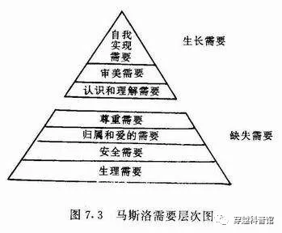
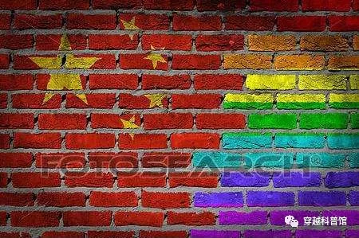

# 第四十九节  思想交流的技巧

布特的宣传策略能触动到张岱，不是偶然的，而是建立在无数次跟归化民、土著思想交流失败的经验基础上。

政治与文化宣传是一门涉及经济学、社会学、心理学、传播学、自然科学等多门学科的复杂技术，需要跟受众的生产生活方式、利益诉求、心理需求、三观等多方面的实际情况相配合才能真正发挥效果。即使是专业人才，也时常把宣传搞砸，或者发生“有心栽树树不活、无心插柳柳成荫”的意外情况。在这方面，很多穿越者引以为豪的“先进几百年的思想”，不仅不是优势，反而是一种类似“代沟”的劣势。即使是三观、见识比较接近的现代人之间，都时常发生鸡同鸭讲的情况，更别提在三观、见识方面差异极大的“古今交流”了。（注1）

因为三观的不同和“代沟”，其实元老的某些言行长期以来让很多归化民和土著看不懂。早期这方面的情况并不突出，一是当时归化民们忙着解决并满足于“吃饱穿暖”的“生理需求”，没空思考元老们的“奇言怪行”；二是很多归化民出于对元老“恩主”的“敬重”，不好意思或不敢当面提出疑问，一般也就私底下议论一番。体制外土著则出于“关我鸟事”的心态没有当面提出疑问。广东攻略开始后，情况开始发生了变化。

首先，很多归化民逐渐摆脱“应声虫”的状态，各种关于元老院政策的提问甚至“质疑”多了起来。至于原因，一是元老不够用，大批归化民干部逐渐摆脱元老跟班的地位，开始独自主政一方。当了某地或某部门的一把手之后，他们必须在没有元老指导的情况下独立执行政策甚至进行某些独立决策，不仅需要知道怎么做，更需要知道为什么这么做，所以在跟元老进行谈话时各种提问多了起来。二是随着某些归化民由“温饱阶段”上升为“富裕阶段”，以及政治地位的提高，他们的心态由“生理需求”逐渐上升为“认知的需求”、“自我实现需求”（注2），觉得自己“有说话的份”了，于是开始提出各种“忠言（逆耳）”。三是有些归化民跟元老混熟了，也纷纷向跟他们熟悉的首长表达了各种“关心”。突出案例就是，广东某县主任在土著师爷的劝说下向刘翔打报告，要求暂缓推广纸币，然后被刘翔一撸到底。高纤也为了王主席的“家业兴旺”提出了很多“苦口婆心”的建议，然后被王主席打发回南海农庄。

其次，很多临高士绅也纷纷摆脱“拍手党”状态，开始积极向元老院“上折子”提出他们的“治国良策”（详情参阅同人第13、14节）。此外，还有一些土著知识分子在通过公务员考试后，在培训期间和工作期间也向跟他们接触交流的元老提出过很多疑问和意见。

正所谓“仓廪实而知礼节，衣食足而知荣辱”。不管是在元老院帮助下“衣食足”归化民，还是原先就“仓廪实”的海南土著富户，现在一个个都心思活络起来，开始“国事、天下事、事事关心”，就好像老舍写的《茶馆》里那些有钱有闲的茶客（没钱没闲的穷人进茶馆是为了要饭或卖女儿）。

对于那些归化民部下的疑问甚至质疑，有的元老不屑解释，强力推进——“理解了要执行，不能理解也要执行”；甚至有元老威胁说要把提出争议的归化民“送去符有地那里”。有的元老想认真解释，却不是很成功，归化民也听得似懂非懂、一知半解。但也有一些元老在与归化民的沟通过程中逐渐摸索出了窍门，布特就是其中之一。

布特认为，与其根据自己的特长和优越感宣传一些土著看不懂、听不懂的理论与产品，不如根据土著的需求设计宣传策略。例如，不管是平民百姓、士绅还是元老，都有“吃饱穿暖”的需求，宣传农业生产和纺织业方面的“先进生产力”很难被质疑，科技馆的很多展品也都能找出跟“吃饱穿暖”有关的用途。有时候，布特甚至觉得，自己编解说词的风格有点像旧时空1979版《辞海》中关于动物的释义，例如某某动物肉可食用、皮毛又有什么用云云。

总体而言，这一次科技馆展览的内容与解说词，布特尽量将其往人类普遍需求的“衣食住行”方面靠拢。展览的主题词是：“科技，让生活更美好!”

对于张岱，盛天仕的“说服教育”也延续了布特的这一策略。

在问过盛天仕张岱的反应后，布特告诉盛天仕，下午关于铁路的宣传推广，可能会有些阻力，到时候自己亲自上阵可能效果比较好。

盛天仕则表示无所谓，自己也说得有些累了，你自己上我还省力点。随后，盛天仕又向布特打听最近有没有“大洋马”来临高。因为协助海关工作的海岸警备队是布特的部下，盛天仕认为布特可能对这方面的消息比较灵通。

布特笑着问道：“怎么？又要买大洋马？你那个盛燕妮如果不想留了，我建议送她去‘帝国长女团’当龙骑兵部队的教官。”

盛天仕则黑着脸说道：“你是要浇灭我对洋马的性幻想呀，可我是不会放弃对洋马幻想的，德国货色不行的话，我以后就淘东欧毛妹子、雅利安妹子，直到淘到好货为止。”

正当布特拉着盛天仕在角落里一边吃自助餐一边说悄悄话的时候，有个叫叶龙的元老上前搭讪张岱：“张公子，我们又见面了，对自助餐感觉如何？”

叶龙是东北人，穿越时大学刚毕业，为了看可能存在的“费马大定理的简单证明方法”而参与穿越。初期在化工部门工作，在三酸两碱投产后不久，因为一些个人原因改行进入芳草地当了老师。当初张岱在芳草地旁听的化学课，就是叶龙上的，算是对张岱比较感兴趣的元老之一。此时眼见张岱在这里，就上前询问张岱对临高饮食的看法。

张岱也认出这个有过给他上过课、有过一面之缘的“叶先生”，回答道：“此处新奇的食材、调料颇多，令余大开眼界。”

随后，叶龙跟张岱聊了聊张岱家乡的食物、口味等问题。

聊了一会儿，叶龙问道：“这里的菜有哪些胜过张公子的家乡菜？”

张岱哑然，他吃过太多的菜肴，现在连那些是“澳洲菜”、那些是“家乡菜”都有点记不清了，一时不知如何回答。

眼见张岱不答，叶龙又问道：“不知这里的菜有哪道让张公子印象深刻？”

张岱吃了一口盘子里的肉，说道：“这临高烤乳猪皮脆、肉细、骨酥、味香，前两日盛首长就已经请在下品尝过了，现在再尝，依然感觉回味无穷。”

叶龙尴尬的笑了笑，没想到现在让张岱印象对深刻的不是穿越者带来的现代菜肴，而是本时空就存在的土著菜肴。

叶龙说道：“临高烤乳猪也算是这次自助餐里比较奢侈的菜了，毕竟猪肉还没能敞开吃，张公子多吃点，别浪费了这道大餐。”

“哦，叶先生也知道奢侈与浪费？说起这个，余有几句忠言想要进谏大宋朝廷，不知叶兄能否代余转告王主席、马督工、吴农相这几位大宋的朝中阁老。”张岱放下筷子、喝了口饮料后对叶龙说道：“大宋若要问鼎中原，切忌浪费粮食……”

叶龙打断张岱的话说道：“我们一向反对浪费粮食，临高烤乳猪虽然奢侈了点，却并没有明显的社会危害吧？我们元老院对于奢侈品一般不禁止，而是采用经济手段调控……”

张岱道：“叶先生请听余说完，余所说的‘浪费粮食’并非是指临高烤乳猪，而是指大宋的军粮供给问题。据余所知，此次大宋王师光复广东之时，大宋户部运往广东的粮食大多都低价卖给了广州城里的百姓，甚少用于军需。岱虽未从戎，亦闻粮事，兵之大者。户部这般平粜，虽有益民生，恐后续军需乏力啊。现今正是大宋天兵北伐征战之时，应将更多的粮食用于招兵买马。”

叶龙尚未回答，好几个元老靠拢过来激动的说了起来。

“我大宋讲究人人有饭吃有衣穿，不比那饿殍满地的篡明。因此每打下一地就要养活一地人口，这就是最大的仁政。仁者无敌，仁义的名声传播出去自然是兵不血刃四海归心，何必养那么多兵？何必要那么多军粮？”

“我澳宋又非闯贼流寇，似那蝗虫一般，只知裹挟百姓，沿途大掠，全然不顾黎民死活。元老院既要治天下，岂能置民生所需于不顾，况且大军并不缺粮。”

“得民心者得天下，伏波军所过之处皆是我大宋所地，其百姓就是我大宋的子民，所以每打下一地就要养活一地人口。”

“粮草问题是稳定人心的当务之急，伪明让百姓流离失所，有违圣人的教化。”

“粮食?大宋多得很，不在乎这么点。”

“我大宋军队给用充足，先生毋需担心”

……

这次科技馆开展，大部分元老也很感兴趣，因此分批跑来参观，顺便在这里一起吃饭。然后，一些元老就在这里碰见盛天仕带着张岱过来吃饭。盛天仕对张岱做宣传工作，很多元老也听说了，其中有好几个想了解张岱“观后感”的元老。

此时他们正坐在旁边吃饭，打算等叶龙跟张岱聊完了，自己上去跟张岱交流一翻。刚才张岱关于“浪费粮食”的说法可谓“捅了马蜂窝”，立马引来了“群情汹涌”。

注1：详情参阅《番外7：元老跟张岱交流困难的原因》

注2：详情参阅马斯洛早期的“人类需求五层次理论”和后期的“七大需要层次理论”。实际上这也是现在收入较高的“中产”、白领、小资骂国家远远多于底层工农的根源之一，资本家、官僚等“既得利益者”群体中常出“反贼”的原因之一。

**番外7：****元老跟张岱交流困难的原因**

政治与文化宣传是一门涉及经济学、社会学、心理学、传播学、自然科学等多门学科的复杂技术。需要跟受众的生产生活状态、利益诉求、心理需求、三观等多方面的实际情况相配合才能真正发挥效果。

第一，根据马克思主义的原理，“物质决定意识”。

受众的经济基础与生产生活方式决定了他们更倾向于何种政治理念与文化消费。对于有从军传统、曾经靠打仗获取财富的男性来说，他们倾向于军事文化，可以对各种军事装备如数家珍；对于靠家庭、婚姻决定生活质量的传统女性来说，她们倾向于“爱情”故事与“家长里短”。至于军事，有个参加公务员考试的女生曾经这样说：“AK47是什么？听都没听过！”

第二，受众的利益诉求与心理需求决定了宣传突破口，人们只相信他们愿意相信的。

对于大多数男性来说，他们更喜欢“后宫”的套路，喜欢看“男主征服世界”的故事；对于大多数女性来说，她们更喜欢玛丽苏的套路，喜欢看“女人征服男人”的故事。

元老跟张岱交流时遇到的那些挫折，原因不是谁比谁更高明，而是纯属利益诉求不同、三观不同、人生阅历不同造成的鸡同鸭讲。

利益诉求方面，阶级矛盾与利益集团之间的矛盾导致了一神教世界的各种宗教战争，在中国则造成了各种“正邪大战”和“正统”争端，张岱与元老的利益根本不可能完全一致。

三观方面，现代人的世界观，是建立在17世纪理性主义，18世纪历史主义，实证主义与浪漫主义，边沁的实用主义，马克思的唯物主义，以至于后来的存在主义等等哲学的基础上形成的。现代人或许没有系统的学过这些，但是这些哲学已经内化于现代人的思想中。虽然现代人在日常生活中感觉不到，但这些哲学确实时时刻刻影响着现代人的一举一动，哲学体系的不同是造成元老和张岱对话困难的重要原因。

人生阅历方面，元老的优势是知道后世的历史发展，有“远见”，但不熟悉17世纪的社会实际情况，显得“不接地气”。实际上穿越者要是真的啥都知道，也就不必从土著中找“带路党”了。张岱的优势是比元老更加熟悉17世纪的世界，但因为不知道后世的历史而显得比较“短视”。这方面比较合适的假设是，一个来自2018年的人穿越到1988年，在不暴露或没人相信自己是“未来人”的情况下向当时的亲友鼓吹“借钱买房致富”，当时的亲友会是啥反应？基本不会有“纳头便拜”的情况发生，多半觉得这个“陌生人”疯了。

这种“鸡同鸭讲”的尴尬，需要经过长期的思想交流才能有限化解，了解受众的利益诉求、心理需求、三观、人生阅历是宣传、说教成功的前提。例如传教士利玛窦通过对中国17世纪社会的长期钻研，琢磨出了一套“以儒释教”的宣传套路，以近代科学技术为敲门砖成功传教，让一部分儒家士大夫受洗加入天主教。在近现代则有“马克思主义中国化”的道路。

但在现实中，不是每一人都像利玛窦那样有耐心、有能力慢慢琢磨不同文化、不同人群之间的三观与见识差异，然后找出一条合适的宣传、说教道路。更多的人无心或无力搞“市场调查”，而是倾向于将自己的三观与见识代入宣传受众，然后用自己喜欢的套路搞宣传，或者根据以往的成功经验用自己擅长的套路搞宣传。

但在现实中，不是每一人都像利玛窦那样有耐心、有能力慢慢琢磨不同文化、不同人群之间的三观与见识差异，然后找出一条合适的宣传、说教道路。更多的人无心或无力搞“市场调查”，而是倾向于将自己的三观与见识代入宣传受众，然后用自己喜欢的套路搞宣传，或者根据以往的成功经验用自己擅长的套路搞宣传。

因为以上原因，即使是搞宣传的专业人士，也时常把宣传搞砸。这方面最典型的案例就是西方国家的对华政治宣传，因为不了解中国国情，从“少数民族被迫害”、“茉莉滑ge_ming”到LGBT运动，西方宣传机构有过很多挫折，闹过很多笑话。

以LGBT热潮为例，一神教世界因为有“反同”的历史，这使得LGBT运动带有一点“反对旧道德与保守主义”的“革命”性，至少可以起到“挑拨群众斗群众”的效果。而中国则不存在歧视LGBT的历史，反而存在跟LGBT相关的“阶级压迫”，包括老爷们对书童、男艺人的压迫，以及“后宫”在夫权压迫下的“百合”风气。中国古代的老爷们不仅不“反同”，反而写文称赞这种“雅趣”。在中国高调宣传LGBT，不仅不会让中国人感受到“革命”的气氛，反而会引发很多中国人潜意识里对“阶级压迫”的恐惧感。

这就是因为三观与见识差异带来的“弄巧成拙”！

历史与现实早就证明，宣传与说教的能否成功，关键在于“接地气”。了解中国国情的国内“公知”，在搞政治宣传方面就远比亲自上阵的西方人成功。而在“接地气”方面，跟17世纪的土著相比，穿越者并没有优势可言。很多穿越者引以为豪的“先进几百年的思想”，不仅不是优势，反而是一种类似“代沟”的劣势。即使是三观、见识比较接近的现代人之间，都时常发生鸡同鸭讲的情况，更别提在三观、见识方面差异极大的“古今交流”了。

所以在《张岱临高见闻录》一文中，临高士绅对张岱的“说服”工作是比较成功的，张岱也在临高士绅的劝说下产生了初步的“投髡”意愿。原因也不难理解，高度相似的阶级地位与处境，决定了张岱不管是在阶级利益方面还是在三观、人生阅历方面都跟临高士绅更加接近，“说服”工作自然很成功。这也是为何历史上“说客”的工作大多是由“熟人”去做，因为熟人通常对被“说服”对象的利益诉求、三观、见识更加了解。当年西方殖民者在殖民地找“买办”当代理人，扶持一部分土著势力当自己的附庸，也是类似的原因。

其实我一早就预料到大多数元老跟张岱的直接交流多半会弄巧成拙，“说服”的效果肯定不如政协委员、归化民干部这些三观跟张岱相近的人，这也是我迟迟没有写到张岱跟元老直接交谈的原因之一。不过读者中让元老跟张岱谈话的呼声很高，我觉得这也是一个展现古今三观、见识差异的良机，加上有其他元老的同人与论坛讨论可以作为素材，就开始写元老跟张岱的“思想碰撞”了。

下面，我将细致分析元老亲自上阵“说服”张岱的各种或成功、或失败的根源。

“刘三”失败的原因我已经在《张岱临高见闻录》里分析过了，不管是17世纪还是现代，“搪瓷大缸”都不如“棉被小木箱”实用，卖冰棍也不能解决大部分人的就业，“铁器论”更是2000多年来历朝历代“禁兵器”的翻版，稍微有点大局观的人都该看出这些点子没啥大用。至于“刘三”为何会这样说，我不知道是因为刘市长本人这么想，还是他为了迎合临高元老中的“理工宅”市场而故意这么写。不过“吹牛者”显然看出了这些Bug，对古代文人的三观也有一定的了解，所以《临高启明》正文里“刘三”失败了。我后来写《张岱临高见闻录》，包括对黄汉民元老同人原文的修改，基本延续了“吹牛者”的这种路线。

然后是黄汉民元老的相对成功。黄汉民一开始跟张岱讨论反季节蔬菜，从题材来说是比较高明的。因为农业是古代儒家文人的技术专长，张岱又是个吃货，在对方感兴趣和擅长的领域展示更牛B的技术，比较容易折服对方，是个装B的好思路。

可惜黄汉民元老对古代反季节蔬菜的发展情况了解有限，也低估了古代以“地利”为核心的气候学、农学水平，结果刚开始时反而被张岱占到上风。实际上在写这段以前，我在这方面也所知有限，只知道中国古代早就有反季节蔬菜了，却并不清除技术细节与发展历史。为了能“合理推演”张岱的反应，特地查阅了相关的历史资料，结果意外发现了中国古代长期领先世界的反季节植物栽培技术，在明代这些也不算很稀奇的技术，不少人都知道。其中最大的意外收获，就是知道了秦始皇焚书坑儒的事居然也跟反季节蔬菜有关。整个查阅过程充满了一种被“打脸”的感觉，最终我将历史资料代入张岱，将自己在查阅历史资料时的感觉代入黄汉民，写成了第31节。

不过，元老院的反季节蔬菜技术绝对是领先古人的，现代气候学也是领先古人的，因此经过一番曲折后，黄汉民元老还是成功“说服”了张岱。张岱不仅完全接受了反季节蔬菜不会“有伤于人”论点，也部分接受了现代气象学理论，之所以不是完全接受，有一位读者的评论很好的揭示了这种观念差距的原因——“感觉文中黄元老和张岱说的都是经验实证主义一派的观念啊，只是由于实验条件和观测手段的差距才得到不同结论。”

在众多写张岱同人的元老中，我和黄汉民元老对古代文人三观与见识的了解大概是花功夫最多的。黄汉民元老对于跟古人沟通的难度，也是有充分认识的，他自己也在同人中写道：“许多人都觉得找个古代的文人，然后逼着他跟自己在唯物主义的基础上激辩就能让对方服输，然而古人却与今人世界观不同，想靠所谓的激辩就说服对方根本不可能。不要说说服古人了，便是说服接受同样教育的现代人都不可能。黄汉民显然也错了，跟其他自认不服来辩的键盘侠一样，他也是在自己脑海预设了一个场景，然后假想了一个跟自己世界观相同的人来进行所谓的‘辩论’，但是世事却从来不会这样走。”

需要指出的是，有些装B失败的情况不是因为元老无知，而是张岱无知。例如根据我的研究，绝大多数古代文人对海权根本没概念，所以张岱没有顺着盛天仕的思路进行回应，这段其实是在黑张岱对海权的无知。

就像我之前说的，元老跟张岱交流时遇到的那些挫折，原因不是谁比谁更高明，而是纯属利益诉求不同、三观不同、人生阅历不同造成的鸡同鸭讲。

相比其他古人，张岱本身也算是“技术迷”与“澳宋文化迷”，已经算是比较容易认同500废的古人了。但张岱也不是随便什么技术与文化都着迷，想要在张岱面前装B，也得拿出让张岱感兴趣的技术来。

我选择的突破口是抽水机等农业技术和纺织技术。有见识的士绅可以否定其他行业的“奇技淫巧”，但粮食和布匹方面的“先进生产力”他们是没办法从心底里否定的，因为这本来就是他们的经济主业。从心理学的角度来说，最容易从心理上征服人的方法就是在他们最擅长的地方击败他们。从历史上看，近代地主士绅引进西方技术时，最积极引进的民用技术中就有抽水机和纺织技术。

除了社会学、心理学、传播学等文史哲学科，宣传工作也涉及自然科学。

在古代，除了中国的儒家，其他比较成功的政治宣传者大多是宗教人士。但不管是儒家还是宗教神职人员，仔细考证后，我发现他们大多数都有着“科学家”或技术人员的另一重身份，利用自己的科学知识制造“神迹”，从而骗取了群众的信任。例如儒家中的精英是气候学家、天文学家、地理学家，早期通过“求雨”和“看风水”捞好处，后来把大部分“神棍”工作转给了道教；道士中有化学家和中医，发展“修仙”和“长生不老”之术；西藏喇嘛通过“天葬”精通解刨学，并发展为“藏医”；默罕默德是一个医学家，他给教徒定的那些教条有很多跟中世纪沙漠环境里的卫生防疫有关，阿訇是“防疫员”兼食品技术员；耶稣是木匠，基督教传教士里有化学家（炼金术）、医生、天文学家，利玛窦在中国传教的敲门砖就是西方的科学技术，现代医院起源于基督教的教堂，神父当内科医生，修女是现代护士的起源，所以医院的标志是红十字。

也许有人会说，懂科学的人怎么能欺骗群众呢？事实是，在古代，熟悉自然科学的人或科学家如果想让自己的利益最大化，最好的的办法就是装神弄鬼。不信请大家对比一下《临高启明》里各元老在民间的声望对比，同样是中医，腐道长在山东已经是万民敬仰的活神仙了，地方官绅对他是仰望的态度；而刘三只是个润世堂的挂名股东，元老院造反之前有哪个大明官绅正眼瞧过他？《临高启明》书中的南无量教，如果他们把发明的“燧发枪”技术公开传播，主要的受益者是军人和匠户，自己可能啥好处都捞不到。但如果玩宗教式的神秘主义，将这些技术用于表演“法术”，那在收益方面完全是另一种效果。中国古代科学家墨子就特别喜欢祭拜鬼神，中国的火药、指南针也是神棍发明的，最早用于提炼金丹、看风水等现代人眼中的“封建迷信活动”。

到了近代，西方资产阶级能战胜封建势力，主要原因之一是印刷术的普及打破了教会和封建势力对知识与宣传渠道的垄断。

到了现代，宣传工作不仅涉及广电技术、互联网技术、电影工业等很多科学技术的运用，很多宣传内容也会利用“科学”的威望。例如以“全球变暖”、“大自然的报复”等环保借口打压发展中国家的工业化，这其实是古代宗教概念里“天意”、“天谴”的现代版。

最奇葩的是，这一行时常发生“有心栽树树不活、无心插柳柳成荫”的意外情况。例如戚其义拍摄《金枝欲孽》的本意是告诉观众，娱乐圈与豪门不好混，不要总做“灰姑娘”的白日梦。结果这部电视剧播出后，反而成了很多人心目中的“办公室斗争教科书”。《大话西游》是港台地区公认的“烂片”，结果却在内地爆红。有时候，搞宣传工作和文化产业就跟买彩票一样，运气的成分超过了“技术含量”。

我写《张岱临高见闻录》的目标，既不是想要张岱投髡，也不是想通过张岱打元老的脸，只不过是想以张岱在临高的游历为主线，“合理推演”穿越者对17世纪土著的思想文化影响。顺带表现一下政治宣传的难度，科普一下包括儒家文人在内古代人的想法与言行是怎么回事，例如近代史上那些让现代人看不懂的“奇技淫巧”、“封建迷信”、“旧道德”等等。

这样的“合理推演”《临高启明》写过很多，只不过以前是以“攀科技树”、“建设工业”这类“自然科学”居多，我这次写的是“人文与社会科学”方面的“合理推演”。

所以，《张岱临高见闻录》不仅有张岱跟临高各色人等的交流经历，也有很多跟张岱没有直接关系的土著、归化民的众生相与心路历程，包括李孝朋的高利贷“现代化”、某些归化民学生的法西斯化、高纤的“鸡犬升天”、职业女性心理的蜕变等等。

穿越集团在“攀科技树”、“建设工业”方面曾经遇到过无数挫折和困难，以至于被很多人嘲笑是“五百废”。同样，在社会改造和移风易俗方面，也将遭遇无数的挫折与困难。我的《张岱临高见闻录》，只不过是“合理推演”这些挫折与困难而已。

最后要说的是，虽然我很早就知道文化产品需要迎合市场才能受欢迎，知道很多人想看爽文，想看张岱被元老的“说教”征服，但我也没能摆脱依照自己的喜好、特长写文章的倾向。我想写的是“合理推演”，特长是历史考证，所以想看爽文、不喜欢我在同人中交代历史背景“讲道理”的读者恐怕要失望了，这就是所谓的“能医不自医”吧！

好在我的读者里也有很多“合理党”，也有很多喜欢看“思想碰撞”的读者，所以我写的文章也算是有点市场，不至于沦落到“孤芳自赏”的地步。例如有读者问：“接待客人为什么找这么不靠谱的”？也有读者说：“找个靠谱的，这文还有啥看头。”

