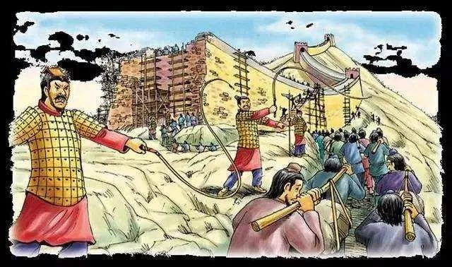
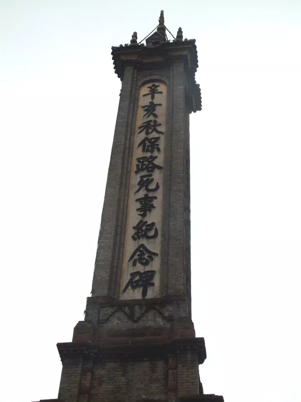

# 第51节 想要富、先修路

张岱说完“修河挖井更可行”的言论后，叶龙首先反驳：“现成的水运成本很低、运量很大我们当然要用，但并不是哪里都有现成的水系可以用。比如运输矿石以水运为主，但矿坑里可是没河流用的，于是从矿坑到码头的距离还得靠铁路。开凿运河？那东西工程量比铁路大多了吧，除非是沟通关键水域或者有农田水利方面的价值，否则个人不大看好。具体细节你需要咨询规划部门，毕竟术业有专攻，我们这边已经过了学个十年八年就能号称‘上知天文下知地理’的阶段了。”

张岱道：“矿场铺设少许铁路倒是合情合理，然而如隋炀帝修大运河般铺设十万里铁路，只怕天下的百姓都累死了还是负担不起啊？”

此时，一个稚嫩的声音响起：“这不是劳民伤财的问题。君不见隋炀帝，修了运河，导致二世而亡。但之后唐朝有没有废除运河？没有。因为这是有利的。秦始皇修长城，汉代不但没有废，还借长城进行北伐，都是一个理。”

张岱望向发言者，发现身后不知何时来了一个年仅十五六岁的少年，心想：“这是哪位澳洲大户家的公子？竟然如此轻狂，宁可大宋‘二世而亡’也要修铁路！”

接着另一个元老说道：“尽道隋亡为此河,至今千里赖通波.若无水殿龙舟事,共禹论功不较多。我澳宋的十万里铁路就是隋朝的三千里大运河。”

眼见这个发言的元老心宽体胖、成熟稳重的样子，张岱心想：“少年轻狂倒也罢了，此人看年龄辈分不低啊，居然也如此好大喜功！”再回想起之前其他元老对修铁路的一边叫好之声，张岱又一次产生了“澳宋要完”的想法，又一次对自己的家族投靠澳宋的前途产生了疑虑。

正当张岱思考要不要放弃投靠澳宋之时，布特说道：“张先生，我们这里与篡明不同，不会让百姓服繁重的徭役白干活。不管是修铁路还是铺水管，干活的百姓都是拿月钱的。农闲之时来打工，不会耽误农时。就算不种地，所得的月钱也足够养活一家老小。如果干活时发生意外伤亡，我们也会重金抚恤。劳民伤财一事，从何说起？至于铁路和自来水该不该大规模营造，张先生应该相信我们澳洲人不会做亏本买卖。”

旁听一段时间后，布特算是听明白了，张岱所说的“劳民伤财”，主要针对的不是钢铁的成本和工程时间，而是市场前途问题和人力资源问题。

市场方面，古代挖运河虽然工程量不小，但挖运河的地方大多数也是水多、容易发生洪涝灾害的地方，挖运河首先有利于排水、灌溉，顺带解决交通问题，不仅是农业社会性价比很高的交通工程，也是水资源丰富的农业地区必须建设的农业基建工程与防洪抗灾工程。最典型的案例是，现代黄浦江的中游河段是明代开挖的，当初挖这段河的时候，完全没考虑过交通需求，完全是为了解决“水灾”问题。因此在张岱看来，原本用于防洪抗灾和灌溉的运河完全可以取代铁路和输水管的大部分需求，剩下的饮用水需求可以痛过挖水井和运水车解决，铁路和输水管不仅性价比低，而且市场前途有限。尤其是自来水，在张岱看来城里有钱人也许有需求，乡下人疯了才会不用自家的井水转而去“高价买水”。既然没市场，那自然就是“劳民伤财”了。张岱的这种思维，本质上跟现代某些人嘲讽高铁是“运椅子专列”是一个思路。

人力资源方面，按照张岱的经验，修铁路和铺水管这种庞大的公共工程，应该是靠“徭役”解决的。所谓的“徭役”，也就是让老百姓不拿工资白干活，有时连口粮和工具都是老百姓自备的，可谓是“倒贴”式劳动。因为传统农业具有自给自足和季节性劳动两大特点，古代农民最缺的是货币，最富裕的是“时间”，让农民“奉献时间”作为主要“纳税”模式，替国家免费干活、当兵，符合当时的社会实际。当然，过多的工程，也会给平民带来沉重的劳役与其他各种经济负担。

万里长城依靠徭役修建

“文景之治”时，汉朝将男子服徭役的年龄从17岁推迟到20岁，就被视为极大的“仁政”了。

张岱的这些想法，其实也是旧时空早期洋务派普遍反对修铁路的原因。市场方面，经济上的好处，他们无法理解；在“边疆危机”发生以前，军事上的必要性他们也看不到。根据历史上的教训，当时大多数洋务派更多的是想到“莫道石人一只眼，挑动黄河天下反”。如果说元朝为了恢复黄河流域的农业生产与财政收入，强征民工修复黄河堤坝还有其必要性，那满清为了修铁路搞到“大清亡了”又是图啥？不得不说，当时那些人眼光还是很准的，最后满清灭亡的导火索真是因为修铁路。四川保路运动中，从强行摊派“租股”、贪污亏空到成都血案，某些人的心黑手狠，把曾国藩等人所说的“小民困苦无告，迫于倒悬”、“以豪强而夺贫民之利”等预言全都兑现了。

然而早就习惯了享用自来水和“若要富先修路”理念的元老们，又有几人能想到居然会有人认为铁路和自来水“卖不出去”；习惯了“给政府打工比私企强多了”的元老们，更是难以想像给封建朝廷“倒贴”式干活的苦逼与“劳民伤财”。

布特倒是知道这方面的情况，之前也早就从盛天仕那里得知张岱对铁路市场前景的疑问，所以一开始就从货运和速度的角度跟张岱解释铁路的“先进生产力”，并列出了“日行千里，一次载货四十多万斤”的数据。但一来张岱并未像以前那样开口说“百姓为何要坐火车”，“多造大船、多养马匹”云云，反而提起了容易往“低价强买”、“强征”的角度歪楼的“劳民伤财”；二来之前有太多元老在回答时谈到铁料价格问题。因此布特也被带歪了，跟张岱说不需要商民低价或免费提供铁料。现在布特想明白了张岱的疑虑，就决定好好给张岱科普一下澳宋铁路、自来水的市场盈利前景与雇工待遇。

当张岱得知澳宋搞工程不会让百姓白干活，而是发工资的，并且工资多到足够养活一家老小，有了伤亡也会重金抚恤，张岱的顿时有一种天方夜谭的感觉，心中暗想：“这得花掉多少钱粮啊？这帮澳洲人也不怕修铁路把自己折腾穷了？”

当布特提醒张岱，“澳洲人不会做亏本买卖”时，张岱又陷入了沉思。他一直听闻“澳洲人很会做生意”，应该不会平白浪费钱粮啊，莫非这其中真的内有乾坤？

张岱正欲开口询问，布特抢先说道：“我知道张先生有很多疑问，待我给张先生娓娓道来。张先生既然来自浙东，应当知道工商皆本的道理。”

张岱回道：“然也。”

布特继续说道：“我朝有句俗话，‘想要富，先修路’。现今江南富庶，除了土地肥沃、百姓勤恳，恐怕也与当地四通八达的水路不无关系。相比陆上的马车，水运可以大大节约运费，便利财货流通，因此江南工商发达，百姓获利丰厚。”

“正是如此，是以余觉得修运河足矣，无需铁路。”

“然而天下大部分地区都不像江南有这么多水，全天下能像江南这样村村通运河的地方，十不存一。据我所知北方河流很少，而且很多北方的河流一到冬天就结冰，一到夏天就干涸，到时就走不了船了。而铁路的运货量不低于河运，而且不用担心冬季结冰、夏季干涸的问题。十万里铁路修成之后，可让全天下的地方，都像江南这般工商发达，不知张先生对此赞同否？”

“这……？”张岱回想了一下，自己去山东看望父亲时，确实感觉北方行船不像南方这样方便，最后一段路是靠马车解决的，但好像并没有因此影响商业呀，于是说道：“各地产出有限，能有多少买卖可做？把官道修修好，多弄些马车，应该也够用了。”

布特说道：“张先生来临高也有段日子了，应该知道我们这里不管是粮食产量、钢铁产量还是其他产出，均大大多于篡明同样的村镇，铁路每日运人、运货不断。如果我们将全天下的县城建设得像临高这般繁华，光靠官道和马车，恐怕还真不够用。村村通铁路自然不必，但县县通铁路还是有必要的，如果每个县都修筑铁路百里，则天下上千个州县就得需要十万里铁路。”