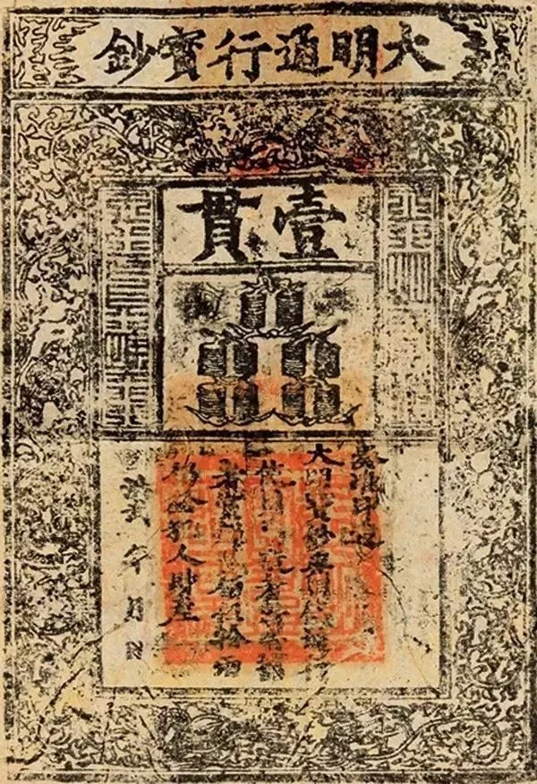

# 第五十六节  元老们的争论

石出由元老说完后，台下的元老一片哗然，再度响起了嗡嗡嗡的私底下讨论声。

很多元老原以为元老院是“富得流油”，但实际上是“穷兵黩武”。两广打的如火如荼，堪比旧时空米帝入侵阿富汗；治理广州，也是到处伸手要钱。贸易顺差不够花，财务状况难以撑起现在的军事开销和地方建设，眼看经济面临崩盘的危险，各方元老顿时焦虑起来。

“合着占领了大半个广东省还是赔钱的？我们是怎么用比大萌朝还少的军队和官员实现的在广东地区的破产呢？”

“我们的军队和官员哪里少了？大萌在广东的营兵不到三万人，我们的伏波军加国民军在1635年已经达到3.75万人，根据现有的扩军计划，1636年底将扩充到7.5万人。同样的统治区大小，军人的数量比大萌多得多，军人的待遇又比大萌的营兵好得多，财政供养的公务员之多也是大萌望尘莫及的，财政开支怎么可能不高？”

“其实花钱那么多，也有刚打下来、广东全都要进行改造的原因，这方面花钱是一次性的，花完了过一两年广东就会成为最好的财富产地了。”

“老实说我对经济不懂，但最近参加了工作组对一个县的工作进行评定，充分感觉到按现在的社会治理模式，政府成本是非常庞大的。特别是医保、医院这一块，成本的增长率远远超过经济的增长率，现在临高体制内完全是免费的医疗，从医药生产到医院看病的成本全部由元老院负担，在旧时空里是完全不敢想象的。”

“你觉得医疗福利负担不起，是因为你把元老院的医疗福利想象的太高了。现在的医疗福利也就有点免费的酒精、红药水、紫药水、磺胺这类玩意儿，医院数量和医务人员数量也非常少，除了元老们的医疗成本比较高，其他人享受的那点医疗才几个钱。”

……

也有一些元老对“银荒”导致“财政危机”、“经济危机”表示质疑，认为元老院的货币实行的是“粮本位”，发行的是纸币，搞得是“计划经济”，不必担心通胀通缩问题，也不应该有财务问题。

“报告写错了吧？元老院不是银本位啊，是粮食本位，只要农业生产、以货易粮和扩张抢粮三驾马车给力，不必担心通货紧缩。”

“粮本位?这是多久以前的事了？我们刚开始发行流通券的时候，确实是粮本位，因为当时我们对农业口暴粮食很有信心，仅靠从大陆与东南亚采购的粮食也足够几万临高人不种地吃上好几年。但粮本位只是权益之计，是不可持续的临时手段。自从发动机行动从北方拉来大量的人口导致海南粮食一时无法自给开始，粮食就不再是流通券的主要担保了。广东攻略开始后，我们的流通券已经发展到靠银元、米、盐、布四种财货进行担保了。”（注1）

“缺粮的状态下，想继续维持粮本位根本不可能。现在农业生产的增长跟不上粮食缺口，以货易粮也买不到足够的商品粮，你说的那些也就扩张抢粮的法子靠谱点。”

“实在不行超发货币啊，当代人穿越回去何必吃一回中古金银危机的亏？”

“想超发货币，也得有担保物，否则就是大明宝钞和金圆券的德性。当年TG能在上海成功让金银贵金属退出流通领域，主要是因为有‘两白一黑’取代金银的硬通货地位。当年仅粮食一项，TG就在上海囤积了足够上海人吃一年半的粮食，现在我们有什么？粮食短缺，煤炭对广州土著是必需品吗？元老院又能拿出多少棉花和棉布？”

……

“很多开支是不是高估了一点？比如元老及女仆们的消费。而且临高内部控制区的白银交易已经基本废止了，内部消费都是依靠流通券，所以应该不能算做用于外贸的支出，不需要用白银和贵金属货币。”

“元老和女仆的消费本来就不占支出的大头，就算高估也高估不到哪里去。禁止白银交易也是广东攻略前的老黄历了，现在是银元和纸币并行。就算是广东攻略前，军饷也一直是用白银发的。内贸方面白银一直是逆差，因为内贸赚翻的利润基本上都换成了铜钱和流通券，而土著和归化民赚了流通券却会想办法兑换成白银。”

“当初我们不是禁止私兑金银吗？土著可以兑换金银，但是临高地区的归化民和土著兑换量是很少的。而在台湾、济州等地的归化民更不许用银元，不听话都去符有地那里劳改了。相比之下，实际上只有广州、佛山这些大型的城市工商业交流才比较需要金银。落后的乡村里，实物交换也是很常见的啊。”

“土著可以兑换金银很少，意味着他们可以用来兑换流通券的金银也很少，所以不要指望内贸能赚取大量白银。实际上临高土著本来就拿不出大量白银兑换流通券，多数是用铜钱和粮食换流通券。反倒是他们在元老院统治下发了点小财后，会反过来要求兑换更多的白银用于投资保值。如果我们拒绝兑换，意味着金融信用破产，就更没人敢用流通券了，可谓得不偿失。就算不兑换白银，他们还有购买金银首饰的消费需求。”

“这里的关键不是元老院统治区用啥货币，而是通过内贸我们能不能赚到白银的问题。台湾、济州等地的归化民不许用银元又如何，这些难民、奴隶出身的归化民本来就没白银，把他们全送到符有地那里他们也交不出一两银子，所以指望内贸赚白银是伪命题。我们通过内贸能赚到的，主要是归化民、土著的‘免费劳动力’、余粮和有限的铜钱。”

“禁止私兑金银的理想是一回事，真正执行得如何是另一回事！私兑金银的问题就算是旧时空的TG也没能彻底解决，我们能比TG还牛？反倒是去年敞开兑换银元后，我们还能多收30%的铸币税。流通券容易兑换银元，民心安定，也让更多的白银退出了内贸流通领域。这也是为何广东攻略后我们开始发行银元了，除了金融信心的问题，还能节省30%以上的白银消耗。”

“你也说了，实际上只有广州、佛山这些大型的城市工商业交流才比较需要金银，考虑到土著情绪的问题，我们在这些地区的货币也是以银元为主。跟这些地区的贸易，广东攻略前属于外贸逆差，广东攻略后也就是外贸变内贸，但逆差没那么容易变顺差的。落后的乡村里以前是实物交换，现在也就是多个流通券作为媒介，最多也就是用流通券换走他们手里的铜钱，想大量换到白银是不可能的。”

……

“我觉得元老院的体制内根本不存在通胀或者通缩问题，因为我们现在是计划经济。”

“流通货币还是要的。不过你说的对，计划经济下，通货紧缩问题会缓解不少。比如，元老院为了流通货币不足，可以发布票、粮票等。”

“计划经济就没通胀通缩？开玩笑，自己查查旧时空TG建国以来的历年物价，自己看看改开前有没有通胀。”

“问题不太大，在开展外贸之前通胀还真不严重。”

“怕的是通缩，明朝一定程度上是给通缩搞死的。”

“大萌朝完蛋其实跟通缩没多大关系，大萌朝是粮食减产造成大规模起义完蛋的，如果没有大规模起义，跟我大清干耗还是能耗一段时间的。对我们其实也一样，我们就是能赚3亿两白银又怎么样？难道银子能变成粮食不成？没粮食，那就只能靠杀人减丁来凑合了。”

“问题是我们现在主要缺的就是粮食。白银问题最快也得1637年才会有出问题的苗头，如果伏波军不用银元发军饷，所有的土著与归化民都愿意改用纸币，就算是1641年的银荒我们也可以挺过去，但粮食问题可是1636年就有可能撑不下去。”

“你们是不是对元老院的计划经济太迷信了？当年中苏都是以公有制经济作为主体，并且采用了配给制度调节产品分配。现在既没有推广公有制经济，又没有配给制度，元老院所谓的计划经济怎么能跟TG、苏联比？最多也就是旧时空二战后日本人搞‘产经联’的水平，也就是通过“亏本”的战略投资，确保科研和产业升级，日本人当年的通胀、通缩难道不严重？”

……

一个多小时后，元老们还在嗡嗡嗡的争吵，钱水廷只得用麦克风大声说道：“大家都别吵了，现在关键是如何解决问题。我宣布现在休会，大家回去后慢慢想怎么应对目前的危机，三天后开会讨论应对方案。”

注1：关于元老院货币政策的情况，详情参阅《临高启明》正文第四卷第32节至35节，第七卷广州治理篇第101节、109节、110节。