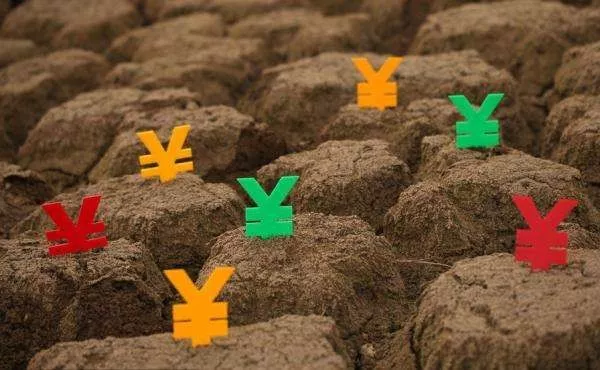
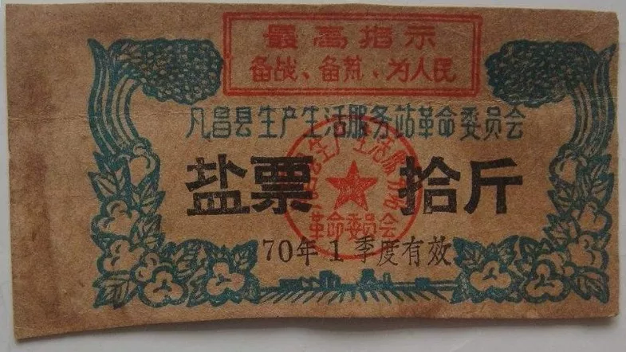
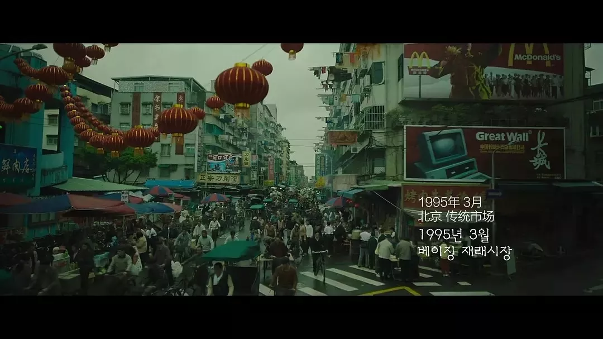
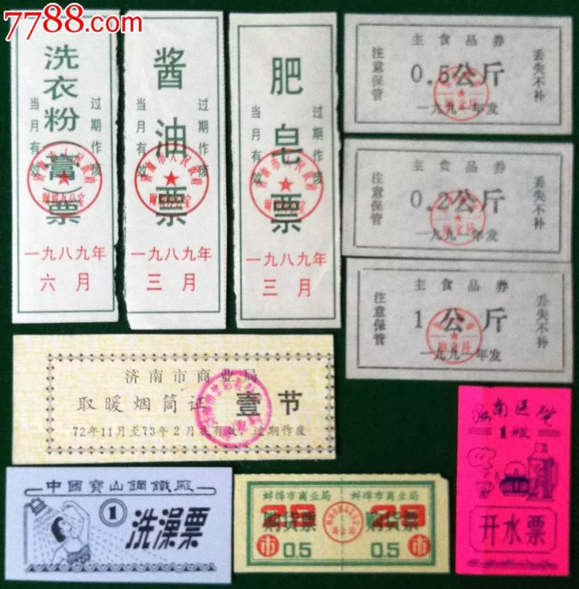
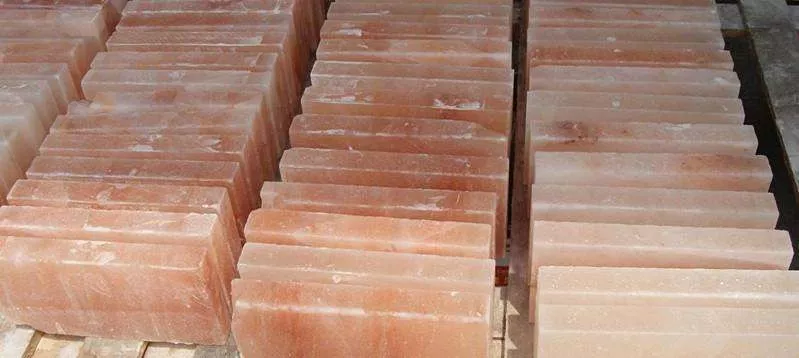
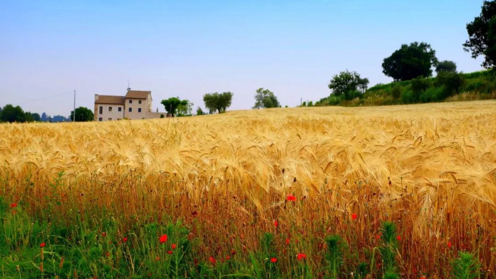
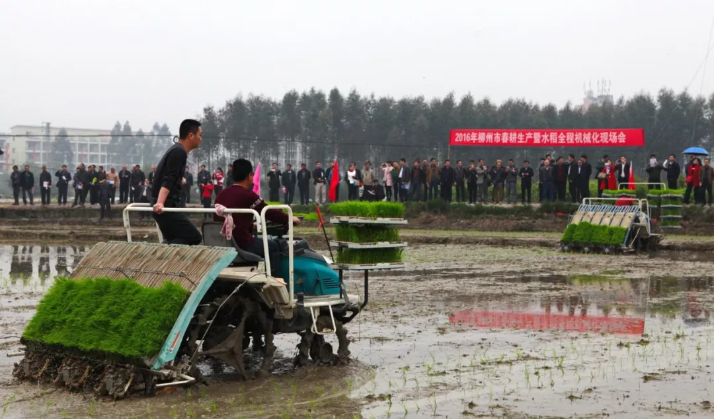

# 第六十节  布特关于财政危机的发言

除了“粮食危机”和“广西攻略”，元老们这段时间同时探讨了关于“财政危机”的问题。

这方面的争论不多，讨论的火药味也淡了很多，毕竟这件事不像“粮食危机”那么迫在眉睫，最快也得到1637年才有出问题的苗头，到了1641年才真正有财政入不敷出的问题，元老院还有几年的时间慢慢想办法。

在关于“财政危机”的讨论中，布特首先批判了之前开会时某些元老的“计划经济万能论”、“废除白银货币论”的观点。

布特指出，关于“元老院是计划经济，体制内不存在通胀或者通缩问题”的看法是不靠谱的。从经济学的角度来说，“温和通胀”和“通缩”是工业化发展的必然，跟是不是计划经济关系不大，而且元老院只是“低水平”的“计划经济”。因此，就算推广纸币依然会有“通胀”和“通缩”的问题。金银等贵金属发生“通缩”，根本原因不在于充当流通货币，而在于工业化的生产速度是大大快于同时期的贵金属产量。在贵金属产量跟不上社会财富增长的客观条件下，发生“贵金属通缩”是必然的。就算纸币取代了贵金属的“流通货币”地位，依然会有“贵金属通缩”的问题。因为“投资保值”的需求和维护纸币稳定的需求，纸币也将长期和贵金属“挂钩”。（注1）

如果土著的心理物价已经习惯了纸币计价本位，并且确保类似“两百一黑”的硬通货的供应，“银荒”倒不是什么大问题，他们大不了抱怨几句“银价太高”、“投资生产还不如炒白银”，但问题是目前土著还是习惯银本位。“银荒”一旦发生，流通的纸币会相对白银发生“大幅贬值”，这不仅将严重打击元老院纸币的信用，也会给元老院的政治权威蒙上阴影。

土著会想，原来元老院的流通券跟宋、元、明三朝的纸钞没区别，全都靠不住。

同时，以白银计价的“通货紧缩”，也会严重打击土著的“生产积极性”、“生活积极性”，造成经济发展的“停滞”。

因此，“银荒”的问题不容轻视。

因为白银具有“投资保值”的特点，元老院如果想解决“银荒”在政治经济方面的隐患，光靠发行纸币作为流通货币是不行的，以粮食、布匹作为“硬通货”担保也是不够的。还必须提供新的“投资保值”产品，以取代土著的“窖藏白银”，否则中国依然是“白银黑洞”。只要土著继续把白银作为收入节余的储蓄，白银永远不够用。

从长远来说，元老院可以将房子、股票、债券作为资金蓄水池。就好像旧时空21世纪的中国是以房子作为资金“蓄水池”，美国是以股票作为资金蓄水池。（这也是最近10年中国的房价和美国的股价都历史新高、“长线”趋势“只涨不跌”的主要原因。）但这是一个长期的过程，只能慢慢推广。估计需要持续推广至少一代人，直至老一代迷信贵金属的人老死，习惯了用纸币进行投资的新一代归化民成长起来。

在短期内，以17世纪的中国国情，能够得到土著广泛认可的“投资保值”目标，除了白银等贵金属，只有土地。

以元老院目前的处境，参考西方近代资产阶级革命建立在“卖地”、“借债”、滥发纸币基础上的财政史（注2），布特提出了以下应对措施。

一、以台南、琼南、湄公河三角洲开荒所得的耕地为担保，发行“土地票”，作为工资的一部分和“窖藏白银”的替代品。

1、“土地票”将作为工资的一部分发给军人和民工，并鼓励他们移民。

2、实行“卖地财政”，向商人和士绅推销“土地票”。如果商人和士绅选择用“土地票”换土地，他们必须派一部分家属移民过去，去了那种地广人稀的地方当不了租赁型地主，只能当自耕农。如果商人和士绅不想要土地，可以通过证券市场把“土地”转卖给别人。甚至元老院可以利用“土地票”的价格波动收割一波韭菜。

3、以“土地票”为担保发行公债，到期后买公债的人可以选择用现金“还本付息”或换取土地。

4、实行“限购”制度，单个小家庭只能买不超过120亩地。例如某个商人或士绅自掏腰包买了360亩地，但地契只能分开写三个人的名字，他和他的两个儿子分家，一个大家族分拆成3个小家庭，各得120亩地。

关于“土地票”的可行性，布特的分析是：以17世纪土著的观念，最主要的“投资理财”渠道是“买地”和“窖藏白银”。如果元老院不想给土著贵金属，那就只有给他们土地。这件事可以说是“有偿土改”，士兵通过用军饷“买地”确保了退役后的生活；贫民通过劳动换取土地，实现了脱贫致富；商人、士绅买地“守本”是做惯了的，但他们那些移民的亲属因为找不到佃户，只能自己当农民种地。对元老院来说，发工资用“土地票”能节省大量白银，通过“土地票”的出售和抵押贷款可以套取大量白银，最重要的是通过“卖地”得到了大笔财政收入。

布特知道很多元老“土改分地”和“小农经济”有偏见，所以又跟他们详细解释以下几点：

1、历史上白人在亚非拉搞得奴隶制种植园并非是“先进生产力”，而是被当地“落后生产力”拖累的“落后生产关系”。雇佣制农场只有在开荒阶段才有优势，渡过开荒阶段后，欧美白人真正的“先进生产力”依然是“家庭农场”，也就是广义上的“小农经济”。

2、美国、澳洲那些占地几公顷到几千公顷的大农场大部分是“家庭农场”，也就是拥有土地较多的自耕农。

3、“土改”是资产阶级革命与工业化必须经历的阶段，最早工业化的英法美三国都有“土改分地”。（注3）

4、农业机械化这事跟土地的大小无关，只跟农民的“隐形失业”有关。如果农民找不到工作，有时间没钱，那就拒绝机械化；如果农民找工作很容易、没空种地，那就把种地的事外包给机械化农机公司或租农机耕作。农业机械化这事也不是只有大农场买农机才能进行，哪怕是美国、澳洲的大型农场，也是以“租农机”为主流。只能说，人均土地多推广机械化容易点，人均土地少推广机械化困难点。光把土地集中起来，却不减少种地的人数，对农业机械化没啥帮助。（注4）

二、发行盐票，作为货币的补充和公债的抵押，凭盐票领盐，也可直接用盐票换纸币。

关于“盐票”的可行性，布特的分析有以下几点：

1、盐是古代、近代除了贵金属以外最流行的货币，直到民国“盐砖”还被中国西南几省当货币用。实际上食盐也是中国古代“飞钱”和“钞引制”的起源之一，跟中国古代纸币的发行有间接关系。（注5）

2、明代商人运粮给军队换取盐引，然后用盐引换盐，我们可以照搬。

3、明代的盐政其实已经有了“公债”的性质，近代中国政府借钱时，最常用的抵押之一就是“盐税”。因此，以盐为抵押借钱是没问题的。

4、根据调查，广西的食盐产自北海（当时属广东布政司），梧州是广西、湖南、江西南部的食盐转运枢纽，仅广西的食盐销量就达到8.5万吨以上，同时还向湖南的四府二州（长沙、宝应、衡州、永州四府，郴、道二州）和江西南部四府（南安、赣州、吉安、临江）转卖食盐。盐税方面，梧州在正德二年收到40.7万两，正德五年是60多万两。有时全部上缴中央，有时上缴三分之二，如果问大明中央在两广最大的财政收入是什么，大概就是梧州每年几十万两的盐税，不知崇祯朝大明中央能拿到多少。简而言之，梧州是“盐都”，广西卖盐大有可为，光靠卖盐就能解决从广西买粮的“硬通货”问题。当然，想要“盐粮贸易”的利益最大化，最好是打下广西，起码得占领广西的平原城市。

三、大力倾销以新型铁质农具、工具为主的各种铁器，作为继粮食、布匹、盐、白银之后第五种纸币主要担保物。

关于“铁器”作为担保物的可行性，布特的分析是：在农业社会和工业社会初期，最主要的大宗商品和生产生活必需品就是粮食、布匹、盐、铁器。

注1：关于布特的这些论点，详情参阅《番外8：关于工业化与“温和通胀”、“贵金属通缩”的关系》

注2：详情参阅本人所写的《浅谈儒家的政治组织本质与明末的斗争》一文中的第七节《西方资产阶级的革命史与财政史》

注3：详情参阅本人所写的《浅谈儒家的政治组织本质与明末的斗争》一文中的第九节《现代人对工业与科技发展的一些误解》

注4：详情参阅《番外9：工业化对“小农经济”的促进作用》

注5：详情参阅《食盐的货币作用与折博制的发展－－兼论钞引制的起源》

**番外8：关于工业化与“温和通胀”、“贵金属通缩”的关系**

一、关于“元老院是计划经济，体制内不存在通胀或者通缩问题”的看法是不靠谱的。

因为工业化必然使工业产品的实际成本大跌，跟人工成本、其他产品（手工产品、服务业、房地产等）的物价比值发生变动。这一变动的结果，要么是工业产品价格下跌，工资和其他产品的价格不变；要么是工业产品价格不变，工资和其他产品的物价发生膨胀。

正常情况下，人类都选后一条道路，于是有了“（温和的）通货膨胀”。当然，也有少数国家选了前一条道路，从而导致“通缩”。例如1985年日元大幅升值，为了确保日本货在国际市场上的销路，以日元计价的日本工业品不得不大幅降价，结果就是日本人的工资和其他物价发生“停滞”。同样遭遇的还有台湾，工资、大部分物价和日本一样，从90年代一直停滞到现在。

历史上，中苏计划经济的特点是：一部分产品非常低廉，敞开供应；另一部分产品非常稀少，要么凭票供应，要么价格很高（黑市、白市都很高），甚至有钱也买不到。后来有人评价，后一类产品实际上发生了“通货膨胀”。例如1962年陈云就曾经靠大幅提高“奢侈品”（当时主要是高级食品）价格的方式解决当时发生的通胀问题，类似的是1998年后中国主要是靠房子这种“奢侈品”的疯狂上涨缓解通胀问题的。

因此，中苏的计划经济其实也有通胀问题，只不过是以“凭票供应”、“有钱买不到货”为代价暂时压制住了一部分通胀。通缩方面，苏联后来的物价扭曲到，面包居然比面粉还便宜，结果苏联农民进城买面包拉回农场喂猪。

因此，工业社会一旦启动，“温和通胀”是必然的，除非像苏联那样蓄意扭曲物价。而当时苏联“扭曲物价”的代价之一，就是像90年代之后的日本、台湾一样陷入“停滞”。换句话说，勃列日涅夫的“停滞十八年”与日本、台湾的“失去二十年”其实是一回事。因为账面上的“投资亏本”和“永不涨薪”，对人的“投资积极性”、“生产积极性”、“生活积极性”造成了很大的心理打击。

个人感觉，可能是因为类似的“失望情绪”，现在的台湾与80年代的苏东地区有了一些共同点。例如都极度渴望“民主”、“公投”、“独立”等等，而台湾人往大陆跑的人口比例也跟当年东德人往西德跑有得一拼。

韩国2018年电影《特工》里的“北京”街景是在台北拍摄的，也就是说2018年的台北跟90年代的北京是一样的，台湾的经济自从台币跟着日元大幅升值后就长期“停滞”了。

因此，不用贵金属当货币，搞计划经济，并不意味着不用面对通胀和通缩问题。

而且，正如我在同人里写的，元老院的“计划经济”其实是日本“产经联”的水平——通过“亏本”的战略投资，确保科研和产业升级。类似于现在TG“社会主义市场经济”的干预水平，远远达不到当年中苏“计划经济”的水平。

因为当年中苏都是以公有制经济作为主体，并且采用了凭票供应的手段调节产品分配。而元老院还没实行过“凭票供应”，同样水平的“公有制经济”主导地位，元老院只在济州岛、高雄两地得到实现，临高、三亚、香港三地也就是1949-1956年TG的水平，在整个广东省的占比更加低，最多达到抗战时TG根据地的水平。当年TG可是彻底控制了农村，可以调动海量的“两白一黑”，而元老院连海南岛的农村控制也是半吊子。

“公有制经济”不占主导，不大规模发行票证，甚至连最基本的粮食都不能彻底控制，某些人居然幻想元老院拥有媲美中苏的计划经济体制，真不知这种“良好感觉”是哪来的？

实际上，元老院体制内的“计划经济”人口，也就是已经剃发的那60-70万人，在整个广东近千万土著人口里属于绝对少数。虽然生产效率高，但论经济总量可能还略低于广东土著掌握的经济总量。

小结：从经济学的角度来说，“温和通胀”和“通缩”是工业化发展的必然，跟是不是计划经济关系不大，而且元老院只是“低水平”的“计划经济”。因此，就算推广纸币依然会有“通胀”和“通缩”的问题。

二、金银等贵金属发生“通缩”，根本原因不在于充当流通货币，而在于工业化的生产速度是大大快于同时期的贵金属产量。在贵金属产量跟不上社会财富增长的客观条件下，发生“贵金属通缩”是必然的。

就好像在城市土地供应有限的情况下，地价、房价相对于工业品的“疯狂涨价”也是必然的。总体而言，贵金属可以归类于前面提到的“其他产品”。

甚至在工业化启动之前，只要整个社会的生产力发展速度快于贵金属开采，就会发生贵金属通缩和贵金属货币不够用的情况。例如黄金在中国封建社会的历史上也发生过“通缩”。战国的时候，黄金是以斤、益为流通单位。到了汉代，因为黄金的产量没有跟上生产力的增长，黄金的流通单位就变成了“两”。

为了解决贵金属通缩的问题，人类很早就开始广泛使用纸币，然而在大多数情况下，贵金属跟纸币的比值却是“长线升值”的。例如在2000年，白银价格不到6美元/盎司；到了2008年，尽管当时白银是熊市，市场价依然超过9美元/盎司；到2015年白银的生产成本已经到了13美元/盎司。

当然，因为人类的工业化生产也包括贵金属的开采和提炼，因此贵金属虽然相对于纸币和其他工业产品一直在“通缩”，但相对于人工成本和古董等特殊稀缺品其实也存在“通胀”/“贬值”，总体而言价值比较“稳定”。

虽然工业化之后人类已经不再将贵金属作为流通货币，但却长期坚持纸币跟贵金属挂钩。因为在产生“剩余价值”、“多余货币”、“通胀”的情况下，货币除了“流通”的需求，还有“投资保值”的需求。不仅需要“硬通货”为纸币的流通提供担保，还需要“硬通货”具有永久保存、适当稀缺、价值稳定的特点，以便维护纸币的稳定。

这个世界上有很多种产品可以充当“硬通货”，例如粮食、布匹，但论永久保存、适当稀缺、价值稳定的优势，很少有超过金银等贵金属的。粮食、布匹少则几年，多则几十年，就会烂光，但金银不会，其贬值速度也比其他工业品的低很多，价值比较稳定。其中黄金又比白银有优势，因为白银会因为氧化而导致纯度下降，开采技术的进步又导致白银相对黄金大幅贬值。因此在19世纪，各国的纸币纷纷由“金银本位”向“金本位”转变。

实际上，中国古代不是没人想过找其他“硬通货”取代贵金属的货币地位，北宋的苏轼就曾提出用粮食当货币，可惜行不通。

在人类历史上，除了金银铜等贵金属，作为货币使用范围较广的只有食盐——除了贵金属，这大概是最不容易放怀的产品了。民国时，“盐砖”曾经是中国西南地区“货币”之一。

盐砖

但相对贵金属，盐也有很多局限性，例如怕水（不如贵金属好保存），产量容易“暴增”（不够稀缺、容易贬值）。所以在古代，食盐的“货币”流通范围不如贵金属；进入工业时代后，就再也没有哪个国家和地区会把食盐跟纸币进行挂钩了。

人类使用纸币后，将纸币跟贵金属挂钩了长达几百年，美元更是直到1971年才和黄金脱钩。美元能和黄金脱钩，原因之一美国成功找到了黄金的替代品——石油。

石油被称为“黑色金子”，和黄金一样可以长期保存，作为“工业的血液”和农业社会的粮食、布匹一样是硬通货，而且有适当的稀缺性和相对稳定的价值。

“石油美元”的出现不是偶然的

类似的案例是，1940年代因为发电的需求，煤炭在中国大城市是类似黄金的硬通货。有一部反映解放初历史的国产电影提到当时的煤炭可以直接换金条，这也是为何1949年TG在上海用来取代金银外汇“硬通货”地位的“两白一黑”里有煤炭——和黄金一样可以长期保存，是“工业的粮食”。

小结：就算纸币取代了贵金属的“流通货币”地位，依然会有“贵金属通缩”的问题。因为“投资保值”的需求和维护纸币稳定的需求，纸币也将长期和贵金属“挂钩”。

**番外9：工业化对“小农经济”的促进作用**

提起“小农经济”，很多人是非常鄙视的。很多讨论《临高启明》的读者认为，“小农经济”是非常脆弱的，是非常容易被工业化大生产消灭的“落后生产关系”，“先进生产关系”应该是“雇佣制大农场”。

北朝的临高启明板块还在的时候，Alexius发帖提到美国学者黄宗智的两篇论文——《长江三角洲小农家庭与社会发展》《华北小农经济与社会变迁》，内容是关于清末民国以至解放后的农村发展情况，Alexius感觉这些历史资料很符合元老院未来的政策导向。

然而这个帖子提供的历史资料却并没能佐证“小农经济在工业化浪潮下迅速破产”、“雇佣制大农场蓬勃发展”的观点，反而以历史事实证明，“小农经济”有着非常顽强的生命力，而且越是资本主义工商业与工业化发达的地方（例如长三角），“小农经济”反而越不容易破产；反倒是工业化更为落后的华北地区，小农也更容易破产，而“雇工制大农场”不管在长三角还是华北都不是主流。

细节方面，这个帖子提到了以下几个情况：

1、长江三角洲的经营式农业非但没有像“资本主义萌芽”学者所说的那样开始长期的、持续的发展，反而衰落了，因为雇工的成本太高。

2、家庭式农业与经营式农业的实力差异不是基于农场的规模，重要差别是家庭生产单位特长发挥的程度。家庭生产单位可以通过利用家庭中妇女和老幼辅助劳动力轻松地胜过雇佣劳动为基础的经营方式，因为家庭辅助劳动力比雇工便宜。

3、商品化带来的并不是小农家庭生产单位的削弱，而是更充分的完善和强化。只要毛收入超过生产成本，即使附加的活十分艰辛、收益又低，迫于生存压力的小农也会将其成员的劳动力投进去，雇佣成年男子劳动力的企业绝不可能与这样的家庭生产单位竞争。

Alexius对这些历史资料感到非常意外，所以在北朝发帖，想跟众元老一起讨论这个问题。

其实很早以前，我就已经发帖反对过某些元老对“雇工制大农场”的幻想和对“小农经济”的“鄙视”。根据《19世纪末、20世纪初农业资本主义的失败》这篇论文的分析，雇佣制大农场更加适合“开荒”与早期西方资本主义农业的发展需求，随着“开荒”的完成与农业机械的大发展，到19世纪末、20世纪初，“家庭农场”也重新在西方复兴。

在本人所写的《浅谈儒家的政治组织本质与明末的斗争》一文第九节的内容中，我从多个角度分析“土改与分地的积极作用”，并且指出，西方人在亚非拉搞的奴隶制种植园并不是什么“先进生产力”，而是被殖民地土著“落后生产力”拖累的“落后生产关系”。因为很多刚迈进奴隶社会甚至还处于原始社会的黑人、印第安人“生产力”与“生产积极性”太差，不仅不会种地，而且很懒散，于是白人奴隶主只得用鞭子“教育”、督促他们多干活，不得不采用奴隶制、封建制的落后生产关系来管理殖民地的农场。

Alexius的帖子所讨论的主题可谓是我的研究特长，于是我在这个主题下发了多个跟帖剖析工业化对“小农经济”的促进作用，以及“小农经济”随着工业化的发展越活越好的根源。

我的第一个回帖说道：“看了文章的内容，我算是进一步理解了为何在‘熟地’地区，家庭农场远比雇佣制农场更具有竞争力。家庭农场不仅不用养监工，连工资都不用发，甚至口粮都不用多支出，可谓是零成本。看样子，元老院需要大量‘高薪雇佣’女工、童工才能瓦解家庭农场”。

当然，我的这个回帖不是想要元老院通过“高薪雇佣”女工、童工的方式瓦解“家庭农场”。根据历史事实，想靠“高薪雇佣妇女儿童”的方式瓦解家庭农场并不靠谱。对于“熟地”来说，“家庭农场”始终是最有经济竞争力的经济模式。

我的本意是，某些元老想推广 “雇工制大农场”是不靠谱的。与其想着怎么瓦解自耕农、推广“雇工制大农场”，不如考虑让“家庭农场”机械化。

实际上，美国、澳洲的那些“机械化大农场”本质上也是“自耕农”，和中国的“小农”一样是“家庭农场”的模式。搞“小农经济”也并不会妨碍“农业机械化”，现在中国就有全国各地季节性流动的农机队。说到底，农业机械化的事跟是不是小农土地所有制没关系，关键是农村劳动力的“剩余”问题。以前外出找工作做困难，反正闲着也是闲着，就不租用农业机械代耕了，自己下地动手干活。现在外出打工赚钱容易，再亲自下地干活就变得不合算了，所以把农活外包给流动农机队。

有人指出，小家庭机械化很吃力，而且小家庭不搞农业水利。

我回答他：你的思维有两个误区。

1、小家庭＝小土地。

实际上小家庭拥有的土地未必小，像美国、澳洲的家庭农场可以拥有几公顷到几千公顷的土地，相当于以前人民公社的面积，不搞机械化怎么忙得过来？

2、搞机械化一定要买农机。

其实可以租农机，租赁价格根据粮食产量或耕地面积算。例如一个操作农机的个体户家庭替几千个农民家庭代耕、代收几万亩耕地，有几个雇佣制农场的内部私有农机能有这样的“产量”？实际上随着现代中国农村的“空心化”，农村的壮劳力已经差不多走光了，目前中国农业的主流就是农忙的时候连人带机器雇佣农机队“代耕”，农闲时留在村里的老人、妇女负责照看农田。

此外，还有两个现实案例可以参考，一是日本也是小土地所有制，也实现了农业机械化。跟中国连人带机器一起雇佣不同，日本农民多数是亲自操作农机。二是美国、澳洲的银行会贷款给farmer（直译为“农场主”，其实就是人均土地很多的自耕农）买农机及其他农业资材，那些farmer不存在买不起农机的问题，就是比较容易因为天灾人祸还不起贷款而破产。

至于小家庭不搞农业水利，这确实是个问题，所以历史上人民公社对中国农村的水利建设起到了很大的作用，在50-60年代搞人民公社是非常英明的决策。不过在70年代后，随着农村人口的膨胀和水利建设的暂时饱和，就有了怠工的问题。

所以我说家庭农场适合“熟地”，因为“熟地”很少需要搞水利建设。大搞水利建设主要是在“开荒”阶段和“产业升级”阶段。而西方的历史经验是，在“开荒”阶段适合雇佣制农场，进入“熟地”阶段后适合“家庭农场”。

不过水利建设也不是只有雇佣制农场一条路，还可以指望基层政权。古代主要是乡绅、宗族、村社组织负责，现代靠乡村两级政权。近代中国搞不起来的原因主要是因为半殖民半封建国情，当时发生了农村经济破产和“乡绅劣化”的浪潮，原来的“乡贤”和“有良心地主”大量移民城市，留在乡村的“土豪劣绅”既没有心思也没有能力搞水利建设。

然后，对方说：“你说农机小家庭可以用租，这个合情合理，我知道了。……就算小家庭拥有的耕地多，并且有了农机，还是需要雇工啊？农业生产不仅是播种收割，我很难想象一个5、6口人家，有老有小，租几台联合播种机收割机，就能干完1000亩地的农活？……那既然小家庭，大耕地也需要雇工，那这和雇工农场又有啥差别？”

我的回答是：

谈古今中外的历史和现实，所谓的“雇工”说，其实还是建立在中国劳动力大量剩余、工资低的“国情”上。但有些国家如美国和澳洲，地广人稀，你想雇人都雇不到阿；就算能雇到，要求的工资也很高，农场主不一定雇得起。而且农业是季节性劳动，就算要雇工也主要是雇季节性的临时工、小时工。即使如此，季节性小时工的“高工资”已经成了美国、澳洲农场主不时亏本甚至破产的原因之一。虽然目前美国、澳洲的农场主并没有大量破产，但农场主赚得不如“临时工”多却是比较常见的。

这方面的情况，去看一下关于中国人在美国、澳洲当农场主文章就清楚了。我记得在报纸上看过一篇报道，有个去美国种地的华人农场主，开始还雇了个白皮当长工，结果那个白皮又懒工资又高，那个华人农场主干脆辞了白皮，所有的农活自己一个人干，只在农忙时雇几个临时工。从这个案例来看，就算一个人种一大片地，在机械化的情况下也是勉强可以的，更何况有了家庭后可以多几个免费劳动力用。

发展到现代，西方国家的绝大多数农活都已经机械化了，包括犁地、种植、收割、浇水、施肥、除草除虫（用农药，甚至可以用飞机撒）。农民非机械化的农活大概只剩下这样几样：监视农作物的生长情况，注意病虫害，拿起猎枪驱逐破坏庄稼和牧场的野生动物。

正是因为基本都机械化了，所以男女老少的劳动力区别不大了，像开拖拉机这种事，十几岁的小孩、60多岁的老人跟成年男人都开得差不多。那些非机械的农活，例如开枪打兔子和袋鼠，10岁的钱朵朵这样的萝莉也是可以干的。

这样一来，一个5、6口有老有小的家庭，跟5、6个壮劳力的劳动效率就差不多了，而且省工资。

从现实看，就算是人口稠密的日本和中国的长江中下游地区，现在也普遍机械化了。

就算是澳洲的农业机械化也是以租农机居多，因为新农机太贵，二手农机虽然便宜但维修、保养又贵又麻烦，总体成本跟买新农机差不多，都不如租农机划算，顺带提高了农机的使用率。

目前中国的流动农机队是全国到处跑，根据农忙季节从广东跑到东北，然后再从东北跑回广东。中国从亚热带到亚寒带的不同农忙季，给了这种流动农机队发挥的空间。

总体而言，很多人对“小农经济”的鄙视，其实是“贫穷限制了想象力”——受中国自耕农人均耕地少的现实影响，他们根本没想到国外的大农场大部分也是自耕农。而且那些“大地主”模式的白人农民，收入并不比本国的工人阶级高，甚至不时亏本。对“雇佣制大农场”的向往，则是受工商业领域广泛流行雇佣制的社会现实影响，根本没想到大部分种植业是“季节性劳动”，雇“长工”是一件亏本的事。

庞大的澳洲农场，大部分跟中国的农户一样是“家庭联产承包责任制”

土地产权的分散并未真正阻碍中国的农业机械化，中国农业机械化的真正阻力是农民的“隐形失业”/“劳动力”不值钱

在农业领域，只有摆脱了“季节性劳动”规律的行业，才能真正发挥“雇佣制工厂”的生产优势。例如“马前卒工作室”在2019年1月25日发表文章《为了保住中国最古老的产业，可能得消灭家庭养蚕》。根据这篇文章的说法，因为养蚕的季节性劳动，中国在这一行至今还是以“家庭养蚕”为主流。不过随着2019年1月20日浙江“全龄人工饲料工厂化养蚕” 一期项目的正式投产，“数千年来传统养蚕模式被颠覆”。也就是说，随着养蚕行业摆脱季节性规律的影响，这一行终于有希望摆脱“小农经济”的限制了。