# 第六十三节  元老院内部的“奇技淫巧”论

首先，面对粮食危机，有元老主张通过禁止珠三角农民种植经济作物，改种粮食来缓解粮荒问题。现在想想，这不就是中国古代对“舍本逐末”的批判和“重农抑商”的思路吗？“重农抑商”可是中国封建社会阻碍资本主义与工业化发展的“罪证”之一。

最离谱的是，个别元老甚至有了让广东人当“安安饿殍”的打算，根本没想过广东可能会出现“李自成”、“张献忠”。

而且不止一个元老忽略了饥荒可能导致的治安战军费暴涨，眼睛只盯着攻略广西的那点军费，更加无视广西攻略在战争缴获、财政方面的正收益。这思路，都有点接近大明为了省钱而开除邮递员了——为了节省有限的财政开支导致更庞大的财政开支。

财政方面，有的元老只想着强制推行纸币、超发纸币、禁止金银交易，却没想过如何给纸币提供尽可能多的担保物。其实他们想得这套大明早就做过了，还考虑到了纸币的防伪、发工资用纸币、收税用纸币。

当年朱元璋在没有备用金的情况下，靠着武力把大明宝钞发行起来了。宝钞以桑树皮纸为材料，有专门防伪的龙形花纹和防伪篆文。伪造钞票哪怕一张也是斩首罪，谁能举报伪造宝钞立刻就是重奖。民间的金银实物交易也一度被禁止。大额交易用宝钞，小额交易用铜钱，一度就是明朝市场的硬规矩。然而没有准备金的缺陷却使大明宝钞迅速贬值，买不到商品，只能用于缴税。

明代中期，由于作为工资、奖金下发给官员、勋贵的宝钞无法购买货物却能缴纳一部分税收，还出现了专门倒卖大明宝钞的“钞户”。但受益的却是倒卖纸钞的权贵和“钞户”，国家财政和底层平民两头受害。

甚至在旧时空的1643年，崇祯还尝试通过印发新钞挽救大明的财政。先不提大明宝钞的信用早就丧失殆尽，当时大明连印制新钞票所需的“钞纸”都征集不到。印行5000万锭新钞估计需要200万斤桑穰，可当时江南江北水旱灾害连连，根本提供不了这么多的原料。听说要交这么多原料，江南的纸户、伞铺的民众纷纷出逃，两浙地区“十室九惊”。结果崇祯的“印钞财政”尚未得到贯彻，明朝就灭亡了。

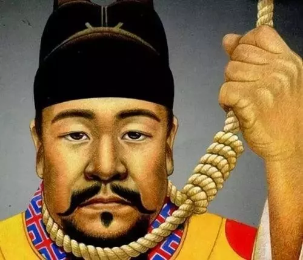

崇祯连滥发纸币的事都办不好，只能上吊

就算是元老们提得那些比较靠谱的主意，古人也一样想到了。

建设水利、推广高产农作物、发展畜牧业、外购粮食，中国很多封建皇朝都干过。

以工业品作为纸币的担保也不是啥“先进理念”，而是中国人的“古老智慧”，中国最早的“纸币”就是用盐、茶叶等手工业品作为担保的。

挖银矿、通过外贸增加收入、卖武器、粮食转口贸易等等更加平常，大明挖银矿挖了几百年，“海贸收入”曾经是万历、天启两朝的重要财政收入之一，大明部分边军、晋商和东南海商集团就是靠包括武器走私、粮食贸易在内的外贸收入发家的。

扩张抢粮的事，满清和各路农民军干了很多次。

“打土豪”的事，上面有雍正皇帝这类“暴君”在干，下面有历朝历代的造反者在干。

周围元老主张通过向东南亚移民缓解人地矛盾是个很好的主意，历史上西方工业国的崛起跟美洲移民浪潮有很大的关系。然而在旧时空的历史上，明清人口大爆炸时就出现了一股广东人下南洋的高潮。后来南洋的华人族群，大多都是明清广东移民的后代。移民东南亚的华人中有很多后来发展为南洋华人资产阶级，是同盟会搞革命的主要经费来源之一。也就是说，不用穿越者的指引，广东土著本来就在做“移民东南亚”的事。

《广西攻略》和《长江流域作战计划》本质上是通过对外扩张和劫掠解决内部资源不足的问题，在人类历史上很常见。

就算是自己提的金融改革方案，其实也是借鉴中国古代的“盐铁专卖”、“钞引制度”、“盐引制度”以及17世纪的英国资产阶级革命，而且有中国古代“均田制”的影子。

很显然，现代人能想到的所谓“好主意”，古人大多早就想到并且实践过了。如果没有实践成功，那就是缺乏相应的经济基础与社会条件，现代人啥都不带搞单穿，光靠个人智慧和嘴皮子很难做得更好。

幸运的是，元老院不是单穿，而是集合了各行各业的专业人才，带着大量的现代物资群穿。以现代科技、历史资料、现代物资为依托，通过正确的经济建设路线，应该可以为中国的提前工业化奠定必要的经济基础与社会条件。

不过在政治方面，似乎历史“总是不断地重复”，以至于元老们发表的各种意见，不管是好的还是坏的，总是能在历史上找到原型。

当周围元老提出“TNT这个科技树必须点出来”时某元老“炸老鼠洞”的反应，还有长久以来元老院内部流行的“军备够用”、“没有必要升级”的言论，更是让布特联想到了中国近代史上的“奇技淫巧”论。

“奇技淫巧”的本意是指“过于奇巧而无益的技艺与制品”。当时中国儒家官僚提出抵制“奇技淫巧”，其动机不是要抵制“科学”，而是要抵制“无用”。因为当时很多“洋货”是对国计民生与军事没有直接好处的民用奢侈品。后来中国民族工商业崛起后，为了推销质量较差的国货，也攻击质量“好过头”的“洋货”是“奇技淫巧”，提倡“够用就好”。（注1）

这些论调跟某些元老在反对军备升级时发表的“军备够用”、“没必要升级”的论点真的很像。换句话说，元老院内部以“没有必要”为理由反对军备升级，其实就是元老院版的“奇技淫巧”论。这让布特再度感觉“我们和土著一副德行”！

“奇技淫巧”的说法当然是错误的，因为“奇技淫巧”论调还在以传统手工业的生产模式看待军工生产和奢侈品生产，还在以直接的市场需求看待商品的社会价值，没有认识到工业化生产是建立在高度的社会分工和庞大的“产业链”基础上，也没能认识到各种商品之间的“产业链”关联。

就像周围元老说的，除虫的氯化苦以及麻醉剂都需要工业生产TNT炸药的中间品，如果能把TNT炸药搞出来，能同时搞定麻醉剂、杀虫剂、大米储存农药和礁石爆破技术。军工产业链和民用产业链其实是一码事。

因此，军备的工业化升级，不仅仅是伏波军是否火力过剩的问题，更加关系到元老院的生产力水平是否得到升级的问题。如果元老院能够将军备的工业化生产成功升级，元老院掌握的生产力与整个工业产业链也将得到升级。反过来说，如果元老院能够将整个工业产业链成功升级，军备升级也是顺利成章的事。否则，就是一种资源浪费。

以步枪为例，如果能开发出连发步枪和机枪，同样的火力投射需求下，可以大大减少正规军所需的兵力，兵力的减少又意味着军用口粮等多种后勤物资消耗的减少。

以铁甲舰为例，就算17世纪没有需要用铁甲舰对付的敌人，但如果钢材的生产成本比木材还便宜，铁质船舶的工业化生产成本低于同样吨位的木质船舶，那不造铁甲舰就是资源浪费。

记得当年看近代历史教科书的时候，里面经常出现“历史局限性”一词，大意就是从太平天国、洋务运动、戊戌变法、辛亥革命直至民国的各种政治势力，全都有“历史局限性”，只有TG才能救中国。然而随着历史的发展，现在TG也被人各种骂，改开后骂文革和前三十年，现在改开后的很多政策也被人骂。按照《历史教科书》的写作模式，以及佛教的哲学，布特感觉，没有任何人可以摆脱“历史局限性”的“宿命”！

后人总是咒骂前人的“愚蠢”，认为如果是自己在那个时代，发挥一下“蝴蝶效应”，历史绝不会那样发展，这就是“穿越者”优越感的由来。然而任何“历史局限性”其实是根植于当时的经济基础、生产力发展水平与社会环境、历史大局，让穿越者真的置身过去，遇到同样的困境，很多穿越者的反应未必好于古人。

最后，布特想起了以前跟其他元老讨论中国传统道德时黄汉民的发言：“所有的问题，都应该是适应当前的生产力发展需要的。所有反对的人，都忽略了这点。不谈当时情况的需要，而只是用某个特殊情况，要来替代所有情况，然后对其加以挞伐，这是没学马哲的后果，用形而上那种静止的观点看问题，而不是用发展的观点看问题。亏这些人，还整天洋洋得意。”（注2）

注1：详情参阅《番外10：关于“奇技淫巧”的历史真相》

注2：这段黄汉民的发言，来自我在北朝发表的讨论投票帖《500废是否应该认同这些中国传统道德？》。

**番外10：关于“奇技淫巧”的历史真相**

“奇技淫巧”一词出自《周书?泰誓下》，原文是“（商纣王）作奇技淫巧，以悦妇人”。

清末守旧大臣和守旧文人批驳西方工业品为“奇技淫巧”，首先跟当时西方商人对中国的商业销售策略有关。因为女人和小孩的钱最好赚，奢侈品利润更高，所以向当时西方人向中国中上层重点推销的“洋货”中有不少是针对妇女儿童的生活奢侈品，例如昂贵的“洋绸”、钻石首饰、八音盒、儿童玩具等。

于是，守旧派根据“作奇技淫巧以悦妇人”的典故将这些洋货称为“奇技淫巧”。

有很多洋货虽然不是只有妇女儿童会消费，但因为当时中上层的男性没有这方面的消费习惯，所以也被视为“奇技淫巧”，觉得那也是哄没见识的儿童妇人的玩意儿，例如机械表、自行车、手电筒、留声机。

旧的农业生产模式与传统农业社会的生活节奏比较缓慢，不需要机械表这种“精密仪器”。清末中国的“成功男人”大多年纪大了，难以学会骑自行车，而且骑自行车远不如坐轿子气派，还可以通过骑马和马车代步，所以自行车在当时中国中上层男性里不受欢迎。农业社会也没有大规模的“夜行”需求，所以手电筒缺乏实用市场，沦为上层家庭里妇女儿童在家里玩“闪灯游戏”的玩具。留声机可以用于“录音证据”，用清末文人的话说就是“有甚要做凭据的说话也说在里面”，但一样有纸质的遗嘱、契约等“书证”作为代替品。在当时留声机的主要用途还是娱乐，对于重事业、轻娱乐的人来说，留声机依然是“奇技淫巧”。

简而言之，“奇技淫巧”的本意是指“过于奇巧而无益的技艺与制品”。当时中国人批驳“奇技淫巧”，其动机不是要抵制“科学”，而是要抵制“无用”。

妇女儿童喜欢的商品，很多成年男人觉得“无用；在工业社会才有广泛用途的商品，包括自行车、手电筒、电报、火车，传统农业社会的人觉得“无用”；主要用于娱乐用途的商品，事业心重的人觉得“无用”。

反之，如果觉得洋货“有益”，那就不是“奇技淫巧”了。例如，电灯、煤气灯在清末就不被视为“奇技淫巧”；洋务派在发觉了电报、火车在军事方面的强大威力后，也从抵制变成了积极提倡；清末各政治派系也从没说过西方的武器和望远镜等军用产品是“奇技淫巧”，也从未抵制过引进西方的军工生产技术。

1793年英国马戛尔尼使团访华时，满清高层确实曾视英国武器为“奇技淫巧”。但这并不是满清高层单纯的无知自大，而是有现实经验支持的。

与大众所认识的不同是，早在清代中期清军就不止一次在战争中见识了洋枪的威力，而不是到了鸦片战争才接触洋枪。乾隆年间平定准部、反击廓尔喀入侵，道光年间平定张格尔叛乱，对方都装备了俄国或英国制造的燧发枪，但是清军还是取得了胜利。尤其是反击廓尔喀入侵之战，廓尔喀装备的英制燧发枪就是几十年后鸦片战争中英军使用的伯克式燧发枪，也给清军了造成重大伤亡，但清军还是在付出巨大代价后胜利了，廓尔喀的这些洋枪同样未引起清廷的高度重视。

也许在福康安眼里，这些武器再怎么精利，也抵挡不住天朝的大军，这些靠洋人“奇技淫巧”武装起来的军队终究是自己的手下败将。于是乎，当马嘎尔尼访华，向乾隆展示英国最新式的军舰、枪炮及火器操法时，早已见怪不怪的福康安会说出“看亦可，不看亦可，这火器操法，谅来没有什么稀罕”的话来。

因为是“手下败将”的武器，在“成王败寇”的思维下，当时满清高层轻视英制武器，并将其视为“无用”的“奇技淫巧”也就不奇怪了。

然而当年清军的胜利，主要是建立在兵力优势和火炮优势的基础上。到了第一次鸦片战争时，不管是兵力优势还是火炮优势对清军都不复存在。跟很多中国人的印象不同，当时英军虽然总兵力远远少于清军总兵力，但利用海上机动优势，英军总是能在局部战场集结起跟清军比例为1比1的军队数量，有时英军的兵力甚至比清军还多，可谓是一场海岸版“萨尔浒之战”。当时英军的火炮优势也是清军和其他亚洲封建国家的军队望尘莫及的。

同样的火枪，英军的发挥水平也不是那些亚洲封建国家的土著士兵能比的。就好像同样是“美械”，炮党美械部队的战斗力跟美军比完全是两码事。

最神奇的是，英军连拼刺刀的勇气和技术都远远高于清军。很多清军在跟英军进行火器对射时，尚能勉强支撑，结果英军一上“刺刀冲锋”马上就崩溃了。

以上关于鸦片战争的历史详情，大家可以参阅《天朝的崩溃》。

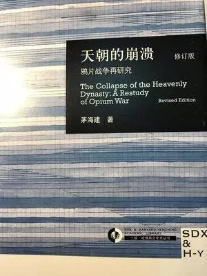

随着中国跟西方殖民经济联系的日益紧密和中国民族工业的出现，“奇技淫巧”的说法非但没有消失，反而扩大了。连“开眼看世界”、意图实现中国现代化的“维新派”，都开始攻击“外国奇技淫巧”，因为洋货的畅销严重妨碍了中国民族资本主义的崛起与工业化的发展。例如1895年康有为在“公车上书”时指出：“外国奇技淫巧，流行内地”是造成“民日穷匮，乞丐遍地，群丐满山”的主要原因。民国时期，洋货流行是造成中国贫穷落后的总根源已成为各界共识，于是有了一次次“消费国货、抵制洋货”的群众运动。

此时，“奇技淫巧”成为了“消费国货、抵制洋货”和批判“过度消费”的借口。大致的逻辑是，洋货虽然品质好但价格太高，买东西够用就好，不用买太好的，品质差但价格低廉的“国货”比较“实惠”。既然有了“够用”的国货，那“好过头”的洋货自然“没用了”，“没用了”就是“奇技淫巧”。

甚至穷人买不起工业品，“奇技淫巧”也成了拒绝消费的借口。现代左翼剧作家洪深在1931年创作的反应农民苦难的话剧《香稻米》第一幕中就写道：“从前乡下不都是用个铜罐在灶窝里炖水么，哪一个肯化三块半洋钱去买这样奇技淫巧的东西！”

“奇技淫巧”的说法当然是错误的，现代人也普遍批判过近代的“奇技淫巧”论，不过我觉得大部分人并没有批到点子上。因为他们普遍没有搞明白当年的“奇技淫巧”论是怎么回事，而是根据自己浅薄的历史知识，在近代影视剧的误导下，想当然的认为原因是儒家士大夫“反科学”、歧视工匠，满清反对使用火器。

然后他们在穿越小说中幻想自己如何重视科学，如何重视工匠，如何靠火器吊打天下。但实际上，重点发展火器的军事路线明清两代的朝廷早就想到了，是历史上明军和清军玩剩下的。

以热门的“西班牙大方阵”为例，让后金军伤亡惨重的浑河血战，明军方面的主力就是装备火枪的浙兵与担任长矛兵的白杆兵，这是明军版“西班牙大方阵”的最后绝唱。而击败他们的后金军，也并非很多现代人所认为的冷兵器军队，很早就大量装备缴获的热兵器，并且根据战斗经验不断魔改以火枪、长矛为主的冷热兵器混合战阵。到了第一次鸦片战争时期，部分清军的火器比例达到80%，大大超过穿越小说中黄石和陈主任的半火器部队。

很多明清儒家文人也早就想到了用火器提高军事实力。

在明代，有很多儒生喜欢写“兵书”和“火器”类书籍，可惜其中大部分不靠谱。不过很多现代单穿小白文的技术细节写作也是各种不靠谱，乱开各种“金大腿”，和明代儒生一样好高骛远。

在清代，儒家官僚和文人为了救亡图存搞起了洋务运动。其中有两个儒家文人徐寿、华蘅芳为了复制西方的蒸汽轮船努力学习、钻研了20多年，才造出了中国第一艘国产蒸汽轮船“黄鹄号”。只是不知现代写穿越小说的作者中，有几个人能坚持花20多年的时间钻研、完善小说中的科技细节?

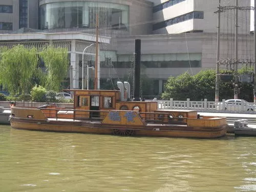

中国第一艘国产蒸汽机明轮船黄鹄号，1865年建成，长17米，航速6节，自重25吨

既然技术细节没精力自己琢磨，有人想到了“外包”。例如引进西方传教士兼科学家发展科技、培训火器部队，重赏工匠，提高军人地位与待遇，以此来建设热兵器军队，但这其实也是明清两代的统治者玩剩下的。

这方面成功的典范是皇太极与康熙，皇太极重奖给他带来火炮科技的三顺王与汉族工匠，康熙利用西方传教士替清朝铸炮。

失败的反面教材是孙元化——虽然孙元化的科技水平是明代一流的科学家，可惜情商低了点，没能管住三顺王。显然，建设近代化强军，不是仅仅靠埋头苦干造枪炮就能成功的，相关的后勤保障与人心凝聚力、士气激励才是关键，组织与人际关系是任何政治势力都无法回避的要素。

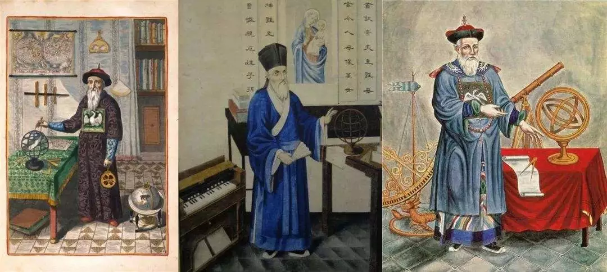

穿越到明末清初造枪炮，记得雇耶稣会传教士，希望你给得待遇不会比满清小气（一品文官级别的待遇）

说句难听的，很多现代人在科技和军事方面的想法与策略未必好过明末官僚和满清统治者。

因为他们不仅没有搞明白“奇技淫巧”是怎么回事，也没想明白“奇技淫巧”错在哪里，反而一再重复明清官僚在军工产业方面的那些策略。

好消息是，利用“先进几百年的见识”，他们在发展军工方面的见识终于能跟皇太极、孙元化、康熙、耶稣会传教士、清末洋务派那样的“古代精英”比肩了。坏消息是，洋务派救不了近代中国。

从建设工业化的角度来说，“奇技淫巧”论调的真正错误是，还在以传统手工业的生产模式看待军工生产和奢侈品生产，还在以直接的市场需求看待商品的社会价值，没有认识到工业化生产是建立在高度的社会分工和庞大的“产业链”基础上，也没能认识到各种商品之间的“产业链”关联。

虽然很多奢侈消费品确实对“富国强兵”没有直接帮助，但生产某些奢侈消费品的技术和工业产业链同样可以用来生产先进武器，例如德国能生产奔驰，同样能生产豹II。

反过来，用来生产先进武器的产业链，也有可能对生活必需品的供应很重要。就像周围元老说的，除虫的氯化苦以及麻醉剂都需要工业生产TNT炸药的中间品，如果能把TNT炸药搞出来，麻醉剂、杀虫剂、大米储存农药全搞定，能搞定三个产业链，而且这个还解锁了礁石爆破技术。还有互联网，最早是作为军事技术，后来却成功推动了互联网经济的崛起。

因此，军工产业链和民用产业链其实是一码事。甚至同样的产品，即可军用也可民用。

这方面的情况在电报、铁路方面表现的最明显，早期洋务派也觉得电报、铁路没必要建设，视其为“奇技淫巧”一类，等到边疆危机时吃了亏，才发觉这两样是“军国利器”。后来更意外发现这两项技术在经济发展和财政收入方面的好处，洋务运动的口号也由前期的“自强”变成后期的“求富”。为了解决军用工业的原料、资金、运输问题，进而大力兴办民用工、矿业和运输业。

而且当年中国人眼里的奢侈品，对当时的西方工业国来说不算“奢侈品”，而是比较平常的日用品。只不过当时中国没办法工业化生产，所以被西方工业国利用工农业剪刀差剪了羊毛。这就也是为何现代中国人去欧洲可以买到便宜“奢侈品”的原因，为何某种进口工业品中国一旦实现了“国产化”，马上会变成“白菜价”。

**洋大人的奇技淫巧论**

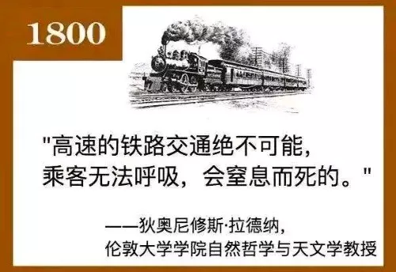

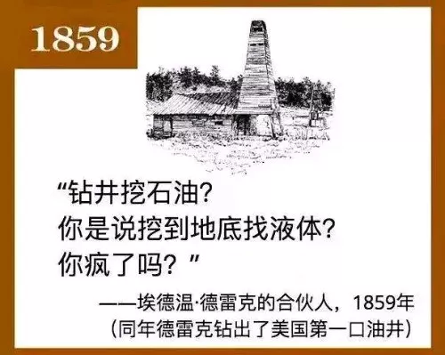

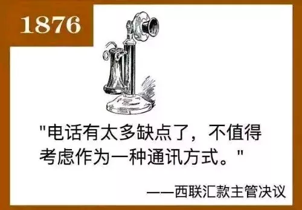

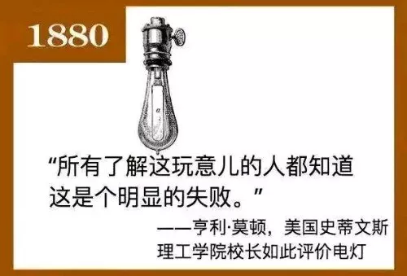

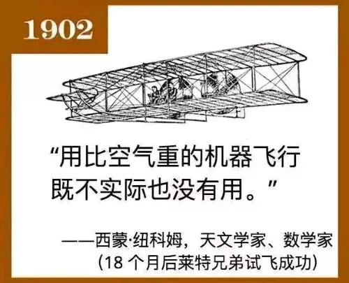

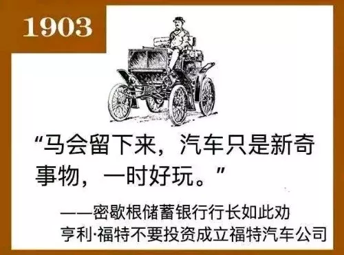

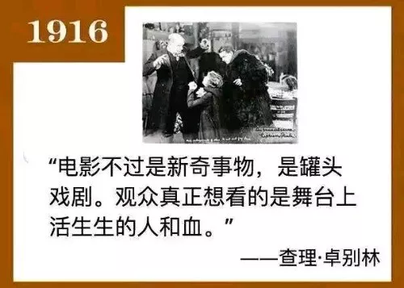

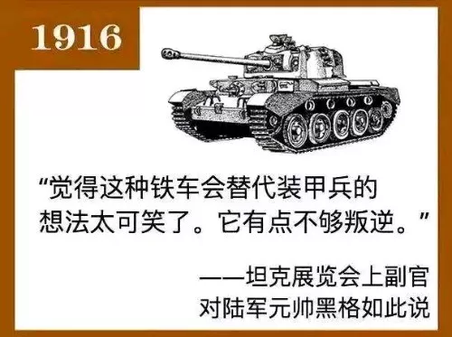

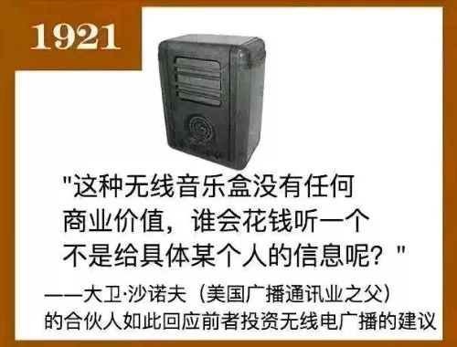

