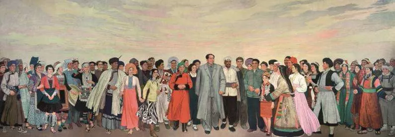

# 第七十六节  澳宋圣贤

跟着张岱走进来的油腻中年人开口说道：“张先生有没有兴趣来做个访谈啊，大家一起探讨下江南的风土人情如何啊？”

张岱拱手道：“请问这位首长是？”

布特介绍到：“这位是执掌我们大宋翰林院的于鄂水首长，盛天仕首长的上官。”

“哦，原来是于学士，失敬、失敬！”张岱客套道。

这个油腻中年人正是于鄂水，他想通过张岱仔细了解一下明末江南士子阶层的历史细节八卦，于是就走了过来，刚好撞见张岱站在树墙前发呆……

接下来，张岱就跟于鄂水聊了起来。于鄂水先问起张岱祖上在宋代时的情况，张岱说自己是宋代“抗金名将张浚”的后人，张岱家族徙居山阴的始祖是“魏公浚六世孙”张远猷。

这件事大大出乎很多元老的意料。

有的元老心想：“这个张岱真是不务正业，既然祖上是名将，为何旧时空历史上终其一生都没有在军事方面干出点啥来？”

有的元老则想：“名将？我都不知张浚凭啥能与岳飞并称南宋中兴四名将，军纪败坏，贪污成性。”

还有的元老想的是：“张浚啊，看看他祖宗的光辉战绩只能说幸亏张岱没遗传他祖宗的军事才能。”

不过也有的元老知道，张岱提到“张俊”并非是“中兴四将”里的水货名将张俊，而是曾经在南宋建炎年间经营川陕的名臣张浚张紫岩。虽然志大才疏、性情急躁，但总体来说是个义人。于是这位元老对张岱说道：“紫岩先生吗？原来张先生还是正宗的西汉留侯张良的后代。”

于鄂水又问张岱对袁崇焕和毛文龙的看法，张岱说道：“袁崇焕短小精悍，形如小猱，而性极躁暴。攘臂谈天下事，多大言不惭；而终日梦梦，堕幕士云雾中而不知其著魅著魇也。五年灭寇，寇不能灭而自灭之矣。呜呼！秦桧力主和议，缓宋亡且二百余载；崇焕以龌龊庸才，焉可上比秦桧！亦犹之毛文龙以么魔小卒，焉可上比鄂王！论者乃取以比拟，不特开罪鄂王，亦且唐突秦桧矣。……”简而言之，袁崇焕不如秦桧，毛文龙不如岳飞。

最后张岱说道：“看天下英雄，还是大宋名臣猛将辈出。于学士既然能进翰林院，想必是博学大儒，不知大宋自崖山衣冠南渡之后，又出过哪几位圣贤？”在张岱看来，澳宋能有“先进生产力”，生产出特别多的粮食、钢铁以及其他商品，火器特别先进，一定是宋人在澳洲开拓发展期间，又冒出了一个或几个类似“三皇五帝”的“圣君贤臣”，张岱很有兴趣了解这些“圣贤”。例如上物理课时听刘汤姆介绍的“林弗兰”，从纸鸢放空际验试雷雨开始，发展出电学，此等功绩堪比传说中尝百草发明中草药的炎帝，发明医理和针灸的黄帝。

于鄂水则端起保温茶杯喝了一口后笑着说道：“现今在我们元老院这边，圣贤大爷都是嘲讽黑社会的。先王制作法度，君子遏制其私欲，现在元老院力图让治下所有人都能乐于遵守法度。功成不必在我辈，希望后代能补全。圣贤高人就算了，古代先王也只能是多位酋邦领袖的概念集合体。元老院也是法古而通变，求的是殊途同归，但求学以致用，不能与世界大势脱节。外界风起云涌、时移世易之时，圣贤高人什么也是扛不住时代的。”

“这是何意？这位叫于鄂水的‘大儒’好像对‘圣贤’非常不敬啊？”张岱疑惑不解的想。

此时，布特开口解释道：“于学士的意思是，少数几位圣贤救不了天下，能救天下的只有百姓自己。只有天下百姓人人争当圣贤，所有人都能乐于遵守法度，才能救天下。而且这世道一向是时移世易，一旦世道变了，前世圣贤高人留下的章程就不管用了，还是得靠争当圣贤的百姓自己找出路。还有就是，当初在澳洲有很多恶人自称‘圣贤’，满口仁义道德，却尽干些伤天害理的事。因此现在很多首长对圣贤二字没啥好感，视圣贤二字为‘大恶人’之意。万一澳宋真出了‘圣贤’一般的人物，我们会改口称呼他为‘伟人’。”

张岱听了后跟着念道：“能救天下的只有百姓自己？天下百姓人人争当圣贤？争当圣贤的百姓自己找出路？”随即张岱站起来说道：“恕在下直言，所谓‘蛇无头不行’，若无圣贤带头，这百姓自己就乱了，又如何救自己？就算要百姓人人争当圣贤，也得有圣贤站出来作为楷模，引领百姓做事。倘若真有百姓自己找出乱世之出路，这样的人也足以称之为‘圣贤’。这样的人前有汉高祖刘邦，后有本朝……哦，后有大明太祖，此二人虽出身布衣，却足以当得起‘圣贤’二字。”

布特叹了口气说道：“组织带头的工作当然需要有人去做，但倘若百姓不配合，就算出了圣贤又有何用？不知张先生可还记得广州瘟疫一事？”

张岱：“当然记得，瘟疫期间大宋朝廷的所作所为，令余叹为观止。”因为当时人口流动方面的封锁，张岱自己也被堵在广州大半年，以至于拖到了1636年才来到临高。

布特：“张先生认为广州瘟疫能平息，靠的是什么？”

张岱：“当然是幸大宋皇……哦，余是说，幸大宋元老院主席洪福齐天，朝中大臣指示机宜，众将士用命，才能将那些乱民治住，防止瘟疫四处流传。又有大宋御医制出治瘟良药，最终灭瘟，还广州百姓一个朗朗乾坤。”

布特：“然而倘若当时众多大宋将士因为怕被染病而一哄而散，又有何人去防止瘟疫四处流传？倘若广州数十万百姓人人争当乱民，数千大宋将士也是拦不住的，又如何防止瘟疫四处流传？倘若人心乱了，就算大宋御医制出治瘟良药，又如何送到患病的百姓那里？这一切的关键，首先在于广州数十万百姓愿意为大局着想，配合广州市政府的隔离行动；其次是数千名出身百姓的大宋将士，愿意冒着生命危险执行政府的命令。说到底，能救天下的只有百姓自己，只有天下百姓人人争当圣贤才能救天下。”

张岱一时语塞，沉默一分钟后说道：“这天下百姓，真能人人争当圣贤？”

布特：“当然，我们大宋南渡澳洲之时，也曾多次发生大疫，即使是华佗那样的神医也一度束手无策。最后，是靠朝廷与百姓上下同心协力，才将瘟疫治住。有诗为证，绿水青山枉自多，华陀无奈小虫何。春风杨柳万千条，六亿神州尽舜尧。”

念完那句诗之后，布特马上感觉自己说漏嘴了——这怎么跟张岱解释“神州”有六亿人？

却听张岱说道：“没想到澳洲那边有六十万争当圣贤的百姓，不知他们何时重返中原，叶落归根？”

听到张岱这样说，布特心中暗暗庆幸：“还好，没穿帮，差点忘了‘亿’这个单位在古代是指十万。”

于是布特继续说道：“可惜在澳洲的数十万大宋百姓只在身体患病之时‘圣贤’了一把，当‘伟人’要他们自己治心中的病魔、移风易俗之际，很多人没能继续配合‘伟人’的倡导，或者根本没听懂‘伟人’的倡导，甚至阳奉阴违。是以于学士刚才说，外界风起云涌、时移世易之时，圣贤高人什么也是扛不住时代的。这个道理不止适用于瘟疫，也适用于‘先进生产力’，不知张先生可记得当初参观能源机械史馆之时盛首长所提及的黄婆婆？”

张岱：“当然记得，布首长的意思，是想说黄婆婆可称为‘圣贤’？”

布特：“非也，黄婆婆的技艺，也是数百年前习自琼州府。张先生可知当年为何黄婆婆，或者传授黄婆婆纺织技艺之人，未能使琼州府成就‘衣被天下’美名，未能使琼州府成为天下财赋重地？因为在松江府有千千万万的织工将黄婆婆的技艺发扬光大，又有千千万万的棉农为之种棉。而琼州府这边的不管是织工还是棉农，数量都不及松江府的一成。成就松江府的，不是一个黄婆婆，而是松江府千千万万像黄婆婆那样织工与棉农！”

张岱一时听楞了，好半天，才轻声说道：“熟为‘圣人’，布首长的看法还真是别具一格啊！”

布特：“非也，此种说法，古已有之。《周礼注疏·考工记》有云，百工之事，皆圣人作也。”

却听张岱说道：“《周礼注疏·考工记》有云，知者创物，巧者述之守之，世谓之工。百工之事，皆圣人作也。百工传承圣人技艺，却还是需圣人开创技艺，不知大宋南渡澳洲之时，开创‘先进生产力’的‘圣贤’有哪些？”

布特不说话了，他突然发现自己刚才用错了古语，把话说砸了。原来“百工之事，皆圣人作也”的意思不是说“百工”是“圣人”，而是说各种各样的工匠们从事的事业，都是由第一流伟大人物开创的。这句话其实还是偏向“英雄史观”，而非“群众史观”。

