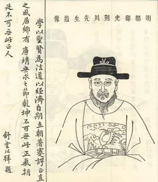
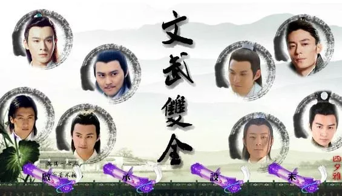
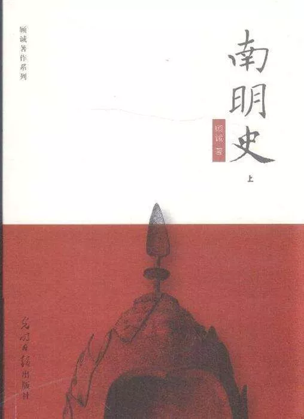

# 第七十七节  明朝的文人真的文弱

眼看布特突然不说话了，其他首长也不开口，张岱回想起之前布特说过，现在很多首长视“圣贤”二字为“大恶人”之意，“圣贤”一般的人物已改口称呼为“伟人”，心想：“莫非澳洲人已对圣贤二字有了避讳？”

于是张岱又说道：“布首长，若汝认为大宋南渡澳洲之后，无人可称之为圣贤，不如谈谈后来大宋又出了哪些伟人吧？”

此时，另一个元老也在布特耳边轻声说道：“我们没必要普及历史唯物主义，英雄史观也不是不可以。”

布特这才回过神来，心想：“即使是元老之中，也有倾向英雄史观的，对张岱就不必强求群众史观了。”

于是布特说道：“大宋南渡澳洲之后，引导人民群众走向进步的革命先驱与伟人当然有很多，现在大宋的教科书中就记载了一部分历史名人。张先生若是感兴趣，不妨买下一整套大宋的教科书，拿回绍兴慢慢阅读、品味。”

张岱点头称是，决定再采购一整套澳宋的教科书回去。

随后，于鄂水又继续跟张岱谈明末江南士子的历史细节八卦，问道：“不知还有哪些士子如张公子你这般，是宋代名将之后？其中有会打仗的吗？”

张岱思索了一番后说道：“说来惭愧，还有哪些士子乃宋代名将之后，余不太清楚，但有哪些士子能上战场杀敌，余倒是略知一二。就说那常州府武进县的荆川先生，武艺高强，戚少保的鸳鸯阵，就是习自荆川先生……”

“荆川先生”本名叫唐顺之，追随王阳明一派，文武双修，作为一个文人，居然会打拳舞枪。三十多岁就得罪皇帝被踢回老家，然后自己苦行，穿麻衣，冬天不生火，夏天不摇扇，不吃肉（这点元老们是不信的，毕竟他是练武的），37岁学河南某名家大枪。倭寇入侵后，又被朝廷启用，积极组织团练，居然还亲自抄枪上阵。参考倭寇战斗特点，提出了克制的战术组合，写进了《武编》，然后传给了30多岁的戚继光，开启了戚战神的传奇。

谈完唐顺之后，张岱又陆续提起好多个懂武术的文人——蒲来举、梦鰲、士宽、志仁、张绍登、魏时光、景春、黄宗羲、方其义、孙克咸、王余佑……

这段谈话让部分元老感到吃惊，直接颠覆了他们对明朝士大夫“文弱”的刻板印象。

时间在谈话中飞逝，眼看夕阳西下，晚间的宴席开始了，众元老招待张岱入席。

吃过晚饭后，众元老送别张岱，然后结伴回百刃城。

在回百刃城的路上，几个元老谈起了明末文人习武的问题。

“今天张岱说的那些真的颠覆我对明朝文人文弱的印象。”

“明朝士大夫文弱吗？明代文武双全的文人不少的，熊廷弼文武双解元，孙承宗一大把年纪了照样上场守城，孙传庭养兵打仗也是一流，卢象升更不用说了，可惜都被坑死了。”

“明朝后期能打的多是军事文官，士大夫文弱？”

“明末能出卢象升这种提着大刀绝对不是偶然，上次看陕西某地一本老册子，某生员参加乡绅组织的民团，乡绅安排他带一个随从去给官军送信，结果半路遭遇闯军百余骑，随从上来就被一箭毙命，这生员不但顺利到达官军驻地，还提了6个首级。”

“明末好多城市抗清就是文人带头的，阎应元不就是典型，明代士大夫的培养没有那么挫。”

“那个在朝堂上用笏板打死锦衣卫指挥使的也是大明文官，身体素质不好的都死在考场里了，科举太熬人了。”

“为啥会觉得明代士大夫文弱？不文弱是非主流？”

“不是有说法吗？汉唐士大夫能骑马射箭，上马从军入朝为官；宋朝的能骑马，到明朝基本都只会坐轿子了，丧失了尚武精神。文武双全的还是少部分，毕竟科举竞争这么激烈，时间都花在备考上了，能有几人有精力全面发展？”

“坐轿其实最根本的原因还是和朱八八定的礼制有关，明早期可是规定文官三品只能骑马。但两京这种官员遍地走的地方，上下官员在路上不好打招呼，动不动都要下马回避或打招呼，真疏忽了不一定得罪谁呢，所以嘉靖年间就开始就流行官员做轿子了，大家装看不见，最多就是轿子避让一下高级官员就行了。”

“这个问题应该从两方面来说。第一自宋明以来文人练武之风不盛，至少是远逊汉唐；第二穷文富武，在王朝末年乱世之中有条件的士绅练武保家这也很正常，但有时候朝廷不待见。”

“纯粹的文官，只存在于现代社会。现代人意识里手无缚鸡之力的文人，其实是来自爷爷辈回忆里的饭都吃不太饱的乡村穷教书先生。科举上去的文官，它们在本乡的一个本职身份是土豪，其实就是个小领主，必要时要带着部曲和其它土豪以及土匪流寇特别是反抗的农民开片的。这一点，越是南方越明显。”

“我一直很纳闷怎么就觉得明朝文人不练武的？地方学校教授的科目之一就有射箭，还有地方教骑马。戚继光的枪法还是跟唐顺之这个大文人学的，俞大猷也受过他影响。”

“穷文富武，唐顺之也是当了几年官，回家之后学习的枪法。李自成和吴三桂大战山海关时，周边来助战的那些生员砍起闯军来比关宁军还生猛。地方学校教射箭，一是因为射箭是儒家六艺之一，至于教授情况，练的一手好箭法的比比皆是，但是估计糊弄人的更多。”

“尉氏县志算记载的很清楚的，射箭棍棒属于必学科目，也是月考项目，学守每月都要考校，一年不成的要退学。”

“妈的，我生活在现代，因为体育不过关，小学好几年当不上三好学生；要是活在明朝，岂不是早早就要开除掉？对比下还是现代好。”

“现代体育考试已经没什么趣味性了，你在明代练武还是很好玩的，我觉得你很可能会是厉害的武将。”

“会练武就怎么了？碰上大军还不是被碾压？”

“就是，清妖一来，为啥都不行了呢？”

“农民军跑了，官军变清妖了，是提着脑袋跟清妖对砍还是受诏安去当清朝的官？”

……（注1）

布特则在一边沉思：顾诚的《南明史》已经说得很清楚了，清朝是汉族地主阶级勾结少数民族军事集团镇压农民起义的产物，那些地主士绅跟满清是敌是友还用得着争论？

明末清初之际，真正玩命抗清的，有几个不是明代的“反贼”出身？南明永历政权依靠大西军、大顺军等农民军支持就不必多说了，在福建抗清的是在明末崇祯朝刚刚被招安的十八芝海商/海盗集团。浙江的很多抗清武装，崇祯朝时也正在一些读书人的带领下造明朝的反。

实际上，江南地区抗清的那部分士绅文人，很多人或者他们的祖上也干过“反明”的工作——最早是支持张士诚、方国珍跟朱元璋对着干，后来又以反对“宦官专权”、反对“厂卫”和“大礼仪”、“争国本”之类的名义跟好几个明朝皇帝对着干，正德、泰昌、天启等几个皇帝也死得不明不白的；后来又坑死了崇祯皇帝，搞臭了弘光皇帝。到最后，又是这帮具有“历史反革命”背景、经常跟明朝皇帝作对、“资本主义萌芽化”的“江南士绅”，在抗清方面要比北方的“封建地主”积极一些，把他们老祖宗那套先“武斗”、后“文斗”的反明套路，对着满清又干了一遍。

先是江阴八十一日、嘉定三屠、浙东鲁王政权的武斗，后来是“明史案”、抹黑雍正的“文斗”，直至乾隆“六下江南”、大兴“文字狱”，对江南士绅又是收买、又是镇压双管齐下，才暂时摆平了江南士绅的“反骨”。结果到了清末，江南士绅子弟中又冒出了“光复会”，参与了辛亥革命。

总而言之，在明朝不造反的那些人，到了清代多半也不会反清；而热衷反清的那些人，在明朝时也普遍当过“反贼”。

此时，早就回到白斯文家里的张岱并不清楚元老们关于明朝文人那些争论，张岱正在想，自己在临高看够了、玩够了没有？是不是该回绍兴了？忽然，张岱想起来，自己原本的主要考察目标是临高以外的澳洲人统治区，好像还没怎么看过。（注2）

注1：关于明代文人练武的情况与相关讨论，详情参阅北朝讨论帖《百度到一个牛人，改变了我明朝士大夫文弱的印象》《明末文人也有很多练武的啊》

注2：详情参阅《临高启明》正文第7卷第233节。原文是：“想来临高是澳洲人的京城，必是不惜金钱人力，装点一新，用以粉饰太平――不外乎当年隋炀帝故伎――出了临高，可就未必如此了。耳听为虚，眼见为实。到底如何，自己且先去看看。”