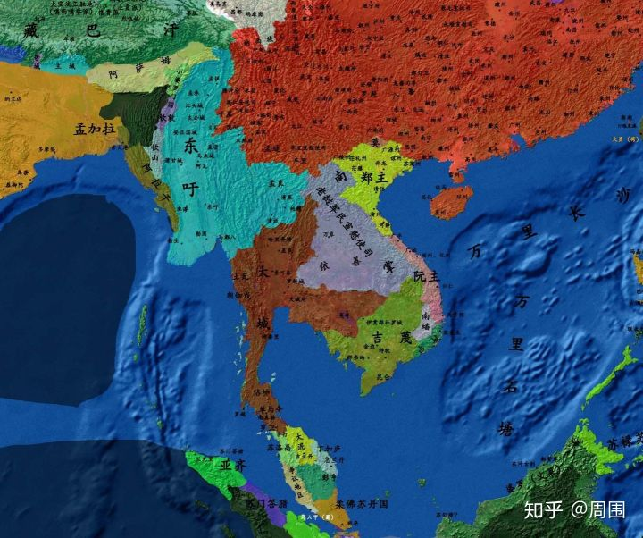

# 第一部分：林邑旧事——第四章 阶梯计划

“该来的还是要来啊。”吴南海摇了摇头。“本时空东亚的混乱是一把阶梯，一把上天赐给元老院的阶梯，抓住他，元老院就能取得胜利。可是你们这是在赌国运啊。”

阶梯计划说白了其实就是超大号的发动机行动。按照阶梯计划的提出人，殖民贸易部周围的想法，阶梯计划分四步，第一步拿下普利安哥，也就是湄公河三角洲。利用当地高棉人建立起奴隶种植园，改造环境、开垦荒地、修建道路及战略村。普利安哥地区的获取基本没有难度，当地大概只有１０万人，而且有平秋盛元老经营三年的贸易站，只要２００个伏波军掐住当地副王，就能控制局面。控制当地后，利用高棉本地居民加上奴隶，目标是在一年内，完成环境改造工作，同时修建２０个母村用于安置遗民，每个母村下有１０个子村，每个子村拥有１００户人家，每家分得１００亩土地，也就是２．５＊２．５公里的土地上有一个子村，每８到９个占率村有一个母村，母村设立一所小学，一个医疗点，一个训练队以及行政事务处。此举既能降低移民的死亡率也能消耗当地原住民，同时保证湄公河三角洲地区的粮食生产不会因为殖民计划停滞，当然也拍了文德嗣战略村的马屁。

第二步是在１６３６年跟着满清一起在丙子胡乱掠夺朝鲜人口，同时以协助满清的名义接管东江镇，另一方面在朝鲜半岛地区开拓铁山、宣州一线的领土。这里东江镇就能拿下２０万人，趁火打劫朝鲜人拉个３０万人左右，朝鲜人以及部分东江镇军民将会拉到安南，用于充实湄公河三角洲人口；同时朝鲜半岛殖民点的开拓将在朝鲜和后金之间打入一个钉子。”

第三步乘着１６３７年岛原天风之乱从日本拉人，当年大乱仅义军就三万七千余人，波及人口不低于１０万。元老院的任务很简单就是乘乱裹挟人口。在此计划之前要在琉球的归仁城建立一个有３０００人口的殖民点，并且在当地建立一所小学。这个殖民点的作用是，第一开荒，能够为后续这个归仁的中转站提供应急物资和必要服务；第二是在琉球地区进行普通话的普及以及广泛的扫盲，为后面接受琉球做准备。这个事情比较简单，赵元老交代一下就好，主要是要安抚好萨摩藩以及琉球国。

第四步是在１６３９年，多尔衮大掠山东时，把局面搞大。根据史料记载，当时清军裹挟俘虏人口多达５０万人，而元老院的目的就是第一是从多尔衮手里咬下一半的人口，同时以救人名义，沿途再裹挟一部分人口，这些人也将要送往安南南部地区，形成相对多数的北方群体，便利普通话的普及。

这次行动在１６４０年结束，目的是要在湄公河三角洲地区建立一个拥有１００万人口的扶南省。与此同时，配合广西对安南南北政权推行两面夹击，西面鲸吞柬埔寨蚕食大城王朝的战略。

其实对东南亚地区的开发提出的很早，邬德元老很早就提出了南进论，南进论的主要思想就是让在大陆保持彼此混战的均衡模式，临高乘这个空挡将主要力量投放到东南亚远至印度的贸易线上。这条线上可以提供除人口以外的其他大多数工业化资源。通过贸易中获取到的白银和粮食两项资源换取大陆上的人口。一方面提高自己的人力资源水平。一方面大量白银的入超造成通货膨胀，给明王朝多压一根稻草。

而元老院在大陆上获得的人口，既能满足临高对劳动力和士兵的需求，而且可以利用组织向东南亚的殖民，建立起殖民地。殖民地不仅是临高政权在东南亚的堡垒，更是吸取东南亚资源的血管。有了殖民地，临高政权就能在主要的资源地拥有强大的控制力而无需仰仗当地土王的鼻息。

可元老院作为作为一个以中国人为主体的穿越集团。如此早的就展开南进攻略意味着。整个东南亚地区，至少安南地区将成为最早归化元老院的地方。这也意味着在未来的归化民干部中。来自东南亚的归化民将要扮演重要角色。一想到一帮猴子要成为未来的左膀右臂以及未来中国的第一批干部，元老院这帮人在心理上又根本过不去。而且在这个时空的东南亚，虽然没有准确数字，但是八九百万人口还是有的。虽然期中的部分民族，如安南人自称汉民，在文字上也使用汉字，但毕竟语言不同。能不能吃下来吃下来？能不能消化好也是摆在元老院面前的一个重要的问题。所以南进论虽然很有市场，年年提月月吵，可从未付诸行动。不过现在，因为粮食的短缺，一切都要改变了。邬德知道是时候把南进派的头面人物推出来了。

“老吴你这话我就不爱听了，我先不说“赌国运”这个词的正确与否，到底什么是国运。我以为国家必定不是赌徒，赌徒的胜负只在色子掷出的一瞬间，而国运之顺或败，却是数代人有所作为或碌碌无为的积累的结果，拿中日甲午战争的时代背景来说，中国进行了洋务运动，日本进行了明治维新，看似四斤八两，平静的湖面之下藏着的景象可是大不一样！日本在励精图治，大力普及初等教育，皇室甚至为之削减开支的时候，中国人在干什么；日本人全面以西方为师，翻译大量近代科技政治文化典籍的时候，中国人做了些什么；日本人改革金融制度，建立与西方接轨的近代银行时候，中国人做了些什么？再看战争准备：日本人建立全新的兵役制度，聘请西方教头的时候，大清还在为平定太平天国之后如何钳制湘、淮，平衡八旗绿营的利益纷争头疼不已，日本针对北洋舰队两只巨无霸定远和镇远进行了海军的研发改造和战术升级，大清恐怕一无所知吧，日本人前后往大清派遣超过２０００人的间谍队伍，对大清国土、政府、人文和经济社会进行详细的侦查勘探，大清又对日本了解几分？所以，所谓的日本国运昌盛的背后，是明治以来日本人的开放、勤勉在政治、军事、经济、科技和外交等等各个方面所做出的巨量的艰难困苦的努力乃至牺牲的结果，所谓的大清国运衰落也是当时的中国人在各个领域的折腾、内斗、愚昧、不作为和乱作为的最终结果，没有什么可奇怪的，就如同两个年轻人，一个积极奋斗不屈不挠，肯吃苦还肯动脑，另一个好吃懒做得过且过守着家业啃老除了吃喝嫖赌啥都不会，过了十几年第一个年轻人成功了，第二个年轻人穷困潦倒了，然后你跟我说这是因为第一个年轻人运气好？”

之前一言不发的邬德点了一根烟，“老马常说澳宋元老院对腐朽的伪明有胜无败，其一：我澳宋元老院胸怀四海，胜于伪明；其二：我澳宋元老院有通海之利，予取予求，伪明能奈我何；其三：我澳宋元老院讲求人人平等，伪明可有；其四：我澳宋元老院先进制度傲然于世，伪明则腐朽黑暗；其五：我澳宋元老院黑白不计，妇孺通收，气度胜于伪明；其六：我澳宋元老院科技昌明海纳百川，力胜于伪明；其七：我澳宋元老院依法治国，明断是非，秩序胜于伪明；其八：我澳宋元老院济贫救危，慈善为怀，伪明若可比之；其九：我澳宋元老院识时务知进退，不拿群众一针一线，伪明能持否；其十：我澳宋元老院众志成城军民一心，伪明貌神合离勾心斗角。对伪明我们有十胜十败，怎么对猴子咱们就没了底气呢？”

“这么想当然，那元老院早就拿下大明咯。”北进的吴南海依旧不愿意妥协，“别的不说，我且问你南北夹击安南政权，你知道安南多少人么，拿下来吃的下来么，别到最后把澳宋变成了猴宋。”

“吴元老的问题一下就说到了点子上，阶梯计划的目的就是要在东南亚钉下一颗钉子，安南的消化和人口，周围自然是会考虑的。”邬德说道，“根据记载，１８０２年安南人口４２９万，而１６３０年人口约３００万。目前根据情报，郑主控制人口是阮主三倍。另有割据高平的莫朝，割据宣光镇的保主武德恭、武公悳。郑主统治人口约１８０万，阮主统治人口约６０万。莫、武各控制约１０万人口。占城人口约１０余万。不在当时安南政府统治下的高原少数民族约１０万。湄公河三角洲约１０万。北越老街莱州等处边境土司人口约１０万。所以安南的人口并没有大家想的那么庞大。而且本时空是没有现代民族概念的，安南人也自称汉人，只要适时推出泛中华民族概念，元老院在东亚获得广泛的民族认同感不是难事。

“其次周围之所以有自信拿下安南，并且消化好的理由有如下三条：１．越北山地地区，尤其是谅山地区，其实安南人并不多，更多的其实是和广西壮族同源的侬族，而广西壮族实际上是汉民和少数民族的混血，因为元老院治下已经不存在民族划分了，这些侬族已经被纳入归化民，元老院要充分利用这些归化民带路党直接拿下山地地区，而拿下山地地区，安南红河平原将无险可守。２．元老院在安南南方站稳之前对安南地区采取的策略是蚕食领土，吸引人口，文化输入，思想改造的策略，用三到五年的时间在南方地区站稳，建立一个稳定的后方，打造一个锐意进取的开拓族群，培养一批忠诚的规划民干部，训练一支能够进行热带地区作战的伏波军。最后以南方为主，北方为辅的方式，争取在１６４０年前彻底攻占安南地区。３．对于大家最关心的安南遗民的使用问题，第一改造和同化大多数普通民众，核心是要打断其文化传承，消除其民族意识，政策是两步走，一是不遗余力的推广普通话，二是采取苏联强制民族迁徙模式，大规模的将安南遗民安插在各个战略村，以及输送往柬埔寨以及老挝地区；第二是培养安南遗民的荣誉意识，移民不是惩罚性的，而是以战胜者的姿态的殖民，是送往这些地区作为统治族群的中华子民；第三是肉体上彻底消灭一切表现出不配合的安南移民，尤其是要消灭安南的反动文人和旧贵族，这些人不光其思想反动，并且还是安南民族意识的传承者，必须予以消灭，断绝观望移民的念想，扑灭安南民族的火种，发动劳苦群众进行阶级斗争，批判和消灭这些人。彻底确立和稳固湄公河东岸元老院的统治，最终对云南实现东南夹击之势。”

“我有个问题，柬埔寨就那么好鲸吞？不然原时空的柬埔寨从哪来的？”文德嗣其实也是个南进派，虽然这次座谈会是文授意的，但是精明的文德嗣并不愿意迅速站队，而是巧妙地采用询问的方式，引出解决办法。

“这个问题，周围早就牵头殖民贸易部和对外情报局做了大量的工作，周围以为对柬埔寨的鲸吞，核心不是柬埔寨的问题，而是大城和安南的问题。旧时空柬埔寨的存在其实是充当了大城和安南的缓冲地带，拿下柬埔寨就意味着战略失衡和两国大规模战争爆发，因此柬埔寨成了一块毒肉，谁都不敢贸然吃下。前面的对比各位也看到，安南阮主力量并不强，而大城居然和他扯了那么久的皮，核心就是因为西边的缅甸咄咄逼人，因此只要以雷霆之势吃下柬埔寨，必要时要进行妥协、试好，大城不会轻举妄动。大家既然那么嫌弃高棉地区的居民，那就拿他们开拓道路，修建村落，改善环境好了，毕竟元老院对奴隶的需求也很大，热带平原的开发，以及日后的矿山和铁路桥梁都要拿人命去填，也可以省些钱。”前来汇报的冯诺说道。

“安南人有那么菜么？人家可是东南亚一霸。”王洛宾看了一眼陆军的席亚洲。

席亚洲拎了一下裤子，站到了地图面前，“安南人有那么菜，但是东南亚一霸那是菜鸡互啄。郑阮战争中，郑主动员正规军（御林军）加民壮不足１０万，留守兵力５万左右，５００头象，５００条船。那么按绝对穷兵黩武标准来看，阮主顶天就４－５万兵力，１００头象。莫氏、武氏各有兵力不到１万。而且主要用于北方防御，我们在南方捅上去，北边必然南下，一仗下来阮主那边能剩下多少男丁都难说。”

“那周围去哪里了？既然计划是他提的，他怎么不来汇报。”吴南海问道。

“周次长人已经在占城主持金兰湾的建设工作了。”邬德说道，“殖民贸易部在33年就在当地布点了，这是企划院批准的商站。”

“这个时空的湄公河，三角洲。还依旧被高棉人所占领。因为水系众多被称为普利哥。意思是水中森林。是一片相对荒芜的地区。实际上到１６９２年。安南真是吞并该地区时。这个地方总共也只有４万户居民。因此，即使安南难民涌入该地区已经有了长达数十年的历史。但本是空该地总人口应该不会超过１万户，考虑到当地主要还是以北方南下的安南难民为主。年龄相对较轻，家庭单位也会相对较小。因此一户的居民人数并不会像本是空的大名那样以后一户人家多达十人。整个湄公河，三角洲地区的人口不会超过１０万人。而湄公河三角洲的面积高，４．４万平方公里。在原始空湄公河三角洲拥有高达一百七十二万公顷的优质耕地，这意味着如果元老院可以控制湄公河三角洲并充分开发，仅仅一个湄公河，三角洲就可以养活元老院治下的所有军民。而这片土地的主人。是处在黑暗时代的柬埔寨，其军事实力根本不足为惧。”马前卒摸了摸自己的脑袋，卖弄起自己的学识，“湄公河三角洲的北边，是衰落的占城国。这占城的脑袋在现在是被门夹了，先是招惹北方的阮主，又是派兵帮柔佛苏丹的攻打马六甲，得罪了葡萄牙人。现在国内搞的是一片凋敝，男丁尽失。所以两个地方，就一起收了。事实上攻占占城的最大的阻力在于安南的南朝也就是阮主。但是现在阮主在南北对峙中处于守势。而且所处的南方。也是夷汉杂处。与占城国接壤的地区。更是刚刚占领不久。阮主政府仅仅在此进行征税和钱粮的征缴，偶尔抓个丁壮丁，存在感很弱。因此只要不去主动招惹，阮主阮主绝对不会冒着两头作战的危险过来和元老院开篇。这样我们在南边就有了２０万奴隶，当然对外还是叫终身契约工人。道路一修，荒地一开，战略村一建，还有煤矿的开采，都是要吃人的，用他们的话元老院的舆论压力也可以减轻不少。”

“那就干吧！殖民贸易部后面拆分就让周围负责殖民部，让他好好带着难民下南洋吧。然后石城银矿的那个事，也尽快安排上马吧！时间不多了，临高饿了。”

**中南半岛附近区域形势图**

