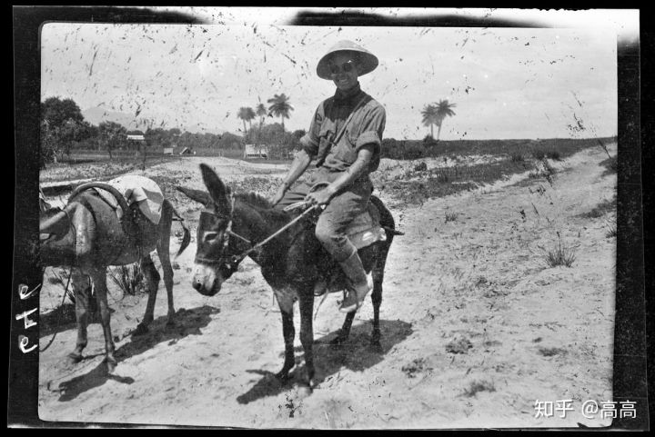
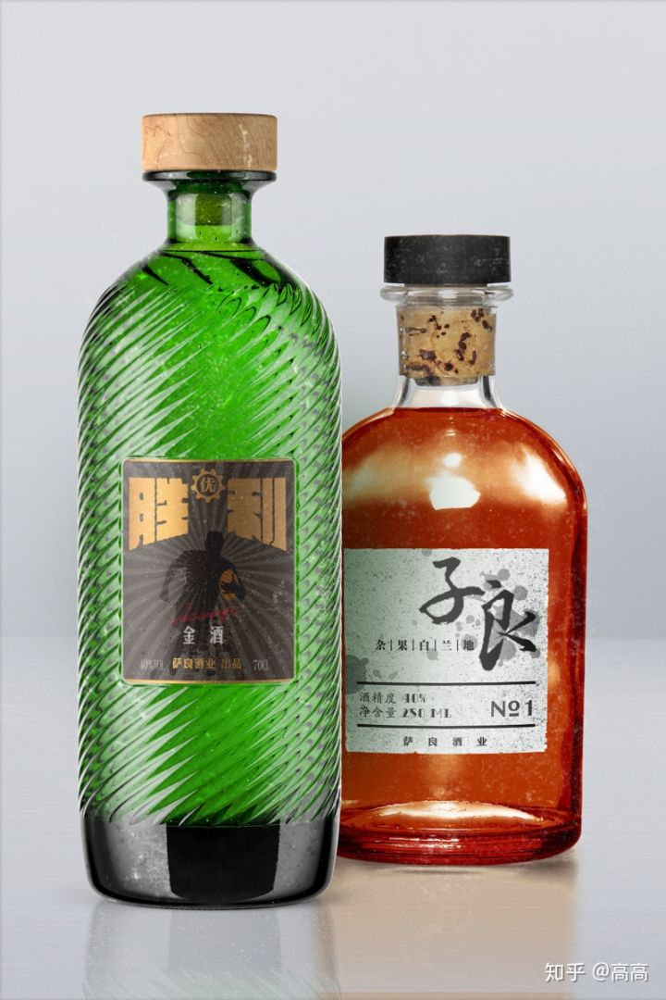
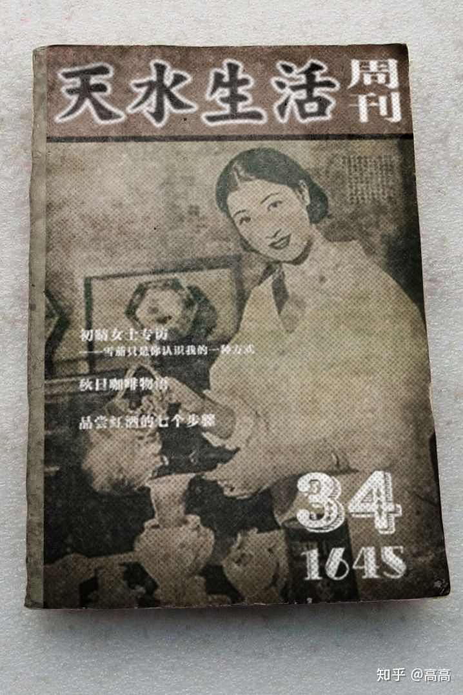
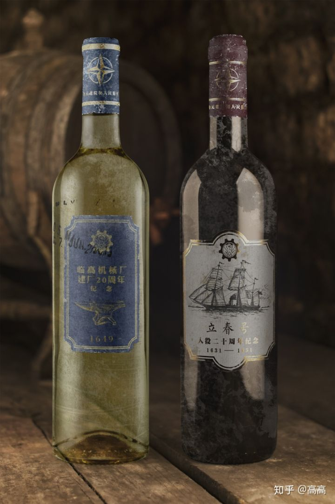
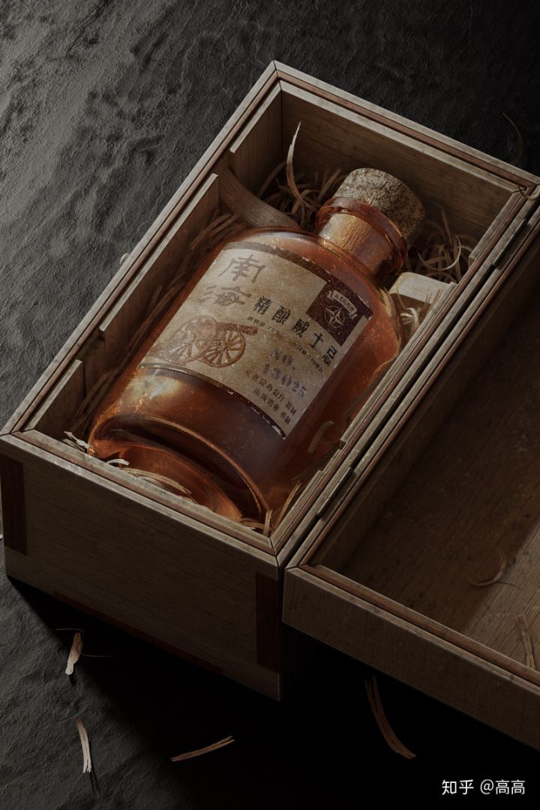
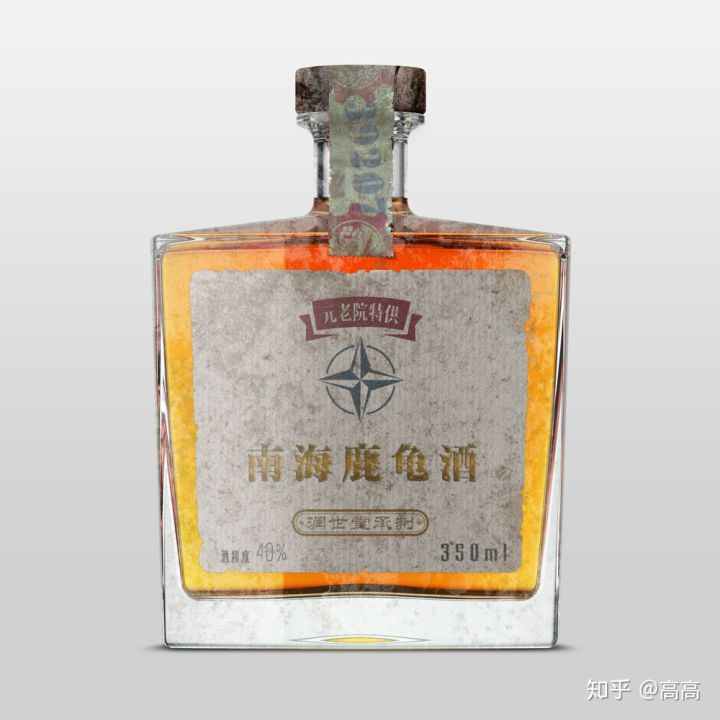
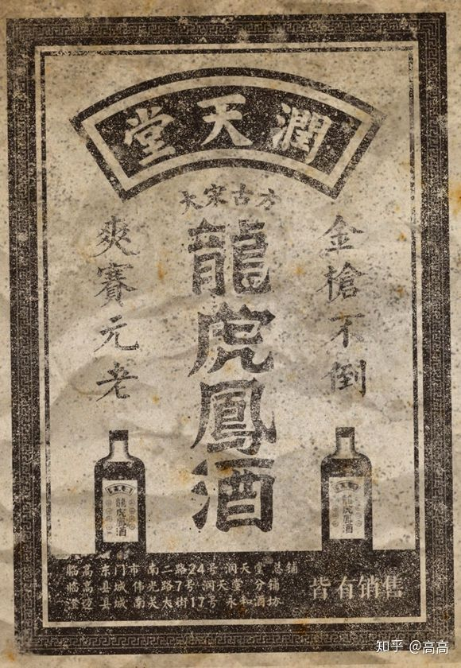
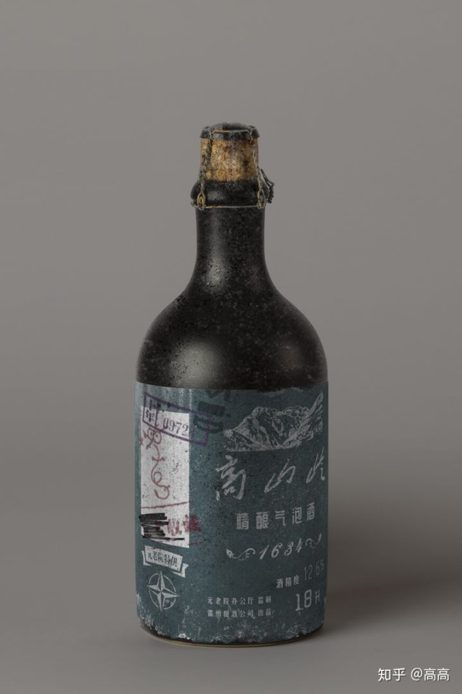
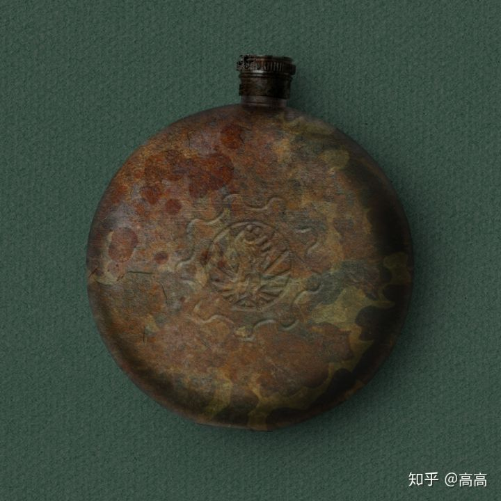
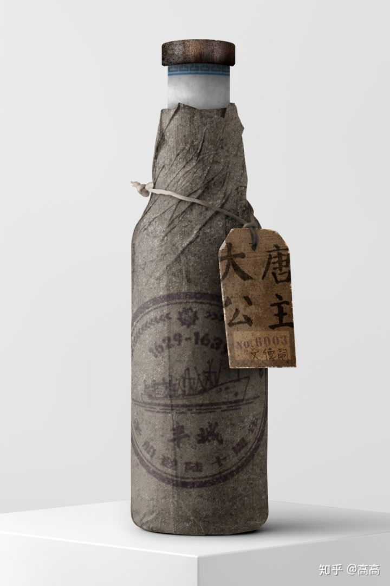

# 临高的烟酒及其他（三）
原文地址：https://zhuanlan.zhihu.com/p/63528720

**临高的酒（二）**

不同于传统工艺酿造的“烧黄二酒”，像啤酒、红白葡萄酒、金酒、白兰地、威士忌、气泡酒、亚力酒、甜酒和朗姆酒等等这些新的品种，都是元老院带来的。尤其是现在畅销国内的“大宋名酒”——“胜利牌金酒”和“子良牌白兰地”；享誉海内外的“国际名牌”——“大唐公主牌大黄甜酒”，“皇家萨琳娜牌朗姆酒”都是由薛子良元老最早创制的。我国重要的酿酒企业，“萨良酒业集团”也是由他和夫人萨琳娜女士亲自创办。虽然工（bu）作（shi）繁（han）忙（zi），薛子良元老还是通过秘书执笔，写出了很多酿造学专著。《薛氏酿造学原理》一至四卷是现在各大院校食品专业的必修内容，《薛氏酿造技术手册》更是酿酒、发酵相关工业技术人员的手边必备，他主编的《酿造工艺》杂志也一直是业内公认的专业核心期刊。另外，令人无比钦佩的是，薛元老还是元老院之剑 ——“特侦队”的缔造者之一，就像很多元老一样，也是经天纬地的文武奇才。

薛子良元老率领特侦队在执行任务（《启明星》杂志 存档）

薛子良元老1644年左右酿制的“胜利牌金酒”和“子良杂果白兰地”（广州轻工博物馆藏品）

如果说甜酒是普通群众喜欢的酒，那干红就是元老们专属的，尤其是“82号”出售的各种红白葡萄酒，更为高档。我第一次喝到干红要比甜红酒还早些，那大概是1642年左右，四哥带来的一瓶“82号”出品的红酒，是陈海阳元老视察船厂时，给技术骨干们赠送的礼物，据说要卖上百一瓶。四哥当时的师傅侯龙涛同志领到了一瓶，但他不爱喝红酒，就顺手给了他最喜欢的徒弟，我四哥陈忠陵。我当时刚从三亚出了个长差回来，喝了几个月当地4块钱一瓶的“劳动牌“亚力酒，第一次要享受这么高档的东西，还是挺激动的。我们为了喝这瓶红酒，特意跑去了东门市的文澜咖啡馆（那时咖啡馆是允许经营酒精饮料的），因为那里有专门的高脚玻璃杯。我和四哥按照《天水生活周刊》上的指导，把酒打开，晃一晃让它醒一醒，当时还觉得这酒是不是像人上班一样，要晃晃才能醒；然后，缓慢的把酒倒进酒杯里，再用手捏住杯座把杯子晃一晃，看看酒液的挂壁和酒液的颜色；再把鼻子凑上去闻闻酒的香气；最后轻轻喝上一口，用舌尖品味酒液。谁知嘴里却不是想象中的琼浆玉液的味道，而是从舌尖传来一种混合着苦味和酸涩的味道，似乎各种味道都有，可就是没有期望中的酒味儿。本来还想按照书上说的把酒含在嘴里品一品，可是味道实在怪异，赶紧眉头一皱赶紧的咽了下去。抬头看四哥时，发现他嘴巴咧着，一张脸紧皱在一起，像个苦瓜，那口红色的琼浆已经吐到桌布上了…… 后来，我们用这瓶打开的酒和茶馆老板换了一箱香烟，高高兴兴的回去了。现在想想，真是年轻不懂事啊。

曾经风靡临高的《天水生活周刊》

后来，四哥调到香港船厂之后，主要负责船舶修理工作。每每修理好海军的主力战舰，项目组和海军的同志们都会搞个会餐。席间一般都是海军的军供朗姆酒兑一兑格瓦斯，或者是“珠江”啤酒。有时，也会有海军元老带来些“82号”销售的好酒，里面就有各种红白葡萄酒。就这样一来二去，四哥也喜欢上了葡萄酒，尤其是干红。到现在他还兼任着大宋葡萄酒协会副秘书长的社会职务，这恐怕是当年咖啡馆喝酒那会儿万万没有想到的吧。想来我们每个人的命运不都是这样么，因为元老院的到来，发生了天翻地覆的变化。我自己则因为跟随在元老们身边多年的工作，随着阅历的增长，也渐渐学会了品味葡萄酒的醇美。60年代初，我还曾经作为“西北经济作物开发小组”的成员，在河西走廊地区研究了几年葡萄种植，也参与了“飞天”系列红白葡萄酒、“塞北冰酒”、“河套枸杞酒”等产品的发酵工艺的攻关，算是为我国酿酒工业做了一点微小的贡献吧。

每逢重大纪念日，“82号”会受办公厅委托，推出纪念版的特供酒，很多元老会购买转赠，是规划民干部队伍中比较珍贵的礼物（陈忠陵个人收藏）

比“82号”更少见的，是元老院办公厅的特供酒，一般都是小批量供应，有些甚至是懂酒的元老个人参与定制的。早期一般没有具体品牌，或者挂“紫诚酒业”的标，到了40年代左右，随着酿酒工业的技术进步，主要几个品种的酒类质量趋于稳定，逐渐形成了以“精品国士无双”、“大唐公主特酿大黄甜酒”、“南海威士忌”、“高山岭精酿气泡酒”、“胜利牌金酒”等几个主要品牌。有些品牌还有更详细的号码以区分批次，工艺，窖藏和口感等等。比如，席亚洲元老回忆录里屡次提到过的“南海13炮”就是“南海牌”威士忌的某批次出品。编号以13开头，包装上有火炮图案，因此成名。据说搭配禽类品尝风味绝佳。

关于为何酒标上有火炮图案，历来有各种说法，有说是当时做了一个系列设计，用付波军的各种主力武器表示“南海”威士忌像伏波军的武器一样，犀利给劲；也有说是因为“南海”的前几批次的产品市场接受度不高，为了一炮打响创出名头，用了火炮图案讨个口彩。我后来就此问题专门请教过吴南海元老，因为“南海”威士忌就是南海农庄联合元老院直营的酿酒厂，在薛元老亲自指导下搞的产品。据吴元老回忆，其实酒标也没有特别的含义，元老们以前在澳洲常喝的威士忌酒，品质最好的两种叫“皇家礼炮”和“鹿邑十三”，前者沉着隽永，后者浓烈醇香。元老院回归中华之后，重新试制此种酒，希望新酒能兼具“礼炮”和“十三”的优点，因此在品质最好的一批酒上，编了13号，酒标上也用了礼炮的图案。加上元老的大力推广，就这样成就了一代名酒。

南海13炮（海南建设博物馆藏品）

特供酒里，除了一般酒品，还有一些特殊功能的滋补酒。30年代，我们的事业正在轰轰烈烈的开展，元老们在各个战线上努力奋斗，却常常因为工作强度太大，感到力不从心。润世堂结合海南民间古方，与刘三元老印证研究之后，再加上张道长提供的一些道门秘法，依照传统古法炮制了“特供补酒”。对于元老们在高强度的工作中保持精力、体力大有益处。很多元老饮用后表示有很好的滋补保健效果，因此办公厅将其加入了特供产品名录。后来，办公厅将其正式更名为“南海鹿龟酒”直到今天。1647年我结婚时，叶雨茗元老就赠送了我一些特供的鹿龟酒，还开玩笑说，让我多喝点，生一只橄榄球队出来。元老们的关怀永远是无微不至的啊……

广东和海南民间本来就有饮用补酒的习惯，后来也有很多商家也打着“大宋古方”的旗号推出各类的补酒，有些在宣传上甚至语涉元老。不过元老院非常的宽容大量，如果产品本身没有证明添加有害成分，对于广告一般不予干预禁止。那些夸张宣传的广告，时间一长，百姓们发现产品没有效果，也就成了贻笑大方的谈资，没人相信了。

40年代的南海鹿龟酒（陈松铭个人收藏，叶雨茗元老赠送）

打着古方和元老旗号的民间补酒广告

大约从1634年起，办公厅开始为元老提供窖藏服务，近年来，一些当年的藏酒流入收藏市场，被收藏界称为“元窖”，收藏价值普遍很高，如果收藏元老在历史上声望很高或者年份上有什么特别意义，价格也会水涨船高。

有某位元老私人收藏印钤的办公厅特供气泡酒（陈松铭个人收藏）

笔者就曾经在一个拍卖会上，拍到过一瓶1634年出产的初代“元窖”，虽然有收藏印钤，但是因为没有明确元老姓名的信息，因此价格还是可以令人接受的。前几年，马尼拉大世界拍卖行的一场慈善拍卖会上，“丰城慈善基金会”委托的一瓶有文德嗣元老亲笔签名的“圣船登陆10年纪念版大唐公主牌大黄甜酒”，拍出了创纪录的430万元的价格。买家是民营南洋能源集团的董事长胡慕文同志。我和慕文同志相识很早，40年代因为建设台湾的南海农场和配套的食品加工企业，我经常需要搭乘“大波”的班轮去台湾出差。他那时是船上的三副，虽然是东南亚公司创始股东之一，三亚市前市长胡五妹的儿子，但也踏踏实实的从最基层做起，一步步做到大副、船长，到后来白手起家，创立起一个大型的能源运输企业，建造了我国首条采用石油燃料的货船。用他自己的话说，就是“能力之外的资本为零”。1653年，台湾遭遇地震，慕文同志驾船抢运了第一批救灾物资抵台，还亲自带队深入灾区运送物资。在返程途中，因为余震不断，慕文同志还负了伤。文德嗣同志那时正在台湾指导救灾工作，闻讯之后，亲自去医院探望了慕文同志和其他几位在救灾中光荣负伤的同志，勉励他们养好伤，以后更好的为元老院和人民服务。临别时，文德嗣同志还赠送了他们一人一个酒壶。后来，慕文同志曾多次和我们谈起此事，每次说到动情之处都热泪盈眶，追忆起以文德嗣元老为代表的元老们在自己成长道路上的亲切关怀。虽然后来拍卖造成了一些负面的舆论，社会上有些“逃税”、“输送”之类的风言风语，但是他仍然不改初心，并不后悔以自己的方式代表广大群众表达对元老院的感激和崇敬。他说：“为了不让大宋元老的珍贵文物流失海外，花再多的钱我也要做！”

文德嗣同志赠送的酒壶（海南建设博物馆藏品）

文德嗣同志签名圣船登陆十周年纪念版“大唐公主牌”大黄甜酒（马尼拉大世界拍卖公司资料)

在那次拍会上，本来拍卖名录上还有一件“重器”，就是有那位元老头像的一瓶纪念版大黄甜酒，这也是那位元老的相关的物品第一次在流通领域与公众见面。国内外诸多藏家都表示了浓厚的兴趣。可是没有想到的是，拍卖当天，因为某些“意外因素”，拍卖名录被全部收回替换，该藏品也被从名录里拿掉了。不得不说是个令人遗憾的插曲。

（未完待续，继续虚无。。。）