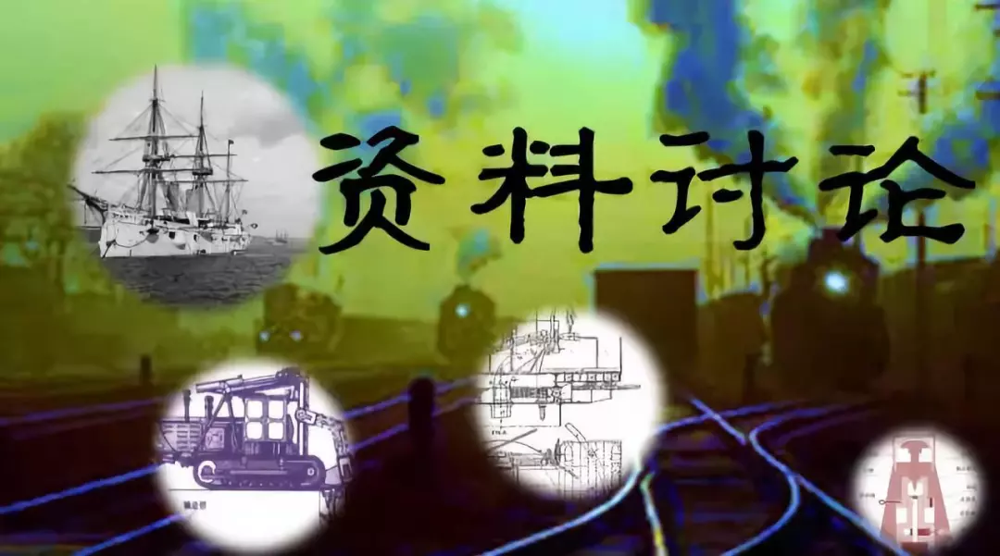
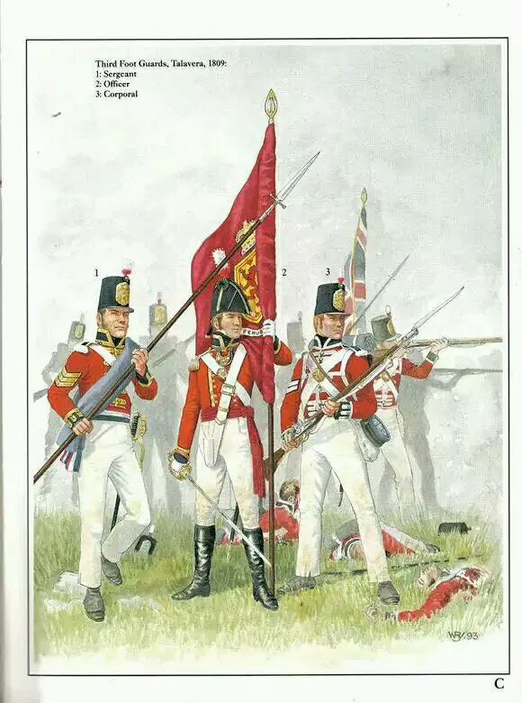
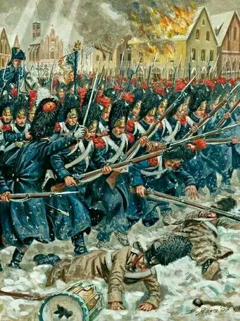

# 推广纸币，回笼银币最好的方法

原创：革命球

**革命球   ：**

 

 

第一，收税只收纸币，不收白银，只有白银要拿去银行换成纸币。

第二，纸币与白银汇率不刮勾，每天更新四次汇率波动，让人们去炒，然后这狗屁汇率完全是元老院说了算，不要涨跌太快，一点点割韭菜就行，有人赚有人赔，但肯定是元老院收了一波白银。

相信我，很快就能割上来一波白银。

  

就像比特币的套路一样，一开始，一点白银就能汇很多纸币，然后汇率逐渐抬升，于是前边拿白银换纸币的大赚了一笔，然后一传十十传百，引来越来越多的人拿白银换纸币，偶尔弄点下跌，吸引人群入仓

**尤格萨隆低语 :**

 

统冶区内所有粮食布匹盐油等一律只能用纸币买到

 

  

**白牙ye :**

 

元老院收税，只收银子，不交者爱的铁拳伺候

 

**修改两次 :**

 

但要是有能力建立成熟的纸币体系了，还收集银子干嘛？拿去做电线吗？

**革命球:** 其实纸币这玩意推广起来只是信用问题而已，剩下的只要不是元老院乱印就行了。而白银的作用更多是作为国际通货，纸币在元老院的统治下能够得到推广，这是在元老院的统治区内才管用，出了国就不管用了，需要真金实银才管用。要知道，上个世纪的黄金还是国际贸易的重要通货呢。

**修改两次:** 回复 革命球 :但是中国对外是出超啊

 

 

 

**天朝之P民 :**

 

税收不背这个锅！

尼玛！

元老院说银元纸币都是法定货币，凭啥我们只收纸币？

等着让人事后放出法学会，卸磨杀驴么？

有本事定性纸币是唯一合法货币。

 

 

 **颖宝都吃胖了:**

 

在统治区内禁止银币流通，限期把银两兑换成纸币，逾期不兑换者，一经查实，处以涉案金额5倍罚款

数额巨大者以扰乱金融秩序罪抄家，流放到婆罗洲种橡胶树

 

**小楼:** 洪武都玩过了，他都玩脱了。

**革命球:** 这个就有些困难了

 

 

 

**karmin123 :**

 

你这么搞，纸币只会变成交税专用的税票。

**革命球:** 那你倒是说说看到最后白银会有什么优势？

**karmin123:**回复 革命球 :你这么搞纸币又有什么优势呢？只是把本来通过交税收上来的白银变成购买税票的白银而已。

**革命球:** 回复 karmin123 :首先，税很少吗？肯定不少，兑换也不少，其次，白银兑换纸票是波动的，也就是说，当然要在低价时大买一批。若是能尝到点炒股的甜头，当然会一发不可收拾，要是一时缺钱，那纸票也能当钱用，只要守住纸票的购物稳定性，那白银反而会变成一种不稳定的类似于实物证券的东西。

**karmin123:**回复 革命球 : 通过刺激投机心理去推动纸币是条歪路，你看看A股就知道了。纸币能取代白银，最终还得依靠信用，让老百姓能接受并在日常生活中使用，币值不稳定其实是大忌，大部分普通人都是本能的厌恶风险的。

 

 

**GHIBLI001 :**

 

收税只收纸币……

你可太有良心了……

你确定这是回笼白银不是回笼纸币么……

 

**革命球:** 废话，收税只收纸币，看最后到底是纸币管用，还是白银管用。

**GHIBLI001:**回复 革命球 :头一次听说收税收纸币还能回笼白银的……

**革命球:** 回复 GHIBLI001 :如果白银持续贬值，当然要拿去换成纸币咯

**GHIBLI001:**回复 革命球 :白银贬值关银币什么事……你纸币的锚定物是大米么……

**革命球:** 回复 GHIBLI001 :反正白银永远都是通货紧缩的状态，经济一发展，澳宋境内，还是纸币为王，怕个屁。

**革命球:** 回复 GHIBLI001 :纸票通行个十年五载的，基本都不用白银了，白银还要鉴定成色、重量，还不能缴税，真以为白银作为通货很好用吗。

**GHIBLI001:**回复 革命球 :你这是拿结果当方法吧……推广纸币的方法是“纸票通行个十年五载”？这样车轱辘话有什么好说的。

**革命球:** 回复 GHIBLI001 :是啊，那结果也是渐进式出现的啊，总不可能结果是间断性出现吧的？

**GHIBLI001:**回复 革命球 :你的题目是“最好的方法”。“通行个十年五载”不是方法，是结果。

**革命球:** 回复 GHIBLI001 :最好的方法还要加上第二个才算

GHIBLI001:回复 革命球 :然而那个并不是。收税意味着不入流通，那你收什么就回笼什么。当然，你要透支信用，学大萌超发宝钞或者凯申公超发金圆券还硬要限定比值，那确实能收一波，配合二，那更能收一波。然后你就可以卷铺盖走人了。

**革命球:** 回复 GHIBLI001 :白银作为通货，真的很垃圾，成色、质量，都需要一套鉴定手段和换算，还不能用于小面额的流通。一般人上街买个菜总不可能带银子吧，基本上都是用纸币。只要没有明朝那般神奇的操作，要取代白银实在简单。

**革命球:** 回复 GHIBLI001 :至于二嘛，就像开赌场一样，有人赚有人赔，只不过赌场始终是利滚利罢了。

**GHIBLI001:**回复 革命球 :上街买点菜当然不用白银，你不会没见过铜钱吧？

**GHIBLI001:**回复 革命球 :水帖不能你这么水啊，多少走点心……

**革命球:** 回复 GHIBLI001 :铜也缺啊，中国历来各种就缺铜钱，于是铜钱越铸越劣，其实就是铅钱，有时不得不铸铁钱，还不如纸币管用呢。

**GHIBLI001:**回复 革命球 :缺铜的前提是只发铜币。大萌白银流入以后银铜结合缺铜么？拿着宋铁钱论证白银时代？

革命球: 回复 GHIBLI001 :还是缺，这么说吧，在小农经济下，由于农业基本是多进少出，加上缺少成熟的银行体系，巨额的货币被堆在地主的仓库里，所以贵金属货币处于紧缺状态是基调。

**革命球:** 回复 GHIBLI001 :欧洲人拿到美洲金银矿的印钞机，将贵金属进行通货膨胀，激活了资本市场，但中国在其中只能算分到一杯羹罢了，影响绝不深刻。

**GHIBLI001:**回复 革命球 :回去看清史和民国史吧……或者随你怎么玩都好……

**革命球:** 回复 GHIBLI001 :别说了，清末甚至搞过代银钱呢，从某种程度上来说居然还成功。

**革命球:** 回复 GHIBLI001 :临高的生产力很强，他们完全有能力支撑起信用货币体系。清末和民国的生产力是虚高，清末要赔偿巨额白银，而民国很多东西都要靠买办进口，印出来的货币就是个屁。

**GHIBLI001:**回复 革命球 :……自己秀吧，不陪你玩了。